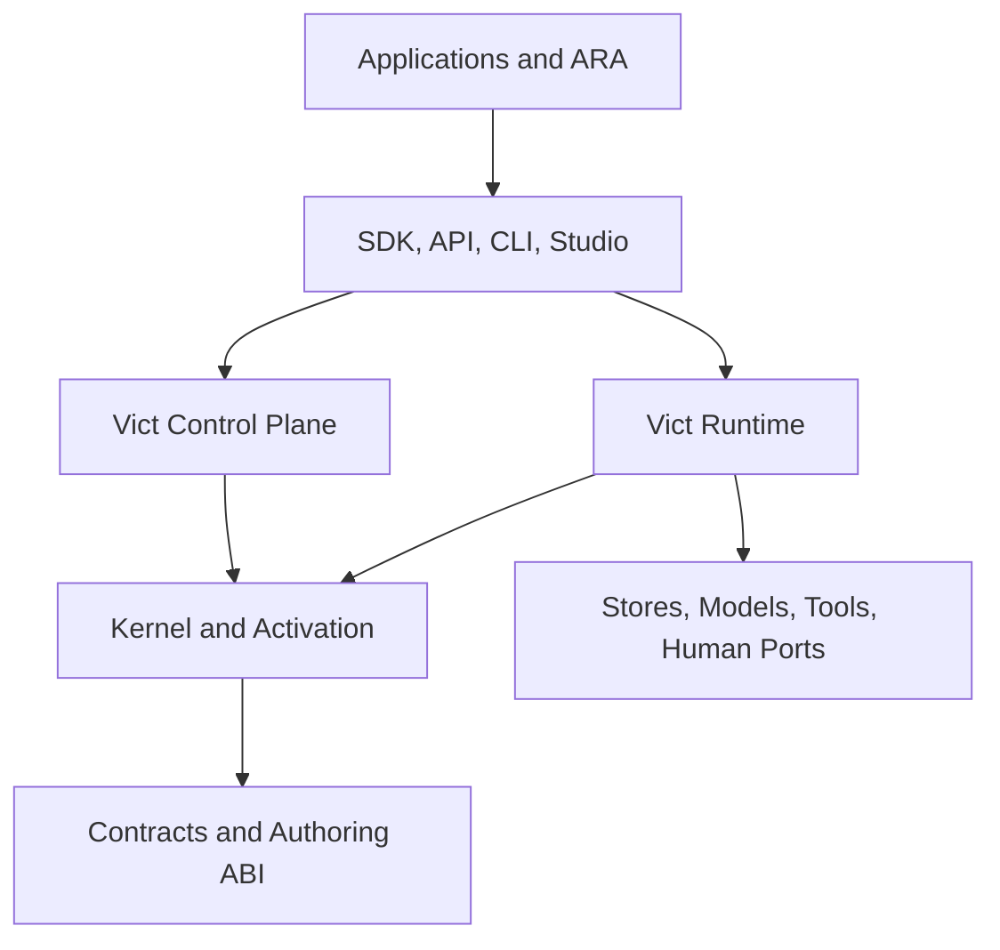
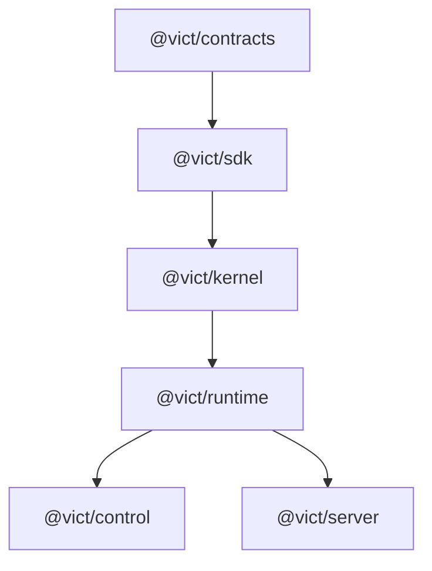
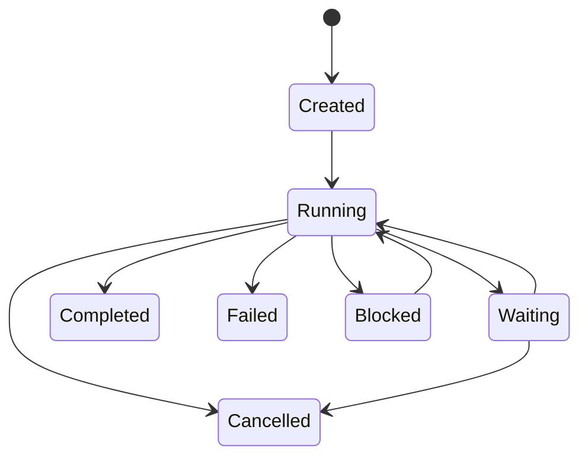
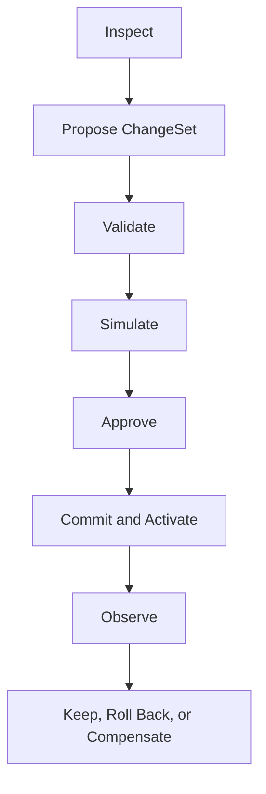
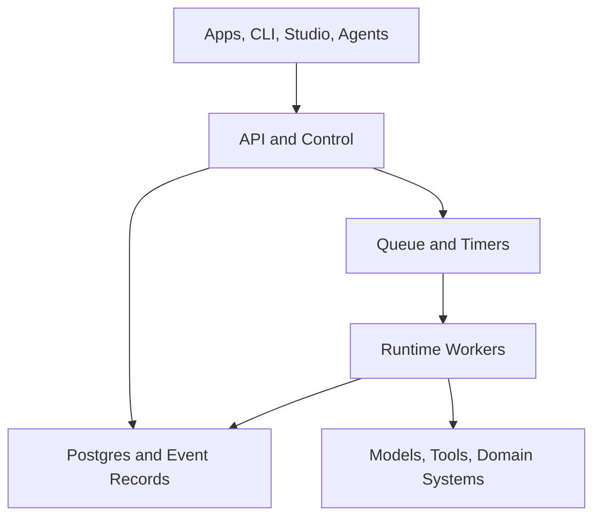

# VICT System Reference

> **Canonical title:** Vict Architecture and Operating Model — Authoritative System Reference  
> **Document version:** 0.1.1  
> **System generation:** Greenfield  
> **Status:** Authoritative baseline; future features are individually marked  
> **Last updated:** 2026-09-01 (Stage 2 implementation status recorded; audit pending)  
> **Current delivery point:** Stages 1 and 1.1 independently verified; Stage 2 (durable identity and stores) implemented and awaiting independent audit  
> **Next permitted stage:** Stage 3 — durable orchestration, only after Stage 2 passes its exit gate

---

## 0. Purpose and authority

This document defines the intended final form of Vict and the controlled path for building it. It is the single architectural reference for the product, runtime, ecosystem, builder tooling, deployment model, and development stages.

Vict is a greenfield system. Earlier Vict documents and packages are research inputs, not an inherited architecture. They may explain useful ideas, but they do not override this reference and do not establish package names, abstractions, or compatibility obligations.

### 0.1 Authority order

When sources disagree, use this order:

1. This system reference and requirements explicitly accepted into it.
2. Accepted architecture decision records that name the requirements they amend.
3. Public contracts and conformance tests for the currently implemented stage.
4. Current implementation and its verified behavior.
5. Stage handoffs, implementation reports, and audits.
6. Experiments, proposals, and legacy research.

Code is evidence of what exists; it does not silently redefine what Vict is intended to become. A discovered mismatch must be fixed, accepted as an explicit architecture change, or recorded as known debt.

### 0.2 Normative language

- **MUST** and **MUST NOT** are mandatory.
- **SHOULD** and **SHOULD NOT** are defaults that require a documented reason to violate.
- **MAY** is optional.
- **Current** describes verified implementation, not architectural preference.
- **Target** describes the accepted intended design, even when it is not implemented yet.

### 0.3 Two-dimensional status

Every material design item has both a maturity and a delivery status.

| Dimension | Value | Meaning |
|---|---|---|
| Maturity | Invariant | Foundational rule; changing it redefines Vict |
| Maturity | Accepted | Chosen design; implementation may still be pending |
| Maturity | Provisional | Direction is useful, but details require evidence |
| Maturity | Deferred | Intentionally postponed and not a present dependency |
| Maturity | Rejected | Explicitly outside the architecture |
| Delivery | Verified | Independently checked in code and tests |
| Delivery | In Progress | Being implemented; no completion claim yet |
| Delivery | Planned | In an accepted future stage |
| Delivery | Not Scheduled | Recognized but not assigned to a stage |

“Implemented” is not equivalent to “Verified.” Only an independent audit can change delivery status to Verified.

### 0.4 Governing requirements

| ID | Requirement | Maturity | Delivery |
|---|---|---|---|
| GOV-001 | This document MUST be the architectural source of truth for greenfield Vict. | Invariant | Verified |
| GOV-002 | Handoffs MUST reference requirement IDs and MUST NOT create competing architecture. | Accepted | Planned |
| GOV-003 | Each stage MUST end with implementation, independent audit, disposition, and reference update. | Invariant | In Progress |
| GOV-004 | Future behavior MUST NOT be described as current until independently verified. | Invariant | Verified |
| GOV-005 | Architecture changes MUST record rationale, affected IDs, compatibility impact, and migration impact. | Accepted | Planned |
| GOV-006 | Legacy documents MAY inform decisions but MUST NOT impose legacy package or language structure. | Invariant | Verified |

---

## 1. The complete idea

Vict is a capability-oriented application runtime and control system for building software whose behavior can be inspected, versioned, simulated, changed, executed, and audited.

The complete Vict package is not just an execution engine. It has five cooperating parts:

1. **Semantic core:** contracts, capabilities, graphs, activations, and deterministic execution rules.
2. **Operational runtime:** effects, persistence, retries, waits, cancellation, observability, and recovery.
3. **Control plane:** safe inspection and change through proposals, validation, simulation, approval, activation, and rollback.
4. **Developer and builder system:** SDKs, local tools, conformance tests, and a model-agnostic Builder Kit usable by Codex, Claude Code, Pi, a human developer, or another coding host.
5. **Ecosystem and reference products:** reusable capability packs, adapters, proven playbooks, and ARA as the lighthouse application.



Vict behaves like an application operating system in a precise, limited sense: it supplies stable execution, identity, effect, state, change, and observability semantics above ordinary operating systems and infrastructure. It is not a general-purpose OS, a programming language replacement, or a universal distributed-computing layer.

### 1.1 Product outcomes

Vict should make these questions answerable:

- What behavior is active?
- Which exact graph and capability revisions produced this run?
- What data and external effects can it access?
- Can a proposed change be validated and safely simulated?
- Who or what approved and activated it?
- Can a suspended run resume against the same semantics?
- Can an operator diagnose failure without exposing sensitive payloads?
- Can a human or coding agent extend the system without bypassing its rules?

### 1.2 Non-goals

Vict is not:

- a visual graph editor that forces every function call to become a node;
- a YAML-first orchestration product;
- a new general-purpose language;
- an autonomous production “healer” with unbounded mutation authority;
- a guarantee of exactly-once effects across arbitrary external systems;
- a model-specific agent framework;
- a microservice requirement;
- a reason to replace normal TypeScript, Svelte, React, SQL, or infrastructure tools.

| ID | Requirement | Maturity | Delivery |
|---|---|---|---|
| PRD-001 | Vict MUST make active application behavior inspectable and version-addressable. | Invariant | In Progress |
| PRD-002 | Vict MUST separate proposed behavior from activated behavior. | Invariant | Planned |
| PRD-003 | Vict MUST support ordinary code and UI frameworks without forcing artificial graph nodes. | Invariant | Verified |
| PRD-004 | Vict MUST remain usable locally before requiring distributed infrastructure. | Accepted | Verified |
| PRD-005 | Vict SHOULD provide the same semantic model in local and server deployments. | Accepted | Planned |
| PRD-006 | Vict MUST be model-agnostic at the builder and product-agent boundaries. | Invariant | Planned |

---

## 2. Design principles

1. **Meaningful graphs, ordinary code.** Graphs express orchestration, policy boundaries, resumable work, and observable decisions. Internal algorithms stay in code.
2. **Activation before execution.** Definitions are mutable authoring material; activations are immutable executable meaning.
3. **Identity is explicit.** Revisions and canonical manifests identify behavior. Runtime function text and third-party schema internals do not.
4. **Pure core, effectful edge.** Kernel logic is deterministic and performs no external I/O.
5. **Effects are declared and enforced.** Safety cannot rely only on handler convention.
6. **Safe data by default.** Stored traces and histories retain summaries unless full payload retention is explicitly enabled.
7. **Change is a workflow.** Inspect, propose, validate, simulate, approve, commit, observe, and recover are distinct operations.
8. **Agents receive bounded authority.** An agent may use granted tools; it may not create its own permissions or silently change active production behavior.
9. **Durability precedes cleverness.** Restart correctness, identity, and idempotency come before autonomous recovery.
10. **Extract ecosystems from evidence.** Capability packs and playbooks emerge from working applications and repeated patterns.
11. **One semantic system.** CLI, API, Studio, and agents are interfaces to the same contracts, not separate products with divergent rules.
12. **Verification is part of delivery.** A report is a claim; an audit and reproducible evidence establish status.

| ID | Requirement | Maturity | Delivery |
|---|---|---|---|
| ARCH-001 | The kernel MUST perform no filesystem, network, database, model, clock, or random I/O directly. | Invariant | Verified |
| ARCH-002 | External operations MUST enter through explicit runtime ports or capabilities. | Invariant | In Progress |
| ARCH-003 | The control plane and execution data plane MUST have distinct responsibilities and permissions. | Invariant | Planned |
| ARCH-004 | The architecture MUST permit a modular monolith and MUST NOT require premature microservices. | Invariant | Verified |
| ARCH-005 | Serialization formats MUST remain secondary to the in-memory and API semantic model. | Invariant | Verified |
| ARCH-006 | Package boundaries SHOULD follow stable responsibilities, not speculative product branding. | Accepted | In Progress |

---

## 3. Canonical vocabulary

| Term | Meaning |
|---|---|
| Contract | A schema-neutral, versioned boundary that validates or decodes a value and returns safe structured failure |
| Capability | A named, revisioned unit of executable application behavior with declared contracts and effect class |
| Capability registry | Mutable authoring/development collection from which an activation may resolve capabilities |
| Graph definition | Versionable orchestration declaration containing meaningful nodes and routes |
| Kernel | Pure logic that validates graphs, resolves declarations, computes identity, and produces executable plans |
| Activation | Immutable snapshot of a graph plus the exact capability and contract revisions it resolves |
| Run | One execution pinned to one activation |
| Node attempt | One bounded attempt to execute a node in a run |
| Effect | Declared external-impact class: pure, read, write, or irreversible |
| Double | Explicit substitute used for simulation or tests |
| Port | Runtime-owned interface to an external concern such as time, persistence, secrets, models, or tools |
| Event | Append-only operational fact about a run, change, approval, or system action |
| Run record | Current summarized operational state of a run, derived or updated transactionally with events |
| ChangeSet | Version-guarded proposed control-plane mutation |
| Capability pack | Installable, documented group of related capabilities, contracts, configuration, permissions, tests, and doubles |
| Playbook | Proven composition and operating guidance extracted from repeated working use |
| Builder Agent | External coding agent operating through the Builder Kit to modify Vict or an application repository |
| Product Agent | Agent invoked as application behavior through a bounded capability and runtime permissions |
| ARA | Vict’s reference application and performance/correctness lighthouse |

Terms are part of the public mental model. New synonyms should not be introduced casually.

---

## 4. System planes and trust boundaries

Vict has five logical planes. They can run in one process locally; separation describes responsibility and authority, not mandatory deployment.

| Plane | Owns | Does not own |
|---|---|---|
| Application | Product UI, domain state, prompts, domain capabilities | Vict activation rules or operator authority |
| Execution | Runs, scheduling, effects, ports, persistence, events | Unreviewed definition mutation |
| Control | ChangeSets, validation, approvals, activation selection, rollback | Application conversation logic |
| Integration | Databases, model providers, tools, queues, humans, secrets | Kernel semantics |
| Development | SDK, Builder Kit, tests, audits, package publishing | Runtime production authority by default |

The boundary between definition and activation is a trust boundary. The boundary between runtime and external ports is an effect boundary. The boundary between Builder Agent and production is an authority boundary.

---

## 5. Package and dependency architecture

### 5.1 Current verified package topology

Stage 1 established these greenfield packages:

| Package | Current responsibility | Status |
|---|---|---|
| @vict/contracts | Contracts and validation primitives | Verified with Stage 1 qualifications |
| @vict/kernel | Graph validation and activation semantics | Verified with Stage 1 qualifications |
| @vict/runtime | In-memory execution, registry, effects, traces | Verified with Stage 1 qualifications |
| @vict/sdk | Public convenience facade over lower packages | Verified with Stage 1 qualifications |
| examples/ara-proof | Deterministic offline walking proof | Verified |

The current import direction is:


This is valid for the walking kernel, but it makes the current SDK a top-level facade rather than a lightweight authoring ABI.

### 5.2 Accepted target topology

Before a third-party capability ecosystem is stabilized, the SDK should become a lightweight authoring layer that capability packs can import without depending on the runtime.



Dependency arrows mean “is imported by the next layer.” Exact package extraction is stage-gated; these names express ownership, not a requirement to create empty packages now.

### 5.3 Target package responsibilities

| Package or area | Responsibility | Maturity | Delivery |
|---|---|---|---|
| @vict/contracts | Schema-neutral contract protocol, safe issues, stable references | Accepted | In Progress |
| @vict/sdk | Capability/graph authoring ABI and public types | Accepted | Planned |
| @vict/kernel | Pure validation, canonicalization, activation, planning | Invariant | In Progress |
| @vict/runtime | Execution, effects, scheduling, ports, durable coordination | Invariant | In Progress |
| @vict/control | ChangeSet lifecycle, policies, approvals, activation management | Accepted | Planned |
| @vict/server | HTTP/event transport and server composition | Provisional | Planned |
| @vict/client | Typed transport client, if evidence supports extraction | Provisional | Not Scheduled |
| @vict/cli | Local inspection, execution, verification, and operator commands | Accepted | Planned |
| @vict/builder-kit | Agent/human repository context, tools, checks, and handoff protocol | Accepted | Planned |
| capability packs | Domain integrations and reusable behavior | Accepted | Planned |
| studio | Human control/inspection interface | Accepted | Planned |

| ID | Requirement | Maturity | Delivery |
|---|---|---|---|
| ARCH-010 | Capability authors MUST NOT need to import the full runtime to define capabilities. | Accepted | Planned |
| ARCH-011 | Packages MUST NOT be created solely as placeholders for hypothetical services. | Invariant | Verified |
| ARCH-012 | Public packages MUST declare compatibility and use semantic versioning. | Accepted | Planned |
| ARCH-013 | Internal dependency direction MUST keep the kernel independent of runtime adapters. | Invariant | Verified |
| ARCH-014 | A future umbrella package MAY re-export stable APIs but MUST NOT become a hidden dependency cycle. | Provisional | Not Scheduled |

---

## 6. Contracts

A contract is Vict’s schema-neutral boundary for accepting data. It is not tied to Zod, JSON Schema, a model provider, or a transport.

A conceptual public shape is:

```ts
type ContractIssue = {
  code: string
  path?: Array<string | number>
  message?: string
}

type ContractResult<T> =
  | { ok: true; value: T }
  | { ok: false; issues: ContractIssue[] }

interface Contract<T> {
  readonly id: string
  readonly revision: string
  parse(input: unknown): ContractResult<T>
  describe?(): unknown
}
```

The exact TypeScript spelling may evolve; the semantics are normative.

### 6.1 Contract identity

- Contract ID names the stable meaning, such as ara.message.input.
- Revision identifies a deliberately published interpretation of that meaning.
- A capability declaration references both ID and revision.
- Compatibility is never inferred from a matching TypeScript type alone.
- Structural compatibility analysis may be added later, but explicit revision remains authoritative.

### 6.2 Adapters

The base authoring path must accept a handwritten neutral contract. Optional adapters may make Zod, JSON Schema, TypeBox, Valibot, or other schema systems convenient. Their public types belong in optional adapter entry points, not in the base Contract protocol.

Official contract factories and adapters must return frozen contract objects. Activation must also capture the effective parsing callable or reject unsupported mutable contract shapes; a caller-owned object must not be able to change the meaning of a pinned activation through in-place mutation.

### 6.3 Safe failures

Validation failures cross an observability boundary. Arbitrary custom messages can contain input or secrets, so Vict must:

- retain safe codes and paths by default;
- sanitize or replace raw third-party messages;
- make detailed developer diagnostics an explicit local or protected mode;
- never embed raw invalid values in ordinary event history.

| ID | Requirement | Maturity | Delivery |
|---|---|---|---|
| CONT-001 | Every executable capability MUST declare input and output contracts. | Invariant | Verified |
| CONT-002 | Contracts MUST expose stable IDs and explicit revisions. | Accepted | Verified |
| CONT-003 | The base contract protocol MUST be independent of a schema library. | Invariant | Verified |
| CONT-004 | Parsing MUST return schema-neutral structured results. | Accepted | Verified |
| CONT-005 | Raw third-party validation messages MUST NOT enter normal persisted traces unsanitized. | Invariant | Verified |
| CONT-006 | A schema adapter MUST NOT leak its types into the base public declaration API. | Accepted | Verified |
| CONT-007 | Contract compatibility beyond exact identity MUST remain conservative until formally defined. | Accepted | Planned |
| CONT-008 | Official contract factories/adapters MUST freeze returned contracts, and activation MUST prevent later caller-owned mutation from changing pinned parsing behavior. | Invariant | In Progress |

---

## 7. Capabilities

A capability is the smallest Vict-governed unit of meaningful executable behavior. It is larger than a helper function and smaller than an application.

Conceptually, a declaration contains:

```ts
interface CapabilityDefinition<I, O> {
  id: string
  revision: string
  input: Contract<I>
  output: Contract<O>
  effect: "pure" | "read" | "write" | "irreversible"
  execute(input: I, context: CapabilityContext): Promise<O> | O
}
```

Additional policies such as retries, timeouts, permissions, idempotency, and doubles are composed around this minimum.

### 7.1 Declaration versus resolved capability

- A **definition** is author-controlled and may exist in a mutable development registry.
- A **resolved capability** is the exact definition captured for an activation.
- An **active capability** is resolved through the run’s pinned activation, never by consulting a live mutable registry.

Replacement in a registry can affect a future activation. It cannot alter an existing activation or an in-flight run.

### 7.2 Effects

| Effect | Meaning | Typical examples |
|---|---|---|
| pure | No observable external access; deterministic for explicit inputs and context | parsing, routing, formatting |
| read | Reads external state without intended mutation | retrieval, database query, model inference when treated as an external read |
| write | Mutates external or durable state and can usually be made idempotent or compensated | save message, create task |
| irreversible | High-impact or practically non-reversible action requiring explicit policy | send funds, publish, destructive administrative action |

Effect class is author-declared metadata and therefore a trust boundary. Later supply-chain controls may require review, signing, static policy, sandboxing, or organizational approval.

### 7.3 Context

Capability context should expose only bounded interfaces:

- run, node, attempt, activation, and correlation identifiers;
- cancellation signal and deadline;
- granted ports and scoped secrets;
- safe event/metric emission;
- idempotency key where applicable;
- actor and authorization context.

It must not expose a universal service locator or unrestricted control-plane mutation.

| ID | Requirement | Maturity | Delivery |
|---|---|---|---|
| CAP-001 | Every capability MUST have a stable ID and explicit revision. | Accepted | Verified |
| CAP-002 | Every capability MUST declare one effect class. | Invariant | Verified |
| CAP-003 | Activated execution MUST resolve handlers from the pinned activation, not a live registry. | Invariant | Verified |
| CAP-004 | Capability context MUST expose least-authority ports and identity. | Invariant | Planned |
| CAP-005 | Capability revisions MUST change when executable semantics or declared boundary semantics change. | Accepted | Planned |
| CAP-006 | Vict MUST NOT derive capability identity from function.toString or third-party schema internals. | Invariant | Verified |
| CAP-007 | Registry replacement MUST be explicit and affect only subsequent activations. | Accepted | Verified |

---

## 8. Graph and kernel model

A graph declares meaningful orchestration. A node references a capability or an explicit control primitive. An edge describes possible control/data routing.

### 8.1 Present graph model

Stage 1 verifies acyclic capability-node graphs, graph validation, deterministic sequential execution, and activation. This is intentionally small.

### 8.2 Target control model

The accepted direction supports:

- capability nodes;
- explicit decision/routing nodes;
- bounded fan-out and join;
- wait/timer and external-signal suspension;
- subgraph invocation;
- explicit bounded iteration when justified.

Arbitrary graph cycles and arbitrary expression languages are rejected. A decision should normally return a typed route key that selects a declared edge. Loops must expose bounds, state, and recovery semantics.

### 8.3 Validation

Before activation, the kernel validates at least:

- graph ID and revision;
- node and edge uniqueness;
- entry and terminal structure;
- referenced capability and contract availability;
- type/contract routing compatibility where known;
- unreachable nodes;
- cycles or invalid loop declarations;
- control-node structural rules;
- effect and policy compatibility;
- canonical serialization requirements.

### 8.4 Compilation

Activation may compile a definition into an internal execution plan. Compilation is off the hot path and may precompute routing, validation, and scheduling metadata. Internal plan shape is not a public contract.

| ID | Requirement | Maturity | Delivery |
|---|---|---|---|
| KERN-001 | Kernel operations MUST be deterministic for the same explicit inputs. | Invariant | Verified |
| KERN-002 | The kernel MUST reject structurally invalid graphs before activation. | Invariant | Verified |
| KERN-003 | Graph nodes SHOULD represent observable orchestration or policy boundaries, not every internal call. | Invariant | Verified |
| KERN-004 | Arbitrary cycles MUST NOT be accepted as implicit workflow semantics. | Accepted | Verified |
| KERN-005 | Future iteration MUST be explicit, bounded, and durable. | Accepted | Planned |
| KERN-006 | Branching SHOULD use declared typed route keys rather than a new general expression language. | Accepted | Planned |
| KERN-007 | Compilation SHOULD occur at activation and MUST NOT be required per application message. | Accepted | Verified |
| KERN-008 | Compiler diagnostics SHOULD report independently detectable structural issues in stable order, including cycles when other issues coexist. | Accepted | In Progress (Stage 2 implementation pending audit) |

---

## 9. Identity, revisioning, and activation

Vict uses three distinct identities:

1. **graphVersion** identifies canonical graph topology and declarations.
2. **capabilitySetVersion** identifies the effective capabilities and contract references used by the graph.
3. **activationVersion** identifies their exact executable combination.

Conceptually:

```text
graphVersion = hash(canonical graph manifest)

capabilitySetVersion = hash(canonical ordered list of:
  capability id,
  capability revision,
  effect class,
  input contract id and revision,
  output contract id and revision,
  optional trusted build artifact identity
)

activationVersion = hash(
  activation schema version,
  graphVersion,
  capabilitySetVersion
)
```

Canonicalization and hash algorithm are versioned. Hashes provide stable content identity; they are not automatically proof of source authenticity. A signed build digest or provenance record may later augment explicit revisions.

### 9.1 Immutable activation

An activation contains:

- graph and graphVersion;
- resolved capability references and immutable executable handles;
- resolved contract identities and captured parsing handles;
- capabilitySetVersion and activationVersion;
- activation schema version;
- creation metadata and provenance;
- policies required for execution.

Once published, it cannot be edited. A changed definition creates a new activation.

### 9.2 Run pinning

A run captures the activation before it starts. The runtime may use a mutable registry to build a new activation, but it must not consult that registry to decide the meaning of an already pinned run.

Test or simulation doubles are similarly snapshotted at run creation or activation, according to the mode contract. Mid-run replacement cannot alter the run.

The Stage 1.1 audit verified immutable capability bindings, frozen contracts produced by the neutral defineContract path, and per-run double snapshots. It also found that a hand-rolled mutable contract, including the current Zod-adapter result, can still swap its parse function after activation. This is a non-blocking carry-forward issue, but the final invariant remains that activated parsing semantics are pinned.

### 9.3 Compatibility

- Existing runs remain pinned to their original activation.
- New runs use the selected current activation.
- Suspended runs resume only if the exact activation and required capability artifacts can be resolved.
- A migration is explicit and produces an audited transition; it is not an automatic version substitution.

| ID | Requirement | Maturity | Delivery |
|---|---|---|---|
| VER-001 | graphVersion MUST represent graph declaration/topology and MUST NOT pretend to identify handler code. | Accepted | Verified |
| VER-002 | capabilitySetVersion MUST cover effective capability and contract identities. | Accepted | Verified |
| VER-003 | activationVersion MUST combine graphVersion and capabilitySetVersion under a versioned schema. | Accepted | Verified |
| VER-004 | Canonical identity MUST use explicit revisions and stable manifests, never runtime function text. | Invariant | Verified |
| VER-005 | Activations MUST be immutable. | Invariant | In Progress (Stage 2 implementation pending audit) |
| VER-006 | Registry changes MUST require reactivation before affecting new production runs. | Invariant | Verified |
| VER-007 | Every run MUST pin one immutable activation for its lifetime. | Invariant | In Progress (Stage 2 implementation pending audit) |
| VER-008 | A suspended run MUST NOT silently resume against a substitute activation. | Invariant | In Progress (Stage 2 implementation pending audit) |
| VER-009 | Build provenance MAY strengthen identity but MUST NOT replace semantic revisions. | Accepted | Planned |
| VER-010 | Activation MUST capture contract parsing semantics by value or enforce equivalent immutability. | Invariant | In Progress (Stage 2 implementation pending audit) |

---

## 10. Runtime and execution semantics

### 10.1 Lifecycle



- **Created:** identity, input policy, mode, and activation have been captured.
- **Running:** at least one node is eligible or executing.
- **Waiting:** durable continuation awaits a timer, signal, human, or external condition.
- **Completed:** terminal output passed its contract.
- **Failed:** retry policy is exhausted or a non-retryable failure occurred.
- **Cancelled:** a cancellation request reached a defined safe boundary.
- **Blocked:** continuation requires operator resolution, missing artifact, or policy action.

Stage 1 currently implements a smaller synchronous/sequential lifecycle. Waiting, blocked recovery, and durable transitions are future work.

### 10.2 Execution rules

1. Validate run input against the entry contract.
2. Create a run record pinned to an activation.
3. Select eligible nodes deterministically.
4. Validate node input.
5. Enforce mode, effect, permission, timeout, and retry policy.
6. Execute through the snapshotted capability.
7. Validate output.
8. Persist safe events and state at the required durability boundary.
9. Route output or suspend.
10. Complete, fail, cancel, or block with an explicit terminal/continuation reason.

### 10.3 Determinism

Vict guarantees deterministic orchestration decisions given the same activation, captured inputs, recorded nondeterministic port results, and scheduler policy. It does not claim that arbitrary model calls, clocks, networks, or third-party systems are intrinsically deterministic.

### 10.4 Errors

Errors have safe stable classes, such as:

- contract failure;
- capability failure;
- permission denial;
- missing double;
- timeout;
- cancellation;
- retry exhausted;
- activation unavailable;
- persistence conflict;
- invariant violation.

Public/persisted errors carry safe codes, locations, and opaque correlation IDs. Protected diagnostics may point to separately controlled details.

### 10.5 Concurrency

Sequential deterministic execution is the baseline. Fan-out, workers, leases, and concurrent nodes must preserve:

- single ownership of an attempt;
- idempotent claim/complete transitions;
- deterministic join semantics;
- cancellation propagation;
- event ordering rules;
- bounded resource use.

| ID | Requirement | Maturity | Delivery |
|---|---|---|---|
| RUN-001 | A run MUST be associated with exactly one activationVersion. | Invariant | Verified |
| RUN-002 | Inputs and outputs MUST be contract-validated at declared boundaries. | Invariant | Verified |
| RUN-003 | Scheduling semantics MUST be explicit and reproducible. | Invariant | In Progress (Stage 2 implementation pending audit) |
| RUN-004 | Nondeterministic values MUST enter through recordable ports or capability results. | Accepted | Planned |
| RUN-005 | Cancellation MUST be cooperative, recorded, and propagated to child work. | Accepted | Planned |
| RUN-006 | Retries MUST be bounded and classified; they MUST NOT blindly repeat irreversible work. | Invariant | Planned |
| RUN-007 | Durable attempts MUST use idempotent ownership/transition rules. | Accepted | Planned |
| RUN-008 | Persisted errors MUST use safe error classes and correlation identifiers. | Invariant | Verified |

---

## 11. Effects, modes, simulation, and doubles

Vict separates the declared effect from the selected execution mode.

| Effect | Normal mode | Simulation mode | Test mode |
|---|---|---|---|
| pure | Real handler allowed | Real handler allowed | Real handler allowed |
| read | Allowed with permission | Safe double required by default | Safe double required by default |
| write | Allowed with permission/idempotency policy | Safe double required | Safe double required |
| irreversible | Explicit high-impact permission/approval | Safe double required | Safe double required |

A policy may be stricter, never silently weaker.

### 11.1 Double rules

- A double is registered against capability ID and compatible revision.
- Registration is explicit and auditable.
- A run snapshots its effective doubles.
- A missing required double produces a denial, not fallback to the real handler.
- A registered irreversible double may execute safely in isolated test/simulation mode.
- A double must itself satisfy output contracts.

### 11.2 External effect correctness

Vict can provide at-least-once execution plus idempotency and reconciliation. It cannot guarantee exactly-once effects in an external system that offers no compatible primitive.

For writes, a capability should declare:

- idempotency-key behavior;
- retry classification;
- reconciliation/read-back strategy;
- compensation where meaningful;
- timeout ambiguity behavior.

For irreversible actions, approval and explicit intent must be recorded before execution.

| ID | Requirement | Maturity | Delivery |
|---|---|---|---|
| EFF-001 | Runtime MUST enforce the capability’s declared effect against execution mode and permissions. | Invariant | Verified |
| EFF-002 | Simulation/test MUST NOT execute real read, write, or irreversible handlers without an explicit safe policy. | Invariant | Verified |
| EFF-003 | Missing required doubles MUST fail closed. | Invariant | Verified |
| EFF-004 | Effective doubles MUST be snapshotted so mid-run registry mutation cannot change behavior. | Invariant | Verified |
| EFF-005 | Irreversible production effects MUST require explicit elevated policy or approval. | Invariant | Planned |
| EFF-006 | Write capabilities SHOULD define idempotency and ambiguity behavior before durable retry is enabled. | Accepted | Planned |
| EFF-007 | Vict MUST NOT promise universal external exactly-once execution. | Invariant | Verified |

---

## 12. State, persistence, and durability

Vict distinguishes operational workflow state from application/domain state.

### 12.1 Store responsibilities

| Store/port | Responsibility |
|---|---|
| DefinitionStore | Mutable authored graph definitions and metadata |
| ActivationCatalog | Immutable activations and artifact resolution metadata |
| RunStore | Current run/attempt state and concurrency guards |
| EventStore | Append-only operational and audit events |
| WaitStore | Durable signal subscriptions and resumable continuations |
| TimerStore | Due-time scheduling and claims |
| AppStateStore | Domain-owned application state through scoped capability ports |
| ArtifactStore | Large or separately retained inputs, outputs, files, and diagnostics |
| SecretResolver | Runtime-only resolution of scoped secrets; never ordinary run payload storage |

Interfaces are semantic ports. SQLite, Postgres, object storage, or a queue are adapters.

### 12.2 Local durability

Stage 2 introduces SQLite for identity and restart correctness while preserving the Stage 1 sequential execution semantics. It should not simultaneously add branching, waits, distributed workers, or Studio behavior.

Minimum durable records include:

- activation manifests;
- run identity and status;
- node attempt identity and status;
- safe event sequence;
- timestamps from the injected clock;
- retention mode;
- cancellation/failure reason;
- references to separately retained artifacts where enabled.

### 12.3 Retention

Every run selects one payload-retention policy:

| Policy | Persisted content |
|---|---|
| none | Identifiers, status, safe codes, timings, sizes/hashes where safe |
| summary | Safe bounded structural summaries; this is the default |
| full | Full payloads in an explicitly protected store with access and lifecycle policy |

The immediate RunResult may return the actual output to the authorized caller. That does not imply full output persistence.

Selecting full transfers responsibility to the caller/operator for everything the capability returns. Full retention must therefore be deliberate, documented, access-controlled, minimized, and covered by an explicit deletion/lifecycle policy; Vict cannot make arbitrary retained payloads safe merely by labeling the mode.

### 12.4 Events and transactions

Vict uses an append-only operational ledger, but does not require every domain model to be event-sourced.

For a durable state transition, the adapter must atomically commit the run/attempt update and corresponding event, or use an equivalent outbox protocol. External effects cannot share that transaction in general, so idempotency and reconciliation remain required.

### 12.5 Resume and replay

- Resume continues a suspended run against the exact activation and captured continuation.
- Replay creates a distinct run using recorded inputs/results according to an explicit replay policy.
- Pure work can be recomputed.
- External reads may use recorded results or explicit live reread mode.
- Writes and irreversible work are never silently replayed.
- Missing activation artifacts block the run for operator action.

### 12.6 Rollback and compensation

Rollback selects a prior activation for future runs. It does not erase events, mutate completed runs, or undo external effects. Compensation is separate domain behavior represented by explicit capabilities and policy.

| ID | Requirement | Maturity | Delivery |
|---|---|---|---|
| DATA-001 | Runtime persistence MUST be accessed through semantic store ports. | Invariant | In Progress (Stage 2 implementation pending audit) |
| DATA-002 | Activations and operational events MUST be immutable once published. | Invariant | In Progress (Stage 2 implementation pending audit) |
| DATA-003 | Run transition and event recording MUST be atomic or outbox-equivalent. | Accepted | In Progress (Stage 2 implementation pending audit) |
| DATA-004 | Payload retention MUST support none, summary, and full policies. | Accepted | Verified |
| DATA-005 | Summary MUST be the default retained payload policy. | Invariant | Verified |
| DATA-006 | Full payload persistence MUST be explicit, access-controlled, and lifecycle-managed. | Invariant | In Progress (Stage 2 implementation pending audit) |
| DATA-007 | Secrets MUST be resolved at runtime and MUST NOT be stored in normal run history. | Invariant | Planned |
| DATA-008 | Resume MUST require the exact pinned activation or enter a blocked state. | Invariant | In Progress (Stage 2 implementation pending audit) |
| DATA-009 | Rollback MUST affect future activation selection and MUST NOT claim to undo external effects. | Invariant | Planned |
| DATA-010 | The architecture MUST NOT require application domain state to use Vict event sourcing. | Invariant | Verified |
| DATA-011 | Public configuration and type documentation for full retention MUST explicitly state the caller’s responsibility for retained content. | Accepted | In Progress (Stage 2 implementation pending audit) |
| DATA-012 | Store read APIs SHOULD return immutable snapshots or defensive copies so callers cannot mutate canonical stored records by reference. | Accepted | In Progress (Stage 2 implementation pending audit) |

---

## 13. Observability, diagnosis, and recovery

Observability exists for correctness and operation, not indiscriminate payload capture.

### 13.1 Core events

Stable event families should include:

- run.created, run.started, run.waiting, run.completed, run.failed, run.cancelled, run.blocked;
- node.ready, node.started, node.completed, node.failed, node.retry_scheduled;
- effect.authorized, effect.denied;
- signal.received, timer.scheduled, timer.fired;
- change.proposed, change.validated, change.simulated, change.approved, change.committed;
- activation.published, activation.selected, activation.rolled_back;
- operator.intervened.

Event payloads use versioned schemas and safe summaries. Names may be finalized with the durable event model, but semantic coverage is accepted.

### 13.2 Metrics

Minimum useful metrics:

- run/node latency and throughput;
- completion/failure/cancellation/block rates;
- retries and timeout counts;
- queue/wait age;
- effect denial and approval rates;
- activation-specific regressions;
- model/tool usage and cost when available;
- payload/artifact volume;
- recovery and reconciliation outcomes.

### 13.3 Diagnosis

The operator or Studio should reconstruct:

- active activation and provenance;
- route and node attempts;
- safe error classifications;
- external effect decisions and idempotency keys;
- waits, signals, timers, and ownership;
- changes and approvals associated with the activation.

### 13.4 Recovery

Automatic recovery is limited to pre-authorized mechanical actions such as bounded retry, lease reclaim, or restart resume. Semantic change, permission escalation, migration, or high-impact compensation requires control-plane policy and often human approval.

| ID | Requirement | Maturity | Delivery |
|---|---|---|---|
| OBS-001 | Every event MUST identify run, activation, event schema, and ordering context. | Accepted | In Progress (Stage 2 implementation pending audit) |
| OBS-002 | Ordinary events MUST store safe summaries rather than raw payloads. | Invariant | Verified |
| OBS-003 | Metrics MUST be attributable to activationVersion. | Accepted | Planned |
| OBS-004 | Diagnostic access to protected details MUST be separately authorized and audited. | Invariant | Planned |
| OBS-005 | Automated recovery MUST remain within pre-authorized mechanical policies. | Invariant | Planned |
| OBS-006 | Recovery MUST NOT silently mutate definitions, permissions, or pinned activations. | Invariant | Planned |

---

## 14. Control plane and operating model

The control plane governs changes to definitions, policies, selected activations, and operational intervention.



### 14.1 ChangeSet

A ChangeSet conceptually contains:

- unique ID and author actor;
- base definition/activation version as a concurrency guard;
- proposed operations;
- rationale and linked requirement/issue;
- validation evidence;
- simulation evidence;
- required approvals;
- expiry and status;
- resulting definition and activation identities after commit.

Direct invisible mutation of an active graph is not an administrative shortcut.

### 14.2 Roles and scopes

Representative roles:

| Role | Typical authority |
|---|---|
| Viewer | Inspect safe definitions, runs, and events |
| Developer | Author definitions/capabilities and run local simulations |
| Operator | Pause/resume/cancel runs, select approved activations, diagnose |
| Approver | Approve designated effect or production changes |
| Administrator | Manage policy, actors, and infrastructure |
| Builder Agent | Repository changes within an explicitly granted development scope |
| Product Agent | Application capabilities only, with run-scoped permissions |

Roles are policy inputs, not hard-coded universal organizational titles.

### 14.3 Active and in-flight behavior

- Committing a ChangeSet creates a new activation.
- Selecting it affects future runs.
- In-flight and suspended runs remain pinned.
- Migration of a suspended run is a separate explicit ChangeSet with compatibility checks.
- Rollback selects a prior activation for future runs.

| ID | Requirement | Maturity | Delivery |
|---|---|---|---|
| CTRL-001 | Production change MUST use an inspect/propose/validate/simulate/approve/commit workflow appropriate to risk. | Invariant | Planned |
| CTRL-002 | Every ChangeSet MUST declare its expected base version and fail on conflict. | Invariant | Planned |
| CTRL-003 | Commit MUST create or select an immutable activation; it MUST NOT edit one in place. | Invariant | Planned |
| CTRL-004 | Approval policy MUST consider actor, environment, effect, and change risk. | Accepted | Planned |
| CTRL-005 | In-flight runs MUST remain pinned unless an explicit migration is approved. | Invariant | Planned |
| CTRL-006 | Rollback and compensation MUST be represented as different operations. | Invariant | Planned |
| CTRL-007 | Operator interventions MUST emit audit events. | Invariant | Planned |

---

## 15. Builder Agent embodiment

Vict does not need to invent a foundation model or a coding-agent runtime. The Builder Agent comes from an external host such as Codex, Claude Code, Pi, or a human developer using the same repository tools.

Vict “embodies” that agent through the **Builder Kit**:

1. **Constitution:** architectural invariants and authority limits from this reference.
2. **Repository map:** packages, dependencies, current stage, accepted decisions, and protected areas.
3. **Task handoff:** bounded objective, in-scope files, exclusions, requirement IDs, and stop conditions.
4. **Tool contract:** filesystem, shell, tests, version control, and optional control-plane tools.
5. **Permission envelope:** what the actor may read, write, execute, publish, or activate.
6. **Verification protocol:** required commands, adversarial checks, evidence, and report format.
7. **Context pack:** only the relevant contracts, examples, and prior audit findings.

This is portability by protocol: different coding agents can perform the same bounded work because the repository supplies the identity, rules, tools, and tests.

### 15.1 Code plane versus Vict control plane

| Plane | Builder action |
|---|---|
| Code plane | Edit TypeScript, tests, migrations, UI, documentation, and package manifests through repository tools |
| Vict control plane | Inspect/propose/simulate approved runtime graph or policy changes through typed Vict tools |

A builder may have one or both scopes. Repository write access does not imply production activation authority.

### 15.2 Product Agent separation

The Product Agent is ordinary application behavior:

- it is invoked by a capability;
- it receives scoped context and tools;
- its inputs/outputs are contracted;
- its external actions obey effect policy;
- it cannot edit Vict’s code or grant itself control-plane permissions.

The Builder Agent is never placed in ARA’s normal conversational fast path.

| ID | Requirement | Maturity | Delivery |
|---|---|---|---|
| AGNT-001 | Builder Kit MUST be usable by multiple agent hosts and humans. | Invariant | Planned |
| AGNT-002 | A handoff MUST define scope, exclusions, requirements, commands, evidence, and stop conditions. | Accepted | In Progress |
| AGNT-003 | Builder authority MUST be explicitly granted per environment and tool. | Invariant | Planned |
| AGNT-004 | Repository write authority MUST NOT imply runtime production activation authority. | Invariant | Planned |
| AGNT-005 | Product Agents MUST execute as bounded capabilities. | Invariant | Planned |
| AGNT-006 | Product Agents MUST NOT receive Builder Kit or repository authority by default. | Invariant | Planned |
| AGNT-007 | The ARA message fast path MUST NOT invoke the Builder Agent. | Invariant | Planned |
| AGNT-008 | No agent may grant itself broader tools, secrets, approvals, or roles. | Invariant | Planned |

---

## 16. Public interfaces and application consumption

All interfaces expose one semantic system.

### 16.1 TypeScript SDK

Primary use:

- define contracts and capabilities;
- define and validate graphs;
- activate locally;
- run or simulate;
- inspect typed results;
- implement adapters and capability packs.

The base SDK should be small, stable, tree-shakable where practical, and independent of server deployment.

### 16.2 Runtime API

The future server interface should cover:

- definitions and validation;
- activations and selection;
- run start, inspect, cancel, signal, and retry where permitted;
- event streaming;
- ChangeSets and approvals;
- protected artifact access;
- health and compatibility information.

Resources and errors are versioned. Idempotency keys are accepted for mutation endpoints.

### 16.3 CLI

The CLI is a thin typed client and local developer surface. Expected commands include:

- verify repository and compatibility;
- validate/activate/run/simulate a graph;
- inspect run/activation/events;
- propose/validate/simulate/apply a ChangeSet;
- manage local adapters and migrations;
- run conformance tests and benchmarks.

### 16.4 MCP and agent tools

MCP may expose bounded Vict operations to Builder or Product Agents. It is an adapter, not Vict’s internal architecture. Tool schemas must map to the same control/runtime APIs and permission checks.

### 16.5 Studio

Studio is a normal web application that consumes Vict APIs. It should visualize definitions, activations, runs, events, ChangeSets, approvals, and safe diagnostics. It does not need a Vict-specific UI language. Svelte, React, or another conventional framework is acceptable.

### 16.6 Event delivery

Polling may be used in an early implementation. The accepted final direction allows server-sent events or WebSockets for live operational updates while retaining resumable cursor-based event retrieval.

| ID | Requirement | Maturity | Delivery |
|---|---|---|---|
| API-001 | SDK, HTTP, CLI, MCP, and Studio MUST preserve the same core identities and permission semantics. | Invariant | Planned |
| API-002 | Public mutation APIs SHOULD support idempotency and optimistic concurrency. | Accepted | Planned |
| API-003 | Event streaming MUST have resumable cursor semantics before it is relied on operationally. | Accepted | Planned |
| API-004 | MCP MUST remain an adapter over bounded operations, not an alternate privileged backdoor. | Invariant | Planned |
| API-005 | Application UIs MAY use ordinary framework components and direct domain APIs where Vict orchestration is not useful. | Invariant | Verified |

---

## 17. Capability ecosystem, packs, and playbooks

Vict’s reusable ecosystem is organized around capabilities and proven compositions, not a family of mandatory “languages.”

### 17.1 Capability pack

A pack manifest should eventually declare:

```yaml
id: vict.example.calendar
version: 1.2.0
victCompatibility: ">=0.x"
capabilities:
  - id: calendar.event.create
    revision: "3"
    effect: write
contracts: []
permissions: []
configuration: []
secrets: []
doubles: []
evaluations: []
```

The exact serialization is provisional. The semantic content is accepted:

- pack ID/version and Vict compatibility;
- capabilities and contract revisions;
- effect/permission declarations;
- configuration and secret names without secret values;
- retry, idempotency, and reconciliation behavior;
- simulation/test doubles;
- documentation, examples, conformance tests, and evaluations;
- provenance/signature metadata when distribution requires it.

### 17.2 Adapters

Adapters implement runtime ports for databases, model providers, queues, tools, telemetry, and identity systems. They do not redefine kernel semantics.

### 17.3 Playbooks

A playbook is extracted only after a composition works in real use and repeats. It may include graph templates, capabilities, configuration guidance, operational checks, evaluations, and migration notes. It is not a speculative catalog of every possible application pattern.

### 17.4 Registry

A public/private registry, signing, trust policy, discovery, and dependency resolution are deferred until multiple real packs exist. Local workspace packages are sufficient first.

### 17.5 Domain languages

A domain-specific authoring surface may later compile into standard Vict contracts, capabilities, and graphs. It must justify itself through repeated user value and cannot establish a parallel runtime.

| ID | Requirement | Maturity | Delivery |
|---|---|---|---|
| ECO-001 | Reusable ecosystem units SHOULD be capability packs with explicit manifests. | Accepted | Planned |
| ECO-002 | Every distributable pack MUST include effects, permissions, compatibility, tests, and safe simulation strategy. | Accepted | Planned |
| ECO-003 | Adapters MUST implement stable ports and MUST NOT change kernel semantics. | Invariant | Planned |
| ECO-004 | Playbooks SHOULD be extracted from repeated proven implementations. | Accepted | Planned |
| ECO-005 | A registry and signing system MUST be driven by real distribution needs, not created as an empty shell. | Deferred | Not Scheduled |
| ECO-006 | A domain language MUST compile to standard Vict semantics and MUST NOT create a second execution engine. | Invariant | Not Scheduled |

---

## 18. Deployment and scale

### 18.1 Local-first topology

The first operational deployment is a modular monolith:

- one Node.js process or local service;
- SQLite persistence;
- in-process sequential worker;
- local filesystem/object adapter where needed;
- explicit adapters for models/tools;
- CLI and optionally a small local UI.

This is a production-quality semantic baseline, not a disposable architecture.

### 18.2 Server topology

When demand exists:

- stateless API/control instances;
- Postgres for durable records;
- worker processes with leases/claims;
- durable queue/timer integration;
- object storage for protected artifacts;
- telemetry pipeline;
- tenant, identity, quota, and billing boundaries.



### 18.3 Scale invariants

Moving from local to distributed deployment must not change:

- contract/capability/activation identity;
- run pinning;
- effect policy;
- event schema meaning;
- retry/idempotency obligations;
- control-plane authorization.

Distributed execution adds ownership, leasing, partitioning, backpressure, and failure recovery; it does not create new product semantics.

| ID | Requirement | Maturity | Delivery |
|---|---|---|---|
| DEP-001 | Vict MUST support a local modular-monolith deployment. | Invariant | In Progress (Stage 2 implementation pending audit) |
| DEP-002 | SQLite SHOULD be the first durable adapter unless environment verification rejects it. | Accepted | In Progress (Stage 2 implementation pending audit) |
| DEP-003 | Local and distributed adapters MUST pass the same semantic conformance suite. | Accepted | Planned |
| DEP-004 | Microservices MUST NOT be required before independent scaling or ownership needs are demonstrated. | Invariant | Verified |
| DEP-005 | Distributed workers MUST use durable claims, leases, idempotent transitions, and backpressure. | Accepted | Planned |
| DEP-006 | Multi-tenancy, encryption policy, quotas, and cost accounting MUST precede shared cloud service claims. | Accepted | Planned |

---

## 19. ARA reference application

ARA is the lighthouse product used to prove that Vict serves a real interactive application without making the runtime the product’s bottleneck.

### 19.1 Fast path


Graph nodes should represent meaningful boundaries such as context assembly, agent invocation, tool approval, durable commitments, and persistence. Token parsing, rendering helpers, and ordinary domain logic remain code.

### 19.2 Extended paths

ARA should eventually demonstrate:

- conversation and memory;
- model/tool invocation;
- human approval for sensitive actions;
- commitments, projects, and reminders;
- waits and resume;
- safe traces and cost/latency metrics;
- activation change without corrupting in-flight work;
- local restart recovery.

### 19.3 Performance

Activation and compilation occur off the message hot path. ARA benchmarks separate:

- Vict orchestration overhead;
- storage overhead;
- model/tool latency;
- end-to-end latency.

Synthetic no-op benchmarks are useful for regression, not a substitute for realistic reference flows.

| ID | Requirement | Maturity | Delivery |
|---|---|---|---|
| ARA-001 | ARA MUST be a real consuming application, not a hidden alternate Vict runtime. | Invariant | Planned |
| ARA-002 | Normal ARA conversation MUST use Product Agent capabilities and MUST NOT invoke Builder Agent tooling. | Invariant | Planned |
| ARA-003 | ARA SHOULD keep graph nodes at meaningful product and effect boundaries. | Invariant | In Progress |
| ARA-004 | ARA MUST provide deterministic offline fixtures for core verification. | Accepted | Verified |
| ARA-005 | ARA MUST separately report orchestration, storage, provider, and end-to-end latency. | Accepted | Planned |
| ARA-006 | ARA SHOULD be the first proving ground for reusable capability packs and playbooks. | Accepted | Planned |

---

## 20. Security and trust model

Vict assumes definitions, handlers, agents, operators, inputs, and external systems can each be faulty or hostile.

### 20.1 Security controls

- actor authentication and scoped authorization;
- environment separation;
- least-authority capability context;
- secrets resolved just in time and never shown to models unless explicitly scoped;
- effect policy and high-impact approval;
- immutable activations and provenance;
- audit events for changes and interventions;
- safe default retention and protected artifact storage;
- supply-chain validation for installed packs;
- tenant isolation before shared hosting;
- rate, cost, and resource limits;
- sandboxing where untrusted code execution is ever supported.

### 20.2 Trust facts

- A declared effect is not automatically truthful.
- A content hash is not automatically a trusted signature.
- A passing simulation does not prove an external system will behave identically.
- A model-generated proposal is untrusted until validated and authorized.
- Redaction after raw persistence is not equivalent to avoiding collection.

| ID | Requirement | Maturity | Delivery |
|---|---|---|---|
| SEC-001 | Every control/runtime operation MUST execute as an authenticated actor in protected deployments. | Invariant | Planned |
| SEC-002 | Authorization MUST be checked at the operation and effect boundary, not only in UI. | Invariant | Planned |
| SEC-003 | Secrets MUST be scope-limited and omitted from ordinary prompts, traces, errors, and events. | Invariant | Planned |
| SEC-004 | High-impact actions MUST support human or policy approval before effect execution. | Invariant | Planned |
| SEC-005 | Installed third-party packs MUST be treated as executable supply-chain inputs. | Invariant | Planned |
| SEC-006 | Untrusted arbitrary code MUST NOT run in-process without an explicit sandbox architecture. | Invariant | Verified |
| SEC-007 | Shared cloud deployment MUST establish tenant isolation and data lifecycle controls first. | Invariant | Planned |

---

## 21. Testing, evaluation, and evidence

### 21.1 Test layers

| Layer | Purpose |
|---|---|
| Unit | Contract, canonicalization, graph validation, policy, scheduler, and state-machine rules |
| Property/adversarial | Mutation, ordering, hash stability, malformed data, concurrency, leakage, and boundary cases |
| Conformance | All store, port, pack, and transport adapters obey the same semantics |
| Integration | Runtime plus real durable adapters, restart, cancellation, retry, and resume |
| Reference application | ARA end-to-end product behavior, effects, approvals, and operations |
| Performance | Regression envelopes with environment and workload disclosed |
| Independent audit | Reproduce commands, inspect code, challenge claims, and issue a disposition |

### 21.2 Required evidence for a stage

Every stage report must include:

- commit and environment identity;
- exact commands and exit codes;
- test counts from actual output;
- benchmark workload and raw/summary results;
- requirements implemented;
- negative/adversarial tests;
- known deviations and debt;
- files/packages changed;
- explicit stop point.

An independent audit must not rely only on the report. It reads the implementation, reruns commands, verifies representative behaviors, checks scope, and classifies findings.

### 21.3 Audit dispositions

- **PASS:** exit gate satisfied; minor non-gating observations allowed.
- **PASS WITH ISSUES:** stage objective stands, but named corrective work is required or scheduled.
- **FAIL:** one or more exit criteria are not established.
- **INCONCLUSIVE:** evidence or environment is insufficient.

Only PASS, or an explicit owner decision accepting listed issues, permits the next stage.

| ID | Requirement | Maturity | Delivery |
|---|---|---|---|
| TEST-001 | Every normative invariant implemented by a stage MUST have direct automated evidence where feasible. | Invariant | In Progress |
| TEST-002 | Tests MUST include negative paths and mutation/adversarial cases, not only happy paths. | Invariant | In Progress |
| TEST-003 | Performance claims MUST state workload, environment, sample count, and measured boundary. | Accepted | Verified |
| TEST-004 | Reports MUST use observed counts and MUST NOT copy stale expectations. | Invariant | Verified |
| TEST-005 | Independent audit MUST inspect code and reproduce material evidence. | Invariant | Verified |
| TEST-006 | Durable stages MUST include process-restart and corrupted/incomplete-state tests. | Invariant | In Progress (Stage 2 implementation pending audit) |
| TEST-007 | Security-sensitive stages MUST include explicit leakage and permission tests. | Invariant | Verified |

---

## 22. Development stages and exit gates

Stages are capability gates, not calendar promises. A “night” may complete part or all of one stage, but the architecture does not bend to the session length.

| Stage | Name | Current status | Core outcome |
|---|---|---|---|
| 0 | Constitution and greenfield boundary | Complete | New source of truth and no legacy coupling |
| 1 | Walking kernel | Verified with documented qualifications | Small end-to-end deterministic graph runtime |
| 1.1 | Activation integrity and data safety | Verified with non-blocking issues | Pinned execution meaning and safe retained records |
| 2 | Durable identity and stores | Implemented; awaiting independent audit | Restart-safe sequential runs on SQLite |
| 3 | Durable orchestration | Planned | Waits, signals, timers, retries, cancellation, branching |
| 4 | Capability platform | Planned | Stable authoring ABI, packs, adapters, config/secrets |
| 5 | Control plane | Planned | Governed ChangeSets, approvals, activation operations |
| 6 | Real ARA product | Planned | Reference application proves the complete runtime path |
| 7 | Builder Kit and self-hosting | Planned | Model-agnostic agents extend Vict under bounded rules |
| 8 | Studio, diagnosis, and controlled recovery | Planned | Operator experience and safe recovery |
| 9 | Ecosystem and proven playbooks | Planned | Reusable packs and compositions |
| 10 | Scale and cloud | Planned | Distributed, multi-tenant operational form |

### Stage 0 — Constitution and greenfield boundary

**Includes**

- greenfield repository and package identity;
- separation from legacy source;
- core principles and staged plan;
- canonical system reference.

**Excludes**

- compatibility shims and migration from legacy packages.

**Exit gate**

- architecture names current and target explicitly;
- legacy material is read-only research;
- handoffs reference the greenfield repository.

### Stage 1 — Walking kernel

**Includes**

- contracts, capability definitions, graph validation, activation, sequential execution;
- effect modes and doubles;
- in-memory events/results;
- deterministic offline ARA proof;
- initial SDK facade and test suite.

**Verified evidence**

- build, typecheck, lint, tests, proof, and benchmark were independently reproduced;
- 69 of 69 tests passed in the audited snapshot;
- ARA proof executed 4 nodes, 3 edges, and 13 events offline;
- audited three-node benchmark emitted 10 events and performed 6 contract validations;
- measured runtime overhead was small in that synthetic environment.

**Known qualifications entering Stage 1.1**

- graphVersion did not identify handler/schema/effect changes;
- execution could observe live mutable registry replacement;
- run history could retain full output/error payloads;
- raw capability or validation messages could leak into trace/history;
- base contract authoring exposed Zod coupling;
- an irreversible-double documentation claim was inaccurate.

**Exit disposition**

- Stage 1 objective is accepted as verified walking-kernel evidence.
- The qualifications are gating work for Stage 1.1 before persistence.

### Stage 1.1 — Activation integrity and data safety

**Includes**

- graphVersion, capabilitySetVersion, and activationVersion separation;
- explicit capability/contract revisions;
- immutable activation snapshot and run pinning;
- run-snapshotted doubles and explicit replacement;
- none/summary/full retention with safe summary default;
- sanitized runtime and schema-derived errors;
- schema-neutral base contract API with optional Zod integration;
- corrected tests, examples, documentation, and report claims.

**Excludes**

- SQLite or any other durable database;
- waits, timers, branching, retries, distributed workers;
- control plane and Studio.

**Exit gate**

- registry mutation after activation cannot alter execution;
- mid-run double replacement cannot alter execution;
- handler/contract/effect revision changes produce the intended identity changes;
- function text and Zod internals are not hashed;
- default stored records do not contain supplied canary secrets across success and failure;
- neutral handwritten contracts compile and execute without Zod in their public type path;
- all repository checks pass;
- independent code audit returns PASS or accepted PASS WITH ISSUES.

**Independent disposition — 2026-09-01**

- **VERIFIED WITH ISSUES; Stage 2 is authorized to begin.**
- The auditor reproduced the complete quality ladder from a clean install: 105 of 105 tests, strict typecheck, lint, format, build, packed-consumer verification, offline ARA proof, and benchmark.
- The three pre-persistence blockers are closed: layered execution identity, pinned capability/double snapshots, and safe retention/error policy at the future store boundary.
- The base contracts and SDK declarations are Zod-free; independent packed consumers worked both without Zod and through the optional Zod subpath.
- ARA remained deterministic at 4 nodes, 3 edges, and 13 events. The three-node benchmark retained 10 events, 6 validations, and one repository write per run.
- No Critical, High, or Medium findings remain.

**Non-blocking carry-forward**

1. Freeze contracts returned by the Zod adapter and capture or enforce immutability for all supported contract objects at activation.
2. Add an explicit caller-responsibility warning beside full retention in foundation/type documentation.
3. Define store reads as immutable/defensive handover rather than mutable by-reference records.
4. Improve cycle diagnostics when another compile issue coexists.

Because the contract-object mutation path remains open for hand-rolled/Zod-adapter objects, the broad activation-immutability requirements CONT-008, VER-005, VER-007, and VER-010 remain In Progress even though the Stage 1.1 gate itself is accepted.

### Stage 2 — Durable identity and stores

**Purpose**

Prove restart correctness without changing the execution language.

**Includes**

- storage ports and SQLite adapter;
- ActivationCatalog, RunStore, EventStore;
- schema versioning and migrations;
- atomic run/event transitions;
- restart and exact-activation resolution;
- retention policy persistence;
- local inspect/resume rules for sequential runs.
- close the Stage 1.1 non-blocking hygiene items that touch contract immutability, retention documentation, and store read semantics;
- improve multi-issue cycle diagnostics if it can be done without expanding orchestration semantics.

**Excludes**

- branching, fan-out, waits, timers, automatic retries;
- Postgres, queues, distributed workers;
- production control plane.

**Exit gate**

- a run and its activation survive process restart;
- completed/failed records and event order remain valid;
- unavailable activation artifacts block rather than substitute;
- transaction interruption tests do not create impossible run/event states;
- default data retention passes canary leakage tests;
- in-memory and SQLite adapters pass the same conformance suite;
- mutation of any supported caller-owned contract after activation cannot alter a pinned run;
- full-retention responsibility is explicit in public configuration/type documentation;
- callers cannot mutate canonical stored run records through returned references;
- independent audit passes.

### Stage 3 — Durable orchestration

**Purpose**

Add real workflow continuity on top of proven storage.

**Includes**

- explicit decision routing;
- bounded fan-out/join;
- waits, external signals, and timers;
- retries, backoff, timeout, cancellation;
- idempotency keys and attempt ownership;
- blocked state and operator-safe resume;
- explicit bounded iteration only if required by a reference flow.

**Excludes**

- distributed multi-node scheduling unless required for correctness testing;
- autonomous semantic healing;
- public ecosystem registry.

**Exit gate**

- waiting runs restart and resume exactly once at the Vict transition boundary;
- duplicate signals, worker crashes, timeout ambiguity, and cancellation races have tests;
- write retries demonstrate idempotency/reconciliation;
- irreversible actions never blind-retry;
- branching/join order is specified and deterministic;
- independent audit passes.

### Stage 4 — Capability platform

**Purpose**

Make Vict safe and pleasant to extend without importing runtime internals.

**Includes**

- stable @vict/sdk authoring ABI and dependency-direction correction;
- capability pack manifest and local loading;
- config and secret descriptors/resolvers;
- permission declarations;
- adapter and pack conformance kit;
- doubles/evaluations packaged with capabilities;
- compatibility policy and documentation.

**Excludes**

- public marketplace;
- untrusted in-process code loading;
- speculative domain languages.

**Exit gate**

- an external workspace package defines contracts/capabilities without runtime dependency;
- at least two real packs pass conformance and simulation suites;
- secrets are never serialized into manifests or normal history;
- compatibility failures are actionable;
- independent audit passes.

### Stage 5 — Control plane

**Purpose**

Govern production behavior changes.

**Includes**

- actors, roles, and scoped authorization;
- ChangeSet lifecycle and optimistic concurrency;
- validation and simulation evidence;
- risk-based approvals;
- activation publish/select/rollback;
- run cancel/signal/operator interventions;
- audit events and typed API/CLI.

**Excludes**

- autonomous production mutation;
- rich Studio authoring;
- multi-tenant cloud product.

**Exit gate**

- no active behavior can be invisibly edited;
- stale-base ChangeSets fail safely;
- permissions are enforced below UI/CLI;
- in-flight runs stay pinned across activation change/rollback;
- every intervention is attributable;
- independent security-oriented audit passes.

### Stage 6 — Real ARA reference product

**Purpose**

Prove product usefulness and expose missing abstractions.

**Includes**

- real conversation, memory/context, model and tool capabilities;
- domain persistence;
- human approval flow;
- commitments/projects/reminders or another validated durable path;
- local deployment and operational dashboards;
- realistic latency, cost, and failure evaluation.

**Excludes**

- Builder Agent in the message path;
- general marketplace claims.

**Exit gate**

- an end-to-end user flow survives restart and version change;
- sensitive tool action requires correct approval;
- safe observability supports diagnosis;
- Vict overhead is measured separately and stays within an accepted budget;
- product code does not bypass core effect/change semantics;
- independent audit passes.

### Stage 7 — Builder Kit and self-hosting

**Purpose**

Let coding agents extend Vict and Vict applications reproducibly.

**Includes**

- compact architecture/context pack generated from this reference;
- typed repository and optional Vict control tools;
- handoff/result/audit schemas;
- permission profiles and stop conditions;
- verification automation;
- reference runs with at least two agent hosts or one agent plus human equivalence.

**Excludes**

- self-granted authority;
- automatic production activation;
- product-agent access to repository tools.

**Exit gate**

- a fresh supported builder completes a bounded change from the same handoff;
- scope violations are prevented or detected;
- all claims include reproducible evidence;
- production activation remains separately authorized;
- independent audit passes.

### Stage 8 — Studio, diagnosis, and controlled recovery

**Purpose**

Give humans a complete operating surface.

**Includes**

- graph/activation/run/event inspection;
- ChangeSet review and approval;
- safe payload/artifact access;
- wait/timer/retry/cancel operations;
- comparison, rollback selection, and compensation guidance;
- pre-authorized mechanical recovery.

**Excludes**

- unbounded autonomous healer;
- raw secret/payload exposure by default.

**Exit gate**

- common incidents can be diagnosed from safe records;
- high-impact controls enforce authorization and confirmation;
- Studio and CLI produce the same semantic operations;
- recovery actions are bounded and audited;
- independent usability/security audit passes.

### Stage 9 — Ecosystem and proven playbooks

**Purpose**

Package repeated value after real applications establish it.

**Includes**

- multiple production-proven capability packs;
- playbook extraction and evaluations;
- pack provenance/signing and registry only if distribution requires them;
- compatibility and deprecation operations.

**Exit gate**

- reusable units have at least two genuine consumers or explicit strategic justification;
- installation cannot bypass effect/permission review;
- upgrades and rollback are tested;
- playbooks include operating evidence, not only templates;
- independent ecosystem/security audit passes.

### Stage 10 — Scale and cloud

**Purpose**

Operate the same semantics across distributed and multi-tenant infrastructure.

**Includes**

- Postgres and distributed store adapters;
- queues, leases, workers, timers, backpressure;
- tenant identity/isolation;
- encryption, quotas, usage/cost accounting;
- horizontal scaling, backup, restore, and disaster recovery.

**Exit gate**

- local and distributed conformance results match;
- chaos tests cover worker loss, duplicate delivery, partition, and restore;
- tenant isolation and data lifecycle are audited;
- service objectives and capacity limits are published;
- independent operational/security audit passes.

---

## 23. Current implementation status

This section is deliberately factual and should be updated after every accepted audit.

### 23.1 Verified baseline

- Greenfield package family exists.
- Contracts and capabilities carry explicit revisions; graphVersion, capabilitySetVersion, and activationVersion have independently verified canonical semantics.
- Activated capability handlers are snapshotted, registry changes require reactivation, and doubles are snapshotted per run.
- Contracts are schema-neutral at the base API; Zod is isolated to optional subpaths and absent from base packed declarations.
- Deterministic sequential execution, the effect matrix, explicit double replacement, and irreversible-effect protections are verified.
- Retention none/summary/full exists; summary is the verified default; caller results preserve actual output while default records retain only safe summaries.
- Capability/schema errors are structurally sanitized and carry safe codes, locations, error class, and correlation identity.
- Offline ARA proof and benchmark remain correct at 13 events and 10 events/6 validations respectively.
- The independent Stage 1.1 audit reproduced 105 of 105 tests and all verification commands from repository commit 877d859.

### 23.2 Accepted carry-forward issues

No issue blocks Stage 2. The following remain visible rather than being hidden by the accepted verdict:

- **Low:** defineZodContract and caller-supplied hand-rolled contracts can remain mutable by reference; swapping parse after activation can change later execution without changing identity. Official adapters must freeze, and activation must capture or enforce parsing immutability.
- **Low:** project foundation/type documentation still needs an explicit statement that selecting full retention transfers responsibility for retained content to the caller/operator.
- **Informational:** the in-memory repository returns run records by reference; the Stage 2 store contract should require immutable snapshots or defensive copies.
- **Informational:** cycle diagnostics are deferred when another compile issue is present; diagnostics should eventually report independently detectable issues in stable order.
- **Accepted trust boundaries:** identity depends on authors/build tooling bumping revisions, and effect classifications are author-supplied.
- **Accepted limitation:** trace key-name redaction is best-effort, but values are structurally omitted regardless of key name.

### 23.3 Authorized next work

Stage 2 durable identity and stores has been implemented (commit recorded in VICT-STAGE-02-REPORT.md): semantic store ports and an in-memory store in @vict/runtime; a @vict/store-sqlite adapter on the built-in node:sqlite driver with versioned forward migrations; atomic run/event transitions; exact-activation restoration; explicit interrupted-run recovery to blocked without replay; and the carry-forward corrections for contract immutability, full-retention documentation, store read encapsulation, and cycle diagnostics. All Stage 2 delivery statuses above remain unverified until the independent audit accepts them. It stops before Stage 3 orchestration: no waits, timers, branching, fan-out, durable retries, distributed workers, control plane, or Studio.

### 23.4 Evidence documents

- NIGHT-01-FOUNDATION.md — implementation handoff and original exit criteria.
- VICT-NIGHT-01-REPORT.md — implementer report; useful but not independently authoritative.
- VICT-NIGHT-01-CODE-AUDIT.md — independent verification and corrected findings.
- VICT-NIGHT-01-FINALIZATION-REPORT.md — Stage 1.1 implementer claim and verification evidence.
- VICT-NIGHT-01-FINALIZATION-AUDIT.md — independent adversarial verification; authoritative Stage 1.1 disposition.
- VICT-STAGE-02-REPORT.md — Stage 2 implementer report (implementation claim and verification evidence; awaiting independent audit).

---

## 24. Rejected approaches

| Decision | Why rejected |
|---|---|
| Recreate the legacy engine/grammar/lang-* organization | Greenfield Vict should follow proven responsibilities, not historical package branding |
| Treat YAML as the product thesis | Serialization is useful, but semantic APIs, identity, and runtime correctness matter more |
| Hash function.toString or schema-library internals | Unstable, environment-dependent, incomplete, and not trustworthy provenance |
| Resolve handlers from a live registry during a run | Breaks activation identity, reproducibility, and suspended-run safety |
| Persist full inputs/outputs/errors by default | Creates unnecessary privacy and secret-leakage risk |
| Silently execute real effects when a simulation double is absent | Violates fail-closed simulation |
| Put the Builder Agent in ARA’s conversation path | Adds latency, authority, and failure risk to product operation |
| Let an agent directly edit active production behavior | Bypasses review, concurrency control, simulation, approval, and audit |
| Claim rollback reverses external side effects | Activation selection and domain compensation are different operations |
| Require two servers, polling, or microservices as the final architecture | Deployment mechanics should follow demand and preserve the same semantics |
| Force every function or UI interaction into a graph node | Produces noise and weakens graphs as meaningful operational models |
| Build an autonomous healer before durable correctness | Recovery without identity, idempotency, and authority boundaries is unsafe |
| Create a theoretical marketplace/playbook catalog before real reuse | Ecosystem structure should be extracted from evidence |

Rejected decisions require an explicit architecture amendment to reconsider.

---

## 25. Provisional and open decisions

These questions do not block the current stage.

| ID | Question | Current direction | Decide by |
|---|---|---|---|
| OPEN-001 | Which SQLite implementation and migration library? | Decided for Stage 2: built-in `node:sqlite` with a hand-rolled forward migration runner (better-sqlite3 v13 segfaults on the supported runtime; v12 couples Node upgrades to native prebuilds). Engines floor raised explicitly to >=22.13.0. | Decided (Stage 2, pending audit) |
| OPEN-002 | Exact durable control-node syntax? | Typed route keys, explicit wait/fan/join, bounded loop only | Stage 3 design |
| OPEN-003 | When should SDK dependency direction be refactored? | After activation integrity, before external capability ABI is declared stable | Stage 4 |
| OPEN-004 | How is structural contract compatibility represented? | Exact ID/revision first; add conservative tooling only with evidence | Stage 4 |
| OPEN-005 | What build provenance/signing format is required? | Optional build digest locally; formal signing when distribution begins | Stages 4/9 |
| OPEN-006 | Which server transports are standard? | Versioned HTTP plus cursor events; SSE likely before WebSocket | Stage 5 |
| OPEN-007 | How are run-state migrations expressed? | Explicit audited migration, never automatic activation substitution | Stage 3 or later |
| OPEN-008 | When is Postgres/distributed execution justified? | After local ARA measures real concurrency and durability needs | Stage 10 |
| OPEN-009 | Does @vict/client merit a package? | Extract only when more than one interface shares a stable transport client | Stage 5/6 |
| OPEN-010 | Which isolation model supports third-party executable packs? | Workspace trust first; sandbox architecture before untrusted code | Stage 9 |

An open decision must not be filled in by convenience during unrelated implementation. The stage handoff either keeps it open or records an accepted decision.

---

## 26. Governance and change procedure

### 26.1 Before a stage

Create a bounded handoff that:

- names this document version;
- lists requirement IDs implemented or exercised;
- states current verified baseline;
- defines inclusions and exclusions;
- defines exact commands and exit evidence;
- names data/security adversarial cases;
- forbids work beyond the stage stop point.

### 26.2 During implementation

- Preserve unrelated user changes.
- Record necessary architecture questions instead of silently deciding beyond scope.
- Add tests with the implementation.
- Keep claims tied to observed evidence.
- Do not mark the stage Verified.

### 26.3 Independent audit

The auditor receives the handoff, report, repository path, and this reference. It must inspect source and tests, reproduce commands, run targeted adversarial checks, and reconcile every material claim.

### 26.4 Disposition and update

After audit:

1. classify each finding as gating, corrective, deferred, or rejected;
2. decide PASS, PASS WITH ISSUES, FAIL, or INCONCLUSIVE;
3. update delivery statuses and Current implementation status;
4. update decisions/open questions only where evidence supports it;
5. increment this document version;
6. derive the next handoff from the newly accepted baseline.

### 26.5 Versioning this document

- Patch: clarification or evidence/status update without changing accepted architecture.
- Minor: accepted additive architecture or stage design.
- Major: changed invariant, identity model, authority boundary, or incompatible product definition.

Document history should be maintained in version control. Superseded content remains recoverable; the current file is authoritative.

---

## Appendix A — Practical build rule

For every feature, answer these in order:

1. **Meaning:** What contract, capability, graph, or control operation does it add?
2. **Identity:** Which explicit revision and activation identity changes?
3. **Authority:** Which actor and permission can invoke or change it?
4. **Effect:** Is it pure, read, write, or irreversible?
5. **State:** What survives restart and at what transaction boundary?
6. **Data:** What is returned, retained, summarized, protected, or deleted?
7. **Failure:** How do timeout, retry, cancellation, ambiguity, and compensation work?
8. **Observation:** Which safe events and metrics prove what happened?
9. **Simulation:** Which doubles or fixtures prove it without real effects?
10. **Verification:** Which automated and independent evidence closes the requirement?

If one of these is unknown, label it provisional or keep the feature out of the current stage.

## Appendix B — Handoff minimum template

```md
# VICT — Stage X Handoff

Reference: VICT-SYSTEM-REFERENCE.md vX.Y.Z
Repository: <absolute path>
Verified baseline: <stage and audit>

## Objective
One bounded outcome.

## Requirements
- <stable requirement IDs>

## In scope
- Exact behaviors and packages.

## Out of scope
- Explicit stop boundaries.

## Required implementation evidence
- Commands, tests, adversarial cases, benchmark conditions.

## Autonomy
- Permitted tools and decisions.
- Conditions requiring a stop.

## Deliverables
- Code, tests, docs, and factual report.

## Exit gate
- Observable pass/fail criteria.

Do not start the next stage.
Do not mark your own work Verified.
```

## Appendix C — Compact architecture test

A proposed Vict feature belongs in the core only if at least one is true:

- it defines stable execution meaning;
- it protects an effect, authority, identity, or durability boundary;
- multiple interfaces must share its semantics;
- a real reference application proves the need.

Otherwise it probably belongs in an application, capability pack, adapter, developer tool, or later playbook.

---

**End of authoritative baseline v0.1.1**
