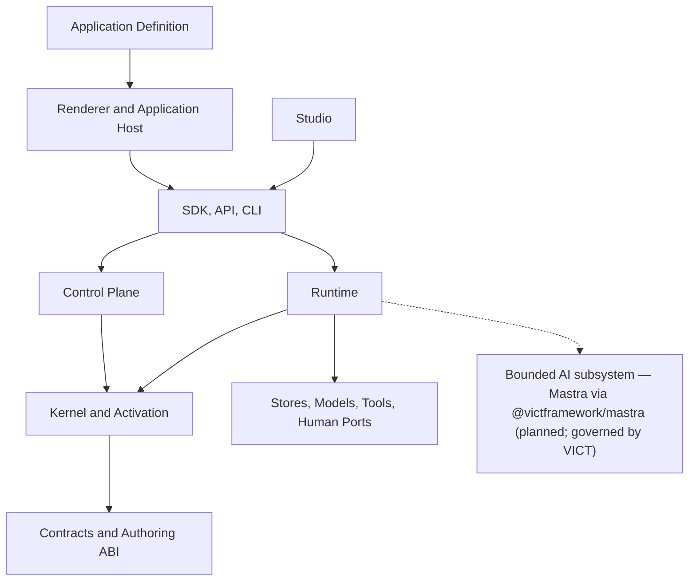
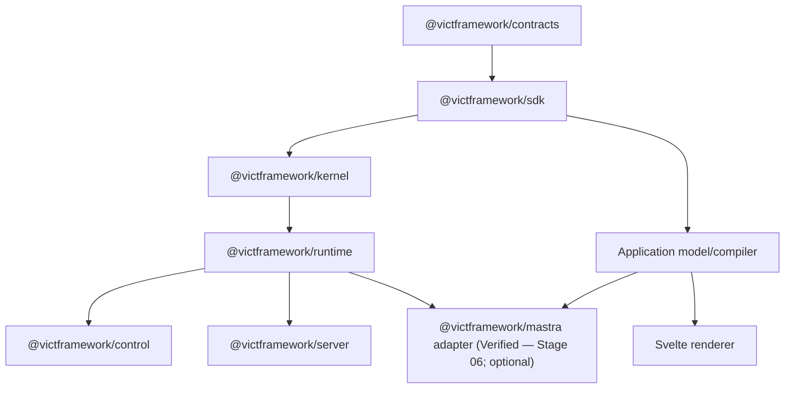
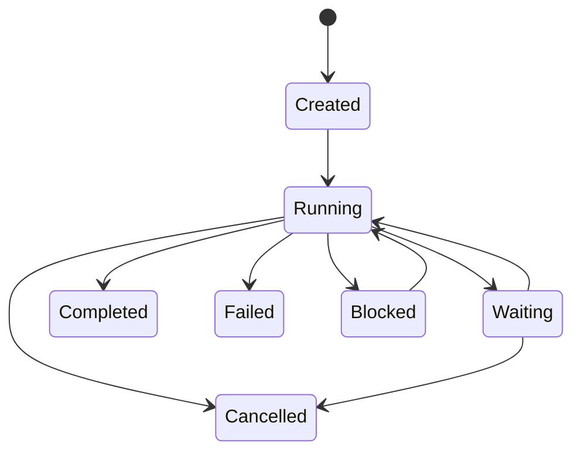
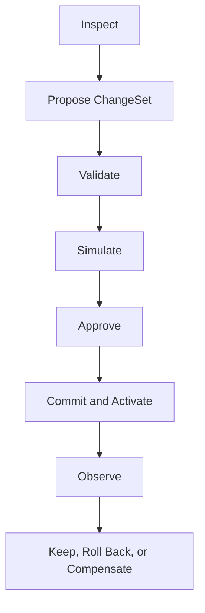
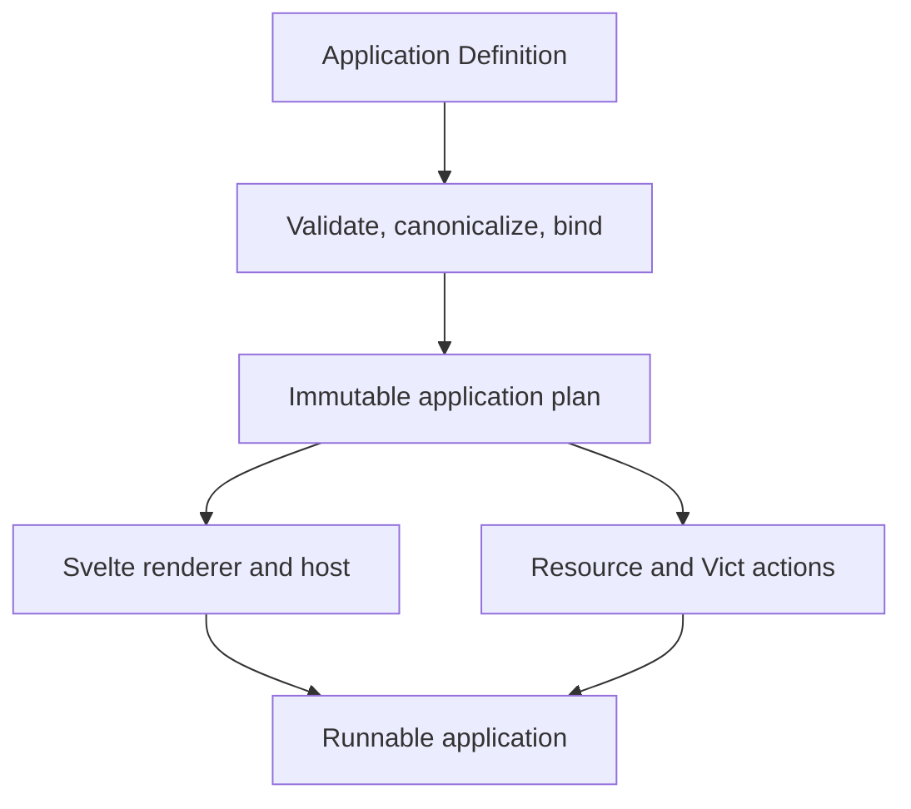
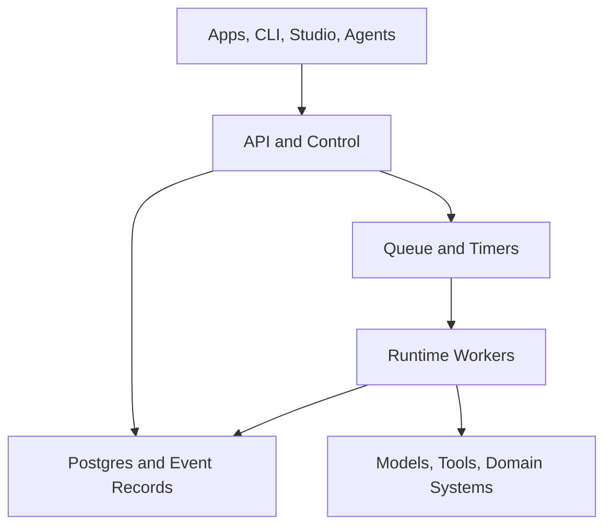

# VICT System Reference

> **Canonical title:** Vict Architecture and Operating Model — Authoritative System Reference<br>
> **Document version:** 0.4.6<br>
> **System generation:** Greenfield<br>
> **Status:** Authoritative baseline; Mastra/ARA integration amendment accepted (v0.3.0), finalized by the v0.3.1 pre-implementation correction, extended by the v0.3.2 Stage 06A formal closure, extended by the v0.3.3 Stage 06B implementation record, extended by the v0.4.0 Quellight product amendment, extended by the v0.4.1 Stage 07A implementation record, extended by the v0.4.2 Stage 07A formal closure, extended by the v0.4.3 Stage 07B handoff registration, corrected by the v0.4.4 navigation-group-order renderer correction, extended by the v0.4.5 coordinated 0.1.1 release-preparation record (§17.3 reactive-scope qualification), and extended by the v0.4.6 coordinated 0.1.1 publication record (§0.15); future features are individually marked<br>
> **Last updated:** 2026-09-10 (v0.4.6 — coordinated release set 0.1.1 PUBLISHED and independently verified installable: all 13 `@victframework/*` packages published at `0.1.1` to the public npm registry from the exact frozen artifacts of the release-preparation commit `2c8a7fb…` (`chore(release): prepare VICT 0.1.1`), dependency-topological order, public access, dist-tag `latest` advanced to `0.1.1` on every package only after all 13 were individually verified against the frozen artifacts (SHA-256 pre-publish, `dist.integrity` post-publish, downloaded-tarball byte recomputation), after a temporary candidate dist-tag (`vict-0.1.1-rc`) had kept `latest` at the complete `0.1.0` set during the publication window and was then removed; the immutable prior set `vict-release-set@1/0.1.0` (content ID `v1_dbb7438dfe16b7de245fe3863f6980b7e9a44a83c1809e01071941782597a11d`, release source `7e5908e…`) remains published, byte-unchanged, and installable by exact pin. New immutable release identity: `vict-release-set@1/0.1.1`, content ID `v1_e31e8dd60d05e1d6feb08b5ed0874cceae561bdf10e08d8b93e07840de8d9cdf` (§0.15). Publication required the supported interactive WebAuthn confirmation (2FA `auth-and-writes`) per registry write, completed by the owner in the browser; no OTP/password/token was requested, accepted, or stored, and no bypass token was created. The post-publication CI gate rule of `docs/RELEASE-COMPATIBILITY.md` §6 (`verify:release-consumer -- --registry`) passed, and an independent fresh-cache external consumer proved the exact-pinned install, strict typecheck, SQLite close/reopen, and the rendered navigation sequence Research → Practice → Operate → Review → System from the emitted registry artifacts. Release record: `docs/report/VICT-0.1.1-NAVIGATION-GROUP-ORDER-RELEASE.md`. No Stage 01–07A Verified status changed; every `QLT-*` requirement remains Planned; Stage 07B remains PERMITTED — SPECIFIED — IMPLEMENTATION NOT BEGUN). Previous: v0.4.5 — coordinated release-set 0.1.1 preparation: all 13 `@victframework/*` packages advanced to `0.1.1` with exact internal pins as the second immutable release set `vict-release-set@1/0.1.1` (content ID `v1_e31e8dd60d05e1d6feb08b5ed0874cceae561bdf10e08d8b93e07840de8d9cdf`), carrying the independently verified navigation-group-order renderer correction (independent verdict `VERIFIED WITH NON-BLOCKING ISSUES — RELEASE PREPARATION PERMITTED`, audit at `02dbf40…`); `docs/RELEASE-COMPATIBILITY.md` records the new set and preserves the complete `0.1.0` lineage record; §17.3's reactive-recalculation sentence is qualified to its verified scope (finding IV-1): shape-preserving group permutations and label renames recalculate without remounting, while adding, removing, or structurally resizing navigation groups during reactive plan replacement is NOT guaranteed by this release and is recorded as known framework debt (finding IV-2) — the stale-baseline closing marker is also corrected (finding IV-5); the renderer revision stays `renderer.svelte-kit@5.0.0` per the explicit release-time disposition of finding IV-4 (no normative rule requires a bump on renderer behavior changes; established practice; the npm package version distinguishes the corrected behavior); the published `vict-release-set@1/0.1.0` remains immutable and unchanged. Previous: v0.4.4 — navigation-group-order renderer correction (§17.3): the canonical Svelte renderer previously sorted navigation groups alphabetically by group name, silently discarding the ordered-navigation semantics the route contract already declares; the corrected renderer presents navigation groups in the order of their FIRST OCCURRENCE in the ordered route list (a repeated or interleaved group is anchored at its first occurrence and collects all of its routes), preserving the declared `nav.order` hint and the deterministic path tie-break within each group, the same order on desktop and mobile, and correct recalculation when an application plan changes reactively. Prompted by the external consumer finding GAP-CANDIDATE-2 (Trading OS T0 independent-review reconciliation, read-only evidence at `22a6b34…`); renderer-only correction — no Application Definition schema change, no compiled-plan shape change, no application-identity change, existing consumers remain valid. Implementation report: `docs/report/VICT-NAVIGATION-GROUP-ORDER-IMPLEMENTATION-REPORT.md`; independently verified (verdict `VERIFIED WITH NON-BLOCKING ISSUES — RELEASE PREPARATION PERMITTED`, `docs/report/VICT-NAVIGATION-GROUP-ORDER-INDEPENDENT-VERIFICATION.md`); the published release set `vict-release-set@1/0.1.0` (content ID `v1_dbb7438dfe16b7de245fe3863f6980b7e9a44a83c1809e01071941782597a11d`, release source `7e5908e…`) is immutable and unchanged and does NOT contain this correction. No Stage 01–07A Verified status changed; every `QLT-*` requirement remains Planned). Previous: v0.4.3 — the Stage 07B handoff is issued and registered (§0.14): `docs/handoff/VICT-STAGE-07B-QUELLIGHT-CONSUMER-BOOTSTRAP-HANDOFF.md` — Quellight Consumer Bootstrap and Live Conversation Foundation. Documentation-only registration: the handoff defines the Stage 07B boundary (repository inception against the immutable release set, one pinned live-provider profile — Ollama Cloud, model `glm-5.3-flash`, pending the owner credential and profile confirmation — streaming conversation over persistent threads with truthful reconnect/restart recovery, a minimal accessible conversation-first UI, and the Quellight-owned Shared World store foundation whose only durable record family in 07B is the user-created thread record); it explicitly separates conversation persistence from Shared World continuity; the proposed later substage sequence 07C–07D–07E is recorded there as PROPOSED. **Stage 07B PERMITTED — SPECIFIED (HANDOFF ISSUED) — IMPLEMENTATION NOT BEGUN**; the Quellight repository has not been created; every `QLT-*` requirement remains Planned; the published release set `vict-release-set@1/0.1.0` (content ID `v1_dbb7438dfe16b7de245fe3863f6980b7e9a44a83c1809e01071941782597a11d`, release source `7e5908e…`) is immutable and unchanged; no Stage 01–07A Verified status changed). Previous: v0.4.2 — Stage 07A Quellight consumer foundation independently verified and formally closed. The independent verdict at commit `cb9d74b…` is `VERIFIED WITH NON-BLOCKING ISSUES — FORMAL CLOSURE PERMITTED`. The formal-closure action performed the narrowly authorized F-1 correction — the `verify:stage7a` namespace gate no longer flags its own detection literal (fix commit `e45bdec…`) — marked N-1 CLOSED-in-Stage-07A, marked `ARCH-012` Verified, reconciled the F-4 wording in `docs/RELEASE-COMPATIBILITY.md`, and recorded `docs/report/VICT-STAGE-07A-FORMAL-CLOSURE.md` (§0.13). Disposition: `STAGE 07A VERIFIED WITH NON-BLOCKING ISSUES — FORMALLY CLOSED`; **Stage 07B PERMITTED — NOT BEGUN**; Stage 07 remains In Progress; every `QLT-*` requirement remains Planned; the published release set `vict-release-set@1/0.1.0` (content ID `v1_dbb7438dfe16b7de245fe3863f6980b7e9a44a83c1809e01071941782597a11d`, release source `7e5908e…`) is immutable and unchanged; no Stage 01–06 Verified status changed)<br>
> **Current delivery point:** Stages 1, 1.1, 2, 3, 4, 5, and 6 independently verified and formally closed (Stage 05 and Stage 06 closed with non-blocking issues); Mastra/ARA amendment accepted, finalized (v0.3.1), and implemented through Stage 06; product rebaselined to Quellight (v0.4.0); Stage 07A — the consumer foundation — implemented (v0.4.1, §0.12), independently verified and formally closed (v0.4.2, §0.13); **Stage 07 remains In Progress**; Stage 07B — Quellight Consumer Bootstrap and Live Conversation Foundation — is PERMITTED and SPECIFIED by its issued handoff (v0.4.3, §0.14) and IMPLEMENTATION HAS NOT BEGUN; the coordinated release set `vict-release-set@1/0.1.1` carrying the verified navigation correction is PUBLISHED and its consumer-installability independently proven (v0.4.6, §0.15)<br>
> **Next permitted stage:** Stage 7 — Minimum Workable Quellight (permitted, rebaselined, In Progress: Stage 06 is formally closed and Stage 07 proceeds under normal stage governance. **Stage 07A — Quellight consumer foundation — is implemented, independently verified (`VERIFIED WITH NON-BLOCKING ISSUES — FORMAL CLOSURE PERMITTED`, audit at `cb9d74b…`), and FORMALLY CLOSED (v0.4.2, §0.13). Stage 07B — Quellight Consumer Bootstrap and Live Conversation Foundation — is PERMITTED and SPECIFIED by its issued handoff `docs/handoff/VICT-STAGE-07B-QUELLIGHT-CONSUMER-BOOTSTRAP-HANDOFF.md` (v0.4.3, §0.14): repository inception of the separate Quellight repository against the immutable release set, one pinned live-provider profile, streaming conversation over persistent threads, and the Quellight-owned Shared World store foundation — and IMPLEMENTATION HAS NOT BEGUN**: there is no Quellight repository, no live provider/model integration, no Shared World store, and no real-use data-protection proof (MSTR-012), and none may be described as delivered. The Stage 07 governing architecture is `docs/architecture/STAGE-07-QUELLIGHT-MINIMUM-WORKABLE-PRODUCT.md` (canonical input SHA-256 `e7f61d24c16fd60c66efdb0af0b32859f1fdf1b571e32a0368870cb559b01331`), read together with the historical Mastra/ARA amendment `docs/architecture/MASTRA-ARA-INTEGRATION.md` and the closed Stage 06 foundation records `docs/architecture/STAGE-06A-PRODUCT-AGENT-FOUNDATION.md` and `docs/architecture/STAGE-06B-CONTROL-AND-GOVERNED-EXECUTION.md`, with the complete Stage 06 evidence chain in §0.10 and §24.3 of this reference)

---

## 0. Purpose and authority

This document defines the intended final form of Vict and the controlled path for building it. It is the single architectural reference for the product, runtime, ecosystem, builder tooling, deployment model, and development stages.

Vict is a greenfield system. Earlier Vict documents and packages are research inputs, not an inherited architecture. They may explain useful ideas, but they do not override this reference and do not establish package names, abstractions, or compatibility obligations.

### 0.1 Authority order

When sources disagree, use this order:

1. This system reference and requirements explicitly accepted into it.
2. Accepted architecture decision records that name the requirements they amend.
3. Public contracts and conformance tests for the currently implemented stage.
4. Current implementation and its verified behavior.
5. Stage handoffs, implementation reports, and audits.
6. Experiments, proposals, and legacy research.

Code is evidence of what exists; it does not silently redefine what Vict is intended to become. A discovered mismatch must be fixed, accepted as an explicit architecture change, or recorded as known debt.

### 0.2 Normative language

- **MUST** and **MUST NOT** are mandatory.
- **SHOULD** and **SHOULD NOT** are defaults that require a documented reason to violate.
- **MAY** is optional.
- **Current** describes verified implementation, not architectural preference.
- **Target** describes the accepted intended design, even when it is not implemented yet.

### 0.3 Two-dimensional status

Every material design item has both a maturity and a delivery status.

| Dimension | Value         | Meaning                                              |
| --------- | ------------- | ---------------------------------------------------- |
| Maturity  | Invariant     | Foundational rule; changing it redefines Vict        |
| Maturity  | Accepted      | Chosen design; implementation may still be pending   |
| Maturity  | Provisional   | Direction is useful, but details require evidence    |
| Maturity  | Deferred      | Intentionally postponed and not a present dependency |
| Maturity  | Rejected      | Explicitly outside the architecture                  |
| Delivery  | Verified      | Independently checked in code and tests              |
| Delivery  | In Progress   | Being implemented; no completion claim yet           |
| Delivery  | Planned       | In an accepted future stage                          |
| Delivery  | Not Scheduled | Recognized but not assigned to a stage               |

“Implemented” is not equivalent to “Verified.” Only an independent audit can change delivery status to Verified.

### 0.4 Governing requirements

| ID      | Requirement                                                                                           | Maturity  | Delivery    |
| ------- | ----------------------------------------------------------------------------------------------------- | --------- | ----------- |
| GOV-001 | This document MUST be the architectural source of truth for greenfield Vict.                          | Invariant | Verified    |
| GOV-002 | Handoffs MUST reference requirement IDs and MUST NOT create competing architecture.                   | Accepted  | Planned     |
| GOV-003 | Each stage MUST end with implementation, independent audit, disposition, and reference update.        | Invariant | In Progress |
| GOV-004 | Future behavior MUST NOT be described as current until independently verified.                        | Invariant | Verified    |
| GOV-005 | Architecture changes MUST record rationale, affected IDs, compatibility impact, and migration impact. | Accepted  | Planned     |
| GOV-006 | Legacy documents MAY inform decisions but MUST NOT impose legacy package or language structure.       | Invariant | Verified    |

### 0.5 Accepted architecture amendment — Application Layer

On 2026-09-02, after Stage 3 had established the durable execution foundation and before Stage 4 began, the product boundary was reviewed against Vict's intended outcome. The greenfield architecture correctly rejected the legacy grammar engine, mandatory `lang-*` package hierarchy, and YAML-first thesis, but it also left end-user application delivery as separately authored framework work. Under that plan, Vict would reliably execute an application without materially accelerating creation of the application surface itself.

That omission is corrected in v0.2.0. Vict now includes a first-class **Application Definition and Delivery Layer** above the semantic/runtime foundation. It owns a framework-neutral structured application model; typed domain-resource and action bindings; application identity and release composition; a renderer contract; a SvelteKit reference renderer; scaffolding; and explicit custom-component escape hatches. It is distinct from Studio, which is an operator surface, and from capabilities, which remain executable behavior.

This amendment:

- adds product requirements PRD-007 and PRD-008, architecture requirements ARCH-007 through ARCH-009, and the APP requirement family;
- extends the Application plane and target package responsibilities;
- adds a dedicated Application Layer section;
- revises unstarted Stages 4 onward so application authoring and delivery are proven before the real ARA product;
- preserves every verified Stage 1–3 execution, identity, safety, and durability invariant;
- creates no compatibility obligation to legacy `lang-app`, `lang-space`, `kit-svelte`, `app.yaml`, `layout.yaml`, or grammar packages; their useful concepts are research inputs only;
- requires no migration of current code because the amendment is additive and no Application Layer package or public contract has yet shipped.

### 0.6 Accepted architecture amendment — Mastra/ARA integration (v0.3.0)

On 2026-09-04, after the verified closure of Stage 05 and before any Stage 06 implementation, the product-agent boundary was decided. The real ARA product needs a production-grade agent framework for model-provider integration, the open-ended reasoning loop, tool selection, streaming, conversation memory, and AI observability; rebuilding those inside VICT would duplicate a fast-moving external framework, while adopting one naively would surrender VICT's safety, durability, identity, application-delivery, and governance responsibilities.

The amendment resolves this with a strict ownership split, fully specified in `docs/architecture/MASTRA-ARA-INTEGRATION.md` (normative for Stages 06–07):

```text
Mastra reasons and coordinates AI work.
VICT authorizes, commits, governs and presents product behavior.
```

- **Mastra is accepted as the canonical first product-agent framework** for the real ARA product (MSTR-001). VICT will not rebuild Mastra's model-provider integration, open-ended agent loop, tool-selection loop, streaming engine, conversation memory, semantic/working/observational memory, subagent mechanics, AI tracing, or evaluation machinery.
- **VICT core remains Mastra-neutral.** A neutral `ProductAgent` boundary (port, versioned `vict.agent-stream@1` event contract, activation-time snapshot semantics) is added; Mastra types may exist only inside an optional adapter package (`@victframework/mastra`, Planned) and product composition (AI-001..AI-015, MSTR-001..MSTR-010).
- **Authority is unchanged.** VICT remains the sole authority for effects, approvals, retries, durable completion, actor identity, releases, and audit history; a Mastra tool bridge is the only path from model tool selection to VICT-governed execution; a model can never approve its own protected action; Mastra suspension is never authorization.
- **Stores stay separate.** Mastra memory, VICT application-domain data, VICT operational history, and Mastra observability are four separate storage domains joined by correlation IDs, with explicit retention/deletion/export policies and no claimed cross-store atomicity. Initial Mastra store: the officially supported file-backed `@mastra/libsql` adapter (MSTR-003).
- **Streaming/transport decided:** a VICT-owned normalized agent-stream contract with sequence numbers, at-least-once delivery, and cursor reconnect, delivered as HTTP commands plus resumable SSE (AI-009); WebSocket/WebRTC deferred until realtime voice justifies it (OPEN-018).
- **Stages revised:** Stage 6 becomes "Control plane, API, and product-agent integration foundation" (integration, tool bridge, identity snapshots, streaming, offline fixtures, AUDIT-F1 hygiene); Stage 7 becomes the Mastra-backed real ARA product (§23).
- **Documentation consistency corrections (not reopened Stage 05 findings):** §5.1 now states the accurate browser-safety boundary of the application branch, and §5.2 now distinguishes verified Stage 05 packages from future stage-gated targets.
- Every new requirement is marked Accepted/Planned — **nothing Mastra-related is Verified**; Stage 06 remains not implemented; no Mastra dependency is added by this amendment; Stage 01–05 verified statuses are unchanged.

### 0.7 Correction v0.3.1 — Mastra/ARA finalization (pre-implementation)

Independent review of v0.3.0 found architectural ambiguities that are
closed here BEFORE Stage 06 implementation begins. v0.3.1 is a
**consistency and safety correction** to v0.3.0 — no verified Stage 01–05
status changes, no implementation is claimed, no dependency is described
as installed, and the central rule is unchanged:

```text
Mastra reasons and coordinates AI work.
VICT authorizes, commits, governs and presents product behavior.
```

1. **Complete agent executable identity (§6 of the amendment; AI-003,
   AI-004, MSTR-002).** `agentProfileVersion` now covers EVERY
   runtime-affecting profile component — agent and instructions IDs and
   revisions, model profile incl. model router/provider intent,
   generation defaults and bounded options, stop/iteration/tool-call/loop
   policy, memory policy, ordered processor and guardrail chains,
   structured-output contract (when enabled), sorted Mastra-native
   helper-tool references, sorted VICT capability references, sorted
   subagent/AI-internal workflow references (when enabled), and an
   adapter compatibility marker including every runtime-affecting pinned
   `@mastra/*` version actually used. Set-like collections sort
   canonically; order-sensitive chains preserve declared order; profile
   data is strict canonical data (functions, accessors, inherited fields,
   sparse arrays, timestamps, random values, and secrets rejected;
   function bodies never hashed). Activation deep-captures an immutable
   snapshot; in-flight turns never consult live Mastra objects; helper
   tools are pure/presentation-local only and fully versioned
   (amendment §6.5).
2. **Local data-protection baseline moved earlier (amendment §8.1–§8.3;
   MSTR-003, MSTR-008, MSTR-011, MSTR-012; OPEN-017 split).** Stage 06's
   foundation increment must specify and test credential isolation,
   payload-safe tracing, explicit retention bounds with an actually
   executed pruning mechanism, governed deletion/export with cross-store
   reconciliation, store-file placement and permissions, backup/export
   disclosure, canary leakage tests, and data classification. Stage 07
   must declare its deployment envelope — local-first, single actor,
   single application process, non-multi-tenant, file-backed — and prove
   the protections in real use before the product is called usable for
   real cases. Only managed/cloud-scale protections (encryption-at-rest,
   KMS/rotation, multi-tenant isolation, cloud secret management,
   production topology, dedicated observability infrastructure, formal
   backup encryption/DR) remain deferred to Stage 11.
3. **Primary-source ledger (amendment §2.4).** Link-level traceability
   for every material Mastra dependency claim, with the
   documented-versus-verified rule restated and Standard Schema /
   Standard JSON Schema / JSON Schema terminology disambiguated.
4. **Stage 06 delivery split (amendment §12.1).** Stage 06 remains one
   formal stage with one final exit gate, implemented as two sequential
   independently reviewed increments: **Stage 06A — Product-agent
   foundation** (neutral declarations, strict profile schema, complete
   identity, snapshots, pinned adapter foundation, offline model fixture,
   helper-tool restrictions, storage boundary, data-protection baseline,
   package isolation, upgrade harness, AUDIT-F1 hygiene) and
   **Stage 06B — Control plane and governed remote execution**
   (ChangeSets/approvals/release governance, actor boundary, HTTP
   commands, resumable SSE with the final `vict.agent-stream@1` field
   schema, tool bridge, approval suspension/resume, cancellation,
   reconnect/dedupe, restart reconciliation, retention/leakage
   verification, CLI and remote bindings, adversarial security testing).
   Stage 06 is marked Verified only after both increments and the full
   exit gate pass a final independent audit. Stages 07–11 are NOT
   renumbered; Stage 07 remains blocked behind formal Stage 06 closure.

### 0.8 Closure v0.3.2 — Stage 06A formal closure (documentation-only)

On 2026-09-06, after the final independent Linux closure audit, Stage 06A
is formally closed. The authoritative disposition is **VERIFIED WITH
NON-BLOCKING ISSUES — STAGE 06A CLOSED — STAGE 06B PERMITTED**; two
accepted Low findings are carried into Stage 06B as early acceptance
items. This v0.3.2 update is documentation-only: no accepted architecture
changes, no Stage 01–05 verified status changes, no production code,
tests, packages, migrations, examples, fixtures, verification scripts, or
historical reports are modified, and no Stage 06B capability is claimed
as existing. The complete closure disposition, evidence chain, verified
behavior, and carried findings are recorded in §24.3. Stage 06 as a whole
remains **In Progress** until Stage 06B and the full Stage 06 exit gate
are independently verified and formally closed (satisfied on 2026-09-09 —
see §0.10; this section records the v0.3.2 state).

### 0.9 Implementation increment v0.3.3 — Stage 06B implemented (documentation update)

Stage 06B — control plane and governed remote execution — is implemented
on top of the Stage 06A closure point, and this v0.3.3 update records the
increment in §5 (package inventory), §24.3 (implementation record), and
§24.4 (evidence documents). The Stage 06A closure disposition and all
historical audits are unchanged. The delivered increment comprises the
closed LOW-06A carry-forwards, the final `vict.agent-stream@1` schema
(OPEN-015 decided), the `@victframework/control`, `@victframework/server`, and `@victframework/cli`
packages, the governed `@victframework/mastra` tool bridge, durable approvals and
cancellation, resumable SSE, remote Application bindings, SIGKILL
cross-store fixtures, and the adversarial canary matrix, gated by the new
`verify:stage6b` aggregate. This is an implementation record: **Stage 06B
is not yet independently audited**, no Stage 06B requirement is Verified,
and the full Stage 06 exit gate remains open.

The authoritative status statement:

```text
Stage 06A independently verified and closed.
Stage 06B implemented and awaiting fresh independent audit.
Stage 06 remains In Progress and is not yet Verified.
Stage 07 remains blocked.
```

Superseded on 2026-09-09 by §0.10: the Stage 06B increment recorded above
was subsequently independently audited, corrected post-audit (hostile
envelope containment, then the H-1 delivery-snapshot boundary),
re-verified, and Stage 06 was formally closed. The statement block above
is the truthful v0.3.3 record and is no longer the current status.

### 0.10 Closure v0.3.4 — Stage 06 formal closure (documentation-only)

On 2026-09-09, after the final independent H-1 closure verification at
commit `8c13c28d4d50c53e141b32f05150d4c443a3dba5`, Stage 06 — Control
plane, API, and product-agent integration foundation — is **verified and
formally closed**. The authoritative independent verdict is
`VERIFIED — STAGE 06 READY FOR FORMAL CLOSURE`; the disposition recorded
by this documentation-only update is:

```text
STAGE 06 VERIFIED — FORMALLY CLOSED — STAGE 07 PERMITTED
```

- **Stage 06A — product-agent foundation:** independently verified with
  non-blocking issues and formally closed at v0.3.2 (final independent
  Linux closure audit `8a554cb`, implementation target `1ac9c18`; formal
  closure commit `b491ededed32a796aa035befe77946e8b107338b`).
- **Stage 06B — control plane and governed remote execution:**
  implemented on the Stage 06A closure point and delivered through a
  truthful corrective history (corrective finalization; R1–R6 reliability
  corrections; invocation and control-boundary correction; tool-state
  truthfulness correction), then audited by the fresh independent Stage
  06 exit audit (`eb8d458a3718562f61e60d844dfa31ffb9cbf356`, verdict
  `VERIFIED WITH NON-BLOCKING ISSUES — STAGE 07 PERMITTED AFTER FORMAL
  STAGE 06 CLOSURE`; one Low and two Informational findings, none
  blocking).
- **Post-audit envelope remediation:** hostile tool-result containment
  (`735cc9a19d3d8253f792e10d605967142b2ad052`), verified by the focused
  independent re-audit (`d146dae1fd27f665ed9d8c297d40436046a860fb`)
  which also independently reproduced one residual High defect — H-1: a
  contract-valid but delivery-hostile capability output was settled
  durably `completed` and then normalized as `tool.failed` — and
  correctly blocked closure until it was corrected.
- **H-1 correction and final verification:** the delivery-safe snapshot
  boundary (implementation
  `c2ff692e68658fca281f797cd1fe5dd9fa0ddd38`, documentation tip
  `a6675bb8f47c763d99f140dddeab7021a6242df1`) captures the exact
  model-facing value BEFORE the fenced `completed` settlement and
  rejects uncapturable values with a stable, non-echoing
  `outcome_unknown` (one effect; a retry never re-executes). The final
  independent closure verification (`8c13c28…`) re-proved the boundary
  end-to-end — negative control at the defective baseline, 68/68 exact
  snapshot-boundary checks, the real-path truthfulness matrix over all
  read/write × memory/SQLite combinations, 114 files / 2152 tests, and
  `verify:stage6b` — and returned the authoritative verdict above with
  no blocking finding.
- **Requirement reconciliation:** Stage 06-delivered requirement rows are
  promoted to Verified in §1.2 (PRD-002), §2 (ARCH-003), §14.3 (CTRL),
  §15.3 (AI, MSTR), §16.6 (API), and §21.1 (SEC), each with a recorded
  evidence mapping in §23 (Stage 6). `OPEN-015` is decided: the final
  field-level `vict.agent-stream@1` schema and the neutral
  `ProductAgent` port signatures are implemented and independently
  verified. Stage 07 concerns (AI-013, ARA-008, MSTR-009, MSTR-012, real
  provider/model selection, the complete ARA user interface, and any
  multi-process, multi-tenant, or cloud-scale claim) remain Planned.
- **Accepted non-blocking carry-forwards** (§23, Stage 6; §24.2): the
  H-1 audit Low finding N-1 (own `__proto__` delivery-snapshot key
  handling) is recorded as an early Stage 07 hardening acceptance item;
  N-2 (sparse-array dense prefix, `-0`) is informational; the
  shared-store cross-composition liveness adjudication (EXIT-1) remains
  the documented trade-off of the declared single-process/local
  envelope; WSL2/native-ext4 evidence is not bare-metal certification;
  and no live provider/API-key verification has occurred — that work
  belongs to Stage 07.
- **Stage 07 is now permitted but has NOT begun:** no Stage 07
  capability, product surface, real-provider integration, or real-use
  proof exists, and none may be described as delivered or Verified.
  This v0.3.4 update is documentation-only: no accepted architecture
  changes, no production code, tests, packages, migrations, examples,
  fixtures, verification scripts, manifests, or historical reports are
  modified. The complete closure record, evidence chain, verified
  behavior, and remaining non-blocking issues are recorded in §23
  (Stage 6) and §24.3.

---

## 0.11 Accepted architecture amendment — Quellight product rebaseline (v0.4.0)

On 2026-09-09, after the verified formal closure of Stage 06 and before
any Stage 07 implementation, the product was rebaselined. The product
previously called **ARA** is now named **Quellight**. This is a
substantive accepted architecture amendment (minor version per §27.5:
accepted additive architecture and stage design — no invariant, identity
model, authority boundary, or verified status changes).

Authoritative input: the canonical frozen architecture context
`The-Persistent-Cognitive-Partner-Agent-Context-v1.3-CANONICAL.md`
(version 1.3, 2026-09-07, status `CANONICAL — conceptual architecture
frozen`; SHA-256
`e7f61d24c16fd60c66efdb0af0b32859f1fdf1b571e32a0368870cb559b01331`).
The canonical architecture is Quellight's long-term governing product
architecture. Stage 07 delivers a truthful **Minimum Workable
Quellight**, not a claim that the v1.3 architecture is implemented.

The governing architecture record is
`docs/architecture/STAGE-07-QUELLIGHT-MINIMUM-WORKABLE-PRODUCT.md`,
which defines:

- the **repository boundary**: VICT is the reusable application
  framework, runtime and control system (this repository); Quellight is
  a separate product repository and external consumer of released VICT
  packages — VICT's first flagship consumer and reference product;
- the **corrected memory/identity model**: Mastra owns raw transcripts,
  in-flight working memory, and replaceable caches only; every durable
  partnership-material fact, interpretation, commitment, open loop,
  relationship state, authority record, and learned procedure resolves
  to Quellight's Shared World; `MS2–MS6` and durable living-model state
  are rebuildable from it; VICT `agentProfileVersion` is pinned
  executable agent configuration, not Quellight's persistent identity;
  VICT operational events record what the software executed and are not
  themselves the Shared World; Shared World writes cross typed, governed
  VICT capabilities; a new thread with no transcript recovers relevant
  continuity from the Shared World;
- the **Shared World storage decision**: a Quellight-owned store and
  SQLite adapter in the Quellight repository (the generic
  `@victframework/application` data port is flat single-resource CRUD — equality
  filters, single-record mutations — and is not stretched into lineage,
  atomic multi-record semantics, dependency invalidation, or
  retention/tombstone behavior); a generic VICT abstraction is deferred
  until real consumer evidence;
- the **exact minimum scope** (§7 of that document), the **canonical
  first vertical** (the commitment/continuity acceptance scenario, §8),
  the **Q0–Q5 roadmap** (§9), and the explicitly **deferred
  capabilities**;
- the **requirement families**: historical `ARA-*` identifiers and all
  ARA evidence are preserved unchanged; new product semantics use the
  new `QLT-*` family (QLT-001..QLT-020), **all Planned**; supersession
  of future-facing framings is explicit, never silent; no Stage 01–06
  Verified status changes; no requirement is simultaneously Planned and
  Verified;
- the **constitutional launch positions**: OQ1 conversation-first
  workspace with visible objects; OQ2 explicit commitment confirmation;
  OQ3 no autonomous interruption in the minimum; OQ4 one pinned
  provider/model profile, rotation deferred; OQ5 no default external
  execute/decide authority; OQ6 custodian and ceremony **proposed, not
  ratified** — no constitutional-owner approval is recorded as having
  occurred.

Stage 07 delivery is split into increments. **Stage 07A — Quellight
consumer foundation** (`docs/handoff/VICT-STAGE-07A-QUELLIGHT-CONSUMER-FOUNDATION-HANDOFF.md`)
is the next permitted implementation increment: the H-1 audit Low N-1
(own `__proto__` delivery-snapshot keys) hardening, the stale Stage 06B
verifier success-banner correction, the release and consumer mechanism,
the immutable compatible release-set identity, the isolated
clean-consumer verification, and the protected configuration
foundations. At the v0.4.0 amendment time Stage 07 implementation had
not begun; the v0.4.1 record below documents its first increment.

---

## 0.12 Implementation increment v0.4.1 — Stage 07A Quellight consumer foundation implemented (awaiting independent verification)

On 2026-09-09 the Stage 07A increment (the six handoff work items) was
implemented on the Stage 06 closure point `e0e65b7`. This is an
implementation record: **Stage 07A is NOT Verified** — it awaits
independent verification per the handoff's exit gate — no Stage 01–06
Verified status changed, no `QLT-*` requirement is promoted, and Stage
07B has not begun.

1. **Canonical public namespace — `@victframework/*`.** The originally
   assumed `@vict/*` npm scope is unavailable; the owner approved
   `@victframework/*` as the canonical public namespace, published by
   npm user `rz1` through the `victframework` organization (`rz1` is an
   owner of the org). All current executable and normative surfaces —
   manifests, source imports, declarations, tests, fixtures, examples,
   packs, scripts, verifiers, lockfile, and current architecture and
   reference documentation — now use `@victframework/*`. **Namespace
   supersession record:** every pre-rename historical report, handoff,
   audit, and evidence record correctly names `@vict/*` for its time and
   is preserved byte-for-byte unchanged; those references denote the
   same packages now named `@victframework/*`. The historical names are
   never published. No executable, generated, or consumer-facing surface
   depends on unavailable `@vict/*` packages (gated by the
   `verify:stage7a` namespace gate).
2. **Licensing.** Apache-2.0 (owner decision): the complete official
   Apache License 2.0 text is the root `LICENSE`; `license:
   "Apache-2.0"` is declared on the root and every publishable manifest.
3. **N-1 hardening (handoff work item 1).** Own `__proto__`
   delivery-snapshot keys — scalar- or object-valued, any own form, any
   depth — are now REJECTED with the dedicated closed reason
   `proto-field` in `DeliveryUnsafeReason`, surfaced through the
   EXISTING durable code `VICT_CAPABILITY_UNSAFE_OUTPUT_STRUCTURE`
   (model code `VICT_CAPABILITY_OUTCOME_UNKNOWN`): a documented
   specialization of the closed durable vocabulary, introducing no new
   durable store value. Null-prototype containers without a prohibited
   key remain accepted; `constructor`/`prototype` string keys remain
   plain own data; all other accepted delivery-domain behavior is
   unchanged. Negative control: the emitted-package probe
   (`scripts/verify-n1-emitted.mjs`) reproduces BOTH defect signatures
   (scalar silently dropped; object value promoted to the delivered
   container's prototype) at `e0e65b7` in an isolated worktree and
   passes on the corrected implementation. Permanent suites:
   `packages/mastra/test/tool-bridge.proto-field.test.ts`.
4. **Stage 06B verifier banner (handoff work item 2).** The stale
   success line ("Stage 06B corrective finalization complete; awaiting
   fresh independent audit.") is replaced by the truthful "Stage 06
   closed (independently verified and formally closed 2026-09-09);
   verification ladder re-confirmed." Gates, gate list, gate order,
   exit codes, and failure output are unchanged.
5. **Public release set and identity (handoff work items 3–4).** The
   thirteen packages (`@victframework/{contracts, sdk, kernel, runtime,
   store-sqlite, application, renderer-svelte, appdata-sqlite,
   scaffolder, mastra, control, server, cli}`) are version `0.1.0` with
   exact internal dependency pins, `publishConfig.access = public`,
   Node `>=22.13.0` engines, and Apache-2.0 licensing; examples, packs,
   and the root workspace remain private. The immutable compatible
   release-set identity — `vict-release-set@1/0.1.0`, content ID
   `v1_dbb7438dfe16b7de245fe3863f6980b7e9a44a83c1809e01071941782597a11d`
   — and the consumer install/rollback/integrity procedures are
   recorded in `docs/RELEASE-COMPATIBILITY.md` and gated by
   `npm run verify:release-set` (mismatched pins fail the release).
   Publication is scripted (`npm run publish:release`),
   dependency-topological, dry by default, and never overwrites,
   re-publishes, or unpublishes a used version. This supersedes the
   handoff's private-registry mechanism decision per the owner's
   explicit public-publication authorization (namespace and licensing,
   above).
6. **Isolated clean-consumer verification (handoff work item 5).**
   `npm run verify:release-consumer`
   (`scripts/verify-release-consumer.mjs`) installs the exact recorded
   set — from packed tarballs pre-publication and from the public
   registry post-publication — into a fresh temp consumer OUTSIDE the
   repository, asserts exact versions and lockfile integrity hashes,
   proves no monorepo leakage (lockfile resolutions, realpaths),
   typechecks the full public surface strictly, executes a minimal
   runtime composition (contract + capability + graph on real SQLite
   with close/reopen exact-activation restore), compiles an Application
   Definition, and runs the renderer structural composition headlessly.
7. **Protected operator-configuration foundation (handoff work item
   6).** `@victframework/runtime` now provides the bounded typed
   operator-configuration resolution foundation
   (`packages/runtime/src/operator-config.ts`): provider-profile
   selection (one pinned profile; credential VARIABLE NAME only),
   store locations, and retention bounds — closed field sets, bounded
   patterns, fail-closed unavailable-credential behavior with stable
   non-echoing codes, and canary-proven non-leakage across logs,
   errors, and persisted bytes
   (`packages/runtime/test/operator-config.test.ts`). No live provider,
   no Quellight code, no secrets platform.
8. **Status and remaining limitations.** Stage 07A is implemented and
   internally verified; the independent Stage 07A audit (including the
   N-1 hardening) has NOT yet occurred, and until it passes no
   live-provider or real-Quellight work may begin. The publication
   itself is executed from the verified release commit and evidenced in
   the Stage 07A implementation report
   (`docs/report/VICT-STAGE-07A-CONSUMER-FOUNDATION-IMPLEMENTATION-REPORT.md`).
   Remaining limitations are recorded there and include: no live
   provider was contacted (Stage 07A needs none); the release-set
   `latest` dist-tag records the first public release; and `ARCH-012`'s
   delivery-status update remains an audit decision (the first real
   consumer obligation is now exercised, not yet independently
   verified).

> **Superseded on 2026-09-09 by §0.13:** the implementation record
> above was subsequently independently verified — verdict `VERIFIED
> WITH NON-BLOCKING ISSUES — FORMAL CLOSURE PERMITTED` — and Stage 07A
> was formally closed at v0.4.2. The statements "Stage 07A is NOT
> Verified", "the independent Stage 07A audit has NOT yet occurred",
> and "`ARCH-012`'s delivery-status update remains an audit decision"
> are the truthful v0.4.1 record of that time and are no longer the
> current status; the audit did reproduce one gate defect (F-1) and
> the formal-closure action carried the sanctioned correction. This
> section is preserved unchanged as the historical implementation
> record.

---

## 0.13 Closure v0.4.2 — Stage 07A formal closure (F-1 verifier correction plus documentation)

On 2026-09-09, after the independent Stage 07A verification at commit
`cb9d74bf0d4ca8e1c21f7962e80bbf8d358d82a1` returned the authoritative
verdict `VERIFIED WITH NON-BLOCKING ISSUES — FORMAL CLOSURE PERMITTED`,
Stage 07A — the Quellight consumer foundation — is **formally closed**.
The authoritative disposition is:

```text
STAGE 07A VERIFIED WITH NON-BLOCKING ISSUES — FORMALLY CLOSED
STAGE 07B PERMITTED — NOT BEGUN
```

Stage 07 as a whole remains **In Progress** until the Stage 07 exit
gate (`docs/architecture/STAGE-07-QUELLIGHT-MINIMUM-WORKABLE-PRODUCT.md`
§13) passes an independent audit; Stage 07B — the Quellight repository
bootstrap — is permitted and has NOT begun; the Quellight product
repository (`C:/Users/RZ1/Desktop/RZ/260909-VCT-Quellight`,
`https://github.com/radz2291/Quellight`) remains untouched; every
`QLT-*` product requirement remains Planned; no Stage 01–06 Verified
status changed.

1. **F-1 correction (the only code change of this closure).** The
   independent audit found (Medium, non-blocking, corrective action
   required) that Gate 1 of `scripts/verify-stage7a.mjs` flags its own
   file: the scanner's source contains the literal `@vict/` as its
   detection pattern and doc-comment text, so `verify:stage7a` exited
   1 on the committed tree and in any clean checkout (offenders:
   `scripts/verify-stage7a.mjs`; gates 2–6 green). The gate failed
   closed (false positive, conservative direction); the substantive
   namespace property was independently verified TRUE. Reproduced at
   the audited starting commit `cb9d74b…` before any change (exit 1,
   364 files scanned, sole offender the verifier itself); corrected by
   the audit-sanctioned one-line exclusion of the verifier's own file
   from its own scan (fix commit `e45bdec…`); clean post-fix run exits
   0 (ALL GATES PASSED, 363 files scanned); and a deliberate
   negative control — a temporary tracked fixture importing
   `@vict/contracts` (former namespace) on a representative executable
   consumer surface (`packages/contracts/src/…`) — still failed the
   gate with exit 1, proving detection strength preserved. The fixture
   was removed after the proof. No broad directory/file-type
   exclusion, no unconditional pass, no other gate, production package,
   or release artifact was touched.
2. **Truthful implementation-report discrepancy.** The independent
   audit found that the implementation report's verification row
   "11. `verify:stage7a` — exit 0, all six gates" **did not reproduce
   on the committed tree**: the auditor's ladder run exited 1 with
   Gate 1 self-flagging (F-1, cause above). The historical
   implementation report
   (`docs/report/VICT-STAGE-07A-CONSUMER-FOUNDATION-IMPLEMENTATION-REPORT.md`)
   is preserved unchanged; this discrepancy is recorded here and in
   the formal-closure record, and the corrected gate now genuinely
   passes from a clean checkout.
3. **N-1 — CLOSED-in-Stage-07A.** The audit independently reproduced
   the baseline defect at `e0e65b7` with its own probe and verified
   the corrected boundary end-to-end (own `__proto__` keys rejected
   with `proto-field` for scalar/object/null/array values, JSON.parse
   and `defineProperty` forms, depths 1–14; governed-bridge durable
   surface fenced `outcome_unknown`, exactly one effect, no second
   effect on retry; no echo, no pollution, no caller alias; safe
   null-prototype and `constructor`/`prototype` behavior preserved;
   three consecutive green rounds of the affected suites; full ladder
   2175 passed / 3 skipped; `verify:n1` 16/16). Its disposition —
   "N-1's independent-verification acceptance criteria are SATISFIED —
   CLOSED-in-Stage-07A" — is now recorded in §23 (Stage 6) and §24.2.
4. **ARCH-012 — Verified (Stage 07A).** The first-real-consumer
   obligations are independently exercised: 13 public packages,
   semver `0.1.0`, `engines.node >=22.13.0` on every manifest, the
   recorded compatibility document, and a proven external consumer.
   The audit's §15 disposition ("SATISFIED in substance") is
   reconciled in §5.3 per §27.4.
5. **F-4 wording reconciliation.** `docs/RELEASE-COMPATIBILITY.md` §6
   no longer implies a version-tag publication path; the immutability
   anchors are the content-derived release-set identity and the
   clean-tree publication preflight, as independently verified.
6. **Immutable release boundary unchanged.** The published release
   remains: release source `7e5908e578c6371ef20a93d03c48f8af422ca487`,
   release set `vict-release-set@1/0.1.0`, content ID
   `v1_dbb7438dfe16b7de245fe3863f6980b7e9a44a83c1809e01071941782597a11d`,
   all 13 packages at `0.1.0` under the `latest` dist-tag. Nothing was
   republished, unpublished, or mutated; no dist-tag, access, or
   organization setting changed; no Git release tag was created. The
   F-1 verifier correction and this documentation commit do not alter
   any published artifact.
7. **Carried findings (unchanged, per the audit).** F-2 (Low,
   implementation-report accuracy) — accepted non-blocking debt;
   the historical report is preserved unchanged and the corrected
   counts are recorded in the formal-closure record. F-3 (Low,
   tarballs carry `license` metadata but not the license text) —
   accepted non-blocking debt, candidate Stage 07B-side packaging
   improvement. F-5 (Informational — `verify:stage6b` comment/label
   strings slightly exceeded "banner text only", semantically neutral;
   upstream `@mastra/*` declaration defects surface only with
   `skipLibCheck: false`) — informational, no action. F-6
   (Informational — four failed publication attempts truthfully
   recorded; published subset 0 before the successful run) — no
   action.

This v0.4.2 update changes exactly one verification script (the F-1
self-match correction above — no gate semantics beyond the sanctioned
self-exclusion) and active normative status/documentation locations
(§0.13 here, the §5.3 ARCH-012 row, §23/§24 status notes, the Stage 07
architecture status, the F-4 wording, and the formal-closure record).
No production code, tests, packages, manifests, lockfiles, examples,
packs, migrations, or historical reports were modified.

## 0.14 Handoff registration v0.4.3 — Stage 07B Quellight Consumer Bootstrap and Live Conversation Foundation specified (documentation-only)

On 2026-09-09 the Stage 07B implementation handoff was issued and is
registered as the next permitted increment after the closed Stage 07A:
`docs/handoff/VICT-STAGE-07B-QUELLIGHT-CONSUMER-BOOTSTRAP-HANDOFF.md`.
This is a documentation-only registration: **Stage 07B is PERMITTED —
SPECIFIED (HANDOFF ISSUED) — IMPLEMENTATION NOT BEGUN**; no Stage 01–07A
Verified status changed; every `QLT-*` requirement remains Planned; the
Quellight repository (`C:/Users/RZ1/Desktop/RZ/260909-VCT-Quellight`,
`https://github.com/radz2291/Quellight`) has not been created and was
inspected read-only only; the published release set is unchanged.

The handoff defines the complete Stage 07B boundary:

1. **Product outcome.** A real local Quellight application that installs
   the exact public release set, starts from a clean checkout with no VICT
   source present, streams a real model response through the Verified
   `vict.agent-stream@1` resumable-SSE path, creates and reopens
   conversation threads, persists and restores transcripts across process
   restart, reconnects truthfully after client interruption, and presents
   a minimal responsive accessible conversation-first UI — with
   credentials excluded from source, logs, events, serialization,
   persistence, and build artifacts, and with deterministic offline tests
   plus one bounded live-provider proof.
2. **Single provider profile (one precise owner confirmation required
   before the live proof runs).** Ollama Cloud, model `glm-5.3-flash`
   (model-router intent `ollama-cloud/glm-5.3-flash`; endpoint
   `https://ollama.com/v1`; credential environment-variable NAME
   `OLLAMA_API_KEY`; OpenAI-compatible chat completions; streaming
   supported; tool-capable for later stages; documented 429/5xx error
   behavior; zero data retention per Ollama's cloud policy). The owner's
   existing Z.ai credential is a GLM Coding Plan key, which Z.ai's usage
   policy restricts to supported coding tools — it MUST NOT be used for
   the Quellight application; the Z.ai alternative for application use is
   the pay-per-token Model API (`ZHIPU_API_KEY`) and would be a recorded
   profile revision. No rotation, no fallback (`OQ4`).
3. **Shared World boundary.** Conversation persistence is explicitly
   distinguished from Shared World continuity. Stage 07B introduces the
   Quellight-owned Shared World store foundation (own SQLite file, own
   versioned migrations, retention metadata columns) with EXACTLY ONE
   durable record family materialized — the user-created Shared World
   thread record. The agent/model writes nothing to the Shared World in
   07B; no continuity claim is derived from transcript persistence; full
   Shared World meaning (claims, commitments, loops, lineage, ceremony,
   context assembly) is explicitly deferred.
4. **Repository inception.** Verified empty-state preflight (the local
   folder contains only the canonical input document, whose SHA-256
   `e7f61d24…b01331` is re-verified; the GitHub repository is empty),
   `main` default branch, ordered initial commits, committed lockfile,
   exact `@victframework/*@0.1.0` pins, `private: true`, truthful
   `UNLICENSED` posture (no license invented), credential-free history,
   and a clean-install/no-monorepo-fallback proof.
5. **Proposed later sequence (PROPOSED, not accepted):** 07C Shared World
   Meaning and Ceremony → 07D Retention, Recovery, and Real-Use Proof
   (incl. `MSTR-012`) → 07E Stage 07 Exit Gate. The superseded ARA
   `07A/07B/07C` breakdown is not inherited.

The handoff's exit gate separates implementation-completeness (all
offline evidence and the proven live seam) from Stage 07B completion
(the single bounded live-provider run, which requires the owner-supplied
credential and the §7 profile confirmation). No work may be described as
Stage 07B Verified until an independent audit passes.

## 0.15 Publication record v0.4.6 — coordinated release set 0.1.1 published (navigation-group-order correction)

On 2026-09-10 the second coordinated public release set was published to
the public npm registry and its consumer-installability independently
proven, closing the release gate opened by the v0.4.4 correction and its
v0.4.4-era independent verification (verdict at `02dbf40…`:
`VERIFIED WITH NON-BLOCKING ISSUES — RELEASE PREPARATION PERMITTED`).

1. **Immutable identity.** `vict-release-set@1/0.1.1`, content ID
   `v1_e31e8dd60d05e1d6feb08b5ed0874cceae561bdf10e08d8b93e07840de8d9cdf`
   (sha256 over the sorted newline-joined `name@version` list, prefixed
   `v1_`), all 13 members at exactly `0.1.1` with exact internal pins.
   Recorded in `docs/RELEASE-COMPATIBILITY.md` §2; the complete `0.1.0`
   lineage record is preserved in its §2.1.
2. **Source commit.** `2c8a7fb5c264c337ae8474603e693bfb19394d1e`
   (`chore(release): prepare VICT 0.1.1`), pushed by normal fast-forward
   from `02dbf40…` before publication; the publication used exactly the
   tarballs built and frozen from that commit.
3. **Safe publication.** Temporary candidate dist-tag `vict-0.1.1-rc`
   kept `latest` at the complete `0.1.0` set during the publication
   window; after all 13 packages were individually verified (existence,
   `dist.integrity` equal to the frozen artifact, manifest, inventory)
   `latest` was advanced to `0.1.1` on every package and the candidate
   tag removed. Publication order: contracts → sdk → kernel → runtime →
   store-sqlite → application → renderer-svelte → appdata-sqlite →
   scaffolder → control → mastra → server → cli. No package was ever
   published under a mixed or partially-tagged final state; no
   overwrite, unpublish, or re-publish occurred.
4. **Authentication.** npm user `rz1` (owner of the `victframework`
   organization), 2FA `auth-and-writes`; every registry write (each
   publish and each dist-tag operation) required the supported
   interactive WebAuthn confirmation, completed by the owner in the
   browser. No OTP, password, token, or `.npmrc` content was requested,
   accepted, printed, or stored; no bypass token was created.
5. **Verification.** Pre-publication: the full ladder from a clean
   checkout of the source commit — all 17 steps exit 0, including the
   full suite (2184 passed / 3 skipped, first-run green), the focused
   navigation suite (9/9), the renderer project (54/54), and
   `verify:release-consumer` tarball mode; the release-set checker
   proven to fail closed by two corrupted-copy negative controls.
   Post-publication: per-package registry verification (13/13),
   `verify:release-consumer -- --registry` ALL CHECKS PASSED (the
   `docs/RELEASE-COMPATIBILITY.md` §6 CI gate rule), and an independent
   fresh-cache external consumer at exact `0.1.1` pins: lockfile
   registry-only resolutions with frozen-artifact integrity values, no
   `file:`/`link:`/workspace/git resolution, no monorepo realpath, strict
   TypeScript compilation, real-SQLite run with close/reopen
   exact-activation restore, Application Definition compilation, and the
   rendered navigation sequence **Research → Practice → Operate →
   Review → System** in declared first-occurrence order with
   `nav.order`/tie-break behavior (2/2 consumer tests). A negative
   control with a deliberately unavailable registry (command-scoped
   configuration, fresh cache) failed truthfully with no lockfile and no
   installed packages. The prior `0.1.0` artifacts remain published and
   byte-unchanged (per-version `dist.integrity` re-verified against the
   Stage 07A independent-verification record).
6. **Known debt carried, not erased.** The dynamic navigation shape-change
   limitation (IV-2) ships unrepaired with this release and is documented
   as known framework debt in §17.3 and in the release record; the
   reactive-recalculation guarantee is qualified to shape-preserving
   updates (IV-1). Trading OS T1's Application Definition uses a stable
   route and navigation-group structure, so the limitation does not block
   T1.
7. **Gates after this record.** `GAP-CANDIDATE-2` is CLOSED — the
   declared navigation-group ordering is supplied by a released,
   independently proven installable VICT version. The Trading OS T1
   entry gate is SATISFIED; Trading OS remains untouched and T1 has NOT
   begun. Stage 07B remains PERMITTED — SPECIFIED — IMPLEMENTATION NOT
   BEGUN; every `QLT-*` requirement remains Planned.

---

## 1. The complete idea

Vict is a capability-oriented application runtime and control system for building software whose behavior can be inspected, versioned, simulated, changed, executed, and audited.

The complete Vict package is not just an execution engine. It has six cooperating parts:

1. **Semantic core:** contracts, capabilities, graphs, activations, and deterministic execution rules.
2. **Operational runtime:** effects, persistence, retries, waits, cancellation, observability, and recovery.
3. **Application definition and delivery:** structured application, data, screen, layout, component, and action definitions rendered into a complete usable application with conventional-code escape hatches.
4. **Control plane:** safe inspection and change through proposals, validation, simulation, approval, activation, and rollback.
5. **Developer and builder system:** SDKs, local tools, conformance tests, and a model-agnostic Builder Kit usable by Codex, Claude Code, Pi, a human developer, or another coding host.
6. **Ecosystem and reference products:** reusable capability packs, adapters, application templates, proven playbooks, and a flagship reference consumer product — historically ARA, now named Quellight as a separate external-consumer repository (v0.4.0 rebaseline; §0.11).
7. **Product-agent subsystem (composed, not core):** the bounded AI subsystem of a real product. Since v0.3.0 this is accepted as Mastra operating behind the neutral VICT ProductAgent boundary — VICT never rebuilds it and never lets it own authority (see §0.6 and `docs/architecture/MASTRA-ARA-INTEGRATION.md`).



Vict behaves like an application operating system in a precise, limited sense: it supplies stable execution, identity, effect, state, change, and observability semantics above ordinary operating systems and infrastructure. It is not a general-purpose OS, a programming language replacement, or a universal distributed-computing layer.

### 1.1 Product outcomes

Vict should make these questions answerable:

- What behavior is active?
- Which exact graph and capability revisions produced this run?
- What data and external effects can it access?
- Can a proposed change be validated and safely simulated?
- Who or what approved and activated it?
- Can a suspended run resume against the same semantics?
- Can an operator diagnose failure without exposing sensitive payloads?
- Can a human or coding agent extend the system without bypassing its rules?
- Can one structured definition of behavior, domain data, and product surface produce a complete working application rather than only its backend?
- Can that application be customized with ordinary framework components without forking or bypassing Vict semantics?

### 1.2 Non-goals

Vict is not:

- a visual graph editor that forces every function call to become a node;
- a YAML-first orchestration product;
- a new general-purpose language;
- an autonomous production “healer” with unbounded mutation authority;
- a guarantee of exactly-once effects across arbitrary external systems;
- a model-specific agent framework in VICT core (the core stays agent-framework-neutral; since v0.3.0 the real ARA product composes Mastra behind the neutral ProductAgent boundary, which keeps VICT itself model- and framework-agnostic);
- a microservice requirement;
- a reason to replace normal TypeScript, Svelte, React, SQL, or infrastructure tools.
- a promise that every game, 3D experience, animation, or pixel-specific marketing surface can be expressed without custom code;
- a requirement that React, Svelte, or any renderer-specific type leak into the framework-neutral Application Definition.

| ID      | Requirement                                                                                                                                                            | Maturity  | Delivery    |
| ------- | ---------------------------------------------------------------------------------------------------------------------------------------------------------------------- | --------- | ----------- |
| PRD-001 | Vict MUST make active application behavior inspectable and version-addressable.                                                                                        | Invariant | In Progress |
| PRD-002 | Vict MUST separate proposed behavior from activated behavior.                                                                                                          | Invariant | Verified    |
| PRD-003 | Vict MUST support ordinary code and UI frameworks without forcing artificial graph nodes.                                                                              | Invariant | Verified    |
| PRD-004 | Vict MUST remain usable locally before requiring distributed infrastructure.                                                                                           | Accepted  | Verified    |
| PRD-005 | Vict SHOULD provide the same semantic model in local and server deployments.                                                                                           | Accepted  | Planned     |
| PRD-006 | Vict MUST be model-agnostic at the builder and product-agent boundaries.                                                                                               | Invariant | Planned     |
| PRD-007 | Vict MUST materially accelerate creation of complete end-user applications, not only the reliable behavior behind them.                                                | Invariant | Verified    |
| PRD-008 | A valid structured application definition plus its declared bindings MUST be sufficient for the reference toolchain to produce a runnable, useful default application. | Accepted  | Verified    |

---

## 2. Design principles

1. **Meaningful graphs, ordinary code.** Graphs express orchestration, policy boundaries, resumable work, and observable decisions. Internal algorithms stay in code.
2. **Activation before execution.** Definitions are mutable authoring material; activations are immutable executable meaning.
3. **Identity is explicit.** Revisions and canonical manifests identify behavior. Runtime function text and third-party schema internals do not.
4. **Pure core, effectful edge.** Kernel logic is deterministic and performs no external I/O.
5. **Effects are declared and enforced.** Safety cannot rely only on handler convention.
6. **Safe data by default.** Stored traces and histories retain summaries unless full payload retention is explicitly enabled.
7. **Change is a workflow.** Inspect, propose, validate, simulate, approve, commit, observe, and recover are distinct operations.
8. **Agents receive bounded authority.** An agent may use granted tools; it may not create its own permissions or silently change active production behavior.
9. **Durability precedes cleverness.** Restart correctness, identity, and idempotency come before autonomous recovery.
10. **Extract ecosystems from evidence.** Capability packs and playbooks emerge from working applications and repeated patterns.
11. **One semantic system.** CLI, API, Studio, and agents are interfaces to the same contracts, not separate products with divergent rules.
12. **Verification is part of delivery.** A report is a claim; an audit and reproducible evidence establish status.
13. **Front and back are first-class.** Structured behavior, domain resources, and product surfaces form one application model while retaining separate execution, data, and presentation responsibilities.
14. **Structured core, code islands.** Common application structure renders directly from definitions; bespoke experiences enter through explicit versioned custom components rather than edits to generated framework internals.

| ID       | Requirement                                                                                                                                                           | Maturity  | Delivery    |
| -------- | --------------------------------------------------------------------------------------------------------------------------------------------------------------------- | --------- | ----------- |
| ARCH-001 | The kernel MUST perform no filesystem, network, database, model, clock, or random I/O directly.                                                                       | Invariant | Verified    |
| ARCH-002 | External operations MUST enter through explicit runtime ports or capabilities.                                                                                        | Invariant | In Progress |
| ARCH-003 | The control plane and execution data plane MUST have distinct responsibilities and permissions.                                                                       | Invariant | Verified    |
| ARCH-004 | The architecture MUST permit a modular monolith and MUST NOT require premature microservices.                                                                         | Invariant | Verified    |
| ARCH-005 | Serialization formats MUST remain secondary to the in-memory and API semantic model.                                                                                  | Invariant | Verified    |
| ARCH-006 | Package boundaries SHOULD follow stable responsibilities, not speculative product branding.                                                                           | Accepted  | In Progress |
| ARCH-007 | The Application Layer MUST remain above and dependent on public Vict semantics; the kernel and runtime MUST NOT depend on a UI framework.                             | Invariant | Verified    |
| ARCH-008 | Product UI structure and renderer implementation MUST be separable so one neutral definition can support more than one renderer without changing execution semantics. | Accepted  | Verified    |
| ARCH-009 | Application generation MUST preserve ordinary-code escape hatches and MUST NOT force presentation-only interactions into orchestration graphs.                        | Invariant | Verified    |

---

## 3. Canonical vocabulary

| Term                   | Meaning                                                                                                                                                                       |
| ---------------------- | ----------------------------------------------------------------------------------------------------------------------------------------------------------------------------- |
| Contract               | A schema-neutral, versioned boundary that validates or decodes a value and returns safe structured failure                                                                    |
| Capability             | A named, revisioned unit of executable application behavior with declared contracts and effect class                                                                          |
| Capability registry    | Mutable authoring/development collection from which an activation may resolve capabilities                                                                                    |
| Graph definition       | Versionable orchestration declaration containing meaningful nodes and routes                                                                                                  |
| Kernel                 | Pure logic that validates graphs, resolves declarations, computes identity, and produces executable plans                                                                     |
| Activation             | Immutable snapshot of a graph plus the exact capability and contract revisions it resolves                                                                                    |
| Run                    | One execution pinned to one activation                                                                                                                                        |
| Node attempt           | One bounded attempt to execute a node in a run                                                                                                                                |
| Effect                 | Declared external-impact class: pure, read, write, or irreversible                                                                                                            |
| Double                 | Explicit substitute used for simulation or tests                                                                                                                              |
| Port                   | Runtime-owned interface to an external concern such as time, persistence, secrets, models, or tools                                                                           |
| Event                  | Append-only operational fact about a run, change, approval, or system action                                                                                                  |
| Run record             | Current summarized operational state of a run, derived or updated transactionally with events                                                                                 |
| ChangeSet              | Version-guarded proposed control-plane mutation                                                                                                                               |
| Capability pack        | Installable, documented group of related capabilities, contracts, configuration, permissions, tests, and doubles                                                              |
| Playbook               | Proven composition and operating guidance extracted from repeated working use                                                                                                 |
| Application definition | Framework-neutral structured declaration of an application's routes, screens, layouts, resources, views, actions, presentation, and component references                      |
| Application version    | Stable identity of one canonical Application Definition and its explicit referenced semantic revisions                                                                        |
| Application release    | Deployable binding of an application version to a renderer/component set and compatible Vict runtime/API/activation policy                                                    |
| Resource definition    | Typed declaration of application-domain data, identity, relationships, queries, mutations, and presentation references without fixing one storage technology                  |
| Renderer               | Adapter that turns a validated Application Definition into a working product surface for a UI framework or platform                                                           |
| Component registry     | Versioned mapping from semantic component references to built-in or custom renderer implementations                                                                           |
| Builder Agent          | External coding agent operating through the Builder Kit to modify Vict or an application repository                                                                           |
| Product Agent          | Agent invoked as application behavior through a bounded capability and runtime permissions                                                                                    |
| Product-agent boundary | The neutral, versioned interface (port, normalized stream contract, activation snapshot) between VICT and any agent framework; Mastra exists only behind it                   |
| Agent profile          | The VICT-authored, revision-addressable definition of a product agent: instructions revision, model profile, memory policy, tool allowlist, adapter compatibility             |
| Agent profile version  | Deterministic hash (`agentProfileVersion`) of the declared profile components — the executable identity of an agent definition                                                |
| Tool bridge            | The only path from a Mastra tool request to VICT-governed execution: schema → bound capability → authority → contract → effect/approval policy → execution → sanitized result |
| AI subsystem           | The server-side, in-process composition where Mastra runs under VICT governance; never a privileged control plane                                                             |
| ARA                    | Historical identifier of Vict’s reference application and performance/correctness lighthouse (Stages 01–06 evidence, the 13-event offline “ARA proof”). Since v0.4.0 the flagship consumer product is named **Quellight** — a separate external-consumer repository; future-facing product language uses Quellight while historical ARA identifiers and evidence remain unchanged (§0.11)                                            |

Terms are part of the public mental model. New synonyms should not be introduced casually.

---

## 4. System planes and trust boundaries

Vict has five logical planes. They can run in one process locally; separation describes responsibility and authority, not mandatory deployment.

| Plane       | Owns                                                                                                                                   | Does not own                                                              |
| ----------- | -------------------------------------------------------------------------------------------------------------------------------------- | ------------------------------------------------------------------------- |
| Application | Structured application definitions, product UI, view state, domain state, prompts, domain capabilities, renderer/component composition | Vict activation rules, operator authority, or operational run persistence |
| Execution   | Runs, scheduling, effects, ports, persistence, events                                                                                  | Unreviewed definition mutation                                            |
| Control     | ChangeSets, validation, approvals, activation selection, rollback                                                                      | Application conversation logic                                            |
| Integration | Databases, model providers, tools, queues, humans, secrets                                                                             | Kernel semantics                                                          |
| Development | SDK, Builder Kit, tests, audits, package publishing                                                                                    | Runtime production authority by default                                   |

The boundary between definition and activation is a trust boundary. The boundary between runtime and external ports is an effect boundary. The boundary between Builder Agent and production is an authority boundary.

Since v0.3.0 the **bounded AI subsystem** (Mastra behind the neutral product-agent boundary) runs inside a product composition spanning the Application and Integration planes. It is not a sixth plane: it holds no plane-level authority. It receives actor identity and effect/approval decisions from the VICT server boundary below the UI, records durable facts in VICT stores, and never exposes an alternate control surface (Mastra Studio included) to production governance.

---

## 5. Package and dependency architecture

### 5.1 Current verified package topology

Stages 1 through 5 established this verified greenfield package set and proofs:

| Package                             | Current responsibility                                                                                                                                       | Status                                                                                                                  |
| ----------------------------------- | ------------------------------------------------------------------------------------------------------------------------------------------------------------ | ----------------------------------------------------------------------------------------------------------------------- |
| @victframework/contracts                     | Schema-neutral contract protocol, safe issues, stable references                                                                                             | Verified with Stage 1 qualifications                                                                                    |
| @victframework/sdk                           | Lightweight capability/graph/application/pack authoring ABI and public types                                                                                 | Verified (Stage 4)                                                                                                      |
| @victframework/kernel                        | Pure validation, canonicalization, activation semantics, authoring diagnostics                                                                               | Verified through Stage 4                                                                                                |
| @victframework/runtime                       | Execution, effects, registry, least-authority authority gating, durable coordination, atomic capability/pack registration                                    | Verified through Stage 4                                                                                                |
| @victframework/store-sqlite                  | SQLite operational stores (built-in node:sqlite, WAL, versioned migrations)                                                                                  | Verified (Stage 2)                                                                                                      |
| @victframework/application                   | Framework-neutral Application/Resource/Release model, canonical identity, release compilation, renderer/component/data ports and shared conformance fixtures | Verified (Stage 4; required-member, canonical-input, and serialized-plan-identity corrections verified through Stage 5) |
| @victframework/renderer-svelte               | Canonical Svelte 5 renderer: generic VitApp host, built-in role components, responsive navigation, theme tokens, accessible defaults                         | Verified (Stage 5)                                                                                                      |
| @victframework/appdata-sqlite                | Production SQLite application-domain adapter with explicit versioned application-domain migrations separate from operational migrations                      | Verified (Stage 5)                                                                                                      |
| @victframework/scaffolder                    | One-time deterministic non-destructive SvelteKit application-host scaffolder                                                                                 | Verified (Stage 5)                                                                                                      |
| packs/notes-pack, packs/ledger-pack | Two verified local capability packs under the shared pack-conformance suite                                                                                  | Verified (Stage 4)                                                                                                      |
| examples/ara-proof                  | Deterministic offline walking proof (13 events)                                                                                                              | Verified                                                                                                                |
| examples/application-proof          | Minimal real SvelteKit vertical proof of the neutral boundary (local, data, and Vict actions)                                                                | Verified (Stage 4; not the Stage 5 production renderer)                                                                 |
| examples/reference-app              | Complete Stage 05 application-delivery proof of §17.10 (renderer, scaffolder output ownership, SQLite application-domain adapter, real Vict action)          | Verified (Stage 5)                                                                                                      |
| @victframework/mastra                        | Mastra-backed implementation of the neutral ProductAgent boundary: pinned Mastra versions, tool bridge, stream normalization, agent-profile snapshots                                                                                                                                        | Verified (Stage 06 — 06A adapter foundation and 06B governed tool bridge independently verified)                                                                                          |
| @victframework/control                       | Neutral control-plane ports and services: actors/roles/scopes, ChangeSets, approvals, activation and release governance, agent-turn governance, audit events   | Verified (Stage 06)                                                                                                                                                                      |
| @victframework/server                        | VICT-owned server boundary: versioned HTTP commands, resumable SSE for `vict.agent-stream@1`, authenticated actor composition, remote Application data adapter | Verified (Stage 06)                                                                                                                                                                      |
| @victframework/cli                           | Typed operator/developer CLI consuming the same versioned command surface (never stores directly)                                                              | Verified (Stage 06)                                                                                                                                                                      |

The verified import direction is acyclic:

```text
@victframework/contracts
       ↓
@victframework/sdk
       ↓
@victframework/kernel
       ↓
@victframework/runtime
       ↓
@victframework/store-sqlite
```

The application branch is separate from the execution spine:

```text
@victframework/contracts ─┐
                 ├→ @victframework/application
@victframework/sdk ───────┘
```

- `@victframework/sdk` is the lightweight authoring ABI; it depends directly only on `@victframework/contracts` (plus an optional `zod` peer for the `./zod` subpath) and no longer depends on, or re-exports, the runtime.
- `@victframework/kernel` and `@victframework/runtime` consume the SDK's authoring declarations; runtime composition APIs are imported explicitly from `@victframework/runtime`.
- `@victframework/application` depends only on `@victframework/contracts` and `@victframework/sdk`; it remains browser-safe and independent of the runtime, SQLite, Svelte, and Zod.
- `@victframework/store-sqlite` remains below the runtime.
- Package browser/node safety of the application branch is per package: `@victframework/application` is browser-safe and framework-neutral; `@victframework/renderer-svelte` supports both browser and SSR composition with Svelte as a peer; `@victframework/appdata-sqlite` is Node/server-side; `@victframework/scaffolder` is Node-side build tooling. The kernel and runtime remain independent of Svelte and application rendering. Svelte dependencies exist only in `@victframework/renderer-svelte` and the SvelteKit example consumers, and SQLite dependencies only in `@victframework/appdata-sqlite` and the operational `@victframework/store-sqlite`. Application-domain tables and migrations remain physically separate from operational stores and migrations.
- The graph is acyclic and is verified through package inspection, the build, and isolated packed consumers (`verify:consumer` / `verify:stage4` / `verify:stage5`).

### 5.2 Accepted target topology

The SDK authoring-ABI part of this target is now verified (Stage 4): `@victframework/sdk` is a lightweight authoring layer that capability packs import without depending on the runtime. The Stage 05 application-delivery packages in and beside this diagram — `@victframework/application` (application model/compiler), the Svelte renderer and host (`@victframework/renderer-svelte`), the application-data adapter (`@victframework/appdata-sqlite`), and the scaffolder (`@victframework/scaffolder`) — are also verified. With the Stage 06 formal closure, `@victframework/control`, `@victframework/server`, and `@victframework/cli` exist as independently verified packages owned by Stage 06B, and `@victframework/mastra` — the optional Mastra adapter accepted since v0.3.0 — is Verified across both increments: the Stage 06A adapter foundation and the Stage 06B governed tool bridge and normalized remote execution (Stage 06 closed 2026-09-09; see §0.10). `@victframework/client` remains an optional extraction if evidence supports it; Builder Kit and Studio remain stage-gated. No neutral package imports `@victframework/mastra`.



Dependency arrows mean “is imported by the next layer.” Exact package extraction is stage-gated; these names express ownership, not a requirement to create empty packages now.

### 5.3 Target package responsibilities

| Package or area                                               | Responsibility                                                                                                                                                                                                                                                                        | Maturity    | Delivery      |
| ------------------------------------------------------------- | ------------------------------------------------------------------------------------------------------------------------------------------------------------------------------------------------------------------------------------------------------------------------------------- | ----------- | ------------- |
| @victframework/contracts                                               | Schema-neutral contract protocol, safe issues, stable references                                                                                                                                                                                                                      | Accepted    | In Progress   |
| @victframework/sdk                                                     | Capability/graph/application/pack authoring ABI and public types                                                                                                                                                                                                                      | Accepted    | Verified      |
| @victframework/kernel                                                  | Pure validation, canonicalization, activation, planning                                                                                                                                                                                                                               | Invariant   | In Progress   |
| @victframework/runtime                                                 | Execution, effects, scheduling, ports, durable coordination                                                                                                                                                                                                                           | Invariant   | In Progress   |
| @victframework/control                                                 | ChangeSet lifecycle with immutable content identity, validation/simulation evidence, approvals, activation publish/select/rollback, Application Release governance, agent-turn governance with durable approvals, audit events                                                          | Accepted    | Verified (Stage 06)   |
| @victframework/server                                                  | VICT-owned server boundary: versioned HTTP commands, resumable SSE for `vict.agent-stream@1`, authenticated actor composition, remote Application data/action adapter; no privileged agent-framework route                                                                               | Provisional | Verified (Stage 06)   |
| @victframework/client                                                  | Typed transport client, if evidence supports extraction                                                                                                                                                                                                                               | Provisional | Not Scheduled |
| @victframework/mastra (optional adapter)                               | Mastra-backed implementation of the neutral ProductAgent boundary: pinned Mastra versions, tool bridge, stream normalization, agent-profile snapshots; imports runtime/application side, never imported by neutral packages (see `docs/architecture/MASTRA-ARA-INTEGRATION.md`)       | Accepted    | Verified (Stage 06)   |
| @victframework/cli                                                     | Typed operator/developer commands over the shared versioned command surface (HTTP); never reads stores directly                                                                                                                                                                       | Accepted    | Verified (Stage 06)   |
| @victframework/builder-kit                                             | Agent/human repository context, tools, checks, and handoff protocol                                                                                                                                                                                                                   | Accepted    | Planned       |
| application model/compiler (implemented as @victframework/application) | Framework-neutral definitions, validation, canonical identity, binding plans, and application release manifests                                                                                                                                                                       | Accepted    | Verified      |
| Svelte renderer and host                                      | Canonical first renderer, SvelteKit shell, built-in component roles, and custom-component registry — verified as `@victframework/renderer-svelte` plus the generic application host used by the reference application and generated hosts                                                      | Accepted    | Verified      |
| application data adapters                                     | Domain-resource persistence and query/mutation ports, kept separate from operational orchestration stores (neutral port, shared conformance suite, in-memory reference adapter, and the production SQLite adapter `@victframework/appdata-sqlite` with separate application-domain migrations) | Accepted    | Verified      |
| application host scaffolder                                   | One-time deterministic non-destructive SvelteKit host scaffolding — verified as `@victframework/scaffolder`                                                                                                                                                                                    | Accepted    | Verified      |
| capability packs                                              | Capability-pack manifest, local atomic installation, and shared conformance foundation (the broader reusable domain ecosystem remains a later-stage concern)                                                                                                                          | Accepted    | Verified      |
| studio                                                        | Human control/inspection interface                                                                                                                                                                                                                                                    | Accepted    | Planned       |

| ID       | Requirement                                                                                                                                                  | Maturity    | Delivery      |
| -------- | ------------------------------------------------------------------------------------------------------------------------------------------------------------ | ----------- | ------------- |
| ARCH-010 | Capability authors MUST NOT need to import the full runtime to define capabilities.                                                                          | Accepted    | Verified      |
| ARCH-011 | Packages MUST NOT be created solely as placeholders for hypothetical services.                                                                               | Invariant   | Verified      |
| ARCH-012 | Public packages MUST declare compatibility and use semantic versioning.                                                                                      | Accepted    | Verified (Stage 07A)  |
| ARCH-013 | Internal dependency direction MUST keep the kernel independent of runtime adapters.                                                                          | Invariant   | Verified      |
| ARCH-014 | A future umbrella package MAY re-export stable APIs but MUST NOT become a hidden dependency cycle.                                                           | Provisional | Not Scheduled |
| ARCH-015 | Logical Application Layer responsibilities MUST be proven before package names are stabilized; packages MUST NOT be created as empty framework abstractions. | Accepted    | Verified      |

---

## 6. Contracts

A contract is Vict’s schema-neutral boundary for accepting data. It is not tied to Zod, JSON Schema, a model provider, or a transport.

A conceptual public shape is:

```ts
type ContractIssue = {
  code: string;
  path?: Array<string | number>;
  message?: string;
};

type ContractResult<T> = { ok: true; value: T } | { ok: false; issues: ContractIssue[] };

interface Contract<T> {
  readonly id: string;
  readonly revision: string;
  parse(input: unknown): ContractResult<T>;
  describe?(): unknown;
}
```

The exact TypeScript spelling may evolve; the semantics are normative.

### 6.1 Contract identity

- Contract ID names the stable meaning, such as ara.message.input.
- Revision identifies a deliberately published interpretation of that meaning.
- A capability declaration references both ID and revision.
- Compatibility is never inferred from a matching TypeScript type alone.
- Structural compatibility analysis may be added later, but explicit revision remains authoritative.

### 6.2 Adapters

The base authoring path must accept a handwritten neutral contract. Optional adapters may make Zod, JSON Schema, TypeBox, Valibot, or other schema systems convenient. Their public types belong in optional adapter entry points, not in the base Contract protocol.

Official contract factories and adapters must return frozen contract objects. Activation must also capture the effective parsing callable or reject unsupported mutable contract shapes; a caller-owned object must not be able to change the meaning of a pinned activation through in-place mutation.

### 6.3 Safe failures

Validation failures cross an observability boundary. Arbitrary custom messages can contain input or secrets, so Vict must:

- retain safe codes and paths by default;
- sanitize or replace raw third-party messages;
- make detailed developer diagnostics an explicit local or protected mode;
- never embed raw invalid values in ordinary event history.

| ID       | Requirement                                                                                                                                                         | Maturity  | Delivery |
| -------- | ------------------------------------------------------------------------------------------------------------------------------------------------------------------- | --------- | -------- |
| CONT-001 | Every executable capability MUST declare input and output contracts.                                                                                                | Invariant | Verified |
| CONT-002 | Contracts MUST expose stable IDs and explicit revisions.                                                                                                            | Accepted  | Verified |
| CONT-003 | The base contract protocol MUST be independent of a schema library.                                                                                                 | Invariant | Verified |
| CONT-004 | Parsing MUST return schema-neutral structured results.                                                                                                              | Accepted  | Verified |
| CONT-005 | Raw third-party validation messages MUST NOT enter normal persisted traces unsanitized.                                                                             | Invariant | Verified |
| CONT-006 | A schema adapter MUST NOT leak its types into the base public declaration API.                                                                                      | Accepted  | Verified |
| CONT-007 | Contract compatibility beyond exact identity MUST remain conservative until formally defined.                                                                       | Accepted  | Planned  |
| CONT-008 | Official contract factories/adapters MUST freeze returned contracts, and activation MUST prevent later caller-owned mutation from changing pinned parsing behavior. | Invariant | Verified |

---

## 7. Capabilities

A capability is the smallest Vict-governed unit of meaningful executable behavior. It is larger than a helper function and smaller than an application.

Conceptually, a declaration contains:

```ts
interface CapabilityDefinition<I, O> {
  id: string;
  revision: string;
  input: Contract<I>;
  output: Contract<O>;
  effect: 'pure' | 'read' | 'write' | 'irreversible';
  execute(input: I, context: CapabilityContext): Promise<O> | O;
}
```

Additional policies such as retries, timeouts, permissions, idempotency, and doubles are composed around this minimum.

### 7.1 Declaration versus resolved capability

- A **definition** is author-controlled and may exist in a mutable development registry.
- A **resolved capability** is the exact definition captured for an activation.
- An **active capability** is resolved through the run’s pinned activation, never by consulting a live mutable registry.

Replacement in a registry can affect a future activation. It cannot alter an existing activation or an in-flight run.

### 7.2 Effects

| Effect       | Meaning                                                                             | Typical examples                                                            |
| ------------ | ----------------------------------------------------------------------------------- | --------------------------------------------------------------------------- |
| pure         | No observable external access; deterministic for explicit inputs and context        | parsing, routing, formatting                                                |
| read         | Reads external state without intended mutation                                      | retrieval, database query, model inference when treated as an external read |
| write        | Mutates external or durable state and can usually be made idempotent or compensated | save message, create task                                                   |
| irreversible | High-impact or practically non-reversible action requiring explicit policy          | send funds, publish, destructive administrative action                      |

Effect class is author-declared metadata and therefore a trust boundary. Later supply-chain controls may require review, signing, static policy, sandboxing, or organizational approval.

### 7.3 Context

Capability context should expose only bounded interfaces:

- run, node, attempt, activation, and correlation identifiers;
- cancellation signal and deadline;
- granted ports and scoped secrets;
- safe event/metric emission;
- idempotency key where applicable;
- actor and authorization context.

It must not expose a universal service locator or unrestricted control-plane mutation.

| ID      | Requirement                                                                                       | Maturity  | Delivery |
| ------- | ------------------------------------------------------------------------------------------------- | --------- | -------- |
| CAP-001 | Every capability MUST have a stable ID and explicit revision.                                     | Accepted  | Verified |
| CAP-002 | Every capability MUST declare one effect class.                                                   | Invariant | Verified |
| CAP-003 | Activated execution MUST resolve handlers from the pinned activation, not a live registry.        | Invariant | Verified |
| CAP-004 | Capability context MUST expose least-authority ports and identity.                                | Invariant | Verified |
| CAP-005 | Capability revisions MUST change when executable semantics or declared boundary semantics change. | Accepted  | Planned  |
| CAP-006 | Vict MUST NOT derive capability identity from function.toString or third-party schema internals.  | Invariant | Verified |
| CAP-007 | Registry replacement MUST be explicit and affect only subsequent activations.                     | Accepted  | Verified |

---

## 8. Graph and kernel model

A graph declares meaningful orchestration. A node references a capability or an explicit control primitive. An edge describes possible control/data routing.

### 8.1 Present graph model

Stage 1 verifies acyclic capability-node graphs, graph validation, deterministic sequential execution, and activation. This is intentionally small.

### 8.2 Target control model

The accepted direction supports:

- capability nodes;
- explicit decision/routing nodes;
- bounded fan-out and join;
- wait/timer and external-signal suspension;
- subgraph invocation;
- explicit bounded iteration when justified.

Arbitrary graph cycles and arbitrary expression languages are rejected. A decision should normally return a typed route key that selects a declared edge. Loops must expose bounds, state, and recovery semantics.

### 8.3 Validation

Before activation, the kernel validates at least:

- graph ID and revision;
- node and edge uniqueness;
- entry and terminal structure;
- referenced capability and contract availability;
- type/contract routing compatibility where known;
- unreachable nodes;
- cycles or invalid loop declarations;
- control-node structural rules;
- effect and policy compatibility;
- canonical serialization requirements.

### 8.4 Compilation

Activation may compile a definition into an internal execution plan. Compilation is off the hot path and may precompute routing, validation, and scheduling metadata. Internal plan shape is not a public contract.

| ID       | Requirement                                                                                                                                | Maturity  | Delivery |
| -------- | ------------------------------------------------------------------------------------------------------------------------------------------ | --------- | -------- |
| KERN-001 | Kernel operations MUST be deterministic for the same explicit inputs.                                                                      | Invariant | Verified |
| KERN-002 | The kernel MUST reject structurally invalid graphs before activation.                                                                      | Invariant | Verified |
| KERN-003 | Graph nodes SHOULD represent observable orchestration or policy boundaries, not every internal call.                                       | Invariant | Verified |
| KERN-004 | Arbitrary cycles MUST NOT be accepted as implicit workflow semantics.                                                                      | Accepted  | Verified |
| KERN-005 | Future iteration MUST be explicit, bounded, and durable.                                                                                   | Accepted  | Planned  |
| KERN-006 | Branching SHOULD use declared typed route keys rather than a new general expression language.                                              | Accepted  | Planned  |
| KERN-007 | Compilation SHOULD occur at activation and MUST NOT be required per application message.                                                   | Accepted  | Verified |
| KERN-008 | Compiler diagnostics SHOULD report independently detectable structural issues in stable order, including cycles when other issues coexist. | Accepted  | Verified |

---

## 9. Identity, revisioning, and activation

Vict uses three distinct identities:

1. **graphVersion** identifies canonical graph topology and declarations.
2. **capabilitySetVersion** identifies the effective capabilities and contract references used by the graph.
3. **activationVersion** identifies their exact executable combination.

Conceptually:

```text
graphVersion = hash(canonical graph manifest)

capabilitySetVersion = hash(canonical ordered list of:
  capability id,
  capability revision,
  effect class,
  input contract id and revision,
  output contract id and revision,
  optional trusted build artifact identity
)

activationVersion = hash(
  activation schema version,
  graphVersion,
  capabilitySetVersion
)
```

Canonicalization and hash algorithm are versioned. Hashes provide stable content identity; they are not automatically proof of source authenticity. A signed build digest or provenance record may later augment explicit revisions.

### 9.1 Immutable activation

An activation contains:

- graph and graphVersion;
- resolved capability references and immutable executable handles;
- resolved contract identities and captured parsing handles;
- capabilitySetVersion and activationVersion;
- activation schema version;
- creation metadata and provenance;
- policies required for execution.

Once published, it cannot be edited. A changed definition creates a new activation.

### 9.2 Run pinning

A run captures the activation before it starts. The runtime may use a mutable registry to build a new activation, but it must not consult that registry to decide the meaning of an already pinned run.

Test or simulation doubles are similarly snapshotted at run creation or activation, according to the mode contract. Mid-run replacement cannot alter the run.

The Stage 1.1 audit verified immutable capability bindings, frozen contracts produced by the neutral defineContract path, and per-run double snapshots. It also found that a hand-rolled mutable contract, including the current Zod-adapter result, can still swap its parse function after activation. This is a non-blocking carry-forward issue, but the final invariant remains that activated parsing semantics are pinned.

### 9.3 Compatibility

- Existing runs remain pinned to their original activation.
- New runs use the selected current activation.
- Suspended runs resume only if the exact activation and required capability artifacts can be resolved.
- A migration is explicit and produces an audited transition; it is not an automatic version substitution.

| ID      | Requirement                                                                                           | Maturity  | Delivery |
| ------- | ----------------------------------------------------------------------------------------------------- | --------- | -------- |
| VER-001 | graphVersion MUST represent graph declaration/topology and MUST NOT pretend to identify handler code. | Accepted  | Verified |
| VER-002 | capabilitySetVersion MUST cover effective capability and contract identities.                         | Accepted  | Verified |
| VER-003 | activationVersion MUST combine graphVersion and capabilitySetVersion under a versioned schema.        | Accepted  | Verified |
| VER-004 | Canonical identity MUST use explicit revisions and stable manifests, never runtime function text.     | Invariant | Verified |
| VER-005 | Activations MUST be immutable.                                                                        | Invariant | Verified |
| VER-006 | Registry changes MUST require reactivation before affecting new production runs.                      | Invariant | Verified |
| VER-007 | Every run MUST pin one immutable activation for its lifetime.                                         | Invariant | Verified |
| VER-008 | A suspended run MUST NOT silently resume against a substitute activation.                             | Invariant | Verified |
| VER-009 | Build provenance MAY strengthen identity but MUST NOT replace semantic revisions.                     | Accepted  | Planned  |
| VER-010 | Activation MUST capture contract parsing semantics by value or enforce equivalent immutability.       | Invariant | Verified |

---

## 10. Runtime and execution semantics

### 10.1 Lifecycle



- **Created:** identity, input policy, mode, and activation have been captured.
- **Running:** at least one node is eligible or executing.
- **Waiting:** durable continuation awaits a timer, signal, human, or external condition.
- **Completed:** terminal output passed its contract.
- **Failed:** retry policy is exhausted or a non-retryable failure occurred.
- **Cancelled:** a cancellation request reached a defined safe boundary.
- **Blocked:** continuation requires operator resolution, missing artifact, or policy action.

Stage 1 currently implements a smaller synchronous/sequential lifecycle. Waiting, blocked recovery, and durable transitions are future work.

### 10.2 Execution rules

1. Validate run input against the entry contract.
2. Create a run record pinned to an activation.
3. Select eligible nodes deterministically.
4. Validate node input.
5. Enforce mode, effect, permission, timeout, and retry policy.
6. Execute through the snapshotted capability.
7. Validate output.
8. Persist safe events and state at the required durability boundary.
9. Route output or suspend.
10. Complete, fail, cancel, or block with an explicit terminal/continuation reason.

### 10.3 Determinism

Vict guarantees deterministic orchestration decisions given the same activation, captured inputs, recorded nondeterministic port results, and scheduler policy. It does not claim that arbitrary model calls, clocks, networks, or third-party systems are intrinsically deterministic.

### 10.4 Errors

Errors have safe stable classes, such as:

- contract failure;
- capability failure;
- permission denial;
- missing double;
- timeout;
- cancellation;
- retry exhausted;
- activation unavailable;
- persistence conflict;
- invariant violation.

Public/persisted errors carry safe codes, locations, and opaque correlation IDs. Protected diagnostics may point to separately controlled details.

### 10.5 Concurrency

Sequential deterministic execution is the baseline. Fan-out, workers, leases, and concurrent nodes must preserve:

- single ownership of an attempt;
- idempotent claim/complete transitions;
- deterministic join semantics;
- cancellation propagation;
- event ordering rules;
- bounded resource use.

| ID      | Requirement                                                                             | Maturity  | Delivery    |
| ------- | --------------------------------------------------------------------------------------- | --------- | ----------- |
| RUN-001 | A run MUST be associated with exactly one activationVersion.                            | Invariant | Verified    |
| RUN-002 | Inputs and outputs MUST be contract-validated at declared boundaries.                   | Invariant | Verified    |
| RUN-003 | Scheduling semantics MUST be explicit and reproducible.                                 | Invariant | In Progress |
| RUN-004 | Nondeterministic values MUST enter through recordable ports or capability results.      | Accepted  | Planned     |
| RUN-005 | Cancellation MUST be cooperative, recorded, and propagated to child work.               | Accepted  | Planned     |
| RUN-006 | Retries MUST be bounded and classified; they MUST NOT blindly repeat irreversible work. | Invariant | Planned     |
| RUN-007 | Durable attempts MUST use idempotent ownership/transition rules.                        | Accepted  | Planned     |
| RUN-008 | Persisted errors MUST use safe error classes and correlation identifiers.               | Invariant | Verified    |

---

## 11. Effects, modes, simulation, and doubles

Vict separates the declared effect from the selected execution mode.

| Effect       | Normal mode                                | Simulation mode                 | Test mode                       |
| ------------ | ------------------------------------------ | ------------------------------- | ------------------------------- |
| pure         | Real handler allowed                       | Real handler allowed            | Real handler allowed            |
| read         | Allowed with permission                    | Safe double required by default | Safe double required by default |
| write        | Allowed with permission/idempotency policy | Safe double required            | Safe double required            |
| irreversible | Explicit high-impact permission/approval   | Safe double required            | Safe double required            |

A policy may be stricter, never silently weaker.

### 11.1 Double rules

- A double is registered against capability ID and compatible revision.
- Registration is explicit and auditable.
- A run snapshots its effective doubles.
- A missing required double produces a denial, not fallback to the real handler.
- A registered irreversible double may execute safely in isolated test/simulation mode.
- A double must itself satisfy output contracts.

### 11.2 External effect correctness

Vict can provide at-least-once execution plus idempotency and reconciliation. It cannot guarantee exactly-once effects in an external system that offers no compatible primitive.

For writes, a capability should declare:

- idempotency-key behavior;
- retry classification;
- reconciliation/read-back strategy;
- compensation where meaningful;
- timeout ambiguity behavior.

For irreversible actions, approval and explicit intent must be recorded before execution.

| ID      | Requirement                                                                                                  | Maturity  | Delivery |
| ------- | ------------------------------------------------------------------------------------------------------------ | --------- | -------- |
| EFF-001 | Runtime MUST enforce the capability’s declared effect against execution mode and permissions.                | Invariant | Verified |
| EFF-002 | Simulation/test MUST NOT execute real read, write, or irreversible handlers without an explicit safe policy. | Invariant | Verified |
| EFF-003 | Missing required doubles MUST fail closed.                                                                   | Invariant | Verified |
| EFF-004 | Effective doubles MUST be snapshotted so mid-run registry mutation cannot change behavior.                   | Invariant | Verified |
| EFF-005 | Irreversible production effects MUST require explicit elevated policy or approval.                           | Invariant | Planned  |
| EFF-006 | Write capabilities SHOULD define idempotency and ambiguity behavior before durable retry is enabled.         | Accepted  | Planned  |
| EFF-007 | Vict MUST NOT promise universal external exactly-once execution.                                             | Invariant | Verified |

---

## 12. State, persistence, and durability

Vict distinguishes operational workflow state from application/domain state.

### 12.1 Store responsibilities

| Store/port        | Responsibility                                                                |
| ----------------- | ----------------------------------------------------------------------------- |
| DefinitionStore   | Mutable authored graph definitions and metadata                               |
| ActivationCatalog | Immutable activations and artifact resolution metadata                        |
| RunStore          | Current run/attempt state and concurrency guards                              |
| EventStore        | Append-only operational and audit events                                      |
| WaitStore         | Durable signal subscriptions and resumable continuations                      |
| TimerStore        | Due-time scheduling and claims                                                |
| AppStateStore     | Domain-owned application state through scoped capability ports                |
| ArtifactStore     | Large or separately retained inputs, outputs, files, and diagnostics          |
| SecretResolver    | Runtime-only resolution of scoped secrets; never ordinary run payload storage |

Interfaces are semantic ports. SQLite, Postgres, object storage, or a queue are adapters.

Application state has three deliberately separate classes:

- **view state** is transient presentation state owned by the application host;
- **domain state** is durable product data accessed through typed resource/data ports and application capabilities;
- **orchestration state** is Vict's operational run/token/attempt/wait state.

The reference local deployment may use SQLite for both operational and domain persistence, but their schemas, ports, migrations, retention, and authority boundaries remain separate. A renderer or generated CRUD surface must never write Vict's operational tables directly.

### 12.2 Local durability

Stage 2 introduces SQLite for identity and restart correctness while preserving the Stage 1 sequential execution semantics. It should not simultaneously add branching, waits, distributed workers, or Studio behavior.

Minimum durable records include:

- activation manifests;
- run identity and status;
- node attempt identity and status;
- safe event sequence;
- timestamps from the injected clock;
- retention mode;
- cancellation/failure reason;
- references to separately retained artifacts where enabled.

### 12.3 Retention

Every run selects one payload-retention policy:

| Policy  | Persisted content                                                               |
| ------- | ------------------------------------------------------------------------------- |
| none    | Identifiers, status, safe codes, timings, sizes/hashes where safe               |
| summary | Safe bounded structural summaries; this is the default                          |
| full    | Full payloads in an explicitly protected store with access and lifecycle policy |

The immediate RunResult may return the actual output to the authorized caller. That does not imply full output persistence.

Selecting full transfers responsibility to the caller/operator for everything the capability returns. Full retention must therefore be deliberate, documented, access-controlled, minimized, and covered by an explicit deletion/lifecycle policy; Vict cannot make arbitrary retained payloads safe merely by labeling the mode.

### 12.4 Events and transactions

Vict uses an append-only operational ledger, but does not require every domain model to be event-sourced.

For a durable state transition, the adapter must atomically commit the run/attempt update and corresponding event, or use an equivalent outbox protocol. External effects cannot share that transaction in general, so idempotency and reconciliation remain required.

### 12.5 Resume and replay

- Resume continues a suspended run against the exact activation and captured continuation.
- Replay creates a distinct run using recorded inputs/results according to an explicit replay policy.
- Pure work can be recomputed.
- External reads may use recorded results or explicit live reread mode.
- Writes and irreversible work are never silently replayed.
- Missing activation artifacts block the run for operator action.

### 12.6 Rollback and compensation

Rollback selects a prior activation for future runs. It does not erase events, mutate completed runs, or undo external effects. Compensation is separate domain behavior represented by explicit capabilities and policy.

| ID       | Requirement                                                                                                                                                 | Maturity  | Delivery |
| -------- | ----------------------------------------------------------------------------------------------------------------------------------------------------------- | --------- | -------- |
| DATA-001 | Runtime persistence MUST be accessed through semantic store ports.                                                                                          | Invariant | Verified |
| DATA-002 | Activations and operational events MUST be immutable once published.                                                                                        | Invariant | Verified |
| DATA-003 | Run transition and event recording MUST be atomic or outbox-equivalent.                                                                                     | Accepted  | Verified |
| DATA-004 | Payload retention MUST support none, summary, and full policies.                                                                                            | Accepted  | Verified |
| DATA-005 | Summary MUST be the default retained payload policy.                                                                                                        | Invariant | Verified |
| DATA-006 | Full payload persistence MUST be explicit, access-controlled, and lifecycle-managed.                                                                        | Invariant | Verified |
| DATA-007 | Secrets MUST be resolved at runtime and MUST NOT be stored in normal run history.                                                                           | Invariant | Verified |
| DATA-008 | Resume MUST require the exact pinned activation or enter a blocked state.                                                                                   | Invariant | Verified |
| DATA-009 | Rollback MUST affect future activation selection and MUST NOT claim to undo external effects.                                                               | Invariant | Planned  |
| DATA-010 | The architecture MUST NOT require application domain state to use Vict event sourcing.                                                                      | Invariant | Verified |
| DATA-011 | Public configuration and type documentation for full retention MUST explicitly state the caller’s responsibility for retained content.                      | Accepted  | Verified |
| DATA-012 | Store read APIs SHOULD return immutable snapshots or defensive copies so callers cannot mutate canonical stored records by reference.                       | Accepted  | Verified |
| DATA-013 | Application-domain persistence MUST remain logically and physically separable from Vict operational persistence even when both use one database technology. | Invariant | Verified |
| DATA-014 | Generated application data mutations MUST cross typed, authorized data/capability boundaries and MUST NOT write operational store records directly.         | Invariant | Verified |

---

## 13. Observability, diagnosis, and recovery

Observability exists for correctness and operation, not indiscriminate payload capture.

### 13.1 Core events

Stable event families should include:

- run.created, run.started, run.waiting, run.completed, run.failed, run.cancelled, run.blocked;
- node.ready, node.started, node.completed, node.failed, node.retry_scheduled;
- effect.authorized, effect.denied;
- signal.received, timer.scheduled, timer.fired;
- change.proposed, change.validated, change.simulated, change.approved, change.committed;
- activation.published, activation.selected, activation.rolled_back;
- operator.intervened.

Event payloads use versioned schemas and safe summaries. Names may be finalized with the durable event model, but semantic coverage is accepted.

### 13.2 Metrics

Minimum useful metrics:

- run/node latency and throughput;
- completion/failure/cancellation/block rates;
- retries and timeout counts;
- queue/wait age;
- effect denial and approval rates;
- activation-specific regressions;
- model/tool usage and cost when available;
- payload/artifact volume;
- recovery and reconciliation outcomes.

### 13.3 Diagnosis

The operator or Studio should reconstruct:

- active activation and provenance;
- route and node attempts;
- safe error classifications;
- external effect decisions and idempotency keys;
- waits, signals, timers, and ownership;
- changes and approvals associated with the activation.

### 13.4 Recovery

Automatic recovery is limited to pre-authorized mechanical actions such as bounded retry, lease reclaim, or restart resume. Semantic change, permission escalation, migration, or high-impact compensation requires control-plane policy and often human approval.

| ID      | Requirement                                                                        | Maturity  | Delivery |
| ------- | ---------------------------------------------------------------------------------- | --------- | -------- |
| OBS-001 | Every event MUST identify run, activation, event schema, and ordering context.     | Accepted  | Verified |
| OBS-002 | Ordinary events MUST store safe summaries rather than raw payloads.                | Invariant | Verified |
| OBS-003 | Metrics MUST be attributable to activationVersion.                                 | Accepted  | Planned  |
| OBS-004 | Diagnostic access to protected details MUST be separately authorized and audited.  | Invariant | Planned  |
| OBS-005 | Automated recovery MUST remain within pre-authorized mechanical policies.          | Invariant | Planned  |
| OBS-006 | Recovery MUST NOT silently mutate definitions, permissions, or pinned activations. | Invariant | Planned  |

---

## 14. Control plane and operating model

The control plane governs changes to definitions, policies, selected activations, and operational intervention.



### 14.1 ChangeSet

A ChangeSet conceptually contains:

- unique ID and author actor;
- base definition/activation version as a concurrency guard;
- proposed operations;
- rationale and linked requirement/issue;
- validation evidence;
- simulation evidence;
- required approvals;
- expiry and status;
- resulting definition and activation identities after commit.

Direct invisible mutation of an active graph is not an administrative shortcut.

### 14.2 Roles and scopes

Representative roles:

| Role          | Typical authority                                                 |
| ------------- | ----------------------------------------------------------------- |
| Viewer        | Inspect safe definitions, runs, and events                        |
| Developer     | Author definitions/capabilities and run local simulations         |
| Operator      | Pause/resume/cancel runs, select approved activations, diagnose   |
| Approver      | Approve designated effect or production changes                   |
| Administrator | Manage policy, actors, and infrastructure                         |
| Builder Agent | Repository changes within an explicitly granted development scope |
| Product Agent | Application capabilities only, with run-scoped permissions        |

Roles are policy inputs, not hard-coded universal organizational titles.

### 14.3 Active and in-flight behavior

- Committing a ChangeSet creates a new activation.
- Selecting it affects future runs.
- In-flight and suspended runs remain pinned.
- Migration of a suspended run is a separate explicit ChangeSet with compatibility checks.
- Rollback selects a prior activation for future runs.

| ID       | Requirement                                                                                                  | Maturity  | Delivery |
| -------- | ------------------------------------------------------------------------------------------------------------ | --------- | -------- |
| CTRL-001 | Production change MUST use an inspect/propose/validate/simulate/approve/commit workflow appropriate to risk. | Invariant | Verified  |
| CTRL-002 | Every ChangeSet MUST declare its expected base version and fail on conflict.                                 | Invariant | Verified  |
| CTRL-003 | Commit MUST create or select an immutable activation; it MUST NOT edit one in place.                         | Invariant | Verified  |
| CTRL-004 | Approval policy MUST consider actor, environment, effect, and change risk.                                   | Accepted  | Verified  |
| CTRL-005 | In-flight runs MUST remain pinned unless an explicit migration is approved.                                  | Invariant | Verified  |
| CTRL-006 | Rollback and compensation MUST be represented as different operations.                                       | Invariant | Verified  |
| CTRL-007 | Operator interventions MUST emit audit events.                                                               | Invariant | Verified  |

---

## 15. Builder Agent embodiment

Vict does not need to invent a foundation model or a coding-agent runtime. The Builder Agent comes from an external host such as Codex, Claude Code, Pi, or a human developer using the same repository tools.

Vict “embodies” that agent through the **Builder Kit**:

1. **Constitution:** architectural invariants and authority limits from this reference.
2. **Repository map:** packages, dependencies, current stage, accepted decisions, and protected areas.
3. **Task handoff:** bounded objective, in-scope files, exclusions, requirement IDs, and stop conditions.
4. **Tool contract:** filesystem, shell, tests, version control, and optional control-plane tools.
5. **Permission envelope:** what the actor may read, write, execute, publish, or activate.
6. **Verification protocol:** required commands, adversarial checks, evidence, and report format.
7. **Context pack:** only the relevant contracts, examples, and prior audit findings.

This is portability by protocol: different coding agents can perform the same bounded work because the repository supplies the identity, rules, tools, and tests.

### 15.1 Code plane versus Vict control plane

| Plane              | Builder action                                                                                        |
| ------------------ | ----------------------------------------------------------------------------------------------------- |
| Code plane         | Edit TypeScript, tests, migrations, UI, documentation, and package manifests through repository tools |
| Vict control plane | Inspect/propose/simulate approved runtime graph or policy changes through typed Vict tools            |

A builder may have one or both scopes. Repository write access does not imply production activation authority.

### 15.2 Product Agent separation

The Product Agent is ordinary application behavior:

- it is invoked by a capability;
- it receives scoped context and tools;
- its inputs/outputs are contracted;
- its external actions obey effect policy;
- it cannot edit Vict’s code or grant itself control-plane permissions.

Since v0.3.0 the Product Agent is reached only through the **neutral product-agent boundary**: product code consumes a `ProductAgent` port, a versioned normalized stream contract, and activation-time agent-profile snapshots, none of which expose Mastra types (AI-001). The Mastra-backed implementation lives in the optional `@victframework/mastra` adapter and composes pinned Mastra agents, memory, and tool bridges inside the server-side bounded AI subsystem (AI-002, AI-015). The open-ended reasoning loop and model-selected tool sequences belong to Mastra inside that subsystem; VICT records durable milestones and keeps sole authority over effects, approvals, retries, and durable completion (AI-006, AI-007, AI-012). `agentProfileVersion` gives every executable agent definition the same identity discipline as graphs, capabilities, and applications (AI-003, AI-004).

The Builder Agent is never placed in ARA’s normal conversational fast path.

| ID       | Requirement                                                                                     | Maturity  | Delivery    |
| -------- | ----------------------------------------------------------------------------------------------- | --------- | ----------- |
| AGNT-001 | Builder Kit MUST be usable by multiple agent hosts and humans.                                  | Invariant | Planned     |
| AGNT-002 | A handoff MUST define scope, exclusions, requirements, commands, evidence, and stop conditions. | Accepted  | In Progress |
| AGNT-003 | Builder authority MUST be explicitly granted per environment and tool.                          | Invariant | Planned     |
| AGNT-004 | Repository write authority MUST NOT imply runtime production activation authority.              | Invariant | Planned     |
| AGNT-005 | Product Agents MUST execute as bounded capabilities.                                            | Invariant | Planned     |
| AGNT-006 | Product Agents MUST NOT receive Builder Kit or repository authority by default.                 | Invariant | Planned     |
| AGNT-007 | The ARA message fast path MUST NOT invoke the Builder Agent.                                    | Invariant | Planned     |
| AGNT-008 | No agent may grant itself broader tools, secrets, approvals, or roles.                          | Invariant | Planned     |

### 15.3 Product-agent integration requirements (v0.3.0 amendment)

These cross-cutting families are added by the Mastra/ARA amendment. Full rationale and design live in `docs/architecture/MASTRA-ARA-INTEGRATION.md`. Delivery statuses are maintained authoritatively in THIS table: the Stage 06A increment was implemented, independently audited on Linux (final closure audit at commit `8a554cb`), and formally closed at v0.3.2; Stage 06B and the full Stage 06 exit gate were then independently verified (Stage 06 independent exit audit `eb8d458`, post-audit hostile-envelope remediation and focused re-audit, H-1 delivery-snapshot correction, final independent closure verification `8c13c28` with verdict `VERIFIED — STAGE 06 READY FOR FORMAL CLOSURE`), and Stage 06 was formally closed at v0.3.4 (§0.10). The families completely delivered and independently proven by Stage 06 are marked **Verified** below; every Stage 07 concern — the real ARA product (AI-013, ARA-008), Mastra Studio governance in real use (MSTR-009), the declared deployment envelope and real-use data-protection proof (MSTR-012), real providers, and the complete assistant UI — remains Planned and MUST NOT be treated as existing.

| ID       | Requirement                                                                                                                                                                                                                                                                                                                                                                                                                                                                                                                                                                                                                                                                                                                                                                                                                                                                                                                                                                                                                                                                                                                                                                                                | Maturity  | Delivery |
| -------- | ---------------------------------------------------------------------------------------------------------------------------------------------------------------------------------------------------------------------------------------------------------------------------------------------------------------------------------------------------------------------------------------------------------------------------------------------------------------------------------------------------------------------------------------------------------------------------------------------------------------------------------------------------------------------------------------------------------------------------------------------------------------------------------------------------------------------------------------------------------------------------------------------------------------------------------------------------------------------------------------------------------------------------------------------------------------------------------------------------------------------------------------------------------------------------------------------------------- | --------- | -------- |
| AI-001   | VICT MUST expose product agents through a neutral, versioned ProductAgent boundary (port, stream contract, snapshot types) that product code can consume without Mastra types.                                                                                                                                                                                                                                                                                                                                                                                                                                                                                                                                                                                                                                                                                                                                                                                                                                                                                                                                                                                                                             | Accepted  | Verified  |
| AI-002   | Core VICT packages (`@victframework/contracts`, `@victframework/sdk`, `@victframework/kernel`, `@victframework/runtime`, `@victframework/application`, `@victframework/renderer-svelte`, `@victframework/appdata-sqlite`, `@victframework/scaffolder`, `@victframework/store-sqlite`) MUST remain free of Mastra dependencies and Mastra types; Mastra-specific code MAY exist only in the optional adapter package and product composition.                                                                                                                                                                                                                                                                                                                                                                                                                                                                                                                                                                                                                                                                                                                                                                                                                                                | Invariant | Verified  |
| AI-003   | Agent definitions MUST be version-addressable through an explicit `agentProfileVersion` composed from strict canonical declared data covering every runtime-affecting component — profile schema marker; agent ID/revision; instructions ID/revision; model-profile ID/revision including model router/provider intent; generation defaults and bounded options; stop/iteration/tool-call/loop policy; memory-policy ID/revision; ordered processor and guardrail chains; structured-output contract reference (when enabled); sorted Mastra-native helper-tool references; sorted VICT capability references; sorted subagent/AI-internal workflow references (when enabled); and an adapter compatibility marker including every runtime-affecting pinned `@mastra/*` package version actually used. Set-like collections are canonically sorted; order-sensitive chains preserve declared order; function bodies are never hashed; and no runtime-affecting configuration is silently omitted. Identity MUST NOT be derived from function source or bodies, secrets, time, random values, framework internals, schema-library internals, mutable memory contents, or raw prompts/conversation payloads. | Invariant | Verified  |
| AI-004   | Activation MUST resolve and deep-capture every revisioned profile component into an immutable VICT-owned snapshot, binding required function references without hashing or serializing their bodies; an in-flight turn MUST NOT retain or consult a live mutable Mastra `Agent`, registry, processor list, model profile, or tool map; changed definitions apply only after explicit reactivation; the snapshot records every runtime-affecting pinned `@mastra/*` version and the actual provider/model identity observed at execution when available; and provider credentials MUST NOT enter the profile, identity, snapshot, stream, trace, diagnostics, or any VICT/Mastra store.                                                                                                                                                                                                                                                                                                                                                                                                                                                                                                                     | Invariant | Verified  |
| AI-005   | Model-facing tool availability MUST derive only from the VICT-pinned authority envelope of the activation snapshot; Mastra tool descriptions or configuration MUST NOT grant or widen authority.                                                                                                                                                                                                                                                                                                                                                                                                                                                                                                                                                                                                                                                                                                                                                                                                                                                                                                                                                                                                           | Invariant | Verified  |
| AI-006   | Effectful tool calls MUST cross the VICT capability boundary — actor/authority check, authoritative VICT contract validation, effect/approval policy, durable intent where required — before execution, through the same boundary used by non-AI callers, with stable correlation and idempotency identities.                                                                                                                                                                                                                                                                                                                                                                                                                                                                                                                                                                                                                                                                                                                                                                                                                                                                                              | Invariant | Verified  |
| AI-007   | A product agent MUST NOT approve its own protected action; approval authority is human/policy only, recorded as VICT approval records bound to the exact capability reference and canonical arguments.                                                                                                                                                                                                                                                                                                                                                                                                                                                                                                                                                                                                                                                                                                                                                                                                                                                                                                                                                                                                     | Invariant | Verified  |
| AI-008   | Mastra memory, VICT application-domain data, VICT operational history, and Mastra observability MUST remain separate stores with explicit retention/deletion/export policies and authenticated VICT-actor↔Mastra-resource identity mapping; cross-user memory access is prohibited; full prompts/messages MUST NOT be copied into default VICT run history; and atomic transactions across these stores MUST NOT be claimed.                                                                                                                                                                                                                                                                                                                                                                                                                                                                                                                                                                                                                                                                                                                                                                               | Invariant | Verified  |
| AI-009   | The agent stream MUST be a versioned VICT-owned normalized event contract with per-stream monotonic sequence numbers, at-least-once delivery with client dedupe, cursor-based reconnect against authoritative turn state, durably retrievable completed messages, and durable milestone recording — and MUST NOT expose raw provider or Mastra chunk types or hidden chain-of-thought.                                                                                                                                                                                                                                                                                                                                                                                                                                                                                                                                                                                                                                                                                                                                                                                                                     | Invariant | Verified  |
| AI-010   | Cancellation MUST record durable VICT intent, propagate an AbortSignal into the AI subsystem where supported, terminate with an honest normalized event, and MUST NOT claim reversal of already committed effects.                                                                                                                                                                                                                                                                                                                                                                                                                                                                                                                                                                                                                                                                                                                                                                                                                                                                                                                                                                                         | Invariant | Verified  |
| AI-011   | Mastra trace IDs MUST be correlated with VICT run/turn/attempt IDs; AI observability and VICT operational observability MUST remain separate stores joined by correlation identifiers, with explicit sampling and payload-safe defaults.                                                                                                                                                                                                                                                                                                                                                                                                                                                                                                                                                                                                                                                                                                                                                                                                                                                                                                                                                                   | Accepted  | Verified  |
| AI-012   | Every product operation MUST have exactly one authority for retry, approval, and durable completion; Mastra suspension MUST NOT substitute for VICT approval, and VICT graphs remain authoritative for durable business orchestration.                                                                                                                                                                                                                                                                                                                                                                                                                                                                                                                                                                                                                                                                                                                                                                                                                                                                                                                                                                     | Invariant | Verified  |
| AI-013   | The real ARA product MUST be a complete user-facing application delivered through the Application Layer (structured surfaces plus explicit versioned custom-component islands), meeting the minimum product specification of `docs/architecture/MASTRA-ARA-INTEGRATION.md` §11 with real-browser usability and accessibility evidence.                                                                                                                                                                                                                                                                                                                                                                                                                                                                                                                                                                                                                                                                                                                                                                                                                                                                     | Accepted  | Planned  |
| AI-014   | Prompts, instructions, retrieved memory, and tool outputs MUST be treated as untrusted data: they MUST NOT be able to modify the capability allowlist, grant permissions, change the pinned profile, or bypass re-authorization below the UI.                                                                                                                                                                                                                                                                                                                                                                                                                                                                                                                                                                                                                                                                                                                                                                                                                                                                                                                                                              | Invariant | Verified  |
| AI-015   | The initial deployment MUST keep Mastra server-side in process behind VICT-owned API/authentication boundaries; the product UI MUST NOT call privileged Mastra endpoints directly.                                                                                                                                                                                                                                                                                                                                                                                                                                                                                                                                                                                                                                                                                                                                                                                                                                                                                                                                                                                                                         | Invariant | Verified  |
| MSTR-001 | Mastra (`@mastra/core` + `@mastra/memory`) is the canonical first product-agent framework for ARA; VICT MUST NOT rebuild model-provider integration, the open-ended agent loop, the tool-selection loop, the streaming engine, conversation memory, semantic/working/observational memory, subagent mechanics, AI tracing, or evaluation machinery.                                                                                                                                                                                                                                                                                                                                                                                                                                                                                                                                                                                                                                                                                                                                                                                                                                                        | Accepted  | Verified  |
| MSTR-002 | The adapter MUST pin exact Mastra package versions, resolve and record every runtime-affecting pinned `@mastra/*` version actually used in the adapter compatibility marker within `agentProfileVersion` and each run snapshot, and re-run the version-upgrade conformance harness before an upgraded combination is accepted.                                                                                                                                                                                                                                                                                                                                                                                                                                                                                                                                                                                                                                                                                                                                                                                                                                                                             | Accepted  | Verified  |
| MSTR-003 | Initial ARA Mastra storage MUST use the officially supported file-backed `@mastra/libsql` store in a dedicated database file separate from VICT operational and application-domain stores, serving Mastra's memory/workflows/observability domains, accepted ONLY within the bounded local deployment envelope (local-first, single actor, single application process, non-multi-tenant, file-backed; amendment §8.2); retention MUST be configured AND an executed pruning mechanism tested; growth beyond the envelope requires an appropriate supported backend and security profile.                                                                                                                                                                                                                                                                                                                                                                                                                                                                                                                                                                                                                   | Accepted  | Verified  |
| MSTR-004 | Only envelope-derived capabilities become Mastra tools; the bridge performs authoritative VICT contract validation regardless of Mastra schema validation; missing approval suspends/blocks safely; decline returns a safe structured outcome; irreversible ambiguity fails closed; direct Mastra tools that perform production writes outside VICT and client-side tools that could bypass authorization are prohibited.                                                                                                                                                                                                                                                                                                                                                                                                                                                                                                                                                                                                                                                                                                                                                                                  | Invariant | Verified  |
| MSTR-005 | Mastra approval/suspension mechanisms MAY gate tool calls, but the authoritative approval record MUST be a VICT approval record; Mastra-side approval/resume MUST proceed only after VICT records the approval.                                                                                                                                                                                                                                                                                                                                                                                                                                                                                                                                                                                                                                                                                                                                                                                                                                                                                                                                                                                            | Invariant | Verified  |
| MSTR-006 | Mastra workflows MUST NOT bypass VICT governed orchestration: protected operations delegate through the capability bridge, Mastra suspension is not authorization, Mastra auto-restart MUST NOT re-drive work whose durable authority is VICT, and no cross-store atomicity is claimed.                                                                                                                                                                                                                                                                                                                                                                                                                                                                                                                                                                                                                                                                                                                                                                                                                                                                                                                    | Invariant | Verified  |
| MSTR-007 | The Mastra request context MUST be derived from the authenticated server-side VICT actor context; client-supplied fields MUST NOT be authoritative for identity, memory ownership, or dynamic agent configuration.                                                                                                                                                                                                                                                                                                                                                                                                                                                                                                                                                                                                                                                                                                                                                                                                                                                                                                                                                                                         | Invariant | Verified  |
| MSTR-008 | Mastra tracing MUST use payload-safe defaults (`hideInput`/`hideOutput` or pinned equivalent) with explicit sampling and explicit retention bounds; full prompt/tool-payload tracing is an explicit protected opt-in with separate retention; traces are stored in the AI observability domain, not VICT operational history; a dedicated high-volume observability backend is the documented growth path.                                                                                                                                                                                                                                                                                                                                                                                                                                                                                                                                                                                                                                                                                                                                                                                                 | Accepted  | Verified  |
| MSTR-009 | Mastra Studio MAY be used for development and AI inspection behind separate authentication; it MUST NOT be deployed as, or act as, a production control plane bypassing VICT authorization, approvals, or activation/release governance.                                                                                                                                                                                                                                                                                                                                                                                                                                                                                                                                                                                                                                                                                                                                                                                                                                                                                                                                                                   | Invariant | Planned  |
| MSTR-010 | The Mastra integration MUST be verifiable offline: deterministic mock-model/integration fixtures against the pinned version, packed-consumer declaration checks proving neutral packages stay Mastra-free, and recovery/reconciliation tests for failures across the store boundary.                                                                                                                                                                                                                                                                                                                                                                                                                                                                                                                                                                                                                                                                                                                                                                                                                                                                                                                       | Accepted  | Verified  |
| MSTR-011 | The local data-protection baseline MUST be specified and tested at the Stage 06 foundation increment: protected-only credential resolution; credentials never serialized into profiles, snapshots, prompts, messages, traces, streams, diagnostics, or any VICT/Mastra database; payload-safe tracing by default; explicit retention bounds with an actually executed (scheduled or manual) pruning mechanism; governed conversation deletion and export; cross-store deletion reconciliation; database files outside publicly served directories; documented local file ownership/permission expectations; backup and export disclosure; canary-based secret-leak tests; and explicit data classification for conversation messages, tool payloads, working memory, semantic memory, observational memory, traces, approvals, and operational summaries.                                                                                                                                                                                                                                                                                                                                                  | Invariant | Verified  |
| MSTR-012 | Stage 07 MUST declare its supported deployment envelope and accept the initial `@mastra/libsql` profile only as local-first, single-actor, single-application-process, non-multi-tenant, and file-backed; it MUST NOT imply multi-process, multi-tenant, protected-cloud, or production-scale guarantees; and Stage 07 MUST prove retention/deletion/export/pruning in real use, non-web-accessible store files, absent secret canaries, credentials external to stored data, informed-user retention disclosure, and documented backup/recovery limitations before the product is called usable for real cases.                                                                                                                                                                                                                                                                                                                                                                                                                                                                                                                                                                                           | Invariant | Planned  |

---

## 16. Public interfaces and application consumption

All interfaces expose one semantic system.

### 16.1 TypeScript SDK

Primary use:

- define contracts and capabilities;
- define and validate graphs;
- define and validate applications, resources, screens, views, actions, and renderer-neutral component references;
- activate locally;
- run or simulate;
- inspect typed results;
- implement adapters and capability packs.

The base SDK should be small, stable, tree-shakable where practical, and independent of server deployment.

### 16.2 Runtime API

The future server interface should cover:

- definitions and validation;
- activations and selection;
- run start, inspect, cancel, signal, and retry where permitted;
- event streaming;
- agent turns: start/cancel/approve/decline commands plus the resumable normalized agent-stream contract (`vict.agent-stream@1`, HTTP commands + resumable SSE per the v0.3.0 amendment);
- ChangeSets and approvals;
- protected artifact access;
- health and compatibility information.

Resources and errors are versioned. Idempotency keys are accepted for mutation endpoints.

### 16.3 CLI

The CLI is a thin typed client and local developer surface. Expected commands include:

- verify repository and compatibility;
- validate/activate/run/simulate a graph;
- inspect run/activation/events;
- propose/validate/simulate/apply a ChangeSet;
- validate, preview, scaffold, and build an Application Definition;
- manage local adapters and migrations;
- run conformance tests and benchmarks.

### 16.4 MCP and agent tools

MCP may expose bounded Vict operations to Builder or Product Agents. It is an adapter, not Vict’s internal architecture. Tool schemas must map to the same control/runtime APIs and permission checks.

### 16.5 Studio

Studio is an operator application that consumes Vict APIs. It visualizes definitions, activations, runs, events, ChangeSets, approvals, and safe diagnostics. It is not the Application Layer and is not a substitute for generated end-user applications. Studio may reuse the framework-neutral Application Definition and Svelte renderer where they fit, while retaining custom operator components where needed.

### 16.6 Event delivery

Polling may be used in an early implementation. The accepted final direction allows server-sent events or WebSockets for live operational updates while retaining resumable cursor-based event retrieval.

**Agent-event decision (v0.3.0):** the product-agent conversation stream uses versioned HTTP commands plus a resumable SSE stream carrying the normalized `vict.agent-stream@1` events, with per-stream sequence numbers, at-least-once delivery, and cursor-based reconnect against authoritative turn state (AI-009). WebSocket/WebRTC is deferred until a realtime-voice requirement justifies a second channel (OPEN-018). Operational run-event delivery for control/inspection remains as described above.

| ID      | Requirement                                                                                                                                              | Maturity  | Delivery |
| ------- | -------------------------------------------------------------------------------------------------------------------------------------------------------- | --------- | -------- |
| API-001 | SDK, HTTP, CLI, MCP, and Studio MUST preserve the same core identities and permission semantics.                                                         | Invariant | Planned  |
| API-002 | Public mutation APIs SHOULD support idempotency and optimistic concurrency.                                                                              | Accepted  | Verified  |
| API-003 | Event streaming MUST have resumable cursor semantics before it is relied on operationally.                                                               | Accepted  | Verified  |
| API-004 | MCP MUST remain an adapter over bounded operations, not an alternate privileged backdoor.                                                                | Invariant | Planned  |
| API-005 | Application UIs MAY use ordinary framework components and direct domain APIs where Vict orchestration is not useful.                                     | Invariant | Verified  |
| API-006 | Application Definition, local rendering, and future remote rendering MUST preserve the same typed resource/action identities and authorization boundary. | Accepted  | Planned  |

---

## 17. Application Definition and Delivery Layer

The Application Layer turns Vict from a reliable application backend into a system that materially accelerates creation of the complete product. A valid structured definition of behavior bindings, domain resources, and product surfaces should yield a runnable, responsive, useful application before bespoke component work begins.

The first product envelope is serious local-first workflow, data, and conversational software: workspaces, dashboards, forms, tables, charts, approvals, project/record management, conversation surfaces, and combinations of them. Games, 3D experiences, highly animated marketing surfaces, and other pixel-specific experiences remain possible through custom application code but are not promised as structure-only output.



### 17.1 Ownership and boundary

The Application Layer is a first-class Vict responsibility, not:

- a capability (capabilities are executable behavior);
- an orchestration graph (graphs describe meaningful durable control flow);
- Studio (Studio operates Vict; the Application Layer creates end-user products);
- a separate unrelated frontend framework;
- a revival of the legacy grammar engine or mandatory `lang-*` hierarchy.

It consumes public contracts, capability/action references, resource definitions, and runtime/control interfaces. The kernel and runtime never import a UI framework. A serialized application manifest contains declarations and stable references, not arbitrary executable functions.

### 17.2 Authoring, canonicalization, and identity

TypeScript is the primary authoring route. A canonical serializable representation supports storage, comparison, transport, inspection, and optional JSON/YAML authoring later. Serialization formats are alternate surfaces over one semantic model; none may create different behavior.

An Application Definition includes, at minimum:

- stable application ID and explicit revision;
- route and navigation declarations;
- screens, layouts, regions, responsive rules, and presentation metadata;
- resource, query, mutation, and view references;
- typed action bindings;
- built-in and custom component references;
- theme/design-token references;
- safe default loading, empty, validation, denied, and failure states;
- compatibility declarations for the application schema and consumed public Vict contracts.

`applicationVersion` identifies the canonical definition and its explicit semantic references:

```text
applicationVersion = hash(
  canonical application manifest
  + referenced resource/view/action revisions
  + referenced component IDs/revisions
  + application schema marker
)
```

It does not hash function text, framework internals, timestamps, object insertion order, or mutable runtime state. Custom component and handler semantics use explicit author/build revisions, following the same trust boundary as capabilities.

### 17.3 Surface model

The neutral surface model describes meaning and composition, not Svelte or React component types. It supports:

- routes, redirects, navigation groups, breadcrumbs, and contextual actions;
- screens composed from responsive layouts and named regions;
- text/content, lists, record/detail views, forms, fields, tables, charts, status displays, tabs, dialogs, drawers, command/action surfaces, conversation feeds/inputs, and custom-component slots;
- conditional visibility and enabled/disabled presentation driven by safe derived state;
- loading, empty, validation, denied, partial, stale, and failure states;
- theme tokens, density, typography, spacing, color roles, and renderer-owned accessibility behavior.

Contracts remain the authority for data validation and decoding. Labels, help text, field order, widget choice, table columns, chart encoding, layout, and other presentation metadata belong to the Application Definition and must not pollute base contracts.

The routes array is ORDERED navigation semantics (v0.4.4, GAP-CANDIDATE-2 correction): the canonical renderer presents navigation groups in the order of their FIRST OCCURRENCE in the ordered route list — never re-sorted by group name. A repeated or interleaved group is anchored at its first occurrence and collects all of its routes together; routes within a group are ordered by the declared `nav.order` hint with a deterministic path tie-break (route-array position never overrides an explicit hint); routes without a `group` keep their unlabeled presentation and anchor at their own first occurrence; and desktop and mobile navigation present the same semantic order. Reactive scope (v0.4.5 qualification of the v0.4.4 wording, per independent-verification finding IV-1): for SHAPE-PRESERVING plan replacements — group permutation and label rename — a reactively updated application plan recalculates the presentation order from the new plan without remounting (independently verified). Reactive updates that add, remove, or structurally resize navigation groups (inserting or removing navigable routes, or changing a group's member count) are NOT guaranteed by this release: such updates can corrupt the nav DOM (missing or duplicated group labels), a pre-existing defect class independently documented as finding IV-2 and carried as known framework debt — it was neither introduced nor fixed by the v0.4.4 correction and is NOT claimed as fixed here. Static navigation structures and shape-preserving group permutations are supported; definitions whose reactive plans change the navigation shape should remount the renderer surface across the shape change until the defect is remediated with its own narrowly-scoped correction and permanent coverage (finding IV-3).

The renderer must fail with structured diagnostics for unknown routes, regions, component roles, component revisions, resource/view/action references, incompatible contracts, or unsupported presentation properties. It must not silently omit an intended validation or action boundary.

### 17.4 Resources and application-domain data

A Resource Definition describes application-domain data without requiring one database or ORM. It may declare:

- stable resource ID and revision;
- identity and field contract references;
- relationships and integrity rules;
- supported list/detail queries, filters, sorting, pagination, and projections;
- permitted create/update/delete or domain-specific mutations;
- presentation references for default forms, tables, labels, and summaries;
- authorization/effect metadata required by its operations.

Resource definitions do not grant storage authority. A data adapter implements typed query/mutation ports, migrations, and transactions. Generated CRUD operations remain ordinary authorized read/write boundaries and must declare effects, validation, idempotency, and policy like hand-authored operations.

The reference Application Layer provides a local SQLite domain-data adapter. Its schema and migration history are distinct from Vict's operational SQLite schema even when one deployment uses the same database technology. Other databases enter through conformance-tested adapters.

### 17.5 Actions and state

Application actions have explicit kinds:

- **local/view:** update transient presentation state;
- **navigation:** change route or screen context;
- **query:** read a typed resource/view;
- **mutation:** perform an authorized domain-data operation;
- **capability/run:** invoke meaningful Vict-governed behavior or start a durable graph;
- **signal/operator:** call an explicitly authorized runtime/control operation where the product permits it.

Every non-local action declares its input/output contract references and observable state mapping. Effectful, durable, resumable, or governed work crosses Vict capability/runtime/control boundaries. Presentation-only interactions—opening a tab, sorting an already-loaded table, expanding a region—stay local and do not become graph nodes.

The model distinguishes transient view state, durable application-domain state, and Vict orchestration state. No renderer may treat one as another or write operational records directly.

### 17.6 Renderer contract and SvelteKit decision

The Application Definition and compiler are framework-neutral. **SvelteKit is the canonical first renderer and application host.** Initial custom components are Svelte components registered through the neutral component-reference boundary.

React is deferred until a genuine second consumer justifies another adapter. Adding a renderer must not change application, action, contract, permission, or runtime semantics. All renderers must pass the same conformance fixtures for routing, state mapping, actions, diagnostics, safe failures, and component resolution.

The Stage 5 evidence decided the component-library question (OPEN-013): the built-in roles are renderer-owned native Svelte components with accessible SVG charts, and no external component or chart library enters the neutral Application Definition. Semantic component roles, application identity, and adapter conformance remain Vict contracts rather than library-specific conventions.

### 17.7 Hybrid delivery and customization

Vict uses a hybrid delivery model:

1. scaffold a conventional SvelteKit application host and configuration once;
2. validate and render Application Definitions through the reference renderer;
3. provide built-in components for common application roles;
4. register bespoke Svelte components by stable ID/revision for custom regions;
5. keep application-owned code, assets, and styles in explicit extension locations.

The structured definition remains the source of truth for structured regions. Vict does not repeatedly overwrite generated route/component files and does not promise bidirectional round-tripping between edited generated code and the definition. Customization occurs through tokens, renderer overrides, component registration, and code islands with clear ownership.

### 17.8 Application release and deployment

An Application Release binds:

- one `applicationVersion`;
- renderer identity and revision;
- the exact built-in/custom component registry revisions;
- resource/data-adapter compatibility;
- public Vict SDK/API/contract compatibility;
- an activation reference or an explicit activation-selection policy for actions that start runs;
- build/provenance metadata where available.

Local modular-monolith delivery comes first: the SvelteKit host may consume the runtime and application-data adapter in one deployment. Later remote deployment uses typed client/API bindings while preserving the same Application Definition and authority rules.

### 17.9 Security, privacy, and authority

Visibility, disabled state, and route guards improve user experience but are not authorization. Every resource mutation, capability invocation, run operation, signal, approval, and operator action is re-authorized below the UI boundary.

Application manifests may name configuration and secret references but never contain resolved secret values. Safe errors exposed to components follow the same non-echoing diagnostics policy as runtime errors. Built-in table, chart, form, and diagnostic components must not expose retained payloads or secret-bearing metadata by default.

### 17.10 Reference proof

The first complete Application Layer proof combines different surface and state types in one local application:

- a conversation screen with message history and input;
- a projects/records screen with search, sorting, pagination, and a table;
- a contract-validated create/edit form;
- a dashboard containing a chart;
- responsive navigation and layout;
- loading, empty, validation, denied, and safe failure states;
- one durable Vict action and one ordinary local UI action;
- separate local SQLite application-domain persistence;
- one genuinely custom Svelte component;
- restart and application-version change evidence.

The proof passes only if one structured definition and its declared capability/data/component bindings produce the runnable application without manually constructing its route/page shell.

| ID      | Requirement                                                                                                                                                                                           | Maturity  | Delivery      |
| ------- | ----------------------------------------------------------------------------------------------------------------------------------------------------------------------------------------------------- | --------- | ------------- |
| APP-001 | A valid Application Definition and declared bindings MUST produce a runnable useful default application through the reference toolchain without manual route/page-shell construction.                 | Invariant | Verified      |
| APP-002 | The Application Definition and compiler MUST be UI-framework-neutral; TypeScript is the primary authoring API and all serializations MUST map to one canonical semantic model.                        | Invariant | Verified      |
| APP-003 | `applicationVersion` MUST be deterministic, insertion-order independent, schema-marked, and based on canonical declarations plus explicit revisions rather than function text or framework internals. | Invariant | Verified      |
| APP-004 | An Application Release MUST identify its application, renderer, component registry, data-adapter, public Vict compatibility, and activation-binding semantics.                                        | Accepted  | Verified      |
| APP-005 | The neutral surface model MUST cover routes, navigation, responsive layouts, forms, tables, charts, conversation surfaces, actions, and explicit default states required by the reference proof.      | Accepted  | Verified      |
| APP-006 | Reference-rendered surfaces MUST provide accessible semantics and responsive defaults, with loading, empty, validation, denied, and safe failure behavior.                                            | Accepted  | Verified      |
| APP-007 | Presentation metadata MUST remain separate from base data contracts while referencing those contracts for validation.                                                                                 | Invariant | Verified      |
| APP-008 | Resource Definitions MUST expose typed storage-neutral identity, query, mutation, relationship, and presentation semantics.                                                                           | Accepted  | Verified      |
| APP-009 | Application-domain stores and migrations MUST remain separate from Vict operational stores and migrations.                                                                                            | Invariant | Verified      |
| APP-010 | Every non-local application action MUST have typed boundary references and MUST cross the applicable data, capability, runtime, or control authorization boundary.                                    | Invariant | Verified      |
| APP-011 | Presentation-only interactions MUST remain local and MUST NOT be forced into Vict graphs.                                                                                                             | Invariant | Verified      |
| APP-012 | UI visibility, disabled state, and route guards MUST NOT be treated as authoritative permission enforcement.                                                                                          | Invariant | Verified      |
| APP-013 | SvelteKit MUST be the first reference renderer; the core Application Definition MUST NOT expose Svelte-specific public types.                                                                         | Accepted  | Verified      |
| APP-014 | Bespoke UI MUST be supported through a versioned component registry and explicit code islands without requiring edits to generated framework internals.                                               | Invariant | Verified      |
| APP-015 | The reference delivery model SHOULD scaffold the host once and render definitions without destructive repeated code generation or promised bidirectional source round-tripping.                       | Accepted  | Verified      |
| APP-016 | Renderer and application-data adapters MUST pass shared semantic conformance suites.                                                                                                                  | Invariant | Verified      |
| APP-017 | The real ARA product MUST use the Application Layer for its structured product surface and MUST expose any missing abstraction rather than bypassing the layer silently.                              | Accepted  | Planned       |
| APP-018 | Studio MUST remain conceptually distinct from the Application Layer, though it MAY reuse the same renderer and components where semantics fit.                                                        | Accepted  | Planned       |
| APP-019 | A visual drag-and-drop authoring environment is deferred; if added, it MUST edit the same canonical Application Definition rather than create a parallel model.                                       | Deferred  | Not Scheduled |
| APP-020 | Legacy `lang-app`, `lang-space`, `kit-svelte`, and YAML scaffolding MAY inform design but MUST NOT create compatibility obligations or a second runtime.                                              | Invariant | Verified      |

---

## 18. Capability ecosystem, packs, and playbooks

Vict’s reusable ecosystem is organized around capabilities and proven compositions, not a family of mandatory “languages.”

### 18.1 Capability pack

A pack manifest should eventually declare:

```yaml
id: vict.example.calendar
version: 1.2.0
victCompatibility: '>=0.x'
capabilities:
  - id: calendar.event.create
    revision: '3'
    effect: write
contracts: []
permissions: []
configuration: []
secrets: []
doubles: []
evaluations: []
```

The exact serialization is provisional. The semantic content is accepted:

- pack ID/version and Vict compatibility;
- capabilities and contract revisions;
- effect/permission declarations;
- configuration and secret names without secret values;
- retry, idempotency, and reconciliation behavior;
- simulation/test doubles;
- documentation, examples, conformance tests, and evaluations;
- provenance/signature metadata when distribution requires it.

### 18.2 Adapters

Adapters implement runtime ports for databases, model providers, queues, tools, telemetry, and identity systems. They do not redefine kernel semantics.

### 18.3 Playbooks

A playbook is extracted only after a composition works in real use and repeats. It may include graph templates, capabilities, configuration guidance, operational checks, evaluations, and migration notes. It is not a speculative catalog of every possible application pattern.

### 18.4 Registry

A public/private registry, signing, trust policy, discovery, and dependency resolution are deferred until multiple real packs exist. Local workspace packages are sufficient first.

### 18.5 Domain languages

A domain-specific authoring surface may later compile into standard Vict contracts, capabilities, and graphs. It must justify itself through repeated user value and cannot establish a parallel runtime.

The accepted Application Definition is not a speculative domain language: it is the framework-neutral product-surface/data/action model required by PRD-007 and PRD-008. Optional domain syntaxes may compile into it later but may not replace or fork its canonical semantics.

| ID      | Requirement                                                                                                     | Maturity  | Delivery      |
| ------- | --------------------------------------------------------------------------------------------------------------- | --------- | ------------- |
| ECO-001 | Reusable ecosystem units SHOULD be capability packs with explicit manifests.                                    | Accepted  | Verified      |
| ECO-002 | Every distributable pack MUST include effects, permissions, compatibility, tests, and safe simulation strategy. | Accepted  | Verified      |
| ECO-003 | Adapters MUST implement stable ports and MUST NOT change kernel semantics.                                      | Invariant | Planned       |
| ECO-004 | Playbooks SHOULD be extracted from repeated proven implementations.                                             | Accepted  | Planned       |
| ECO-005 | A registry and signing system MUST be driven by real distribution needs, not created as an empty shell.         | Deferred  | Not Scheduled |
| ECO-006 | A domain language MUST compile to standard Vict semantics and MUST NOT create a second execution engine.        | Invariant | Not Scheduled |

---

## 19. Deployment and scale

### 19.1 Local-first topology

The first operational deployment is a modular monolith:

- one Node.js process or local service;
- SQLite operational persistence plus a separately owned application-domain schema/adapter;
- in-process sequential worker;
- local filesystem/object adapter where needed;
- explicit adapters for models/tools;
- SvelteKit application host/reference renderer and CLI.

This is a production-quality semantic baseline, not a disposable architecture.

### 19.2 Server topology

When demand exists:

- stateless API/control instances;
- Postgres for durable records;
- worker processes with leases/claims;
- durable queue/timer integration;
- object storage for protected artifacts;
- telemetry pipeline;
- tenant, identity, quota, and billing boundaries.



### 19.3 Scale invariants

Moving from local to distributed deployment must not change:

- contract/capability/activation identity;
- run pinning;
- effect policy;
- event schema meaning;
- retry/idempotency obligations;
- control-plane authorization.

Distributed execution adds ownership, leasing, partitioning, backpressure, and failure recovery; it does not create new product semantics.

| ID      | Requirement                                                                                             | Maturity  | Delivery |
| ------- | ------------------------------------------------------------------------------------------------------- | --------- | -------- |
| DEP-001 | Vict MUST support a local modular-monolith deployment.                                                  | Invariant | Verified |
| DEP-002 | SQLite SHOULD be the first durable adapter unless environment verification rejects it.                  | Accepted  | Verified |
| DEP-003 | Local and distributed adapters MUST pass the same semantic conformance suite.                           | Accepted  | Planned  |
| DEP-004 | Microservices MUST NOT be required before independent scaling or ownership needs are demonstrated.      | Invariant | Verified |
| DEP-005 | Distributed workers MUST use durable claims, leases, idempotent transitions, and backpressure.          | Accepted  | Planned  |
| DEP-006 | Multi-tenancy, encryption policy, quotas, and cost accounting MUST precede shared cloud service claims. | Accepted  | Planned  |

---

## 20. ARA reference application

> **v0.4.0 supersession note (2026-09-09):** the Stage 07 product target
> described in this section has been **rebaselined**. The product is now
> named **Quellight**, a separate product repository consuming released
> VICT packages, and Stage 07 delivers the **Minimum Workable
> Quellight** per `docs/architecture/STAGE-07-QUELLIGHT-MINIMUM-WORKABLE-PRODUCT.md`
> — not the complete assistant product previously described here. This
> section remains the truthful historical record of the ARA-era framing;
> historical `ARA-*` requirement rows below are unchanged, and their
> mapping to the successor `QLT-*` requirements is recorded in the
> Stage 07 architecture document (§10.4).

ARA is the lighthouse product used to prove that Vict serves a real interactive application without making the runtime the product’s bottleneck.

ARA is also the first real consumer of the Application Layer. Its conversation, projects/commitments, forms, records, dashboards, approvals, and custom interaction surfaces must use the structured application model where it fits. Bespoke components remain allowed, but ARA must expose missing Application Layer abstractions rather than silently rebuilding ordinary screens, routes, data binding, and actions outside Vict.

### 20.1 Fast path


Graph nodes should represent meaningful boundaries such as context assembly, agent invocation, tool approval, durable commitments, and persistence. Token parsing, rendering helpers, and ordinary domain logic remain code.

### 20.2 Extended paths

ARA should eventually demonstrate:

- conversation and memory;
- model/tool invocation;
- human approval for sensitive actions;
- commitments, projects, and reminders;
- waits and resume;
- safe traces and cost/latency metrics;
- activation change without corrupting in-flight work;
- local restart recovery.
- Application Definition version changes without losing domain or orchestration state;
- generated/reference-rendered conversation, form, table, chart, navigation, and custom-component surfaces.

### 20.3 Performance

Activation and compilation occur off the message hot path. ARA benchmarks separate:

- Vict orchestration overhead;
- storage overhead;
- model/tool latency;
- end-to-end latency.

Synthetic no-op benchmarks are useful for regression, not a substitute for realistic reference flows.

### 20.4 The real ARA product (Mastra-backed, v0.3.0)

The Stage 07 ARA target is a complete user-facing assistant product: streaming conversation with thread management (create, rename, archive/delete, search), markdown/code rendering with copy actions, tool activity and result states, approval cards for protected actions bound to their exact capability and arguments, stop/retry/regenerate and safe failure recovery, explicit edit/resend/branch history rules, attachments/citations where supported, usage and provider status without secret leakage, reconnect and process-restart recovery, full loading/offline/empty/denied/partial/error states, responsive desktop/tablet/mobile layouts, keyboard accessibility and screen-reader semantics, real-browser usability evidence, theme customization, and explicit extension points.

The structured surface (routes, navigation, thread lists, records, forms, tables, charts, shells) comes from the Application Definition; the advanced live conversation workspace may begin as an explicit versioned Svelte custom-component island. Islands never bypass typed actions, data boundaries, authorization, or release identity. Reusable conversation semantics migrate into the neutral Application Definition only after evidence. Svelte 5 remains the canonical renderer; React stays deferred. The full normative specification is `docs/architecture/MASTRA-ARA-INTEGRATION.md` §11 (AI-013, ARA-008).

| ID      | Requirement                                                                                                                                                                                                                                                                  | Maturity  | Delivery    |
| ------- | ---------------------------------------------------------------------------------------------------------------------------------------------------------------------------------------------------------------------------------------------------------------------------- | --------- | ----------- |
| ARA-001 | ARA MUST be a real consuming application, not a hidden alternate Vict runtime.                                                                                                                                                                                               | Invariant | Planned     |
| ARA-002 | Normal ARA conversation MUST use Product Agent capabilities and MUST NOT invoke Builder Agent tooling.                                                                                                                                                                       | Invariant | Planned     |
| ARA-003 | ARA SHOULD keep graph nodes at meaningful product and effect boundaries.                                                                                                                                                                                                     | Invariant | In Progress |
| ARA-004 | ARA MUST provide deterministic offline fixtures for core verification.                                                                                                                                                                                                       | Accepted  | Verified    |
| ARA-005 | ARA MUST separately report orchestration, storage, provider, and end-to-end latency.                                                                                                                                                                                         | Accepted  | Planned     |
| ARA-006 | ARA SHOULD be the first proving ground for reusable capability packs and playbooks.                                                                                                                                                                                          | Accepted  | Planned     |
| ARA-007 | ARA MUST be the first real product proof of the Application Layer and MUST document any product surface that requires a deliberate custom-component escape hatch.                                                                                                            | Accepted  | Planned     |
| ARA-008 | The real ARA product MUST be a complete user-facing application — not an API demonstration — delivered through the Application Layer with the Mastra-backed agent subsystem, meeting the minimum product specification of `docs/architecture/MASTRA-ARA-INTEGRATION.md` §11. | Accepted  | Planned     |

---

## 21. Security and trust model

Vict assumes definitions, handlers, agents, operators, inputs, and external systems can each be faulty or hostile.

### 21.1 Security controls

- actor authentication and scoped authorization;
- environment separation;
- least-authority capability context;
- secrets resolved just in time and never shown to models unless explicitly scoped;
- effect policy and high-impact approval;
- immutable activations and provenance;
- audit events for changes and interventions;
- safe default retention and protected artifact storage;
- supply-chain validation for installed packs;
- tenant isolation before shared hosting;
- rate, cost, and resource limits;
- sandboxing where untrusted code execution is ever supported.

### 21.2 Trust facts

- A declared effect is not automatically truthful.
- A content hash is not automatically a trusted signature.
- A passing simulation does not prove an external system will behave identically.
- A model-generated proposal is untrusted until validated and authorized.
- Redaction after raw persistence is not equivalent to avoiding collection.

| ID      | Requirement                                                                                      | Maturity  | Delivery |
| ------- | ------------------------------------------------------------------------------------------------ | --------- | -------- |
| SEC-001 | Every control/runtime operation MUST execute as an authenticated actor in protected deployments. | Invariant | Verified  |
| SEC-002 | Authorization MUST be checked at the operation and effect boundary, not only in UI.              | Invariant | Verified  |
| SEC-003 | Secrets MUST be scope-limited and omitted from ordinary prompts, traces, errors, and events.     | Invariant | Verified  |
| SEC-004 | High-impact actions MUST support human or policy approval before effect execution.               | Invariant | Verified  |
| SEC-005 | Installed third-party packs MUST be treated as executable supply-chain inputs.                   | Invariant | Planned  |
| SEC-006 | Untrusted arbitrary code MUST NOT run in-process without an explicit sandbox architecture.       | Invariant | Verified  |
| SEC-007 | Shared cloud deployment MUST establish tenant isolation and data lifecycle controls first.       | Invariant | Planned  |

---

## 22. Testing, evaluation, and evidence

### 22.1 Test layers

| Layer                 | Purpose                                                                                      |
| --------------------- | -------------------------------------------------------------------------------------------- |
| Unit                  | Contract, canonicalization, graph validation, policy, scheduler, and state-machine rules     |
| Property/adversarial  | Mutation, ordering, hash stability, malformed data, concurrency, leakage, and boundary cases |
| Conformance           | All store, port, pack, and transport adapters obey the same semantics                        |
| Integration           | Runtime plus real durable adapters, restart, cancellation, retry, and resume                 |
| Reference application | ARA end-to-end product behavior, effects, approvals, and operations                          |
| Performance           | Regression envelopes with environment and workload disclosed                                 |
| Independent audit     | Reproduce commands, inspect code, challenge claims, and issue a disposition                  |

### 22.2 Required evidence for a stage

Every stage report must include:

- commit and environment identity;
- exact commands and exit codes;
- test counts from actual output;
- benchmark workload and raw/summary results;
- requirements implemented;
- negative/adversarial tests;
- known deviations and debt;
- files/packages changed;
- explicit stop point.

An independent audit must not rely only on the report. It reads the implementation, reruns commands, verifies representative behaviors, checks scope, and classifies findings.

### 22.3 Audit dispositions

- **PASS:** exit gate satisfied; minor non-gating observations allowed.
- **PASS WITH ISSUES:** stage objective stands, but named corrective work is required or scheduled.
- **FAIL:** one or more exit criteria are not established.
- **INCONCLUSIVE:** evidence or environment is insufficient.

Only PASS, or an explicit owner decision accepting listed issues, permits the next stage.

| ID       | Requirement                                                                                          | Maturity  | Delivery    |
| -------- | ---------------------------------------------------------------------------------------------------- | --------- | ----------- |
| TEST-001 | Every normative invariant implemented by a stage MUST have direct automated evidence where feasible. | Invariant | In Progress |
| TEST-002 | Tests MUST include negative paths and mutation/adversarial cases, not only happy paths.              | Invariant | In Progress |
| TEST-003 | Performance claims MUST state workload, environment, sample count, and measured boundary.            | Accepted  | Verified    |
| TEST-004 | Reports MUST use observed counts and MUST NOT copy stale expectations.                               | Invariant | Verified    |
| TEST-005 | Independent audit MUST inspect code and reproduce material evidence.                                 | Invariant | Verified    |
| TEST-006 | Durable stages MUST include process-restart and corrupted/incomplete-state tests.                    | Invariant | Verified    |
| TEST-007 | Security-sensitive stages MUST include explicit leakage and permission tests.                        | Invariant | Verified    |

---

## 23. Development stages and exit gates

Stages are capability gates, not calendar promises. A work session may complete part or all of one stage, but the architecture does not bend to session length.

| Stage | Name                                                         | Current status                                                        | Core outcome                                                                                                                                                                                                                                                                          |
| ----- | ------------------------------------------------------------ | --------------------------------------------------------------------- | ------------------------------------------------------------------------------------------------------------------------------------------------------------------------------------------------------------------------------------------------------------------------------------- |
| 0     | Constitution and greenfield boundary                         | Complete                                                              | New source of truth and no legacy coupling                                                                                                                                                                                                                                            |
| 1     | Walking kernel                                               | Verified with documented qualifications                               | Small end-to-end deterministic graph runtime                                                                                                                                                                                                                                          |
| 1.1   | Activation integrity and data safety                         | Verified with non-blocking issues                                     | Pinned execution meaning and safe retained records                                                                                                                                                                                                                                    |
| 2     | Durable identity and stores                                  | Verified                                                              | Restart-safe sequential runs on SQLite                                                                                                                                                                                                                                                |
| 3     | Durable orchestration                                        | Verified with non-blocking issues                                     | Waits, signals, timers, retries, cancellation, branching                                                                                                                                                                                                                              |
| 4     | Capability and application authoring foundation              | Verified with non-blocking issues                                     | Stable SDK/packs plus neutral Application Definition, identity, bindings, and renderer contract                                                                                                                                                                                       |
| 5     | Application delivery layer                                   | Verified with non-blocking issues                                     | SvelteKit renderer, scaffolder, built-in surfaces, domain-data adapter, and complete working application proof                                                                                                                                                                        |
| 6     | Control plane, API, and product-agent integration foundation | Verified with non-blocking issues — formally closed (2026-09-09)      | Governed ChangeSets, approvals, activation operations, typed remote consumption, plus the neutral product-agent boundary, Mastra adapter foundation, tool bridge, and agent-stream contract (two increments: 06A foundation and 06B control plane/remote execution — both independently verified; one final exit gate passed; formal closure recorded at §0.10)                                                                                                                |
| 7     | Minimum Workable Quellight (v0.4.0 rebaseline; formerly "Real Mastra-backed ARA product") | In Progress — Stage 07A (consumer foundation) verified with non-blocking issues and formally closed (2026-09-09); Stage 07B permitted, specified by its issued handoff (v0.4.3, §0.14), and not begun | The separate Quellight repository consumes released VICT packages and delivers the Minimum Workable Quellight: shared-world persistence, commitments/open loops with explicit ceremony, the canonical first vertical, real-use MSTR-012 proofs (Stage 07A — consumer foundation — is the first increment; Stage 07B — Quellight Consumer Bootstrap and Live Conversation Foundation — is the second; see §0.11, §0.13, §0.14 and the Stage 07 architecture document)                                                                                                                |
| 8     | Builder Kit and self-hosting                                 | Planned                                                               | Model-agnostic agents extend Vict and its applications under bounded rules                                                                                                                                                                                                            |
| 9     | Studio, diagnosis, and controlled recovery                   | Planned                                                               | Operator experience and safe recovery, reusing the Application Layer where appropriate                                                                                                                                                                                                |
| 10    | Ecosystem and proven playbooks                               | Planned                                                               | Reusable packs, application templates, and proven compositions                                                                                                                                                                                                                        |
| 11    | Scale and cloud                                              | Planned                                                               | Distributed, multi-tenant operational form                                                                                                                                                                                                                                            |

### Stage 0 — Constitution and greenfield boundary

**Includes**

- greenfield repository and package identity;
- separation from legacy source;
- core principles and staged plan;
- canonical system reference.

**Excludes**

- compatibility shims and migration from legacy packages.

**Exit gate**

- architecture names current and target explicitly;
- legacy material is read-only research;
- handoffs reference the greenfield repository.

### Stage 1 — Walking kernel

**Includes**

- contracts, capability definitions, graph validation, activation, sequential execution;
- effect modes and doubles;
- in-memory events/results;
- deterministic offline ARA proof;
- initial SDK facade and test suite.

**Verified evidence**

- build, typecheck, lint, tests, proof, and benchmark were independently reproduced;
- 69 of 69 tests passed in the audited snapshot;
- ARA proof executed 4 nodes, 3 edges, and 13 events offline;
- audited three-node benchmark emitted 10 events and performed 6 contract validations;
- measured runtime overhead was small in that synthetic environment.

**Known qualifications entering Stage 1.1**

- graphVersion did not identify handler/schema/effect changes;
- execution could observe live mutable registry replacement;
- run history could retain full output/error payloads;
- raw capability or validation messages could leak into trace/history;
- base contract authoring exposed Zod coupling;
- an irreversible-double documentation claim was inaccurate.

**Exit disposition**

- Stage 1 objective is accepted as verified walking-kernel evidence.
- The qualifications are gating work for Stage 1.1 before persistence.

### Stage 1.1 — Activation integrity and data safety

**Includes**

- graphVersion, capabilitySetVersion, and activationVersion separation;
- explicit capability/contract revisions;
- immutable activation snapshot and run pinning;
- run-snapshotted doubles and explicit replacement;
- none/summary/full retention with safe summary default;
- sanitized runtime and schema-derived errors;
- schema-neutral base contract API with optional Zod integration;
- corrected tests, examples, documentation, and report claims.

**Excludes**

- SQLite or any other durable database;
- waits, timers, branching, retries, distributed workers;
- control plane and Studio.

**Exit gate**

- registry mutation after activation cannot alter execution;
- mid-run double replacement cannot alter execution;
- handler/contract/effect revision changes produce the intended identity changes;
- function text and Zod internals are not hashed;
- default stored records do not contain supplied canary secrets across success and failure;
- neutral handwritten contracts compile and execute without Zod in their public type path;
- all repository checks pass;
- independent code audit returns PASS or accepted PASS WITH ISSUES.

**Independent disposition — 2026-09-01**

- **VERIFIED WITH ISSUES; Stage 2 is authorized to begin.**
- The auditor reproduced the complete quality ladder from a clean install: 105 of 105 tests, strict typecheck, lint, format, build, packed-consumer verification, offline ARA proof, and benchmark.
- The three pre-persistence blockers are closed: layered execution identity, pinned capability/double snapshots, and safe retention/error policy at the future store boundary.
- The base contracts and SDK declarations are Zod-free; independent packed consumers worked both without Zod and through the optional Zod subpath.
- ARA remained deterministic at 4 nodes, 3 edges, and 13 events. The three-node benchmark retained 10 events, 6 validations, and one repository write per run.
- No Critical, High, or Medium findings remain.

**Non-blocking carry-forward**

1. Freeze contracts returned by the Zod adapter and capture or enforce immutability for all supported contract objects at activation.
2. Add an explicit caller-responsibility warning beside full retention in foundation/type documentation.
3. Define store reads as immutable/defensive handover rather than mutable by-reference records.
4. Improve cycle diagnostics when another compile issue coexists.

Because the contract-object mutation path remained open for hand-rolled/Zod-adapter objects at the Stage 1.1 gate, the broad activation-immutability requirements CONT-008, VER-005, VER-007, and VER-010 stayed In Progress at that point. All four carry-forward items were subsequently closed during Stage 2 and verified by its independent audit; CONT-008, VER-005, VER-007, VER-010, DATA-011, DATA-012, and KERN-008 are now marked Verified.

### Stage 2 — Durable identity and stores

**Purpose**

Prove restart correctness without changing the execution language.

**Includes**

- storage ports and SQLite adapter;
- ActivationCatalog, RunStore, EventStore;
- schema versioning and migrations;
- atomic run/event transitions;
- restart and exact-activation resolution;
- retention policy persistence;
- local inspect/resume rules for sequential runs.
- close the Stage 1.1 non-blocking hygiene items that touch contract immutability, retention documentation, and store read semantics;
- improve multi-issue cycle diagnostics if it can be done without expanding orchestration semantics.

**Excludes**

- branching, fan-out, waits, timers, automatic retries;
- Postgres, queues, distributed workers;
- production control plane.

**Exit gate**

- a run and its activation survive process restart;
- completed/failed records and event order remain valid;
- unavailable activation artifacts block rather than substitute;
- transaction interruption tests do not create impossible run/event states;
- default data retention passes canary leakage tests;
- in-memory and SQLite adapters pass the same conformance suite;
- mutation of any supported caller-owned contract after activation cannot alter a pinned run;
- full-retention responsibility is explicit in public configuration/type documentation;
- callers cannot mutate canonical stored run records through returned references;
- independent audit passes.

**Independent disposition — 2026-09-01**

- **PASS — STAGE 03 PERMITTED.**
- Audited implementation commit `a1ccea1` (corrective-report commit `baed453`; independent-audit record `eb263ab`).
- The auditor reproduced the complete quality ladder from a fresh clone: 217 unit tests and 4 integration tests passed, plus strict typecheck, lint, format, build, packed-consumer verification, the offline ARA proof, and the benchmark.
- Durable-before-invocation ordering was independently proven with an adversarial gated-store probe around the real runtime wiring: zero capability invocations before the required durable boundaries on both adapters, with structured rejections and no replay.
- Both store adapters (in-memory and SQLite) passed the shared conformance suite and 78/78 independent adversarial assertions per adapter covering sequence/atomicity enforcement, identity integrity, publishAndSelect atomicity, and strict persisted-value serialization.
- Restart recovery was independently proven: real SIGKILL of a running child process, exact-activation restoration, idempotent recovery to blocked with exactly one interruption event and no capability replay; migrations, corruption handling, and driver guarantees (WAL, synchronous=FULL) were verified by pragma and file-hash checks.
- Packed-consumer verification passed: five packed tarballs, a neutral consumer without Zod under strict typecheck, and cross-process close/reopen with exact-activation restore.
- No Blocking, High, or Medium findings remain. Recorded Low findings: the repository lacked `.gitattributes` (spurious CRLF Prettier failures on Windows-default clones — addressed in the closure commit) and the SQLite injected pre-opened handle does not apply production pragmas (documented as a test-infrastructure caveat; no runtime change).
- Environmental scope: verification was executed on Windows (win32-x64) only; POSIX execution remains not verified (recorded as environmental, not a defect).

### Stage 3 — Durable orchestration

**Purpose**

Add real workflow continuity on top of proven storage.

**Includes**

- explicit decision routing;
- bounded fan-out/join;
- waits, external signals, and timers;
- retries, backoff, timeout, cancellation;
- idempotency keys and attempt ownership;
- blocked state and operator-safe resume;
- explicit bounded iteration only if required by a reference flow.

**Excludes**

- distributed multi-node scheduling unless required for correctness testing;
- autonomous semantic healing;
- public ecosystem registry.

**Exit gate**

- waiting runs restart and resume exactly once at the Vict transition boundary;
- duplicate signals, worker crashes, timeout ambiguity, and cancellation races have tests;
- write retries demonstrate idempotency/reconciliation;
- irreversible actions never blind-retry;
- branching/join order is specified and deterministic;
- independent audit passes.

**Independent disposition — 2026-09-02**

- **VERIFIED WITH NON-BLOCKING ISSUES — STAGE 04 PERMITTED.**
- Final independently audited implementation target: `810144ff0327f8ffc3c7ca48b1dcad63dd901eaa`; remediation implementation commit `9a69fe1`; original independent audit commit `f8c8d5b`; independent re-audit record commit `d2ca3b4`.
- The fresh re-audit independently closed all three original High defects and the Medium lint failure using new public-API probes, both in-memory and SQLite adapters, real close/reopen, real SQLite transaction fault injection, and negative controls against the defective implementation.
- Verified semantics include durable waits/signals/timers, deterministic routing, bounded fan-out/join, retry and keyed-write reconciliation, irreversible ambiguity blocking, cancellation and late-result fencing, operator resolution, exact-activation recovery, and atomic fault boundaries.
- The clean verification ladder passed with 345 unit tests, 4 integration tests, and 349 total tests; the full suite passed three consecutive runs, six real-process restart fixtures passed, ARA retained 13 events, and the three-node benchmark retained 10 events. Node 22.13.1 ran the full ladder; Node 24.10.0 passed lint, typecheck, format, and targeted adapter suites.
- No Critical, High, or Medium findings remain.

**Non-blocking carry-forward (statuses reconciled after the verified Stage 4 closure)**

Closed by verified Stage 04 — authoritative closure-audit record `83c97b4` and the Stage 4 independent disposition below; the original Stage 3 re-audit wording above is preserved unchanged:

1. Throwing author contract parser / hostile issue getter — CLOSED in Stage 04: every supported validation boundary now commits a sanitized terminal failure (sequential, durable in-memory, and SQLite engines, including close/reopen) instead of a silent reclaim loop.
2. Unknown node fields supplied by untyped JavaScript authors — CLOSED in Stage 04: graph, node, edge, wait, and retry boundaries reject unknown fields with structured, path-sorted, insertion-order-independent diagnostics (application/pack/release boundaries were closed at their own schemas).
3. Wait-level `timeoutMs`/`delayMs` bound validation — CLOSED in Stage 04: present bounds must be positive finite safe integers, enforced at graph compilation with the stable `INVALID_WAIT_BOUND` diagnostic (no ceiling; scheduling-time overflow fails structurally).

Still open or informational:

4. Completion-phase store faults are recovered safely after lease lapse but are not immediately surfaced by the worker loop.
5. Non-cooperative in-flight capabilities retain the documented cooperative-cancellation race semantics.
6. The full Stage 3 verification ladder was reproduced on Windows; POSIX Stage 3 execution remains environmental follow-up rather than a gating defect.

### Stage 4 — Capability and application authoring foundation

**Purpose**

Stabilize the external authoring boundary for both executable behavior and complete application definitions without importing runtime or renderer internals.

**Includes**

- stable `@victframework/sdk` authoring ABI and dependency-direction correction;
- capability pack manifest, local loading, compatibility, configuration/secret descriptors, permission declarations, doubles, and evaluations;
- neutral `ApplicationDefinition`, `ResourceDefinition`, view/action binding, presentation, and component-reference types;
- application validation, canonicalization, `applicationVersion`, and Application Release manifest semantics;
- framework-neutral renderer and application-data adapter contracts plus conformance fixtures;
- a deliberately small SvelteKit vertical renderer proof to validate the neutral boundary before package/API stabilization;
- closure of the Stage 3 authoring-boundary Low findings: sanitized terminal handling for throwing contract parsers, structured rejection of unknown node fields, and explicit wait-level timeout/delay bound validation;
- compatibility policy, migration notes, and complete authoring documentation.

**Excludes**

- the complete forms/tables/charts component suite and production application-data experience assigned to Stage 5;
- React or another second renderer;
- visual drag-and-drop authoring;
- public marketplace or untrusted in-process code loading;
- control-plane/API implementation;
- speculative domain languages.

**Exit gate**

- an external workspace package defines contracts, capabilities, resources, and an Application Definition without importing runtime or Svelte internals;
- at least two real capability packs pass conformance and simulation suites;
- canonical application identity is stable across insertion order and changes when declared resource/action/component revisions change;
- unknown routes, components, fields, resources, actions, and incompatible contract references fail with structured deterministic diagnostics;
- a throwing supported contract parser produces a sanitized durable terminal outcome rather than a silent reclaim loop;
- invalid wait-level timeout/delay bounds fail at compilation with a real stable diagnostic;
- a minimal SvelteKit proof renders one defined route, typed form/view, local action, Vict action, and custom-component reference without manual page-shell construction;
- secrets are never serialized into manifests or normal history;
- renderer and app-data adapter contracts have reusable conformance fixtures;
- independent audit passes.

**Independent disposition — 2026-09-03**

- **VERIFIED WITH NON-BLOCKING ISSUES — STAGE 05 PERMITTED.**
- Final implementation commit `29c5a9d`; final remediation report commit `d51818c`; independent closure audit commit `83c97b4`.
- The fresh-clone closure audit independently closed both re-audit blockers — HIGH-04-D (capability-lifetime authority caches) and RE-AUDIT MED-04-G-R (opt-in release-binding verification) — with fresh adversarial probes and negative controls reproduced at `77e4dee`, and closed the Low residues LOW-RE-1 through LOW-RE-4.
- The complete verification ladder passed in a fresh clone: 535 unit tests and 4 integration tests (539 total); the full test suite passed three consecutive runs; the application proof passed 17/17; ARA retained exactly 13 events; the benchmark retained exactly 10 events per completed run.
- Authority caching is independently proven invocation-scoped across the sequential, durable in-memory, and SQLite engines: the value caches and their resolvers are created per invocation, repeated reads deduplicate only within that invocation, sequential and concurrent invocations never share cached values or promises, and a transient provider failure cannot poison later invocations.
- Mandatory release-binding verification is independently proven against omitted, partial, hostile, and mismatched contexts: renderer and data-adapter identities are always required, component-registry identity is required when components are declared, exact activation references require the selected activation version, and release declarations are claims that deployment composition must source from the actual selected objects.
- Capability-pack installation and direct capability registration are atomic; capability contracts, effects, authority declarations, and authoring captures are strict and immutable; application and release identities are deterministic; the Application Definition is framework-neutral and `@victframework/application` is browser-safe; capability packs and the renderer/data-adapter conformance suites pass; and the real SvelteKit vertical proof exercises local, data, and Vict actions.
- No Critical, High, or Medium findings remain.

**Stage 04 commit/audit history (preserved, not rewritten)**

```text
0f84d2e  initial audited implementation
4ed8686  original independent audit
77e4dee  first remediation target
a124f37  focused independent re-audit
29c5a9d  final remediation implementation
d51818c  final remediation report
83c97b4  independent closure audit
```

**Non-blocking carry-forward into Stage 5** (statuses reconciled after the verified Stage 05 closure; the Stage 4 audit-era descriptions above are preserved unchanged in the reports)

1. **LOW-C-1 (Low) — CLOSED in Stage 05:** a hostile getter or hostile Proxy in an in-process query `filters` container can produce a raw rejection carrying the hostile message rather than a structured diagnostic in the reference application-data adapter. It was fail-closed (no rows return; authorization has already completed) and not remotely reachable through the current proof. The Stage 05 production SQLite application-domain adapter converts hostile query/mutation request processing failures into stable, non-echoing structured diagnostics, and permanent shared-conformance coverage for throwing getters and hostile proxies was added (verified by the Stage 05 independent closure audit). No Stage 4 production code was modified for this.
2. **LOW-C-2 (Low, closed at documentation closure):** the final remediation report's file-change list overstated which architecture-document sections that pass had updated. The historical report is preserved unchanged; the architecture document itself now explicitly documents the invocation-scoped caches and resolvers, the mandatory release-binding context, atomic direct registration, and the strict query boundary, and records this disposition.
3. **Accepted informational boundaries (unchanged):** supplied binding snapshots cannot prove hostile deployment tooling truthful; identity depends on declared revisions and author/build discipline; Node 24 and second-OS closure-audit execution were unavailable (a second Node runtime, v22.22.3, provided partial targeted mitigation); and the existing Stage 3 informational carry-forwards remain unchanged.

### Stage 5 — Application delivery layer

**Purpose**

Turn the neutral Stage 4 application model into a complete, responsive, customizable local application rather than leaving each product to rebuild its frontend and domain-data plumbing.

**Includes**

- canonical SvelteKit renderer and one-time application-host scaffolder;
- built-in routes/navigation, responsive layouts, content, list/detail, forms/fields, tables, charts, tabs, dialogs/drawers, status/action, and conversation surface roles;
- loading, empty, validation, denied, stale, partial, and safe failure states;
- theme/design-token system and accessible renderer defaults;
- versioned Svelte custom-component registry and explicit code-island ownership;
- typed resource queries/mutations and a local SQLite application-domain adapter with migrations separate from operational stores;
- generated safe CRUD behavior for declared simple resources, with effects and authorization enforced below the UI;
- local preview/build commands, deterministic fixtures, renderer/data-adapter conformance, and packed-consumer verification;
- the complete reference proof defined in Section 17.10.

**Excludes**

- React or another second renderer;
- visual drag-and-drop authoring or generated-code round-trip guarantees;
- remote multi-client control plane, multi-tenancy, or cloud deployment;
- pixel-perfect generation for arbitrary games, 3D, or marketing experiences.

**Exit gate**

- one Application Definition plus its declared capability/resource/component bindings produces a runnable SvelteKit application without manually authored routes or page shells;
- the proof contains conversation, records/projects table, validated create/edit form, chart dashboard, responsive navigation, safe default states, one durable Vict action, one local action, and one custom Svelte component;
- application-domain data survives restart through the separate SQLite data adapter without touching operational tables;
- changing an Application Definition produces the intended `applicationVersion`, while unchanged definitions build deterministically;
- built-in and custom components receive only declared safe data/action surfaces;
- malformed definitions and missing component/action/resource revisions fail with structured diagnostics rather than partial silent rendering;
- renderer and data adapters pass shared conformance, accessibility, leakage, packaging, and fresh-consumer tests;
- independent usability, architecture, and security audit passes.

**Independent disposition — 2026-09-04**

- **VERIFIED WITH NON-BLOCKING ISSUES — FORMAL CLOSURE PERMITTED.**
- Stage 05 is formally closed as of 2026-09-04. The authoritative closure disposition is the final independent closure audit committed as `2f8233c`, which audited the final implementation target `070147e` on a fresh clone.
- The complete verification ladder passed in prescribed sequential execution: 57 unit files / 1436 unit tests, 3 renderer files / 45 renderer tests, 1 integration file / 4 integration tests, and a full suite of 61 files / 1485 tests; the ARA proof retained exactly 13 ordered events; the benchmark retained exactly 10 events per completed run; the Stage 04 application proof passed 17/17; and the Svelte reference build remained warning-free.
- No Critical, High, or Medium findings remain. One Low test-infrastructure hygiene finding (AUDIT-F1, the scaffolder shared-temp-path race) and several informational/environmental limitations are recorded below and do not block closure.

**Stage 05 evidence chain (preserved, not rewritten)**

| Milestone                            | SHA                                        |
| ------------------------------------ | ------------------------------------------ |
| Initial Stage 05 implementation      | `03a04a96a3c11be641305bf035033a83d6ef82f0` |
| Initial independent audit            | `53a8ec1b1e4ee4db7578681502de1d7559e04a7b` |
| Application-delivery remediation     | `d346badd1d042afb61f6e36847b0716116bc4dd7` |
| Focused independent re-audit         | `11e26447d645326aebf6560e3963476449fa840e` |
| Required-member correction tip       | `9fa89e4177654ea04399e3191469041107be77cb` |
| Required-member closure audit        | `50d46feb93d44f93a7e92cce862cac85c7d8525b` |
| Canonical-input correction           | `8ecb9aff8687e8059f78df1eb8c5bfc0b4053613` |
| Canonical-identity documentation tip | `c4cb79beee3ed3d229084367a846bd2be3f9cf33` |
| Canonical-identity closure re-audit  | `4aead149bf8e647f8cf1e2df57a90fea6c45fa5d` |
| Snapshot-consistency correction      | `b9b7eaaf3706d0fbbf93774800e0261869849896` |
| Crash-fixture readiness correction   | `9cf61ee8268d99c438e795f250055ed56dbea4a5` |
| Final audited implementation target  | `070147eedb23c3f9857a62509a41412bd703357d` |
| Final independent closure audit      | `2f8233c6eddfec6a172f1486c373cce950f138ea` |

**Independently verified Stage 05 delivery**

- `vict.application@1` compatibility and the `vict.application@2` delivery vocabulary (redirect routes, breadcrumbs, lists, tables, details, charts, status, tabs, dialogs/drawers, conversation, stale/partial states, theme tokens).
- Strict required-member and canonical-input validation: dense plain canonical data only, structural rejection of sparse arrays, inherited/non-enumerable/accessor members, exotic prototypes and hostile proxies, with stable non-echoing diagnostics.
- Deterministic, collision-resistant `applicationVersion`; valid `@1`/`@2` identity vectors are byte-identical to their pre-correction values.
- Immutable, caller-independent compiled plans and serialization: plan scalars, manifest identity, serialization bytes and `applicationVersion` never contradict each other and never move with later caller mutation; no caller object is frozen or retained by reference.
- The canonical Svelte 5 renderer and generic application host with one generic catch-all route and no per-screen page shells.
- Built-in routes, navigation, and responsive layouts, including the corrected mobile-navigation layout and close-on-navigate/Escape policy.
- Forms, records, tables, search, charts, tabs, dialogs, drawers, status, action and conversation surfaces, with the centralized type-aware form-value model (untouched numeric prefills stay numbers).
- Safe loading, empty, validation, denied, stale, partial and failure states, with authorization always enforced below the UI.
- Theme tokens and versioned custom-component code islands with bounded primitive props.
- The one-time deterministic non-destructive scaffolder (path-safe, idempotent, code-island ownership).
- The production SQLite application-domain adapter with parameterized access, strict idempotency, durability pragmas, and real injection/hostile-input coverage.
- Application-domain migrations explicitly versioned and transactional, with bookkeeping and namespaces separate from operational migrations and tables.
- Typed, authorized query/mutation/action boundaries (local, navigation, query, mutation, capability) with hidden/disabled UI never treated as enforcement.
- Restart and real-process SIGKILL recovery evidence: readiness sentinels emitted only after fsynced durable checkpoints, including the partial-fan-out fixture that becomes ready only after the completed sibling branch is durably recorded; recovery never re-invokes completed work or duplicates durable facts.
- Warning-free Svelte build (reactivity carried by `$derived`/`$state`; the Stage 04 `state_referenced_locally` carry-forward closed at the source).
- Real-browser responsive and accessibility checks, including axe scans of the rendered application.
- Packed-consumer and generated-host build verification (`verify:consumer`, `verify:stage5` packs the renderer/scaffolder/adapter chain and builds the generated host in isolation).

**Final observed baseline**

```text
Unit:         57 files / 1436 tests
Renderer:      3 files / 45 tests
Integration:   1 file / 4 tests
Full suite:   61 files / 1485 tests
ARA proof:    exactly 13 ordered events
Benchmark:    exactly 10 events per completed run
Stage 04 application proof: 17/17
```

**Requirement reconciliation evidence (why each promotion is direct)**

- **PRD-007** — the §17.10 reference proof proves that one structured definition plus declared bindings produces a complete working application (conversation, records table, validated forms, chart dashboard, responsive navigation, safe states, custom component) rather than only the behavior behind it.
- **PRD-008 / APP-001** — the reference application runs without manually authored routes or page shells: one generic catch-all host renders every screen from the compiled plan, proven by the reference suites and the independently built generated host.
- **DATA-013 / APP-009** — the production `@victframework/appdata-sqlite` adapter uses `appdata_*` namespaces and its own `vict_appdata_migrations` bookkeeping, disjoint from operational tables and `vict_schema_migration`; a test proves an application-domain-only database contains no operational tables, and restart evidence runs over a separate database file.
- **DATA-014** — generated CRUD crosses the typed query/mutation action boundaries with authorization and contract validation below the UI; the admin-delete proof shows a visible-but-denied operation rejected at the boundary (`DATA_UNAUTHORIZED`), and no generated path writes operational records directly.
- **APP-005** — the shipped neutral surface vocabulary and renderer cover routes, navigation, responsive layouts, forms, tables, charts, conversation surfaces, actions, and the declared default states exercised by the reference proof.
- **APP-006** — accessible semantics (heading levels, `aria-sort`, roving-tabindex tabs, focus-trapped dialogs, live-region state announcements, AA-contrast tokens, reduced motion) and responsive defaults are implemented and checked by real-browser and axe evidence, with loading/empty/validation/denied/stale/partial/failure states rendered.
- **APP-015** — `@victframework/scaffolder` scaffolds the host exactly once, deterministically, non-destructively (conflict detection, never overwrite; code islands untouched) and is idempotent; no bidirectional round-tripping is claimed.

**Closed carry-forward items**

The following were closed by verified Stage 05 evidence:

- Stage 04 **LOW-C-1** — hostile getter/Proxy application-data diagnostics now produce stable, non-echoing structured diagnostics with permanent shared-conformance coverage (scenario 17 of the shared adapter suite).
- Stage 04 Svelte `state_referenced_locally` warning and stale-input concern — the renderer computes all prop-derived values through `$derived`/`$state`, navigation never retains stale resolution, and the build is warning-free by enforced check.
- The untouched numeric edit-form typing defect — centralized type-aware form-value conversion keeps untouched numeric prefills numeric and never dispatches `NaN`/infinity.
- The mobile navigation grid/layout defect — the opened menu is an explicit in-flow panel; the main content keeps its full width.
- Required action revisions and all other required application members — enforced at the runtime compiler for both schema markers.
- Sparse-array, inherited-member, non-enumerable-member, and canonical-identity collisions — rejected structurally at the single canonical-input boundary, so two definitions can never share one identity through an empty canonical declaration.
- Caller freezing/aliasing and live-root serialization inconsistency — plans are built from eager, deep-frozen VICT-owned captures; `toJSON()` reads only captured scalars and frozen clones.
- Fixed elapsed-time SIGKILL coordination in the three corrected restart fixtures — readiness-gated kills with exact sentinels after fsynced durable checkpoints.

**Remaining non-blocking notes (unchanged, honest)**

- **AUDIT-F1 — Low:** the scaffolder's real-build test uses the shared repository-local `.tmp-scaffold-check` path and can race if two independent Vitest processes execute that test simultaneously in one checkout. The prescribed sequential verification ladder passes. Carry this as test-infrastructure hygiene for Stage 06; the later correction should use a unique `mkdtemp` directory per process.
- **Environmental:** Node 24 and a second operating system were unavailable for the final closure audit (all evidence Windows 11 / win32-x64 / Node v22.13.1).
- **Informational:** the unchanged Stage 02 diagnostic sleep is not a crash trigger (its kills are poll-gated on durable events).
- **Informational:** Node 22 emits the existing `node:sqlite` experimental warning.
- The existing accepted Stage 03 informational limitations remain unchanged.
- Declared revisions, binding provenance, and supplied deployment snapshots retain their documented trust boundaries.
- Stage 05 renderer/product limitations documented in its architecture record remain honest: bar/line charts only, equality-only filters, manual host upgrades, no second renderer, and no claim of manual screen-reader certification.

### Stage 6 — Control plane, API, and product-agent integration foundation

**Purpose**

Govern production behavior and application-release changes, expose typed remote consumption, and establish the neutral product-agent integration boundary with Mastra behind it — without changing the local semantic model. This stage implements the Mastra/ARA amendment (`docs/architecture/MASTRA-ARA-INTEGRATION.md`); its handoff must be generated from the v0.3.1 baseline.

**Delivery structure — one stage, two increments.** Stage 06 is ONE formal architectural stage with ONE final exit gate, implemented as two sequential, independently reviewed delivery increments (a delivery strategy; Stages 07–11 are not renumbered):

- **Stage 06A — Product-agent foundation:** neutral `ProductAgent` declarations; the strict agent-profile schema; the complete deterministic `agentProfileVersion` (every runtime-affecting component per amendment §6.1); immutable profile/activation/run snapshots; the pinned `@victframework/mastra` adapter foundation; the offline deterministic model fixture; Mastra-native helper-tool restrictions (amendment §6.5); the memory/storage configuration boundary; the local data-protection baseline (MSTR-011); package isolation and Mastra-free neutral declarations; the Mastra version-upgrade conformance harness; and the AUDIT-F1 scaffolder `mkdtemp` hygiene correction. Stage 06A received and passed its independent audit (final independent Linux closure audit at commit `8a554cb`) before Stage 06B began.
- **Stage 06B — Control plane and governed remote execution:** ChangeSets, approvals, activation and release governance; the authenticated actor/role boundary; versioned HTTP commands; resumable SSE with the final `vict.agent-stream@1` field schema (OPEN-015 closes here); the VICT capability-to-Mastra tool bridge; approval suspension/resume; cancellation; cursor reconnect and client deduplication; cross-store restart reconciliation; retention and leakage verification; correlation across VICT and Mastra; CLI and remote Application Layer bindings; and security-focused adversarial testing.

**Includes (across both increments)**

- actors, roles, and scoped authorization;
- ChangeSet lifecycle and optimistic concurrency;
- validation and simulation evidence;
- risk-based approvals;
- activation and Application Release publish/select/rollback;
- run cancel/signal/operator interventions;
- versioned HTTP command interface;
- the resumable agent/event streaming contract (`vict.agent-stream@1`) with cancellation and reconnect semantics;
- the neutral product-agent boundary: `ProductAgent` port, normalized stream events, and snapshot types in Mastra-free packages;
- the Mastra adapter foundation (`@victframework/mastra`, pinned versions, adapter compatibility marker covering every runtime-affecting pinned `@mastra/*` package);
- the VICT capability-to-Mastra tool bridge with effect/approval gating and no model self-approval;
- agent profile identity (`agentProfileVersion` over the complete §6.1 component set, including generation defaults, stop/loop policy, ordered processor/guardrail chains, helper tools, subagent/workflow references, and structured output when enabled) and immutable activation/run snapshots with no live Mastra objects in flight;
- Mastra-native helper tools restricted to pure/presentation-local, versioned, contract-bound, snapshot-pinned use (amendment §6.5);
- memory/data/operational/observability store separation with explicit retention bounds;
- the local data-protection baseline specified and tested (MSTR-011): credential isolation, executed pruning, governed deletion/export with cross-store reconciliation, store-file placement and permissions, backup/export disclosure, canary leakage tests, and data classification;
- correlation across VICT and Mastra identities;
- an offline deterministic Mastra integration fixture or mock-model proof (no provider credentials in tests);
- packed-consumer/declaration verification proving core packages remain Mastra-free;
- remote resource/action bindings required for an Application Definition to operate through the same authority model;
- audit events, CLI, and the AUDIT-F1 scaffolder test-hygiene correction using a unique per-process `mkdtemp` directory.

**Excludes**

- the full real ARA product and rich production conversation UI (Stage 7);
- an autonomous builder agent;
- direct provider credentials in tests;
- a parallel ungoverned Mastra API or Mastra Studio as a production control plane;
- replacing VICT orchestration with Mastra workflows;
- multi-tenant cloud product;
- autonomous production mutation.

**Exit gate (final; Stage 06 is marked Verified only after 06A and 06B are complete and this full gate passes an independent audit)**

- no active behavior or published Application Release can be invisibly edited;
- stale-base ChangeSets fail safely;
- permissions are enforced below application UI and CLI;
- in-flight runs stay pinned across activation change/rollback, including pinned agent-profile semantics with no live Mastra object consulted during a turn;
- application clients cannot bypass resource/action authorization, and the product UI cannot reach Mastra endpoints directly;
- tool-bridge authorization is proven: out-of-envelope tools are absent, model-supplied names/arguments are validated at the VICT boundary, protected effects cross the same boundary as non-AI callers, a model cannot approve its own action, missing approval suspends/blocks durably, decline returns a safe structured outcome, and irreversible ambiguity fails closed;
- agent streaming has resumable cursor semantics with sequence numbers, at-least-once delivery, dedupe, and backpressure behavior;
- cancellation records durable intent, propagates AbortSignal, and never claims reversal of committed effects;
- `agentProfileVersion` is stable and sensitive to the declared inputs and insensitive to the forbidden ones; the profile schema covers every runtime-affecting component (nothing silently omitted); snapshots are immutable and record all pinned runtime versions;
- the local data-protection baseline (MSTR-011) is proven: credentials isolated and never serialized into stored or observable surfaces; pruning actually executes; governed deletion/export reconciles across stores; store files sit outside publicly served directories; data classification and backup/export disclosure exist;
- retention canaries prove no secret, raw provider error, or full prompt reaches streams, traces, AI stores, or default run history;
- restart/reconciliation tests across the VICT/Mastra store boundary resolve to the VICT-authoritative view without duplicate effects or lost approvals;
- event delivery has resumable cursor semantics;
- every intervention and release change is attributable;
- independent security-oriented audit passes.

**Closure disposition (2026-09-09, v0.3.4)**

Stage 06 is **Verified with non-blocking issues — formally closed**. The
final independent H-1 closure verification at commit
`8c13c28d4d50c53e141b32f05150d4c443a3dba5` returned
`VERIFIED — STAGE 06 READY FOR FORMAL CLOSURE`; the formal disposition is
`STAGE 06 VERIFIED — FORMALLY CLOSED — STAGE 07 PERMITTED` (§0.10). Every
exit-gate item above was independently evidenced across the Stage 06
independent exit audit, the post-audit envelope re-audit, and the final
verification (fresh clones, negative controls, adversarial probes, the
full test suite, and `verify:stage6b`). No live provider, API key, or
real model was used anywhere in Stage 06.

**Evidence chain (full SHAs; linear ancestry independently verified)**

| Role | SHA |
| --- | --- |
| Stage 06A formal closure (Stage 06B starting point) | `b491ededed32a796aa035befe77946e8b107338b` |
| Stage 06B first-pass corrective chain recorded | `8d8c46a` |
| Stage 06B R1–R6 reliability corrections | `5ab24be` (implementation), `944bcdc` (permanent suites) |
| Stage 06B final reliability correction report | `1e8f2ec` |
| Stage 06B invocation/control boundary correction | `b37320c` (implementation), `af4d85a` (report) |
| Stage 06B tool-state truthfulness correction | `57ca502` (implementation), `712752a` (report; exit-audit target) |
| Stage 06 independent exit audit | `eb8d458a3718562f61e60d844dfa31ffb9cbf356` |
| Post-audit hostile-envelope remediation | `735cc9a19d3d8253f792e10d605967142b2ad052` (implementation), `46a1ab7` (report) |
| Post-audit independent closure re-audit (H-1 blocker record) | `d146dae1fd27f665ed9d8c297d40436046a860fb` |
| H-1 delivery-snapshot implementation | `c2ff692e68658fca281f797cd1fe5dd9fa0ddd38` |
| H-1 remediation documentation tip | `a6675bb8f47c763d99f140dddeab7021a6242df1` |
| Final independent H-1 closure verification | `8c13c28d4d50c53e141b32f05150d4c443a3dba5` |

**Final observed baseline (authoritative independent runs; WSL2 Ubuntu
24.04 native ext4, Node v24.19.0, pinned Mastra `@mastra/core` 1.64.0,
offline deterministic fixture only)**

```text
Full suite:       114 files / 2152 tests, all passed
verify:stage6b:   ALL GATES PASSED (including the H-1 group 6c)
H-1 probes:       snapshot boundary 68/68 exact-bound checks;
                  real-path truthfulness matrix 8/8 combos (read/write ×
                  memory/SQLite); instrumented settlement ordering
Negative control: the H-1 contradiction reproduced at 46a1ab7, absent at
                  the audited tip
ARA proof:        exactly 13 ordered events; benchmark exactly 10 events
                  per completed run; Stage 05 application proof intact
```

**Requirement reconciliation evidence (why each promotion is direct)**

- **PRD-002 / ARCH-003** — the independently verified `@victframework/control` ChangeSet/activation/release governance keeps proposed behavior separate from activated behavior and the control plane separate from the execution data plane: immutable content-hashed ChangeSets with exact expected-base compare-and-set, evidence derived only from durable control runs, content-hash-bound approvals, publish/select/rollback of immutable activations and releases (exit-audit Probe 4; control-plane suites; `verify:stage6b` package-inspection gate).
- **CTRL-001** — production change executes only through propose → evidence → approve → commit with risk-appropriate evidence (low: validation; medium/high: validation AND simulation); fabricated or replayed evidence is refused with permanent negative controls (`control-plane.test.ts`, exit-audit Probe 4).
- **CTRL-002** — every ChangeSet declares its exact expected base; stale-base proposals fail without mutation; competing commits produce exactly one winner under the status CAS (`control-plane-reliability`, `idempotency`).
- **CTRL-003** — commit creates/selects immutable activations or publishes immutable releases through the two-state prepared-intent saga; nothing is edited in place; recovery verifies recorded target state instead of re-running effects (saga fault-injection suites, SIGKILL fixtures).
- **CTRL-004** — approval records bind requesting actor, environment, effect class, capability ID/revision, canonical argument digest, expiry, and required approver role; ChangeSets carry risk class and required approver count; self-approval and wrong-binding consumption are denied (exit-audit Probe 4).
- **CTRL-005** — in-flight runs remain pinned across activation change and rollback: rollback selects a prior immutable version for future work and never repins in-flight runs (control-plane suites on top of the Stage 03 pinning proofs).
- **CTRL-006** — rollback and compensation are distinct closed operation kinds in the ChangeSet operation vocabulary (`rollback-activation` vs. compensation kinds); no executable functions or unrestricted JSON patches can be persisted as operations.
- **CTRL-007** — every transition and operator intervention is attributable (actor, action, subject, summary) and evented to the durable audit log; audit records agree with the actually-committed state (control-plane suites; SIGKILL restart fixtures).
- **AI-005** — model-facing tool availability derives only from the activation authority envelope; out-of-envelope tools are absent and tool names/descriptions cannot widen authority (`tool-bridge.test.ts`, `authorization-matrix.test.ts` over real HTTP).
- **AI-006** — the nine-step bridge authorization order places the actor/authority check, authoritative VICT contract validation, effect/approval policy, and durable intent BEFORE invocation, on the same boundary used by non-AI callers, with stable correlation and idempotency identities (durable-intent-before-effect probes; occurrence identity; `Idempotency-Key` propagation).
- **AI-007** — a product agent cannot approve its own protected action: `VICT_APPROVAL_SELF_DENIED`; approvals consume only on exact binding of actor, capability reference, revision, tool-call identity, and canonical argument digest (exit-audit Probe 4; approval suites).
- **AI-008** — dedicated Mastra store separate from VICT operational and application-domain stores; server-derived `resourceId` actor mapping; actor-scoped reads with cross-actor denial (403/404); canary matrices prove full prompts/messages never enter default history; no cross-store atomicity is claimed (`canary.test.ts`, `e2e-canary.test.ts`, `http.test.ts`, Stage 06A storage suites).
- **AI-009** — the final `vict.agent-stream@1` schema: closed 13-kind vocabulary, monotonic per-stream sequences, at-least-once delivery with dedupe, cursor-based reconnect against authoritative turn state, durably retrievable completed content via `contentRef`, durable milestones, lossless ordered replay over real HTTP and across SIGKILL restart; raw provider/Mastra chunk types and hidden chain-of-thought never cross (`agent-stream-schema`, `sse`, `stream-hub`, `restart-sigkill` suites; exit-audit reliance checks).
- **AI-010** — cancellation records durable VICT intent, propagates an AbortSignal where supported, terminates with exactly one honest normalized event, never claims reversal of committed effects, and survives restart (`control-plane`, `adapter.*`, `restart-sigkill` suites).
- **AI-011** — correlation identifiers (`traceId`/`victRunId`, `mastraRunId`, `victInvocationId`, `victAttemptId`) ride the stream envelope as IDs only; AI observability and VICT operational observability remain separate stores (Stage 06A) with payload-safe defaults already Verified (MSTR-008).
- **AI-012** — occurrence identity plus fenced settlements give exactly one authority for retry, approval, and durable completion; Mastra suspension is a waiting mechanism and the VICT approval record commits before resume; retries/replays never re-execute (occurrence-identity, fencing, and SIGKILL approval-resume fixtures; final-verification §6–§7).
- **AI-014** — prompts, memory content, and tool outputs are untrusted: reserved-marker fencing, the closed failure-code vocabulary, and total hostile-container capture mean model-visible content cannot add tools, permissions, roles, or secrets or bypass re-authorization (containment suites; exit-audit probes D3/D7; `verify:stage6b` hostile-envelope gates).
- **AI-015** — Mastra runs server-side in process behind VICT-owned API/authentication boundaries; `@victframework/server` exposes no privileged agent-framework route and composes Mastra context only from the authenticated server-side actor (`http.test.ts` probe set; authorization matrix).
- **MSTR-001** — the pinned Mastra agent loop, tool-selection loop, memory, and observability are composed inside `@victframework/mastra` and drive real turns through the offline deterministic model; VICT rebuilt none of them (real pinned-Mastra-path probes in the exit audit and the final verification).
- **MSTR-004** — only envelope-derived capabilities become tools; VICT contract validation is authoritative regardless of Mastra schema validation; missing approval suspends/blocks durably; decline returns a safe structured outcome; irreversible ambiguity settles fenced `outcome_unknown` (bridge suites; SIGKILL approval fixtures; H-1 delivery matrix).
- **MSTR-005** — the authoritative approval record is a VICT approval record and commits BEFORE any Mastra-side resume (crash-between-approval-and-resume SIGKILL fixture applies the protected effect exactly once).
- **MSTR-006** — protected operations delegate only through the capability bridge; `autoRestartActiveRuns: false` is enforced in the adapter; suspension is not authorization; durable fencing means restart never re-drives VICT-authoritative work; no cross-store atomicity is claimed (fencing/restart suites; documented adjudication).
- **MSTR-007** — the Mastra request context is derived server-side from the authenticated VICT actor (`resourceId = vict-actor-<actorId>`); client-supplied identity, `resourceId`, roles, scopes, and approval authority are never authoritative (identity-spoofing and cross-actor denial suites over real HTTP).
- **API-002** — every state-changing command supports durable idempotency (namespaced actor+command+key receipts with lease takeover) and optimistic concurrency (expected-base CAS), verified over in-memory, SQLite, and real HTTP (`idempotency`, `command-reliability`, `http` suites).
- **API-003** — the agent stream has resumable cursor semantics (`v1:<streamId>:<seq>` cursor round-trip, `Last-Event-ID` replay, lossless ordered backlog, bounded queue drain) and is relied on operationally by the CLI/server suites (`sse`, `restart-sigkill`).
- **SEC-001** — every control/runtime operation executes as an authenticated actor with default-deny scopes enforced below the HTTP/CLI layers (public-API authorization matrix over real HTTP; `ROLE_SCOPES` assertions).
- **SEC-002** — authorization is enforced in the shared command dispatcher and at the capability/effect boundary, not only in UI: every command maps to a closed scope, so a route-handler bug cannot widen authority, and out-of-envelope tools are absent (`authorization-matrix.test.ts`, dispatcher scope gates).
- **SEC-003** — credentials are scope-limited and protected-only; canary matrices over HTTP responses, SSE frames, safe errors, durable stream rows, approval records, and raw SQLite DB/WAL/SHM bytes prove secrets, raw provider errors, and full prompts never leak (`canary.test.ts`, `e2e-canary.test.ts`, exit-audit Probe 3, final-verification byte scans).
- **SEC-004** — high-impact write/irreversible actions require human/policy approval before effect execution; missing approval suspends/blocks durably; decline never invokes; irreversible ambiguity fails closed (approval suites; SIGKILL approval fixtures; bridge disposition matrix).

**Remaining non-blocking carry-forwards (accepted; Stage 06 is not reopened)**

- **N-1 (H-1 audit Low) — own `__proto__` delivery-snapshot key handling:** an own `__proto__` data key is silently dropped from the delivered snapshot (scalar value) or becomes the delivered container's prototype (object value), with no pollution of `Object.prototype`, no caller alias, internally consistent summaries, and safe serialization. Recorded as an **early Stage 07 hardening acceptance item**: reject own `__proto__` keys with a dedicated closed reason (or build snapshot containers with null prototypes / `defineProperty`) BEFORE any live-provider or real-ARA claim is made. **Stage 07A correction note (v0.4.1, 2026-09-09):** implemented as specified — dedicated closed reason `proto-field`, existing durable code `VICT_CAPABILITY_UNSAFE_OUTPUT_STRUCTURE`, negative control at `e0e65b7`, permanent regression suites; item closure awaits the independent Stage 07A verification. **CLOSED-in-Stage-07A (v0.4.2, 2026-09-09):** the independent Stage 07A verification reproduced the baseline defect with its own probe at `e0e65b7`, verified the corrected boundary end-to-end (audit §9: all own forms at depths 1–14, governed-bridge durability, one effect, no echo/pollution/alias, safe domain preserved, three green rounds, `verify:n1` 16/16), and recorded "N-1's independent-verification acceptance criteria are SATISFIED"; closure is formalized at §0.13.
- **N-2 (Informational):** fully sparse arrays are delivered as their documented dense prefix `[]`, and `-0` serializes as `0` — documented, truthful model-facing behaviors.
- **EXIT-1 (Low):** two same-process compositions sharing one store do not share live-owner liveness; a cross-composition retry conservatively reconciles the record to non-replayable `outcome_unknown` and the live owner's known result is discarded (exactly one effect, no false completion). Documented trade-off of the declared single-process/local envelope; unreachable through any shipped flow.
- **Environmental:** the Linux evidence is WSL2 on native ext4 — real Linux kernel and filesystem behavior, not bare-metal certification; Windows ACL best-effort and the other retained environmental notes are unchanged.
- **Stage 07 scope:** no live provider, API key, or real model was used anywhere in Stage 06; live-provider behavior and the real-use data-protection/deployment-envelope proof (MSTR-012) remain Stage 07 work and are not claimed.
- Findings genuinely superseded by later corrections — notably H-1 itself (corrected at `c2ff692`, verified at `8c13c28`) and the pre-H-1 hostile-envelope limitation #3 of the post-audit remediation report — are closed and are not listed as open anywhere.

### Stage 7 — Minimum Workable Quellight (v0.4.0 rebaseline)

> **Rebaseline (2026-09-09, §0.11).** This stage was rebaselined from the
> former "Real Mastra-backed ARA product" target to the **Minimum
> Workable Quellight**: the product is a separate repository consuming
> released VICT packages, and the governing architecture, exact scope,
> first vertical, roadmap, and deferred capabilities are defined in
> `docs/architecture/STAGE-07-QUELLIGHT-MINIMUM-WORKABLE-PRODUCT.md`.
> The former complete-assistant specification (this section's original
> body, and `MASTRA-ARA-INTEGRATION.md` §11/§12.2) remains Quellight's
> long-term product target; Stage 07 delivers only the bounded minimum
> below. **Stage 07A — Quellight consumer foundation**
> (`docs/handoff/VICT-STAGE-07A-QUELLIGHT-CONSUMER-FOUNDATION-HANDOFF.md`)
> is the first permitted increment; Stage 07 implementation has not
> begun.
>
> **Stage 07A closure note (2026-09-09, v0.4.2, §0.13).** Stage 07A is
> implemented, independently verified (`VERIFIED WITH NON-BLOCKING
> ISSUES — FORMAL CLOSURE PERMITTED`), and formally closed; the exit-gate
> requirement that the Stage 07A gate pass independent audit before any
> live-provider or real-Quellight claim is now SATISFIED. **Stage 07B is
> PERMITTED and NOT BEGUN**; Stage 07 remains In Progress; every
> `QLT-*` requirement remains Planned; the Quellight repository has not
> been created or touched.
>
> **Stage 07B specification note (2026-09-09, v0.4.3, §0.14).** The
> Stage 07B handoff is issued:
> `docs/handoff/VICT-STAGE-07B-QUELLIGHT-CONSUMER-BOOTSTRAP-HANDOFF.md`
> — Quellight Consumer Bootstrap and Live Conversation Foundation. It
> defines the substage boundary: repository inception of the separate
> Quellight repository against the immutable release set; one pinned
> live-provider profile (Ollama Cloud, `glm-5.3-flash`, pending owner
> credential and profile confirmation); streaming conversation over
> persistent threads with truthful reconnect/restart recovery; a minimal
> responsive accessible conversation-first UI; and the Quellight-owned
> Shared World store foundation whose only durable record family in 07B
> is the user-created thread record — with conversation persistence
> explicitly distinguished from Shared World continuity. The later
> substage sequence 07C–07D–07E proposed in the handoff remains PROPOSED
> until accepted through the handoff process. **Stage 07B is PERMITTED —
> SPECIFIED — and IMPLEMENTATION HAS NOT BEGUN.**

**Purpose**

Establish VICT's first real external consumer and prove the central
persistent-partner claim in a usable product baseline: a separate
Quellight repository delivers streaming conversation over persistent
threads plus a minimal Shared World — epistemically typed records,
commitments and open loops created only by explicit confirmation,
correction lineage, and retention metadata — where context assembly
recovers continuity from the Shared World rather than transcripts,
restart loses nothing, and the canonical first vertical passes offline
with a bounded live-provider subset.

**Includes**

- **Stage 07A (first increment, VICT-side):** the H-1 audit Low N-1
  `__proto__` delivery-snapshot hardening; the stale Stage 06B verifier
  banner correction; the private-registry release/consumer mechanism
  with exact internal version pins; the immutable compatible release-set
  identity; isolated clean-consumer verification (install, typecheck,
  build, minimal runtime/renderer composition outside the monorepo);
  and protected configuration foundations (provider profile selection,
  credential variable-name resolution, store locations, retention
  bounds — values never logged, serialized, or persisted);
- the separate Quellight repository consuming immutable, pinned VICT
  release artifacts through that mechanism (no source copies, no
  mutable-main resolution);
- one real model-provider profile with protected credential resolution
  (one pinned preferred profile; rotation deferred — OQ4);
- streaming conversation and persistent thread handling on the Verified
  `vict.agent-stream@1`/SSE path; restart and reconnect recovery in real
  use;
- the minimal Quellight-owned Shared World store (threads; epistemically
  typed claims/evidence; commitments; open loops; correction lineage;
  retention metadata), written only through governed VICT capabilities;
- explicit proposal/confirmation before conversation becomes
  consequential durable meaning (OQ2);
- context assembly from the relevant Shared World thread, commitments,
  and open loops — a fresh thread with no transcript still recovers
  relevant continuity;
- user-visible inspection, correction (with lineage), and deletion (with
  tombstones and dependency re-evaluation);
- a conversation-first workspace with visible shared-world objects (OQ1);
- the canonical first vertical (§8 of the Stage 07 architecture
  document) passing offline deterministically plus a bounded
  live-provider subset;
- real-use retention, deletion, export, and credential-leakage proof
  (MSTR-012);
- responsive, accessible baseline UI with the Stage 05 accessibility
  discipline; structured surfaces from the Application Layer with
  explicit justified islands.

**Excludes** (deferred to later Quellight milestones, §9 of the Stage 07
architecture document; absence MUST NOT violate canonical invariants)

- autonomous background cognitive cycles and non-conversation loop
  activation; full `D1–D5` initiative exposure and `ESC` behavior;
- full `G1–G5` external delegation (no default external execute/decide
  authority — OQ5);
- email, calendar, device, and third-party ingestion; complete `SYNC`
  computation; automatic pattern learning and full `A1–A5` adaptation;
- broad evidence dependency propagation beyond the bounded minimum;
- full provider-rotation/fallback policy and model-swap certification;
- voice; multi-user, multi-process, multi-tenant, or protected-cloud
  claims (MSTR-012 envelope unchanged); Builder Agent in the
  conversation path; marketplace claims; bypassing Application Layer
  surfaces.

**Exit gate**

- the Stage 07A gate has passed independent audit (including the N-1
  hardening) BEFORE any live-provider or real-Quellight claim;
- the Quellight repository installs, typechecks, builds, and runs from a
  clean clone against pinned release artifacts, proven outside the VICT
  monorepo;
- the complete canonical first vertical passes: offline deterministically
  plus the bounded live-provider subset;
- Shared World continuity survives restart and fresh-thread recovery
  without transcript dependence; corrections preserve lineage; deleted
  or expired material no longer influences assembled context;
- MSTR-012 real-use proofs pass (retention, deletion, export, pruning;
  non-web-accessible stores; absent secret canaries; credentials
  external to stored data; informed-user retention disclosure;
  documented backup/recovery limitations);
- the UI is responsive and accessible on baseline flows with
  real-browser evidence;
- no deferred capability is claimed; product language uses Quellight;
  historical ARA evidence remains intact; OQ6 remains unratified and
  labeled as such;
- independent product, architecture, security, and accessibility audits
  pass.

### Stage 8 — Builder Kit and self-hosting

**Purpose**

Let coding agents extend Vict and Vict applications reproducibly, including capabilities, Application Definitions, resources, and custom components.

**Includes**

- compact architecture/context pack generated from this reference;
- typed repository and optional Vict control tools;
- Application Layer authoring and preview tools exposed through the same bounded development protocol;
- handoff/result/audit schemas;
- permission profiles and stop conditions;
- verification automation;
- reference runs with at least two agent hosts or one agent plus human equivalence.

**Excludes**

- self-granted authority;
- automatic production activation or Application Release publication;
- product-agent access to repository tools.

**Exit gate**

- a fresh supported builder completes a bounded capability plus application-surface change from the same handoff;
- scope violations are prevented or detected;
- generated and custom surface ownership remains clear;
- all claims include reproducible evidence;
- production activation/release publication remains separately authorized;
- independent audit passes.

### Stage 9 — Studio, diagnosis, and controlled recovery

**Purpose**

Give humans a complete operating surface and reuse the Application Layer where its semantics fit without conflating operator and product authority.

**Includes**

- graph/activation/run/event/Application Release inspection;
- ChangeSet review and approval;
- safe payload/artifact access;
- wait/timer/retry/cancel operations;
- comparison, rollback selection, and compensation guidance;
- pre-authorized mechanical recovery;
- reuse of renderer/layout/form/table/chart capabilities where appropriate, plus explicit custom operator components.

**Excludes**

- unbounded autonomous healer;
- raw secret/payload exposure by default;
- a second Studio-only application model.

**Exit gate**

- common incidents can be diagnosed from safe records;
- high-impact controls enforce authorization and confirmation;
- Studio and CLI produce the same semantic operations;
- reused Application Layer surfaces preserve operator-specific authorization;
- recovery actions are bounded and audited;
- independent usability/security audit passes.

### Stage 10 — Ecosystem and proven playbooks

**Purpose**

Package repeated value after real applications establish it.

**Includes**

- multiple production-proven capability packs;
- proven application templates, component packs, renderer extensions, and data adapters;
- playbook extraction and evaluations;
- pack provenance/signing and registry only if distribution requires them;
- compatibility and deprecation operations.

**Exit gate**

- reusable units have at least two genuine consumers or explicit strategic justification;
- installation cannot bypass effect/permission/component review;
- application templates remain ordinary Application Definitions rather than parallel generators;
- upgrades and rollback are tested;
- playbooks include operating evidence, not only templates;
- independent ecosystem/security audit passes.

### Stage 11 — Scale and cloud

**Purpose**

Operate the same runtime, Application Layer, and authority semantics across distributed and multi-tenant infrastructure.

**Includes**

- Postgres and distributed operational/application-data adapters;
- queues, leases, workers, timers, backpressure;
- tenant identity/isolation;
- encryption, quotas, usage/cost accounting;
- distributed application hosting and release delivery;
- horizontal scaling, backup, restore, and disaster recovery.

**Exit gate**

- local and distributed runtime, renderer-binding, and data-adapter conformance results match;
- chaos tests cover worker loss, duplicate delivery, partition, release rollout, and restore;
- tenant isolation and data lifecycle are audited across operational and application-domain stores;
- service objectives and capacity limits are published;
- independent operational/security audit passes.

---

## 24. Current implementation status

This section is deliberately factual and should be updated after every accepted audit.

### 24.1 Verified baseline

- Greenfield package family exists.
- Contracts and capabilities carry explicit revisions; graphVersion, capabilitySetVersion, and activationVersion have independently verified canonical semantics.
- Activated capability handlers are snapshotted, registry changes require reactivation, and doubles are snapshotted per run.
- Contracts are schema-neutral at the base API; Zod is isolated to optional subpaths and absent from base packed declarations.
- Deterministic sequential execution, the effect matrix, explicit double replacement, and irreversible-effect protections are verified.
- Retention none/summary/full exists; summary is the verified default; caller results preserve actual output while default records retain only safe summaries.
- Capability/schema errors are structurally sanitized and carry safe codes, locations, error class, and correlation identity.
- Offline ARA proof and benchmark remain correct at 13 events and 10 events/6 validations respectively.
- The independent Stage 1.1 audit reproduced 105 of 105 tests and all verification commands from repository commit 877d859.
- Stage 2 adds verified durable identity and stores: semantic store ports with an in-memory adapter and a SQLite adapter (built-in node:sqlite, WAL, synchronous=FULL), versioned forward migrations, atomic run/event transitions, exact-activation restoration, and interrupted-run recovery to blocked without replay.
- Durable write-ahead ordering (durable intent committed before capability invocation) is enforced through the kernel's beforeInvoke boundary and independently proven on both adapters; a completed three-node run performs seven durable transactions.
- Store reads return deep-frozen immutable snapshots; persisted values follow a strict serialization domain; activations, selection, runs, and events are identity-cross-validated against canonical content.
- The independent Stage 2 audit reproduced 221 tests (217 unit + 4 integration) and all verification commands from repository commit a1ccea1; disposition PASS — STAGE 03 PERMITTED.
- Stage 3 adds verified durable orchestration on both store adapters: decision routing, durable attempts/tokens/checkpoints, waits and external signals, manual-clock timers, bounded retries, idempotent keyed-write reconciliation, cancellation/fencing, blocked operator resolution, bounded fan-out/join, exact-activation resume, real-process restart recovery, and SQLite atomic fault boundaries.
- Durable joins validate their own declared contracts outside store transactions and commit canonical completion exactly once; suspended work resumes only through the exact pinned activation; irreversible or ambiguous unsafe effects block rather than blind-replay.
- The final independent Stage 3 re-audit targeted commit `810144f`, reproduced the original defects as negative controls, closed every High/Medium finding, passed 345 unit plus 4 integration tests (349 total), six real-process fixtures, ARA's 13 events, and the benchmark's 10 events; authoritative re-audit record commit `d2ca3b4` permits Stage 4 with Low/Informational carry-forward only.
- Stage 4 adds the independently verified capability/application authoring foundation: the stable authoring-focused `@victframework/sdk` ABI with the corrected contracts-only dependency direction; capability packs with atomic pack installation AND atomic direct capability registration; least-authority permission/configuration/secret gating with genuinely invocation-scoped authority caches and resolvers (proven on the sequential, durable in-memory, and SQLite engines, including rotation, transient-failure recovery, and concurrency); strict closed capability contracts, effect vocabulary, authority declarations, and immutable authoring captures; the framework-neutral, browser-safe `@victframework/application` package with closed Application/Resource/Release schemas, deterministic `applicationVersion` and `releaseVersion`, mandatory fail-closed release-binding verification against actual deployment identities, a neutral renderer contract, a structurally keyed versioned component registry, a storage-neutral application-data port with closed request schemas and primitive filter domains, and shared renderer/data-adapter conformance suites; and a real SvelteKit vertical proof exercising local, data, and Vict actions with authorization enforced below the UI.
- Stage 5 adds the independently verified application delivery layer at final audited implementation target `070147e`: the `vict.application@2` delivery vocabulary with strict `@1` compatibility and byte-identical legacy identity vectors; strict required-member and canonical-input validation (dense plain canonical data only; sparse arrays, inherited/non-enumerable/accessor members, exotic prototypes, and hostile proxies rejected structurally); deterministic, collision-resistant `applicationVersion`; immutable caller-independent compiled plans whose scalars, manifest identity, serialization bytes, and version never contradict each other; the canonical Svelte 5 renderer (`@victframework/renderer-svelte`) and generic application host with routes, navigation, responsive layouts, forms, records, tables, search, charts, tabs, dialogs, drawers, status, action and conversation surfaces, safe loading/empty/validation/denied/stale/partial/failure states, theme tokens, and versioned custom-component code islands; the one-time deterministic non-destructive scaffolder (`@victframework/scaffolder`); the production SQLite application-domain adapter (`@victframework/appdata-sqlite`) with typed authorized query/mutation/action boundaries, strict idempotency, and application-domain migrations explicitly separate from operational migrations; readiness-gated real-process SIGKILL restart evidence; a warning-free Svelte build; real-browser responsive and accessibility checks; and packed-consumer plus generated-host build verification. Observed closure baseline: 57 unit files / 1436 tests, 3 renderer files / 45 tests, 1 integration file / 4 tests, 61 files / 1485 total; ARA exactly 13 ordered events; benchmark exactly 10 events per completed run; Stage 04 application proof 17/17. Disposition: VERIFIED WITH NON-BLOCKING ISSUES — formal closure permitted and performed 2026-09-04.
- Stage 6 adds the independently verified control plane, API, and product-agent integration at final audited implementation `c2ff692` (H-1-corrected tip, documented at `a6675bb`, verified by `8c13c28`): the neutral `vict.agent-stream@1` stream contract with resumable SSE, monotonic sequences, and lossless ordered replay; the `@victframework/control` governance package (ChangeSets with immutable content identity and exact-base CAS, evidence derived only from durable control runs, content-hash-bound approvals, activation and Application Release publish/select/rollback, durable agent-turn governance, audit events); the governed `@victframework/mastra` capability tool bridge (nine-step authorization order, framework-supplied occurrence identity, fenced exactly-once settlements, and the delivery-safe result snapshot settled BEFORE durable completion); the `@victframework/server` boundary (versioned HTTP commands with namespaced durable idempotency, authenticated actor composition, actor-scoped reads, no privileged Mastra route); the `@victframework/cli`; real child-process SIGKILL restart fixtures; and the adversarial canary matrix over every observable surface including raw DB/WAL/SHM bytes. Observed closure baseline: 114 files / 2152 tests, all passed; `verify:stage6b` ALL GATES PASSED; ARA exactly 13 ordered events; benchmark exactly 10 events per completed run; Stage 05 application proof 17/17. Disposition: VERIFIED WITH NON-BLOCKING ISSUES — formal closure performed 2026-09-09 (§0.10).
- Stage 07A adds the independently verified Quellight consumer foundation at audited starting commit `cb9d74bf0d4ca8e1c21f7962e80bbf8d358d82a1` (implementation baseline `e0e65b7…`, published release commit `7e5908e…`): the canonical public namespace `@victframework/*` (13 packages published at `0.1.0` to the public npm registry with exact internal pins, Apache-2.0, engines `>=22.13.0`; immutable release-set identity `vict-release-set@1/0.1.0`, content ID `v1_dbb7438dfe16b7de245fe3863f6980b7e9a44a83c1809e01071941782597a11d`, recorded in `docs/RELEASE-COMPATIBILITY.md` and gated by `verify:release-set`); the N-1 own-`__proto__` delivery-snapshot rejection (closed reason `proto-field` through the existing durable `VICT_CAPABILITY_UNSAFE_OUTPUT_STRUCTURE` code, negative control at `e0e65b7`, permanent suites, emitted-package probe); the corrected Stage 06B verifier banner; isolated clean-consumer verification from packed tarballs and the public registry (82/82 independent checks); and the protected operator-configuration foundation with canary-proven non-leakage. The independent audit reproduced the full namespace classification and one gate defect — F-1, the `verify:stage7a` Gate 1 self-match — corrected at formal closure (`e45bdec…`, audit-sanctioned one-line self-exclusion; negative control proves the gate still fails on a genuine former-namespace reference). Observed independent closure baseline: 115 files / 2175 tests passed, 3 skipped (POSIX-only, unchanged); registry truth 13/13 recomputed; release-set identity recomputed; historical reports and handoffs byte-identical to the baseline. Disposition: `STAGE 07A VERIFIED WITH NON-BLOCKING ISSUES — FORMALLY CLOSED` (2026-09-09, §0.13); Stage 07 remains In Progress; Stage 07B permitted and not begun.

### 24.2 Accepted carry-forward issues

The Stage 1.1 non-blocking carry-forward was closed during Stage 2 and verified by its independent audit: official contract freezing and activation-time immutability enforcement (CONT-008, VER-005, VER-007, VER-010 now Verified), the explicit full-retention caller-responsibility warning in public configuration/type documentation (DATA-011 now Verified), immutable store-read handover (DATA-012 now Verified), and cycle diagnostics that run independently of other compile issues in stable order (KERN-008 now Verified).

The following accepted notes remain visible rather than being hidden by the accepted verdicts:

- **Low (test infrastructure, documented):** the SQLite adapter's injected pre-opened database handle is test/integration infrastructure; it does not apply the production pragma configuration automatically. Callers supplying their own handle own its pragma setup. The production durability path is `createSqliteStores({ path })`, which configures WAL, foreign keys, busy timeout, and synchronous=FULL (see the store architecture note).
- **Accepted trust boundaries:** identity depends on authors/build tooling bumping revisions, and effect classifications are author-supplied.
- **Accepted limitation:** trace key-name redaction is best-effort, but values are structurally omitted regardless of key name.
- **Closed during Stage 4 (verified by the independent closure audit):** all three Stage 3 authoring-boundary Low carry-forwards are closed. Throwing author contract parsers and hostile issue getters now commit a sanitized terminal failure on every supported boundary (sequential, durable in-memory, SQLite, including close/reopen) instead of a silent reclaim loop; unknown authoring fields on graph/node/edge/wait/retry and application/pack/release boundaries are rejected with structured, path-sorted, insertion-order-independent diagnostics; and wait-level `timeoutMs`/`delayMs` bounds are enforced at compilation with the stable `INVALID_WAIT_BOUND` diagnostic (positive finite safe integers; no ceiling; scheduling-time overflow fails structurally).
- **Low (LOW-C-1, Stage 5 acceptance item) — CLOSED in Stage 05 (verified by the independent closure audit):** a hostile getter or hostile Proxy in an in-process query `filters` container could produce a raw rejection (carrying the hostile message) rather than a structured diagnostic in the reference application-data adapter. It was fail-closed (no rows return; authorization has already completed) and not remotely reachable through the current proof. The Stage 05 production SQLite application-domain adapter now converts hostile query/mutation request processing failures into stable, non-echoing structured diagnostics, and permanent conformance coverage for throwing getters and hostile proxies was added to the shared adapter suite. Stage 4 production code was not modified for this.
- **Stage 5 acceptance item (Svelte reactivity warnings, reproduced during the v0.2.2 reconciliation) — CLOSED in Stage 05 (verified by the independent closure audit):** the Stage 4 minimal single-route SvelteKit proof emitted Svelte `state_referenced_locally` warnings for the initial captures of `plan`, `path`, and `registry` in the proof host. The Stage 05 renderer computes every prop-derived value (plan, path, rows, registry, viewData, record) through `$derived`/`$state` reactive props, so route/plan/data/registry updates propagate without remounting and client-side navigation never retains a stale route or component resolution; the Stage 5 application build is free of these warnings by enforced (never suppressed) check, and permanent tests update renderer inputs without forcing a complete remount. The Stage 4 proof implementation was not modified.
- **Low (LOW-C-2, closed at documentation closure):** the final remediation report's file-change list overstated which architecture-document sections that pass had updated (the actual remediation diff for the architecture document contained only the two §4 lines making the binding context mandatory). The historical report is preserved unchanged; the architecture document itself now explicitly documents the per-invocation caches/resolvers, the mandatory release-binding context, atomic direct registration, and the strict query boundary, and records the closure disposition.
- **Accepted trust boundary (release bindings):** VICT checks equality of SUPPLIED binding snapshots and cannot prove that hostile deployment tooling supplied truthful ones; deployment composition must source verification descriptors from the actual selected renderer, component-registry identity snapshot, application-data adapter, and selected activation.
- **Informational (Stage 3, unchanged):** completion-phase store faults recover safely after lease lapse but are not immediately surfaced by the worker loop; non-cooperative in-flight capability cancellation retains documented cooperative race semantics.
- **Environmental (not a defect):** the full Stage 3 verification ladder and packed-consumer check were executed on Windows (win32-x64); Node 24 targeted checks passed, while POSIX Stage 3 execution remains not independently reproduced. Node 24 and a second operating system were likewise unavailable for the Stage 4 remediation, the Stage 5 correction audits, and the final Stage 5 closure audit; a second Node runtime (v22.22.3) provided partial targeted mitigation at Stage 4, recorded as an environmental limitation rather than a defect.
- **Low (AUDIT-F1, test-infrastructure hygiene, carried into Stage 06):** the scaffolder's real-build test uses the shared repository-local `.tmp-scaffold-check` path and can race if two independent Vitest processes execute that test simultaneously in one checkout. The prescribed sequential verification ladder passes; the finding does not touch identity, durability, or crash timing. A later correction should use a unique `mkdtemp` directory per process. **CLOSED in Stage 06A:** the real-build test now uses a unique per-process `mkdtemp` directory, verified by the Stage 06A final independent Linux closure audit.
- **Low (H-1 audit N-1, boundary hardening — early Stage 07 acceptance item):** an own `__proto__` data key on an otherwise-accepted object is not rejected by the delivery-snapshot's closed vocabulary: a scalar-valued own `__proto__` field is silently dropped from the delivered snapshot, and an object-valued own `__proto__` becomes the delivered container's prototype. Verified consequences: no pollution of `Object.prototype` or any shared object, no caller-owned alias, internally consistent summaries/events/durable rows, safe serialization. To be corrected in early Stage 07 — reject own `__proto__` keys with a dedicated closed reason (or build snapshot containers with null prototypes) — BEFORE any live-provider or real-ARA claim. **Stage 07A correction note (v0.4.1, 2026-09-09):** implemented — own `__proto__` keys in any own form at any depth are rejected with the dedicated closed reason `proto-field`, surfaced through the existing durable code `VICT_CAPABILITY_UNSAFE_OUTPUT_STRUCTURE`; negative control reproduced at `e0e65b7`, corrected behavior proven by permanent suites and the emitted-package probe (`verify:n1`). Closure of this item awaits the independent Stage 07A verification. **CLOSED-in-Stage-07A (v0.4.2, 2026-09-09):** the independent Stage 07A verification independently reproduced the defect at the `e0e65b7` baseline with its own probe and verified the corrected boundary end-to-end (§0.13 item 3); its disposition "N-1's independent-verification acceptance criteria are SATISFIED" permits the formal closure that marks this item CLOSED.
- **Informational (H-1 audit N-2):** fully sparse arrays are delivered as their documented dense prefix `[]`, and `-0` is delivered as `-0` (serializes as `0`). Documented, truthful model-facing behaviors; recorded for completeness.
- **Low (Stage 06 exit audit EXIT-1, documented trade-off):** two same-process bridge compositions sharing ONE store do not share live-owner liveness; a cross-composition retry of the same occurrence identity conservatively reconciles the record to non-replayable `outcome_unknown` and the genuinely live owner can no longer settle its known result (exactly one effect; no false completion; no second effect). Unreachable through any shipped flow; retained as the documented trade-off of the declared single-process/local envelope. EXIT-2 (approval expiry throw-vs-denial form) and EXIT-3 (by-design persisted bounded approval `decisionReason`) remain informational observations.
- **Environmental (Stage 06, not a defect):** the authoritative Stage 06 evidence was produced inside a WSL2 Ubuntu 24.04 guest on native ext4 — real Linux kernel and filesystem behavior, not bare-metal certification. No live provider, API key, or real model was used anywhere in Stage 06; live-provider verification and the real-use deployment-envelope/data-protection proof (MSTR-012) belong to Stage 07.
- **Informational (Stage 05, unchanged):** the unchanged Stage 02 diagnostic sleep is not a crash trigger (its kills are poll-gated on durable events); Node 22 emits the existing `node:sqlite` experimental warning.

### 24.3 Authorized next work

Stage 3 durable orchestration is independently verified at target `810144f`; the authoritative re-audit is commit `d2ca3b4` with disposition **VERIFIED WITH NON-BLOCKING ISSUES — STAGE 04 PERMITTED**. The verified delivery comprises durable attempts/tokens/checkpoints, decision/fan-out/join routing, waits/signals/timers, bounded retry and reconciliation, cancellation/fencing, operator resolution, exact-activation resume, per-adapter semantic conformance, restart fixtures, and real SQLite fault-boundary atomicity.

Stage 4 — capability and application authoring foundation — is independently verified at final implementation `29c5a9d`, with the final remediation report at `d51818c` and the independent closure audit at `83c97b4`, disposition **VERIFIED WITH NON-BLOCKING ISSUES — STAGE 05 PERMITTED**. The verified delivery comprises the stable authoring-focused `@victframework/sdk` ABI, atomic capability-pack and direct capability registration, least-authority authority gating with genuinely invocation-scoped configuration/secret caches, strict capability contracts/effects/authority declarations and immutable captures, the framework-neutral browser-safe `@victframework/application` model with deterministic application and release identities and mandatory release-binding verification, shared renderer/data-adapter conformance, the real SvelteKit vertical proof with local, data, and Vict actions, and the three closed Stage 3 authoring-boundary Low carry-forwards.

Stage 5 — application delivery layer — is independently verified and formally closed (2026-09-04) at final audited implementation target `070147e`, with the final independent closure audit at `2f8233c`, disposition **VERIFIED WITH NON-BLOCKING ISSUES**. The verified delivery comprises the `vict.application@2` delivery vocabulary with strict `@1` compatibility; strict required-member and canonical-input validation; deterministic, collision-resistant `applicationVersion`; immutable caller-independent compiled plans and serialization; the canonical Svelte 5 renderer and generic application host; routes, navigation and responsive layouts; forms, records, tables, search, charts, tabs, dialogs, drawers, status, action and conversation surfaces; safe loading, empty, validation, denied, stale, partial and failure states; theme tokens and versioned custom-component code islands; the one-time deterministic non-destructive scaffolder; the production SQLite application-domain adapter with application-domain migrations separate from operational migrations; typed, authorized query/mutation/action boundaries; restart and real-process SIGKILL recovery evidence; a warning-free Svelte build; real-browser responsive and accessibility checks; and packed-consumer and generated-host build verification. The observed closure baseline is 57 unit files / 1436 tests, 3 renderer files / 45 tests, 1 integration file / 4 tests, 61 files / 1485 total, ARA exactly 13 ordered events, benchmark exactly 10 events per completed run, and Stage 04 application proof 17/17.

Stage 06 — Control plane, API, and product-agent integration foundation — **was In Progress at the time this narrative was written and is now verified and formally closed (2026-09-09; §0.10); the paragraph below is preserved as the truthful historical record of that in-progress state**. The **Mastra/ARA architecture amendment is accepted and finalized** as reference v0.3.1 together with `docs/architecture/MASTRA-ARA-INTEGRATION.md`. Its foundation increment, **Stage 06A — product-agent foundation**, is **independently verified and formally closed (2026-09-06)** with disposition **VERIFIED WITH NON-BLOCKING ISSUES — STAGE 06A CLOSED — STAGE 06B PERMITTED**. The final independent Linux closure audit at commit `8a554cb` verified the corrected implementation target `1ac9c18` (documented at `c1a6a57`) on a fresh clone under Ubuntu 24.04.4 (WSL2, real Linux kernel 6.6.87.2) with native Linux x86_64 Node v24.19.0 and a native ext4 checkout: 68 files / 1,605 unit tests, 1 file / 4 integration tests, 81 files / 1,777 complete project tests; `verify:stage6a` passed twice; the POSIX storage suites passed five consecutive times; the driver-cause suite passed five consecutive times; and the migration/governance suites passed three consecutive times; ARA retained exactly 13 ordered events and the benchmark exactly 10 events per completed run, with the Stage 05 application proof and real-browser suite intact (44/44 including 13 real-browser tests; `example:application` 17/17). Findings: Critical 0, High 0, Medium 0, Low 2 (both accepted, below); **no Stage 06A closure blocker remains**.

The complete accepted Stage 06A evidence chain: initial implementation `b513d9f`; initial implementation report `1d50027`; corrective-finalization implementation `1c65849`; corrective-finalization report `53c3eb7`; boundary-remediation implementation `5d931e3`; boundary-remediation report `79a1ef3`; independent boundary audit `28b4a06`; Linux closure implementation `1ac9c18`; Linux closure report `c1a6a57`; final independent Linux closure audit `8a554cb` (the formal starting point of this closure).

Independently verified Stage 06A behavior: the neutral versioned product-agent boundary; exact deterministic agent-profile identity; immutable activation snapshots; resolved subagent identity pinning; fail-closed activation restoration; pinned Mastra adapter versions; the offline deterministic model fixture; mandatory governed deletion fencing; receipt-backed cross-store deletion reconciliation; protected credential resolution; payload-safe tracing and diagnostic sanitization; dedicated Mastra storage; explicit retention with executed pruning; POSIX containment and protected modes; transactional migration from `mastra-memory` to the neutral `memory-store`; safe non-serializable raw driver causes; and neutral packages and emitted declarations free of Mastra dependencies and types.

The two accepted non-blocking findings are carried explicitly into Stage 06B as early acceptance items:

- **LOW-06A-1 — SQLite invalid receipt-step silent no-op:** the SQLite CHECK constraint prevents invalid receipt steps from persisting, so deletion state cannot advance without the required valid receipts, but `INSERT OR IGNORE` makes an invalid or legacy step resolve successfully while persisting nothing — the in-memory adapter rejects the same input explicitly. Non-blocking because no invalid durable data or false deletion completion occurs. Stage 06B MUST restore public adapter error-surface parity before exposing governance through remote/control-plane APIs: invalid receipt steps must produce a stable, non-echoing rejection rather than silent success, while duplicate-valid-receipt idempotency is preserved.
- **LOW-06A-2 — incomplete Stage 06A verifier coverage:** `verify:stage6a` gates the POSIX containment and permission suites, but driver-cause safety is covered only by the unit/full ladder and the migration regression suites are not directly included in the verifier. Non-blocking because the final independent audit ran and repeated these suites directly. Before the final Stage 06 exit gate, the verifier MUST be extended so driver-cause and migration regressions cannot be skipped.

Stage 06B — control plane and governed remote execution — was implemented on top of the Stage 06A closure point `b491ede` and passed through a truthful corrective history before independent audit: the two accepted LOW-06A carry-forwards closed first (SQLite receipt-step rejection parity with shared conformance tests; `verify:stage6a` extended to directly gate driver-cause, migration, and governance regressions); the final `vict.agent-stream@1` field-level schema in `@victframework/contracts` with OPEN-015 decided; the `@victframework/control` package (actors/roles/scopes with default-deny, ChangeSets with immutable content identity, closed typed operations, evidence invalidation, content-hash-bound approvals, idempotent competing-commit semantics, activation publish/select/rollback, Application Release publish/select/rollback, agent-turn governance with durable-before-invocation tool intents, self-approval denial, exact-binding approval consumption, durable cancellation, restart reconciliation, audit events) with shared in-memory/SQLite conformance suites; the `@victframework/mastra` governed capability tool bridge enforcing the nine-step authorization order against the pinned Mastra versions; the `@victframework/server` boundary (versioned HTTP commands over real `node:http`, resumable SSE with `Last-Event-ID`/cursor replay and delta coalescing, authenticated actor composition with Mastra `resourceId` derived server-side, remote Application data adapter with hostile-container containment); the `@victframework/cli` typed operator commands consuming the same versioned command surface; and real child-process SIGKILL fixtures plus an adversarial canary leakage matrix over HTTP, SSE, safe errors, durable stream rows, approval records, and raw SQLite DB/WAL/SHM bytes. Corrective passes before audit closed clean-clone build integrity, below-transport authorization, durable command idempotency, the applying-saga commit, wire-envelope finalization, lossless replay/backpressure, and R1–R6 reliability defects, followed by the invocation/control boundary correction (`b37320c`) and the tool-state truthfulness correction (`57ca502`).

The fresh independent **Stage 06 exit audit** (`eb8d458`) then verified the complete Stage 06 gate on a fresh Linux clone — full ladder, four independent probe programs (109 assertions), and a negative control at the previous boundary-correction tip — returning **VERIFIED WITH NON-BLOCKING ISSUES — STAGE 07 PERMITTED AFTER FORMAL STAGE 06 CLOSURE** (Low EXIT-1 shared-store liveness trade-off; Informational EXIT-2/EXIT-3; no Critical/High/Medium). **Post-audit hostile-envelope remediation** (`735cc9a`) hardened every result/output inspection into one total, guarded control-envelope capture; the focused independent **post-audit closure re-audit** (`d146dae`) re-verified that containment (37/37 envelope matrix, 8/8 durability, 10/10 boundary probes, 45/45 permanent tests) but independently reproduced one residual **High defect, H-1** — a contract-valid output containing a delivery-hostile nested value was settled durably `completed` and then normalized as `tool.failed` in the real pinned Mastra stream (for an approved write capability, an effectful result became contradictory) — and correctly blocked closure. **H-1 was corrected** by the delivery-safe snapshot boundary (`c2ff692`, documented at `a6675bb`): the exact value returned to Mastra is recursively captured into a bounded, passive, VICT-owned snapshot BEFORE the fenced `completed` settlement; uncapturable values settle stable `outcome_unknown` with one effect and no second effect on retry; the durable summary is derived from the snapshot and only the snapshot is delivered. The final independent **H-1 closure verification** (`8c13c28`) re-proved the boundary end-to-end on a fresh clone — negative control reproducing the contradiction at `46a1ab7`, 68/68 exact snapshot-boundary checks, the real-path truthfulness matrix over all read/write × memory/SQLite combos, instrumented settlement ordering, the concurrency/fencing/restart subset three times, 114 files / 2152 tests, `verify:stage6b`, `npm audit` with 0 vulnerabilities — and returned **`VERIFIED — STAGE 06 READY FOR FORMAL CLOSURE`** with no blocking finding (Low N-1 and Informational N-2 accepted). Stage 06 was formally closed on 2026-09-09 at v0.3.4 (§0.10). **Stage 07 — the real Mastra-backed ARA product, as named at that time — was next permitted and had not begun**; under the v0.4.0 rebaseline (§0.11) that target is now the **Minimum Workable Quellight**, still permitted and still not begun, with Stage 07A as the first permitted increment.

Retained informational limitations (verified architecture is not reopened): Stage 03's two load-sensitive real-time tests re-tripped once each in the audit's first-run full-suite executions and passed on every quiet re-run (unchanged Stage 03 files; governed clock-injection remains the recorded future direction); the Linux evidence is WSL2 (real Linux kernel, native ext4) and does not claim bare-metal certification; Windows ACL behavior remains documented best-effort; rollback-journal sidecars were absent under the exercised WAL configuration; sidecars created after the initial permission application rely on the enclosing `0700` directory unless permissions are reapplied; and Stage 06A is proven only within the declared local-first, single-actor, single-process, non-multi-tenant envelope — Stage 07 must still prove the real-use deployment envelope and product behavior (MSTR-012).

### 24.4 Evidence documents

- VICT-NAVIGATION-GROUP-ORDER-IMPLEMENTATION-REPORT.md — implementer claim for the v0.4.4 navigation-group-order renderer correction (first-occurrence group ordering in the canonical Svelte renderer; prompted by the Trading OS GAP-CANDIDATE-2 external-consumer finding); includes the pre-fix negative control, contract analysis, compatibility analysis, and the verification ladder; implementer claim, superseded by the independent verification (below) and the published 0.1.1 release. Maintained under docs/report/.
- VICT-NAVIGATION-GROUP-ORDER-INDEPENDENT-VERIFICATION.md — the independent verification of the navigation correction at commit `02dbf40d27eb8df9afbb1dc14b83ce52feeebe52`: baseline negative control, 16-case adversarial probe matrix, keyed/unkeyed reconciliation reproduction, the pre-existing dynamic shape-change defect (IV-2), and the full ladder; **authoritative disposition: VERIFIED WITH NON-BLOCKING ISSUES — RELEASE PREPARATION PERMITTED** (IV-1 Medium, IV-2 Medium, IV-3 Low, IV-4 Low, IV-5/IV-6 Informational — none blocking). Maintained under docs/report/.
- VICT-0.1.1-NAVIGATION-GROUP-ORDER-RELEASE.md — the coordinated 0.1.1 release record (v0.4.6, 2026-09-10): release identity and content ID, frozen-artifact evidence, topological publication with candidate dist-tag and per-package integrity confirmation, WebAuthn authentication record, pre/post-publication ladders, independent fresh-cache consumer proof with the rendered navigation sequence, IV-1–IV-6 dispositions, the carried dynamic shape-change limitation, and the Trading OS T1 gate disposition. Maintained under docs/report/.
- NIGHT-01-FOUNDATION.md — implementation handoff and original exit criteria.
- VICT-NIGHT-01-REPORT.md — implementer report; useful but not independently authoritative.
- VICT-NIGHT-01-CODE-AUDIT.md — independent verification and corrected findings.
- VICT-NIGHT-01-FINALIZATION-REPORT.md — Stage 1.1 implementer claim and verification evidence.
- VICT-NIGHT-01-FINALIZATION-AUDIT.md — independent adversarial verification; authoritative Stage 1.1 disposition.
- VICT-STAGE-02-REPORT.md — Stage 2 implementer report (implementation claim and verification evidence; superseded by the independent audit; maintained under docs/report/).
- VICT-STAGE-02-CORRECTIVE-FINALIZATION-REPORT.md — corrective pass over the Stage 2 implementation: durable write-ahead enforcement, store identity/sequence validation, atomic publishAndSelect, strict persisted-value domain, portable packed-consumer verification; accepted by the independent audit.
- VICT-STAGE-02-INDEPENDENT-AUDIT.md — independent adversarial verification of Stage 2 (fresh-clone reproduction, gated-store durability probe, per-adapter adversarial assertions, real SIGKILL restart probe, migration/corruption checks); authoritative Stage 2 disposition: PASS — STAGE 03 PERMITTED. Maintained under docs/report/.
- STAGE-03-DURABLE-ORCHESTRATION.md — accepted Stage 3 runtime/storage semantics and operational limits; maintained under docs/architecture/.
- VICT-STAGE-03-REPORT.md — Stage 3 implementer evidence with later post-audit amendments; not independently authoritative.
- VICT-STAGE-03-INDEPENDENT-AUDIT.md — independent audit that found three High orchestration defects and the failed lint gate; authoritative historical blocker record at commit `f8c8d5b`.
- VICT-STAGE-03-AUDIT-REMEDIATION-REPORT.md — implementer remediation claim for the audit findings, with a post-re-audit correction to its wait-bound explanation.
- VICT-STAGE-03-INDEPENDENT-RE-AUDIT.md — fresh independent negative-control and adversarial verification of the corrected target; authoritative Stage 3 disposition **VERIFIED WITH NON-BLOCKING ISSUES — STAGE 04 PERMITTED**, committed as `d2ca3b4`.
- STAGE-04-CAPABILITY-APPLICATION-AUTHORING.md — accepted Stage 4 capability/application authoring semantics; corrected and extended at documentation closure (LOW-C-2); maintained under docs/architecture/.
- VICT-STAGE-04-REPORT.md — Stage 4 implementer evidence; useful but not independently authoritative.
- VICT-STAGE-04-INDEPENDENT-AUDIT.md — original independent audit that found three High and eight Medium findings; authoritative historical blocker record at commit `4ed8686`.
- VICT-STAGE-04-AUDIT-REMEDIATION-REPORT.md — implementer remediation claim for the original audit findings; preserved unchanged (its architecture-document file-change description was later found overstated — LOW-C-2).
- VICT-STAGE-04-INDEPENDENT-RE-AUDIT.md — focused independent re-audit that found the remediation's new HIGH-04-D authority-cache defect and the opt-in release-binding cross-check (RE-AUDIT MED-04-G-R); authoritative blocker record at commit `a124f37`.
- VICT-STAGE-04-FINAL-REMEDIATION-REPORT.md — final remediation claim closing both re-audit blockers and the Low residues LOW-RE-1 through LOW-RE-4 with observed counts (48 files / 535 unit, 1 file / 4 integration, 539 total); preserved unchanged.
- VICT-STAGE-04-INDEPENDENT-CLOSURE-AUDIT.md — independent closure audit verifying the final remediation in a fresh clone with new adversarial probes and `77e4dee` negative controls; authoritative Stage 4 disposition **VERIFIED WITH NON-BLOCKING ISSUES — STAGE 05 PERMITTED**, committed as `83c97b4`.
- STAGE-06B-CONTROL-AND-GOVERNED-EXECUTION.md — accepted Stage 06B control-plane and governed-remote-execution semantics: `vict.agent-stream@1` final schema, ChangeSet/approval state machines, actor trust boundary, HTTP/SSE contracts, tool-bridge execution order, cancellation and reconciliation semantics, and the H-1 delivery-safe snapshot boundary; status updated to **Verified with non-blocking issues — formally closed as part of Stage 06** at v0.3.4 with the independent-closure section. Maintained under docs/architecture/.
- VICT-STAGE-06B-REPORT.md — Stage 06B implementer evidence with the verification ladder and observed counts; implementer claim, NOT independently authoritative.
- VICT-STAGE-06B-CORRECTIVE-FINALIZATION-REPORT.md — pre-audit corrective finalization on the Stage 06B implementer claim: independently reproduced defect probes at the starting SHA, corrections (clean-clone build integrity, below-transport authorization matrix, durable command idempotency, authoritative ChangeSet evidence, applying-saga commit, `vict.agent-stream@1` wire-envelope finalization, lossless replay/backpressure, retention boundaries, tool-bridge recovery, server wire strictness) and the corrective verification ladder; implementer claim, NOT independently authoritative.
- VICT-STAGE-06B-FINAL-RELIABILITY-CORRECTION-REPORT.md — implementer claim closing the R1–R6 reliability defects (durable turn-execution slots, terminal replay policy, fenced settlement through the command service, activation-selection CAS, closed ChangeSet validation, idempotency receipts) with the Linux authoritative ladder and negative controls; historical record.
- VICT-STAGE-06B-FINAL-BOUNDARY-CORRECTION-REPORT.md — implementer claim closing the invocation and control capture gaps (occurrence identity from the framework tool call, per-composition liveness domains, safe receipt projections, SSE round-trip, transport-owned bounded queue); historical record.
- VICT-STAGE-06B-TOOL-STATE-TRUTHFULNESS-CORRECTION-REPORT.md — implementer claim preserving truthful tool terminal states (closed replay-disposition mapping, first-terminal-wins, reserved control markers); historical record (implementation tip `57ca502`, documentation tip `712752a`).
- STAGE-05-APPLICATION-DELIVERY.md — accepted Stage 05 application-delivery semantics and decisions (§2 schema compatibility, §10 migration model, §13 OPEN-013 decision); updated at formal closure with the final independent-disposition section; maintained under docs/architecture/.
- VICT-STAGE-05-REPORT.md — Stage 05 implementer evidence with the command ladder and observed counts; historical implementer claim, superseded by the final independent closure audit.
- VICT-STAGE-05-INDEPENDENT-AUDIT.md — original independent audit that found application-delivery blockers; authoritative historical blocker record at commit `53a8ec1`.
- VICT-STAGE-05-AUDIT-REMEDIATION-REPORT.md — implementer remediation claim for the original audit findings; preserved unchanged.
- VICT-STAGE-05-INDEPENDENT-RE-AUDIT.md — focused independent re-audit of the remediated delivery; historical record at commit `11e2644`.
- VICT-STAGE-05-FINAL-CORRECTION-REPORT.md — implementer claim closing the retained required-member finding (LOW-05-A); historical remediation record whose tip is `9fa89e4`.
- VICT-STAGE-05-INDEPENDENT-CLOSURE-AUDIT.md — independent closure audit accepting the required-member correction; historical record at commit `50d46fe`.
- VICT-STAGE-05-CLOSURE-BLOCKER-REMEDIATION-REPORT.md — implementer claim establishing the strict canonical-input boundary after the closure audit's misclassified identity defects were re-produced as exit-gate violations; historical remediation record (correction tip `8ecb9af`, documentation tip `c4cb79b`).
- VICT-STAGE-05-INDEPENDENT-CLOSURE-RE-AUDIT.md — independent closure re-audit of the canonical-input correction; historical record at commit `4aead14`.
- VICT-STAGE-05-FINAL-SNAPSHOT-CORRECTION-REPORT.md — implementer claim correcting the live-root serialization inconsistency (pinned plan identity) and the fixed-delay crash fixtures; historical remediation record (tips `b9b7eaa`, `9cf61ee`, `070147e`).
- VICT-STAGE-05-FINAL-INDEPENDENT-CLOSURE-AUDIT.md — final independent closure audit of target `070147e` on a fresh clone, with snapshot negative controls, readiness-barrier probes, and independent restart recovery probes; **authoritative Stage 05 disposition: VERIFIED WITH NON-BLOCKING ISSUES — FORMAL CLOSURE PERMITTED**, committed as `2f8233c`. All earlier Stage 05 blocker and remediation reports above are preserved as historical evidence.
- STAGE-06A-PRODUCT-AGENT-FOUNDATION.md — accepted Stage 06A product-agent foundation semantics (neutral boundary, profile schema and identity, snapshot/restoration, adapter construction, offline fixture, helper-tool policy, data protection, storage containment); status updated to **Verified with non-blocking issues — formally closed** at v0.3.2 with the independent closure section; maintained under docs/architecture/.
- VICT-STAGE-06A-REPORT.md — Stage 06A implementer evidence with the command ladder and observed counts; historical implementer claim, superseded by the independent audits.
- VICT-STAGE-06A-CORRECTIVE-FINALIZATION-REPORT.md — implementer claim correcting the first audit round's findings (adapter compatibility, tool limits, sanitization, actor isolation, atomic installs, fail-closed restoration, credential-var validation); historical record (implementation tip `1c65849`, documentation tip `53c3eb7`).
- VICT-STAGE-06A-BOUNDARY-REMEDIATION-REPORT.md — implementer claim enforcing boundary receipts, manifest content, fencing, containment, budget and sanitization; historical record (implementation tip `5d931e3`, documentation tip `79a1ef3`).
- VICT-STAGE-06A-INDEPENDENT-BOUNDARY-AUDIT.md — independent audit verifying the boundary remediation and recording the POSIX-environment gap that motivated the Linux closure correction; historical record at commit `28b4a06`.
- VICT-STAGE-06A-LINUX-CLOSURE-CORRECTION-REPORT.md — implementer claim closing the Linux and diagnostic-safety gaps (POSIX test corrections at true root causes, real-mode permission proofs, `driverCause` property-shape safety, governed `memory-store` migration 4, verifier POSIX gate); historical record (implementation tip `1ac9c18`, documentation tip `c1a6a57`).
- VICT-STAGE-06A-FINAL-INDEPENDENT-CLOSURE-AUDIT.md — final independent Linux closure audit of target `1ac9c18` on a fresh clone (Ubuntu 24.04.4/WSL2, Node v24.19.0, ext4) with negative controls at `28b4a06` and probes P1–P7; **authoritative Stage 06A disposition: VERIFIED WITH NON-BLOCKING ISSUES — FORMAL CLOSURE PERMITTED**, committed as `8a554cb`. All earlier Stage 06A reports and audits above are preserved as historical evidence.
- VICT-STAGE-06-INDEPENDENT-EXIT-AUDIT.md — fresh, comprehensive independent exit audit of the complete Stage 06 gate (06A + 06B) at target `712752a3ebe8053d1a846e840925d87f98e4f0c3` on a fresh Linux clone: full ladder (109 files / 2062 tests), four independent probe programs (109 assertions), and a negative control at `32b0e89`; **authoritative Stage 06 exit disposition: VERIFIED WITH NON-BLOCKING ISSUES — STAGE 07 PERMITTED AFTER FORMAL STAGE 06 CLOSURE**, committed as `eb8d458a3718562f61e60d844dfa31ffb9cbf356` (Low EXIT-1 shared-store cross-composition liveness trade-off; Informational EXIT-2/EXIT-3).
- VICT-STAGE-06-POST-AUDIT-ENVELOPE-REMEDIATION-REPORT.md — implementer claim hardening hostile tool-result containment into one total, guarded control-envelope capture after the exit audit; historical remediation record (implementation `735cc9a19d3d8253f792e10d605967142b2ad052`, documentation `46a1ab7283364f0a3def6b03c374c3c190e0e3dc`); preserved unchanged.
- VICT-STAGE-06-POST-AUDIT-INDEPENDENT-CLOSURE-RE-AUDIT.md — focused independent re-audit of the envelope remediation: containment re-verified, but the H-1 High defect (durable completion before safe delivery) independently reproduced; **authoritative Stage 06 blocker record: NOT VERIFIED — STAGE 07 BLOCKED**, committed as `d146dae1fd27f665ed9d8c297d40436046a860fb`.
- VICT-STAGE-06-H1-DELIVERY-SNAPSHOT-REMEDIATION-REPORT.md — implementer claim correcting H-1 with the delivery-safe snapshot boundary (capture before durable completion; stable `VICT_CAPABILITY_UNSAFE_OUTPUT_STRUCTURE`; no second effect on retry); historical record (implementation `c2ff692e68658fca281f797cd1fe5dd9fa0ddd38`, documentation tip `a6675bb8f47c763d99f140dddeab7021a6242df1`); preserved unchanged.
- VICT-STAGE-06-H1-INDEPENDENT-CLOSURE-VERIFICATION.md — final independent closure verification of the H-1 correction on a fresh clone (Ubuntu 24.04/WSL2, Node v24.19.0, ext4): negative control at the defective baseline `46a1ab7`, 68/68 exact snapshot-boundary checks, real-path truthfulness matrix, instrumented settlement ordering, 114 files / 2152 tests, and `verify:stage6b`; **authoritative Stage 06 disposition: VERIFIED — STAGE 06 READY FOR FORMAL CLOSURE**, committed as `8c13c28d4d50c53e141b32f05150d4c443a3dba5`. Formal Stage 06 closure was performed as a separate documentation-only act at v0.3.4 (§0.10). All earlier Stage 06 blocker and remediation reports above are preserved as historical evidence.
- MASTRA-ARA-INTEGRATION.md — the accepted Mastra/ARA integration amendment record (v0.3.0, finalized by the v0.3.1 pre-implementation correction): product decision, ownership matrix, Mastra-versus-VICT orchestration boundary, neutral product-agent boundary, complete agent executable identity and snapshot semantics (§6), Mastra-native helper-tool policy, tool bridge, memory/storage/observability separation with the local data-protection baseline and declared deployment envelope (§8), streaming/transport decision, security composition, primary-source ledger (§2.4), real ARA product target, Stage 06A/06B delivery split and revised Stage 06/07, and the AI/MSTR requirement families; normative for Stage 06+; maintained under docs/architecture/. Read since v0.4.0 with its dated Quellight supersession note: historical "ARA product" references denote the product now named Quellight, and the §11 full-product specification is Quellight's long-term target while Stage 07 delivers the Minimum Workable Quellight.
- STAGE-07-QUELLIGHT-MINIMUM-WORKABLE-PRODUCT.md — the accepted v0.4.0 Quellight rebaseline amendment: authority and canonical input hash (v1.3 CANONICAL, SHA-256 `e7f61d24…b01331`), product identity and repository boundary (VICT framework vs separate Quellight consumer repository), VICT-readiness matrix, canonical-to-VICT ownership mapping, the corrected memory/identity model, the Shared World record and storage decision (Quellight-owned store; no premature VICT extraction), the exact Minimum Workable Quellight scope and exclusions, the canonical first vertical acceptance scenario, the Q0–Q5 vertical/horizontal roadmap, requirement traceability with ARA compatibility and the new `QLT-*` family (all Planned), open constitutional decisions (OQ1–OQ6 launch positions; OQ6 unratified), security and retention boundaries, the Stage 07 exit gate, and genuine risks; normative for Stage 07; maintained under docs/architecture/.
- VICT-STAGE-07A-QUELLIGHT-CONSUMER-FOUNDATION-HANDOFF.md — the executable Stage 07A implementation handoff (the next permitted increment): the H-1 N-1 `__proto__` delivery-snapshot hardening, the stale Stage 06B verifier-banner correction, the private-registry release/consumer mechanism, the immutable compatible release-set identity, isolated clean-consumer verification, and protected configuration foundations, with exact tests, negative controls, deliverables, exclusions, and exit gate; maintained under docs/handoff/.
- VICT-STAGE-07A-CONSUMER-FOUNDATION-IMPLEMENTATION-REPORT.md — the Stage 07A implementer evidence (six work items, the public publication record, and the verification ladder); implementer claim, NOT independently authoritative; preserved unchanged including its non-reproducible `verify:stage7a = 0` row, which the independent verification found did not hold on the committed tree (F-1).
- VICT-STAGE-07A-INDEPENDENT-VERIFICATION.md — the independent Stage 07A verification at commit `cb9d74bf0d4ca8e1c21f7962e80bbf8d358d82a1`: full governing-document derivation, namespace classification, registry truth for all 13 packages, release-set identity recomputation, 82/82 independent external-consumer proof, N-1 adversarial verification with baseline negative control, operator-credential canary probe, and the verification ladder; **authoritative Stage 07A disposition: VERIFIED WITH NON-BLOCKING ISSUES — FORMAL CLOSURE PERMITTED** (findings F-1 Medium, F-2/F-3 Low, F-4/F-5/F-6 Informational — none blocking; N-1 and ARCH-012 satisfied).
- VICT-STAGE-07A-FORMAL-CLOSURE.md — the Stage 07A formal-closure record (v0.4.2, 2026-09-09): the F-1 reproduction/correction/negative-control evidence, the truthful implementation-report discrepancy, F-2–F-6 dispositions, N-1 CLOSED-in-Stage-07A, ARCH-012 Verified, the immutable release-boundary confirmation, the verification ladder at the fix commit, and the Stage 07B permitted/not-begun status; maintained under docs/report/.
- VICT-STAGE-07B-QUELLIGHT-CONSUMER-BOOTSTRAP-HANDOFF.md — the executable Stage 07B implementation handoff (v0.4.3, 2026-09-09; the next permitted increment): Quellight Consumer Bootstrap and Live Conversation Foundation — verified pre-inception state and repository-inception procedure, exact release-set consumption with no-monorepo-fallback controls, the single pinned provider profile (Ollama Cloud, `glm-5.3-flash`; owner confirmation required before the bounded live proof; the Z.ai Coding Plan credential prohibited for the application), the conversation path over `vict.agent-stream@1` resumable SSE with reconnect/restart/cancellation semantics, the Quellight-owned Shared World store foundation with the thread record as the only durable 07B record family and conversation persistence explicitly distinguished from Shared World continuity, ordered work packages WP-1–WP-7, the full negative-control set including credential canaries and build-artifact hygiene, documentation and evidence rules, the completion-report template, explicit deferrals, and the PROPOSED later sequence (07C Shared World Meaning and Ceremony → 07D Retention, Recovery, and Real-Use Proof → 07E Stage 07 Exit Gate); maintained under docs/handoff/.

---

## 25. Rejected approaches

| Decision                                                                               | Why rejected                                                                                                                     |
| -------------------------------------------------------------------------------------- | -------------------------------------------------------------------------------------------------------------------------------- |
| Recreate the legacy engine/grammar/lang-* organization                                 | Greenfield Vict should follow proven responsibilities, not historical package branding                                           |
| Treat YAML as the product thesis                                                       | Serialization is useful, but semantic APIs, identity, and runtime correctness matter more                                        |
| Leave every end-user application surface to separately hand-authored React/Svelte code | Produces a reliable backend but fails Vict's accepted complete-application product outcome                                       |
| Make Svelte types part of the canonical Application Definition                         | SvelteKit is the first renderer, not the framework-neutral semantic model                                                        |
| Repeatedly generate editable framework files and promise bidirectional round-tripping  | Creates competing sources of truth and destructive regeneration; Vict uses a rendered structured core plus explicit code islands |
| Hash function.toString or schema-library internals                                     | Unstable, environment-dependent, incomplete, and not trustworthy provenance                                                      |
| Resolve handlers from a live registry during a run                                     | Breaks activation identity, reproducibility, and suspended-run safety                                                            |
| Persist full inputs/outputs/errors by default                                          | Creates unnecessary privacy and secret-leakage risk                                                                              |
| Silently execute real effects when a simulation double is absent                       | Violates fail-closed simulation                                                                                                  |
| Put the Builder Agent in ARA’s conversation path                                       | Adds latency, authority, and failure risk to product operation                                                                   |
| Let an agent directly edit active production behavior                                  | Bypasses review, concurrency control, simulation, approval, and audit                                                            |
| Claim rollback reverses external side effects                                          | Activation selection and domain compensation are different operations                                                            |
| Require two servers, polling, or microservices as the final architecture               | Deployment mechanics should follow demand and preserve the same semantics                                                        |
| Force every function or UI interaction into a graph node                               | Produces noise and weakens graphs as meaningful operational models                                                               |
| Build an autonomous healer before durable correctness                                  | Recovery without identity, idempotency, and authority boundaries is unsafe                                                       |
| Create a theoretical marketplace/playbook catalog before real reuse                    | Ecosystem structure should be extracted from evidence                                                                            |

Rejected decisions require an explicit architecture amendment to reconsider.

---

## 26. Provisional and open decisions

These questions do not block the current stage.

| ID       | Question                                                                                                                                                                                                                  | Current direction                                                                                                                                                                                                                                                                                                                                                                                                                                                        | Decide by                                                                       |
| -------- | ------------------------------------------------------------------------------------------------------------------------------------------------------------------------------------------------------------------------- | ------------------------------------------------------------------------------------------------------------------------------------------------------------------------------------------------------------------------------------------------------------------------------------------------------------------------------------------------------------------------------------------------------------------------------------------------------------------------ | ------------------------------------------------------------------------------- |
| OPEN-001 | Which SQLite implementation and migration library?                                                                                                                                                                        | Decided for Stage 2: built-in `node:sqlite` with a hand-rolled forward migration runner (better-sqlite3 v13 segfaults on the supported runtime; v12 couples Node upgrades to native prebuilds). Engines floor raised explicitly to >=22.13.0.                                                                                                                                                                                                                            | Decided (Stage 2; audit-accepted)                                               |
| OPEN-002 | Exact durable control-node syntax?                                                                                                                                                                                        | Decided and independently verified in Stage 3: typed route keys, explicit wait/fan/join, no dynamic/nested fan-out, no general loop                                                                                                                                                                                                                                                                                                                                      | Decided (Stage 3; re-audit accepted)                                            |
| OPEN-003 | When should SDK dependency direction be refactored?                                                                                                                                                                       | Decided in Stage 4: `@victframework/sdk` is the lightweight authoring ABI and depends directly only on `@victframework/contracts`; kernel and runtime consume the SDK's authoring declarations; runtime composition remains explicitly imported from `@victframework/runtime`; the acyclic direction is verified by package inspection, the build, and isolated packed consumers                                                                                                                    | Decided (Stage 4; audit-accepted)                                               |
| OPEN-004 | How is structural contract compatibility represented?                                                                                                                                                                     | Decided in Stage 4: exact contract ID and revision remain the default compatibility rule; compatibility is never inferred from TypeScript structure, Zod internals, or runtime implementation; `vict.neutral.json` is an explicit bounded edge-compatibility exception that permits routing but does not bypass validation — every downstream capability still executes its own declared input contract, and incompatible specific-to-specific contracts remain rejected | Decided (Stage 4; audit-accepted)                                               |
| OPEN-005 | What build provenance/signing format is required?                                                                                                                                                                         | Optional build digest locally; formal signing when distribution begins                                                                                                                                                                                                                                                                                                                                                                                                   | Stages 4/10                                                                     |
| OPEN-006 | Which server transports are standard?                                                                                                                                                                                     | Versioned HTTP plus cursor events. Decided for the product-agent conversation stream in v0.3.0: HTTP commands plus resumable SSE carrying the normalized `vict.agent-stream@1` contract (`docs/architecture/MASTRA-ARA-INTEGRATION.md` §9); WebSocket/WebRTC deferred for realtime voice (OPEN-018)                                                                                                                                                                      | Agent stream decided (v0.3.0); operational event transport finalized in Stage 6 |
| OPEN-007 | How are run-state migrations expressed?                                                                                                                                                                                   | Explicit audited migration, never automatic activation substitution                                                                                                                                                                                                                                                                                                                                                                                                      | Stage 6 or later                                                                |
| OPEN-008 | When is Postgres/distributed execution justified?                                                                                                                                                                         | After local ARA measures real concurrency and durability needs                                                                                                                                                                                                                                                                                                                                                                                                           | Stage 11                                                                        |
| OPEN-009 | Does @victframework/client merit a package?                                                                                                                                                                                        | Extract only when local Svelte hosting and remote application/Studio consumption share a stable transport client                                                                                                                                                                                                                                                                                                                                                         | Stages 6/7                                                                      |
| OPEN-010 | Which isolation model supports third-party executable packs?                                                                                                                                                              | Workspace trust first; sandbox architecture before untrusted code                                                                                                                                                                                                                                                                                                                                                                                                        | Stage 10                                                                        |
| OPEN-011 | Which UI framework is the first renderer?                                                                                                                                                                                 | Decided: framework-neutral Application Definition with SvelteKit as the canonical first renderer; React requires a genuine second consumer                                                                                                                                                                                                                                                                                                                               | Decided (v0.2.0 amendment)                                                      |
| OPEN-012 | Is application delivery generated source or runtime rendering?                                                                                                                                                            | Decided: one-time SvelteKit host scaffold plus definition-driven rendering and explicit custom code islands; no destructive repeated generation or promised round-trip                                                                                                                                                                                                                                                                                                   | Decided (v0.2.0 amendment)                                                      |
| OPEN-013 | Which Svelte component/chart libraries implement the reference semantic roles?                                                                                                                                            | Decided in Stage 5: renderer-owned native Svelte components and accessible renderer-owned SVG charts; NO external component or chart library enters the neutral model — no component-/chart-library types exist in `@victframework/application` or `@victframework/sdk`                                                                                                                                                                                                                    | Decided (Stage 05; audit-accepted)                                              |
| OPEN-014 | How are Resource Definitions migrated by the reference domain-data adapter?                                                                                                                                               | Decided in Stage 5: explicit versioned transactional application-domain migrations (`vict_appdata_migrations` bookkeeping) structurally separate from operational migrations; schema evolution is always an explicit new migration, never a destructive inferred rewrite                                                                                                                                                                                                 | Decided (Stage 05; audit-accepted)                                              |
| OPEN-015 | Exact field-level schema of `vict.agent-stream@1` and the neutral `ProductAgent` port signatures                                                                                                                          | Decided in Stage 06: the final field-level `vict.agent-stream@1` schema (closed 13-kind vocabulary, common envelope, monotonic sequences, wire-envelope validator) and the neutral `ProductAgent` port signatures are implemented in `@victframework/contracts`/`@victframework/runtime` and independently verified by the Stage 06 exit audit and the final closure verification                                                                                                    | Decided (Stage 06; closure-verified)                                             |
| OPEN-016 | Real model provider, model profile, and any provider-scale storage move for ARA                                                                                                                                           | Local file-backed `@mastra/libsql` decided under the declared local envelope (MSTR-003/012); provider account/model choice and any backend move are Stage 07 product/scale decisions                                                                                                                                                                                                                                                                                     | Stage 7                                                                         |
| OPEN-017 | Managed encryption-at-rest, KMS/key rotation, multi-tenant isolation, cloud secret-manager integration, production database topology, dedicated high-volume observability infrastructure, and formal backup encryption/DR | Split in v0.3.1: the local data-protection baseline (credential isolation, retention bounds with executed pruning, governed deletion/export, reconciliation, file placement, classification, canaries) is REQUIRED at the Stage 06 foundation increment (MSTR-011); the declared deployment envelope and its real-use proofs are REQUIRED at Stage 07 (MSTR-012). Only managed/cloud-scale protections remain deferred to here                                           | Stage 11 (before any protected or multi-tenant cloud use)                       |
| OPEN-018 | Realtime voice transport (WebSocket/WebRTC)                                                                                                                                                                               | Deferred until realtime voice is a genuine product requirement; MUST NOT distort the accepted HTTP+SSE text transport                                                                                                                                                                                                                                                                                                                                                    | Stage 7+ on demonstrated demand                                                 |

An open decision must not be filled in by convenience during unrelated implementation. The stage handoff either keeps it open or records an accepted decision.

---

## 27. Governance and change procedure

### 27.1 Before a stage

Create a bounded handoff that:

- names this document version;
- lists requirement IDs implemented or exercised;
- states current verified baseline;
- defines inclusions and exclusions;
- defines exact commands and exit evidence;
- names data/security adversarial cases;
- forbids work beyond the stage stop point.

### 27.2 During implementation

- Preserve unrelated user changes.
- Record necessary architecture questions instead of silently deciding beyond scope.
- Add tests with the implementation.
- Keep claims tied to observed evidence.
- Do not mark the stage Verified.

### 27.3 Independent audit

The auditor receives the handoff, report, repository path, and this reference. It must inspect source and tests, reproduce commands, run targeted adversarial checks, and reconcile every material claim.

### 27.4 Disposition and update

After audit:

1. classify each finding as gating, corrective, deferred, or rejected;
2. decide PASS, PASS WITH ISSUES, FAIL, or INCONCLUSIVE;
3. update delivery statuses and Current implementation status;
4. update decisions/open questions only where evidence supports it;
5. increment this document version;
6. derive the next handoff from the newly accepted baseline.

### 27.5 Versioning this document

- Patch: clarification or evidence/status update without changing accepted architecture.
- Minor: accepted additive architecture or stage design.
- Major: changed invariant, identity model, authority boundary, or incompatible product definition.

Document history should be maintained in version control. Superseded content remains recoverable; the current file is authoritative.

---

## Appendix A — Practical build rule

For every feature, answer these in order:

1. **Meaning:** What contract, capability, graph, resource, action, component role, or control operation does it add?
2. **Surface:** Which route, screen, layout, state, action, or custom component exposes it, and can the Application Definition express the common case?
3. **Identity:** Which explicit graph, capability, contract, application, component, renderer, or release revision changes?
4. **Authority:** Which actor and permission can invoke, view, or change it, and where is that enforced below the UI?
5. **Effect:** Is it local presentation, pure, read, write, or irreversible?
6. **State:** Is it view, domain, or orchestration state; what survives restart and at what transaction boundary?
7. **Data:** What is returned, retained, summarized, protected, or deleted?
8. **Failure:** How do validation, empty/denied/error states, timeout, retry, cancellation, ambiguity, and compensation work?
9. **Observation:** Which safe events and metrics prove what happened?
10. **Simulation:** Which doubles, renderer fixtures, or data-adapter fixtures prove it without real effects?
11. **Customization:** Can bespoke behavior remain an explicit code island without forking generated/runtime-owned structure?
12. **Verification:** Which automated and independent evidence closes the requirement?

If one of these is unknown, label it provisional or keep the feature out of the current stage.

## Appendix B — Handoff minimum template

```md
# VICT — Stage X Handoff

Reference: VICT-SYSTEM-REFERENCE.md vX.Y.Z
Repository: <absolute path>
Verified baseline: <stage and audit>

## Objective

One bounded outcome.

## Requirements

- <stable requirement IDs>

## In scope

- Exact behaviors and packages.

## Out of scope

- Explicit stop boundaries.

## Required implementation evidence

- Commands, tests, adversarial cases, benchmark conditions.

## Autonomy

- Permitted tools and decisions.
- Conditions requiring a stop.

## Deliverables

- Code, tests, docs, and factual report.

## Exit gate

- Observable pass/fail criteria.

Do not start the next stage.
Do not mark your own work Verified.
```

## Appendix C — Compact architecture test

A proposed Vict feature belongs in the core only if at least one is true:

- it defines stable execution meaning;
- it defines stable framework-neutral application, resource, action, renderer, or release meaning shared by multiple products/adapters;
- it protects an effect, authority, identity, or durability boundary;
- multiple interfaces must share its semantics;
- a real reference application proves the need.

Otherwise it probably belongs in an application, capability pack, adapter, developer tool, or later playbook.

---

**End of authoritative baseline v0.4.6**
