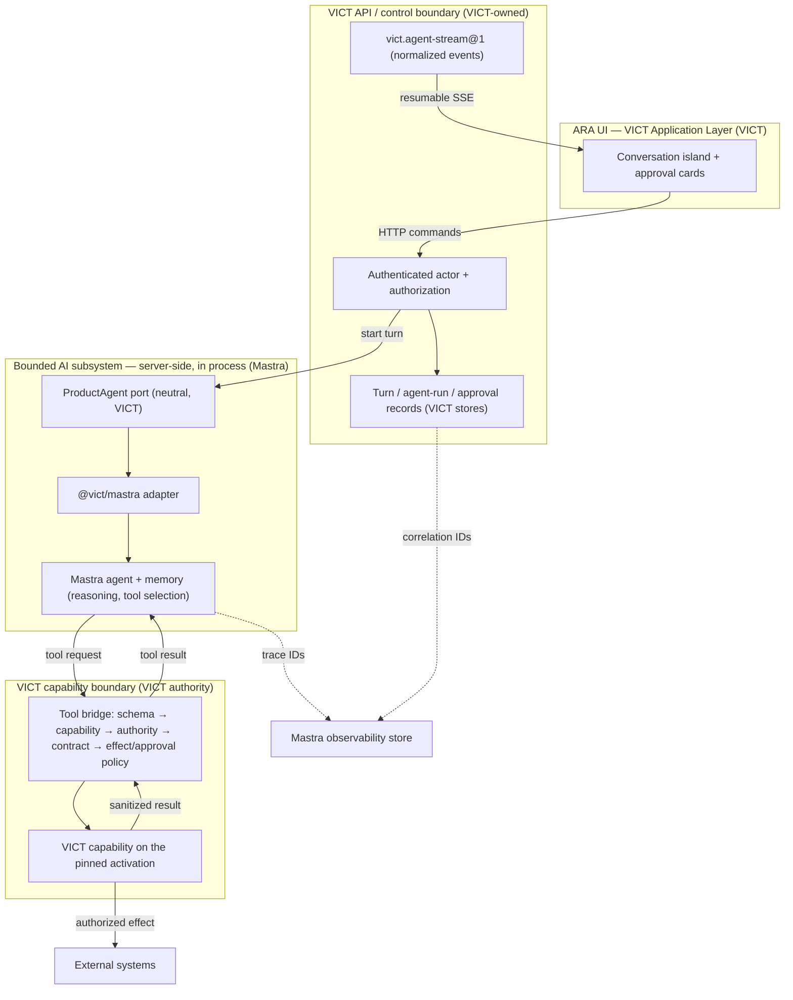
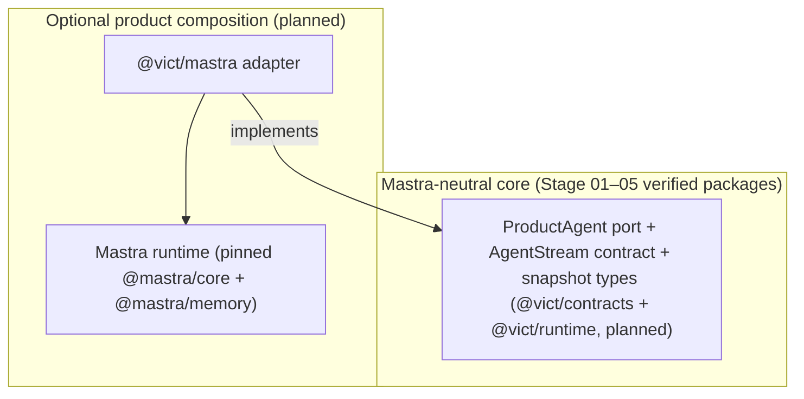
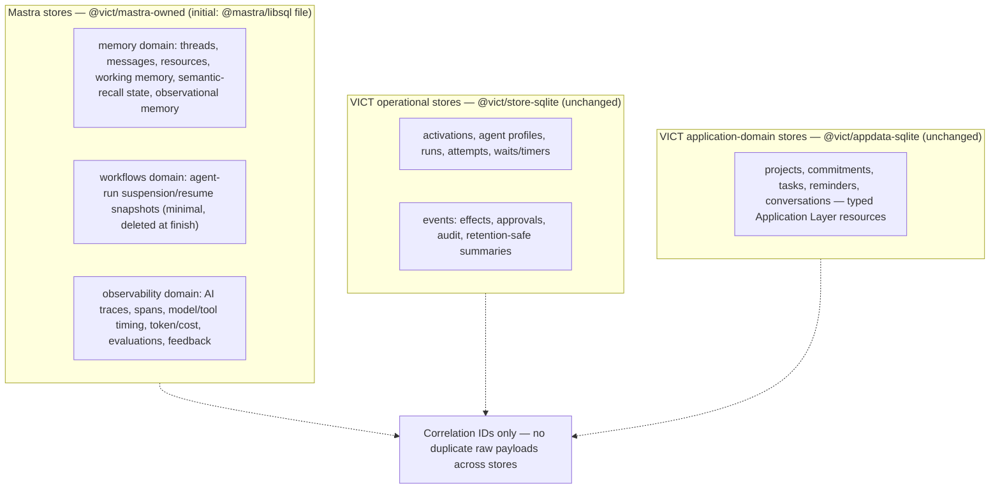
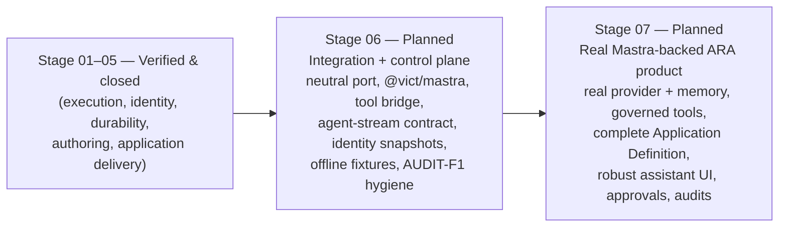

# VICT Mastra/ARA Integration Architecture

> **Authority:** `docs/VICT-SYSTEM-REFERENCE.md` v0.3.1 — this document is
> part of the v0.3.0 Mastra/ARA amendment, corrected by the v0.3.1
> finalization (complete agent executable identity, Stage 06/07 local
> data-protection baseline, deployment envelope, primary-source ledger,
> Stage 06A/06B delivery split), and is normative for Stage 06 and
> Stage 07.
> **Status:** Accepted architecture; Planned delivery. Nothing in this
> document is implemented. No Mastra capability is Verified. Stage 06 has
> not begun.
> **Scope:** the canonical product-agent boundary between VICT and Mastra,
> the ownership matrix, the tool bridge, agent identity and snapshot
> semantics, memory/storage/observability separation, data-protection
> baselines, streaming and transport semantics, and the revised Stage
> 06/Stage 07 targets.
> **Mastra sources accessed:** 2026-09-04 (§2, with the §2.4 source
> ledger). No Mastra package is installed or added by this amendment.

---

## 1. Product decision

The following product decisions are **accepted** as part of this amendment:

> The real ARA product will use Mastra as its canonical product-agent
> framework. VICT will not rebuild Mastra's model-provider integration,
> open-ended agent loop, tool-selection loop, streaming engine, conversation
> memory, semantic recall, working/observational memory, subagent mechanics,
> AI tracing or evaluation machinery.

> Mastra does not replace VICT. VICT remains the authority for application
> identity, activation identity, capability contracts, effect
> classification, authorization, durable business orchestration, approvals,
> operator intervention, application releases, application-domain
> boundaries and audit history.

Canonical rule:

```text
Mastra reasons and coordinates AI work.
VICT authorizes, commits, governs and presents product behavior.
```

Neither side may silently take ownership of the other's responsibilities.
Any future change that moves a concern across this boundary requires an
explicit architecture amendment with rationale, affected requirement IDs,
and migration impact (GOV-005).

This amendment preserves every independently verified Stage 01–05
invariant. It adds a product-agent integration boundary; it does not alter
contracts, capability, graph, activation, runtime, store, renderer,
application, or scaffolder semantics that Stages 01–05 verified (§15).

---

## 2. Mastra research record (primary sources, 2026-09-04)

All facts below were taken from current primary sources on 2026-09-04:
the official Mastra documentation (`mastra.ai/docs/**`, agent-friendly
`.md` forms), the npm registry metadata, and the `mastra-ai/mastra`
repository. No marketing claim is treated as proof of reliability; every
documented capability that Stage 06/07 depends on MUST be re-verified
against the pinned version by VICT conformance evidence (MSTR-002,
MSTR-010).

### 2.1 Package versions at access time

Latest stable npm versions observed on 2026-09-04 (all published
2026-09-03, all Apache-2.0 on npm, all `engines.node >= 22.13.0`):

| Package                 | Version | Role                                                                                                                |
| ----------------------- | ------- | ------------------------------------------------------------------------------------------------------------------- |
| `mastra`                | 1.27.3  | CLI (dev, build, dev server, `mastra api`)                                                                          |
| `@mastra/core`          | 1.64.0  | Mastra instance, `Agent`, `createTool`, `createStep`/`createWorkflow`, `RequestContext`, storage contracts, tracing |
| `@mastra/memory`        | 1.28.2  | `Memory`: message history, working memory, semantic recall, observational memory                                    |
| `@mastra/libsql`        | 1.22.3  | `LibSQLStore` — file-backed local storage adapter                                                                   |
| `@mastra/pg`            | 1.22.3  | `PostgresStore`, `WorkflowsPG`                                                                                      |
| `@mastra/upstash`       | 1.4.4   | Upstash Redis adapter                                                                                               |
| `@mastra/observability` | 1.17.5  | Observability package                                                                                               |
| `@mastra/client-js`     | 1.43.0  | `MastraClient` HTTP client                                                                                          |
| `@mastra/deployer`      | 1.64.0  | Standalone server deployment                                                                                        |

Relevant public exports named by the docs: `Mastra`
(`@mastra/core`), `Agent` (`@mastra/core/agent`), `createTool`
(`@mastra/core/tools`), `createStep`/`createWorkflow`
(`@mastra/core/workflows`), `RequestContext`
(`@mastra/core/request-context`), `MastraCompositeStore`
(`@mastra/core/storage`), `Memory` (`@mastra/memory`), `LibSQLStore`
(`@mastra/libsql`), `MastraClient` (`@mastra/client-js`),
`MastraStorageExporter` (observability exporter), `toAISdkStream`/
`toAISdkMessages` (`@mastra/ai-sdk`).

### 2.2 Stability, requirements, and constraints observed

- **Runtime:** Node `>= 22.13.0` on every checked package — exactly the
  VICT engines floor. ESM/ES2022 required; CommonJS fails. The VICT
  adapter therefore composes in the existing Node/ESM workspace without
  an engines change.
- **Schemas — terminology (precise):** three distinct terms must not be
  conflated. **JSON Schema** is the IETF declarative vocabulary.
  **Standard Schema** (standardschema.dev) is the unified
  schema-library interface. **Standard JSON Schema**
  (standardschema.dev/json-schema) is the conversion interface those
  libraries expose for JSON-Schema-compatible description. Mastra's
  documented tool/workflow schema interface is the second-derivative of
  these: tool and workflow `inputSchema`/`outputSchema` accept schema
  objects from libraries implementing the documented Standard JSON
  Schema support (Zod, Valibot, ArkType per current docs) — not raw
  JSON Schema documents. Mastra's `@mastra/core` peers on
  `zod ^3.25 || ^4`. Stage 06 MUST verify the exact accepted interface
  against the pinned versions before relying on it. VICT contracts
  remain the authoritative validation boundary regardless of the schema
  library the adapter uses to describe tools to the model (§7).
- **Stability labels:** agents, tools, workflows, memory, storage,
  human-in-the-loop, and tracing are presented as current core
  functionality. The docs explicitly mark the client "Conversations" API
  **experimental** and describe pre-v1 tool `execute` signatures as
  outdated. The harness/durable-agents surface is recent. Release cadence
  is fast (near-daily publishes). **None of this is Verified in VICT**
  until Stage 06 evidence exists against a pinned version.
- **Models:** model selection uses the model router string format
  `provider/model` (e.g. `openai/gpt-5.6-sol`), resolved through
  provider environment variables (`OPENAI_API_KEY`, `ANTHROPIC_API_KEY`,
  `GOOGLE_API_KEY`, ...). Provider credentials are external to VICT and
  MUST never enter VICT stores, prompts, traces, or tests (SEC-003;
  Stage 06 excludes direct provider credentials in tests).
- **Streaming interfaces:** `Agent.stream()` returns a
  `MastraModelOutput` (`textStream`, `fullStream`, `text`, `steps`,
  `usage`, `finishReason`, `objectStream`). Agent chunk types include
  `start`, `text-start/delta/end`, `reasoning-start/delta/end`,
  `tool-call`, `tool-result`, `tool-call-approval`,
  `tool-call-suspended`, `step-start/step-finish`, `finish`, and tool
  input streaming (`tool_input_start/delta/end`). Workflow streams emit
  `workflow-start`, `workflow-step-start/output/progress/result`,
  `workflow-finish`, `workflow-paused`, `workflow-step-suspended`,
  `workflow-canceled`. Tools/steps can write custom and `transient`
  chunks (transient chunks stream live but are not persisted). These are
  **Mastra-internal interfaces**: the VICT UI consumes only the
  normalized VICT stream contract (§9).
- **Abort/cancellation:** tool `execute` receives an execution context
  containing `abortSignal`; `MastraClient` supports an `abortSignal`
  (standard `AbortController`) across requests; workflow streams carry
  `workflow-canceled` events. Mastra cancellation is cooperative and
  provider-dependent. VICT records durable cancellation intent and never
  claims reversal of committed effects (AI-010).
- **Tool suspension and approval:** pre-execution approval via
  `requireApproval: true` on a tool or `requireToolApproval` on a call
  (boolean or per-call function; a throwing function fails safe to
  requiring approval; a tool's own flag takes precedence). The stream
  emits `tool-call-approval`; the host resumes via
  `approveToolCall`/`declineToolCall` (stream and `generate` variants)
  with an optional structured `reason`. Runtime suspension via
  `suspend()` inside `execute` with `suspendSchema`/`resumeSchema`
  emits `tool-call-suspended` and resumes via `resumeStream`.
  `autoResumeSuspendedTools` resumes data-bearing suspensions from the
  user's next message but never auto-approves `requireApproval` tools.
  `listSuspendedRuns({ threadId, resourceId })` rediscovers suspended
  runs from storage after restart. Suspension/approval snapshots are
  minimal resume artifacts that require a persistent storage provider
  and are deleted when the run finishes. Approval fingerprinting
  (binding an approval to the exact tool name + arguments) is a
  documented production pattern. **In VICT, these mechanisms gate and
  suspend, but never authorize:** the authoritative approval record is a
  VICT approval record (§7, MSTR-005).
- **Memory boundaries:** the storage `memory` domain owns threads,
  messages, resources, and working memory. Memory features: message
  history (`lastMessages`), working memory (structured user data
  injected as a system message), semantic recall (vector retrieval;
  resource-scoped by default), observational memory (background agents
  compress old history; thread-scoped by default; the docs recommend it
  for long conversations), and memory processors. Threads are owned by a
  `resourceId` that is immutable after creation, so cross-user memory
  access is structurally prevented when the VICT actor identity is the
  only source of `resourceId` (§8).
- **Storage/provider requirements:** storage is organized into domains
  (`memory`, `workflows`, `observability`, `scores`, `datasets`,
  `experiments`, `backgroundTasks`, `schedules`, `threadState`); the
  default in-memory store loses state on exit. libSQL (`@mastra/libsql`,
  `LibSQLStore`, `file:` URLs) is the documented zero-service local
  path; PostgreSQL/MongoDB are the documented production defaults;
  `MastraCompositeStore` routes domains to different backends; retention
  policies plus `storage.prune()` are the documented lifecycle controls.
- **Observability boundaries:** tracing records spans grouped into
  traces, with four sampling strategies (including custom), exporters
  (`MastraStorageExporter` into Mastra storage, OpenTelemetry exporter
  and bridge), `hideInput`/`hideOutput` trace options that exclude
  sensitive input/output from export, automatic metadata extraction from
  `RequestContext`, tags, and span processors/formatters for redaction.
  Eval scores/datasets/experiments have their own storage domains.
- **Server/deployment constraints:** Mastra can compose in-process via
  server adapters (Hono, Express, Fastify, Elysia, Koa, NestJS, Next.js,
  TanStack) or compile to a standalone server (`mastra build` /
  `mastra start`, default port 4111). `server.auth` gates both Studio
  and all API routes; **without authentication, Studio and all API
  routes are publicly accessible** — a material governance fact for the
  rule that Mastra Studio is never a production control plane (§10,
  MSTR-009). Role-based access control default roles import from
  `@mastra/core/auth/ee`, which resides under the monorepo's `ee/`
  enterprise-license directories: the VICT adapter's initial scope MUST
  NOT depend on `ee/` paths. The monorepo root license is Apache-2.0
  outside `ee/`; all packages listed in §2.1 declare Apache-2.0.

### 2.3 Documented-capability versus verified-behavior rule

Mastra's documentation describes capabilities; it does not certify them
for VICT's safety envelope. Stage 06 MUST prove, against pinned versions,
at least: tool-bridge authorization ordering, approval gating, stream
normalization and resume, cancellation propagation, snapshot/identity
stability, store separation, and restart reconciliation (§12). Any
behavior not proven by that evidence remains Planned, never Verified.
Official documentation is evidence of intended API behavior, not proof of
VICT conformance.

### 2.4 Primary-source ledger (accessed 2026-09-04)

Link-level traceability for every material dependency claim. All URLs
are official primary sources. “Stability warning” records anything VICT
must re-verify or treat cautiously against the pinned version.

| Source (type)                    | URL                                                                                                                                                                                                    | Supports                                                                                                                                                                                                                                                                                                                                                                                                                                                                                              | Stability warning for VICT                                                                                                                                                        |
| -------------------------------- | ------------------------------------------------------------------------------------------------------------------------------------------------------------------------------------------------------ | ----------------------------------------------------------------------------------------------------------------------------------------------------------------------------------------------------------------------------------------------------------------------------------------------------------------------------------------------------------------------------------------------------------------------------------------------------------------------------------------------------- | --------------------------------------------------------------------------------------------------------------------------------------------------------------------------------- |
| Agents overview (docs)           | `https://mastra.ai/docs/agents/overview`                                                                                                                                                               | `Agent` construction (`id`, `name`, `instructions`, `model`), model-router `provider/model` strings, `.generate()`/`.stream()`, registration on the `Mastra` instance                                                                                                                                                                                                                                                                                                                                 | Fast release cadence; instructions/model/tools accept dynamic forms — VICT pins static profiles (§6)                                                                              |
| Tools (docs)                     | `https://mastra.ai/docs/agents/tools`                                                                                                                                                                  | `createTool({id, description, inputSchema, outputSchema, execute})`; `execute(inputData, context)` with `requestContext`/`tracingContext`/`abortSignal`; `transform` display/transcript redaction; `beforeToolCall`/`afterToolCall` hooks (can block); `toolChoice`/`activeTools`; `clientTools`; agents/workflows as tools; Standard JSON Schema support (Zod, Valibot, ArkType)                                                                                                                     | Docs state older `execute` signatures are outdated — pin and verify the exact signature; `clientTools` execution locality must be re-verified                                     |
| Human-in-the-loop (docs)         | `https://mastra.ai/docs/agents/human-in-the-loop`                                                                                                                                                      | `requireApproval`/`requireToolApproval` (incl. function form; tool flag precedence; throwing function fails safe); `tool-call-approval` chunks; `approveToolCall`/`declineToolCall` (stream + generate variants, `reason`); `suspend()`/`suspendSchema`/`resumeSchema`; `tool-call-suspended`; `resumeStream`; `autoResumeSuspendedTools` never auto-approves `requireApproval` tools; `listSuspendedRuns` storage-backed discovery; minimal snapshots deleted at finish; persistent storage required | Suspension persistence depends on configured storage; snapshot lifecycle is Mastra-managed — VICT treats suspension as gating, never authorization (§7)                           |
| Streaming (docs)                 | `https://mastra.ai/docs/guides/streaming`                                                                                                                                                              | `MastraModelOutput` (`textStream`/`fullStream`/`usage`/`finishReason`); agent chunk types (`start`, `text-*`, `reasoning-*`, `tool-call`, `tool-result`, `step-*`, `finish`); workflow stream events; writer API; `transient` chunks; `toAISdkStream`/`toAISdkMessages`                                                                                                                                                                                                                               | Chunk vocabulary is Mastra-internal and evolves — never exposed to the UI; VICT maps to `vict.agent-stream@1` (§9)                                                                |
| Memory (docs)                    | `https://mastra.ai/docs/memory/overview` (+ `message-history`, `working-memory`, `semantic-recall`, `observational-memory`, `multi-user-threads`)                                                      | Message history, working memory, semantic recall, observational memory, processors; `resource`/`thread` scoping; immutable thread ownership by `resourceId`; call-time context messages never saved                                                                                                                                                                                                                                                                                                   | Defaults for feature scope (resource vs thread) must be confirmed at pin; retrieval features require embeddings/vector support in storage                                         |
| Storage (docs)                   | `https://mastra.ai/docs/storage` (+ storage overview/retention/composite references)                                                                                                                   | Storage domains (`memory`, `workflows`, `observability`, `scores`, `datasets`, `experiments`, `backgroundTasks`, `schedules`, `threadState`); in-memory default loses state; `LibSQLStore` file URLs; `PostgresStore`; `MastraCompositeStore` domain routing; retention configuration + `storage.prune()`                                                                                                                                                                                             | Domain coverage varies by adapter — verify libSQL domain coverage at pin; file-backed stores are single-process (§8.2)                                                            |
| Workflows suspend/restart (docs) | `https://mastra.ai/docs/workflows/suspend-and-resume` (+ `snapshots`, `workflow-runners`)                                                                                                              | `suspend()`/`resume()` with snapshots persisted in storage; `restart()`/`restartAllActiveWorkflowRuns()`; `autoRestartActiveRuns` opt-out; `sleep`/`sleepUntil`; result statuses incl. `suspended`/`paused`/`tripwire`                                                                                                                                                                                                                                                                                | Auto-restart on server start is default-on for active runs — VICT MUST scope it away from VICT-authoritative work (§4, MSTR-006)                                                  |
| Observability / tracing (docs)   | `https://mastra.ai/docs/observability/tracing/overview` (+ `logging`, `feedback`, storage exporter)                                                                                                    | Spans/traces; sampling strategies incl. custom; `MastraStorageExporter`, OTel exporter/bridge; `hideInput`/`hideOutput`; RequestContext metadata extraction; span processors/formatters for redaction; tags                                                                                                                                                                                                                                                                                           | Export-time filtering hides data from export while execution retains it internally — VICT relies on it only as an observability boundary, not a retention control                 |
| Studio auth (docs)               | `https://mastra.ai/docs/studio/auth`                                                                                                                                                                   | `server.auth` gates Studio UI and API routes together; **without authentication Studio and all API routes are publicly accessible**; RBAC default roles import from `@mastra/core/auth/ee`                                                                                                                                                                                                                                                                                                            | Governance-critical: any development Studio exposure MUST be separately authenticated (MSTR-009); `ee/` paths are enterprise-licensed — excluded from the adapter's initial scope |
| Request context (docs)           | `https://mastra.ai/docs/server/request-context` (+ middleware, server adapters)                                                                                                                        | `RequestContext` set/get; server middleware population; typed/runtime-only keys; dynamic per-request agent configuration (instructions/model/tools/memory)                                                                                                                                                                                                                                                                                                                                            | Client-influenced values are only safe when set server-side from authenticated context (MSTR-007)                                                                                 |
| Mastra client (docs)             | `https://mastra.ai/docs/server/mastra-client`                                                                                                                                                          | `MastraClient` `baseUrl`; `abortSignal` (standard `AbortController`) request cancellation; credentials/cookies for cross-origin; `clientTools`; Conversations API marked experimental                                                                                                                                                                                                                                                                                                                 | Conversations API is explicitly experimental — not relied upon; cancellation is request-scoped, not turn-authority                                                                |
| Repository / license             | `https://github.com/mastra-ai/mastra` and `https://raw.githubusercontent.com/mastra-ai/mastra/main/LICENSE.md`                                                                                         | Apache-2.0 outside `ee/`; `ee/` directories (incl. `@mastra/core/auth/ee`) under a separate enterprise license; active monorepo                                                                                                                                                                                                                                                                                                                                                                       | License scope check required on every adopted package/path                                                                                                                        |
| npm metadata (registry)          | `https://registry.npmjs.org/<pkg>` for `mastra`, `@mastra/core`, `@mastra/memory`, `@mastra/libsql`, `@mastra/pg`, `@mastra/upstash`, `@mastra/observability`, `@mastra/client-js`, `@mastra/deployer` | Exact versions recorded in §2.1; Apache-2.0 declarations; `engines.node >= 22.13.0`; peer ranges (e.g. `@mastra/core` peers `zod ^3.25 \|\| ^4`)                                                                                                                                                                                                                                                                                                                                                      | Near-daily publishes; transitive `@mastra/*` versions are resolved at install — the snapshot records every runtime-affecting pinned version actually used (§6.1)                  |

---

## 3. Ownership matrix

The following matrix is **normative**. "Owner" means the single side
that decides semantics for that concern. Every overlap in the matrix is
resolved by its integration rule; no concern has two owners.

| Concern                           | Owner                  | Integration rule                                                           |
| --------------------------------- | ---------------------- | -------------------------------------------------------------------------- |
| Model selection/provider calls    | Mastra                 | Pinned through an explicit VICT agent binding/profile                      |
| Open-ended reasoning loop         | Mastra                 | Never reproduced as a VICT graph loop                                      |
| Tool selection                    | Mastra                 | Tool availability comes from the VICT-pinned authority envelope            |
| Tool input/output validation      | Both boundaries        | Mastra validates its tool schema; VICT contracts remain authoritative      |
| Effect authorization              | VICT                   | Mastra cannot grant or widen authority                                     |
| Durable business workflow         | VICT                   | VICT remains authoritative for effectful, resumable product work           |
| Agent-internal workflow           | Mastra                 | Allowed only inside the bounded AI subsystem                               |
| Conversation memory               | Mastra                 | Stored under an explicit retention/access policy                           |
| Domain resources                  | VICT Application Layer | Projects, commitments and other product records remain typed resources     |
| Operational run history           | VICT                   | Safe metadata and summaries by default                                     |
| AI traces/evals                   | Mastra                 | Separately stored and correlated to VICT identities                        |
| Product UI                        | VICT Application Layer | Svelte renderer plus explicit custom component islands                     |
| Product control plane             | VICT                   | Mastra Studio is not the VICT production control plane                     |
| Authentication and actor identity | VICT server boundary   | Client-supplied context is not authoritative                               |
| Human approval for effects        | VICT                   | Mastra suspension may wait for it but cannot substitute for it             |
| Cancellation                      | Coordinated            | VICT records intent; AbortSignal stops Mastra/provider work where possible |

Unresolved overlaps are prohibited. If an integration question is not
covered by this matrix or §4–§10, it is an architecture question and must
be recorded per GOV-005, not decided silently in code.

Ownership and call flow (authority in parentheses):



The model reaches external effects only through the VICT capability
boundary; the UI reaches Mastra only through the VICT API boundary.

---

## 4. Mastra workflows versus VICT orchestration

This boundary is deliberately mechanical:

- **Mastra agents** serve open-ended tasks whose steps are selected
  dynamically by the model (conversation turns, research, drafting).
- **Mastra workflows** serve AI-internal deterministic composition
  (fixed pre/post processing around model calls) only where no
  VICT-governed effect, approval, or durable business-state transition
  is bypassed.
- **VICT graphs** remain authoritative for durable business
  orchestration: effect policy, retries, waits, signals, timers,
  cancellation, branching, approvals, blocked-run operator resolution,
  and durable completion (Stage 03 verified semantics).
- **Mastra workflow suspension is not authorization for a VICT effect.**
  A suspended Mastra workflow or agent has stopped; it has not been
  permitted. Authorization is a VICT decision recorded at the VICT
  boundary.
- **A Mastra workflow MUST delegate any protected read/write/irreversible
  operation through the VICT capability bridge** (§7). A Mastra workflow
  step that performs a production write outside VICT is prohibited, the
  same rule as for agent tool calls.
- **VICT MUST NOT model every token, reasoning step, or model-selected
  tool choice as a static graph node.** The agent loop is Mastra's
  engine; VICT records the turn's durable milestones (§9), not a
  predeclared topology of every possible model decision. KERN-003 and
  ARA-003 are preserved: VICT graph nodes represent meaningful product
  and effect boundaries.
- **No single product operation may have two competing authorities for
  retry, approval, or durable completion.** If a turn needs a durable,
  effectful, resumable product workflow (commitment creation, approval
  escalation, reminder scheduling), the turn's agent output crosses a
  VICT capability into a VICT graph, and VICT owns retries, approvals,
  and completion. Mastra never re-drives those transitions.
- **Cross-store atomicity must not be claimed** between Mastra storage,
  model providers, and VICT stores (AI-008, MSTR-006).

**Reconciliation and idempotency expectations at the boundaries:**

1. Every bridge invocation carries a stable correlation identity
   (VICT turn/attempt IDs) and a derived idempotency key for the logical
   tool invocation; retries of the same logical invocation reuse the key
   and reconcile through VICT capability idempotency semantics (Stage 03
   keyed writes), never by blind replay.
2. Ambiguous non-keyed writes and irreversible operations with unknown
   outcomes **block** under VICT policy; they are never re-driven by
   Mastra restart/recovery.
3. A crash between Mastra storage writes and VICT store writes is
   reconciled on restart from VICT milestone state as the authority:
   user-visible message and effect records live in VICT stores; Mastra
   thread/memory content for the same turn is Mastra-owned conversational
   context. If the two disagree after a crash, the VICT record governs
   what the product shows; the Mastra thread is repaired or accepted as
   best-effort context — never as authority.
4. Mastra's own workflow restart machinery (`restart()`,
   `restartAllActiveWorkflowRuns()`, auto-restart on server start) MUST
   be disabled or scoped so it cannot re-drive work whose durable
   authority is VICT (configured via documented options such as
   `autoRestartActiveRuns: false`; Stage 06 verifies the effective
   behavior against the pinned version).

---

## 5. Product-agent integration boundary

### 5.1 Neutral port and optional adapter

VICT-facing product code consumes a **neutral product-agent boundary**.
No Mastra type appears through:

```text
@vict/contracts
@vict/sdk
@vict/kernel
@vict/runtime
@vict/application
```

The Mastra-specific implementation lives in an **optional adapter
package**:

```text
@vict/mastra
```

The name follows the existing technology-adapter convention
(`@vict/store-sqlite`, `@vict/appdata-sqlite`). Changing the package name
is permitted only with documented reasoning recorded per GOV-005 before
the package is published as a stabilized boundary.



Dependency rule (AI-002): `@vict/mastra` may import `@mastra/*` and the
neutral VICT packages. The neutral VICT packages import only VICT
packages. Packed-consumer declaration checks in Stage 06 prove no
`@mastra/*` dependency or type leaks into neutral packages.

### 5.2 Boundary elements

| Element                              | Definition                                                                                                                                                                                                                                                                                                                                                                                                                                                                                  |
| ------------------------------------ | ------------------------------------------------------------------------------------------------------------------------------------------------------------------------------------------------------------------------------------------------------------------------------------------------------------------------------------------------------------------------------------------------------------------------------------------------------------------------------------------- |
| `ProductAgent` port                  | Neutral interface: given a pinned agent activation snapshot, a turn input (validated by VICT contracts), and an execution context (actor, authority envelope, abort signal, correlation IDs), produce a normalized event stream and a terminal turn outcome. No Mastra parameter, chunk, or error type appears in the signature.                                                                                                                                                            |
| Mastra-backed adapter                | `@vict/mastra` implementation of the port. It owns translating the pinned profile into a Mastra `Agent` configuration, bridging tools (§7), mapping streams (§9), and propagating cancellation.                                                                                                                                                                                                                                                                                             |
| Agent definition/binding             | The VICT-authored description of an agent under the strict profile schema: ID/revision, instructions ID/revision, model profile (incl. provider intent), generation defaults and bounded options, stop/loop policy, memory policy, ordered processor/guardrail chains, structured-output contract (when enabled), helper-tool set (§6.5), capability allowlist, subagent/workflow set (when enabled), and provider compatibility metadata. Declared canonical data only — no function text. |
| Agent ID and revision                | Explicit non-empty stable strings (same discipline as capability IDs/revisions; CAP-001).                                                                                                                                                                                                                                                                                                                                                                                                   |
| Model-profile reference and revision | Names the model-router string (`provider/model`), sampling/temperature bounds, and any provider compatibility constraints. The profile declares intent; the actual provider/model identity observed at run time is recorded when known (§6).                                                                                                                                                                                                                                                |
| Instructions/prompt revision         | Instructions are referenced by revision, never inlined into identity as raw text. Changing instructions requires a new revision (AI-003).                                                                                                                                                                                                                                                                                                                                                   |
| Memory-policy reference and revision | Names the Mastra memory features enabled (message history window, working memory template, semantic recall scope, observational memory), retention bounds, and the storage domain binding.                                                                                                                                                                                                                                                                                                  |
| Tool/capability allowlist            | The ordered set of VICT capability references (id + revision) the agent may use. Nothing outside the pinned envelope is exposed to the model (AI-005).                                                                                                                                                                                                                                                                                                                                      |
| Provider compatibility metadata      | Declared provider requirements (environment variable names, capability constraints such as tool-call or streaming support) so activation can fail fast in offline/test environments.                                                                                                                                                                                                                                                                                                        |
| Streaming event mapping              | The adapter maps Mastra chunk types onto the normalized VICT agent-stream contract (§9). Mastra chunk types never cross to the UI.                                                                                                                                                                                                                                                                                                                                                          |
| Cancellation boundary                | VICT cancel intent → adapter `AbortSignal` into Mastra generate/stream/tool executes → normalized `response.cancelled` (§9).                                                                                                                                                                                                                                                                                                                                                                |
| Trace/correlation metadata           | The adapter attaches VICT run/turn/attempt IDs to the Mastra trace context and records the Mastra trace/run IDs on VICT milestones (AI-011).                                                                                                                                                                                                                                                                                                                                                |
| Safe result/error boundary           | Turn outcomes and tool results crossing back are sanitized VICT structures: safe stable codes, summaries or references by default, never raw provider errors, capability errors, or payload secrets (CONT-005/OBS-002 discipline extended to the AI subsystem).                                                                                                                                                                                                                             |
| Activation and run snapshot behavior | The adapter resolves the agent from an immutable activation-time snapshot; live registry/agent mutation never affects an active run (§6).                                                                                                                                                                                                                                                                                                                                                   |

### 5.3 Deployment boundary

The initial deployment remains a **modular monolith**: Mastra runs
server-side, in process, behind VICT-owned API and authentication
boundaries. VICT composes Mastra through the adapter (in-process use or a
server adapter embedded inside the VICT server composition) — it does not
deploy a parallel privileged Mastra server endpoint for the product UI.
The product UI MUST NOT call Mastra endpoints directly (AI-015).

Mastra Studio may be used for development and AI-specific inspection. It
MUST NOT become an alternate production control plane capable of
bypassing VICT authorization, approvals, or activation governance
(MSTR-009). Without explicit server authentication, Mastra Studio and
Mastra API routes are publicly accessible (§2.2); any development Studio
exposure is therefore separately authenticated, separately stored, and
never product-facing.

---

## 6. Agent identity and snapshot semantics

The exact executable agent meaning MUST be version-addressable, with the
same discipline Stage 01–04 verified for graphs, capabilities, and
applications (VER-001..010, APP-003). Identity covers **every
runtime-affecting profile component** — an execution-relevant
configuration that is silently omitted from identity is an architecture
violation, not an implementation detail.

### 6.1 Complete profile components

The profile is strict canonical data (§6.2). Every component below is
version-addressable declared data; “revision” always means an explicit
non-empty stable string (APP required-member discipline — nothing is
defaulted):

| #   | Component                                                                                                                                                                                                                                                                                     | Identity class     |
| --- | --------------------------------------------------------------------------------------------------------------------------------------------------------------------------------------------------------------------------------------------------------------------------------------------- | ------------------ |
| 1   | Profile schema marker (`vict.agent-profile@1`)                                                                                                                                                                                                                                                | exact string       |
| 2   | Agent ID + agent revision                                                                                                                                                                                                                                                                     | exact              |
| 3   | Instructions ID + instructions revision                                                                                                                                                                                                                                                       | exact              |
| 4   | Model-profile ID + revision (includes model router/provider intent — the `provider/model` intent string and provider compatibility constraints)                                                                                                                                               | exact              |
| 5   | Generation defaults and bounded options (for example temperature, max-output, request-level option bounds) — an enumerated, closed canonical record                                                                                                                                           | canonical record   |
| 6   | Stop conditions, iteration limit, tool-call limit, and loop policy (bounded, enumerated; no unbounded loops)                                                                                                                                                                                  | canonical record   |
| 7   | Memory-policy ID + revision                                                                                                                                                                                                                                                                   | exact              |
| 8   | Processor chain — ordered references (ID + revision)                                                                                                                                                                                                                                          | order-preserving   |
| 9   | Guardrail chain — ordered references (ID + revision)                                                                                                                                                                                                                                          | order-preserving   |
| 10  | Structured-output contract reference + revision (only when structured output is enabled)                                                                                                                                                                                                      | exact              |
| 11  | Mastra-native helper-tool references + revisions (§6.5; set-like)                                                                                                                                                                                                                             | canonically sorted |
| 12  | VICT capability references + revisions (the authority envelope; set-like)                                                                                                                                                                                                                     | canonically sorted |
| 13  | Subagent references + AI-internal workflow references + revisions (only when enabled; set-like)                                                                                                                                                                                               | canonically sorted |
| 14  | Adapter compatibility marker — adapter package ID/revision plus **every runtime-affecting pinned `@mastra/*` package name@version actually used** (at minimum `@mastra/core`, `@mastra/memory` when memory is enabled, plus any storage/tracing package whose behavior the adapter relies on) | canonical record   |
| 15  | Any other safety-relevant default option the adapter pins — the closed profile schema MUST enumerate these; an unlisted runtime-affecting option is a profile-schema defect, not a free field                                                                                                 | canonical record   |

```text
agentProfileVersion = hash(
  profile schema marker
  + adapter compatibility marker
    (adapter ID/revision + every runtime-affecting pinned @mastra/* name@version)
  + agent ID + agent revision
  + instructions ID + instructions revision
  + model-profile ID + revision (incl. model router/provider intent)
  + generation defaults and bounded options (canonical record)
  + stop/iteration/tool-call/loop policy (canonical record)
  + memory-policy ID + revision
  + ordered processor chain (id + revision, declared order)
  + ordered guardrail chain (id + revision, declared order)
  + structured-output contract reference + revision (when enabled)
  + sorted Mastra-native helper-tool references (id + revision)
  + sorted VICT capability references (id + revision)
  + sorted subagent / AI-internal workflow references (id + revision, when enabled)
)
```

### 6.2 Deterministic identity rules

- **Set-like collections** (capability references, helper tools,
  subagents/workflows) are canonically sorted by stable key; declaration
  order never changes their identity.
- **Order-sensitive chains** (processors, guardrails) preserve declared
  order: reordering changes the identity because execution order changes
  behavior.
- **Configuration entering identity MUST be strict canonical data** under
  the same input discipline Stage 05 verified for application
  compilation: plain objects with own enumerable data properties, dense
  arrays, canonical finite numbers, and closed enumerated fields.
  Functions, accessors/getters, inherited or symbol-keyed members, sparse
  arrays, timestamps, random values, secrets, mutable framework
  internals, and other noncanonical inputs are REJECTED at profile
  authoring/activation, with stable non-echoing diagnostics.
- **Function bodies are never hashed or serialized.** Processor,
  guardrail, helper-tool, and capability implementation changes remain an
  **author/build revision responsibility**: identity reflects DECLARED
  revisions, and authors MUST bump the revision when implementation
  semantics change (the same accepted trust boundary as CAP-005/APP-003).
- **No runtime-affecting configuration may be silently omitted** from
  identity. If the adapter discovers a runtime-affecting option that the
  profile schema does not cover, that is a defect: the profile schema
  marker changes in a documented amendment, never a silent passthrough.

### 6.3 Forbidden identity inputs

`agentProfileVersion` MUST NOT be derived from:

- function source or function bodies;
- provider credentials or any secret;
- current time or timestamps;
- random values;
- Mastra internal object layout;
- schema-library internals (for example Zod internals);
- mutable memory contents;
- raw prompts or conversation payloads.

### 6.4 Activation and run snapshot semantics

- **Resolve every revisioned component during activation.** Starting a
  turn resolves each component above to its exact revision and captures
  the result immutably, analogously to VICT graph activations (VER-005).
- **Deep-capture immutable configuration owned by VICT.** The snapshot is
  a defensive VICT-owned capture (frozen canonical data); later caller or
  registry mutation cannot change it (Stage 04/05 capture discipline).
- **Capture required function references by value-binding, not by
  hashing or serialization.** Handlers, processors, guardrails, and
  helper-tool executes are bound into the snapshot as opaque references;
  their bodies are never hashed, serialized, or transmitted.
- **No live objects in flight.** An in-flight turn MUST NOT retain or
  consult a live mutable Mastra `Agent`, registry, processor list, model
  profile, or tool map. The turn executes only against the captured
  snapshot (VER-007/CAP-003 discipline applied to the AI subsystem).
- **Later changes apply only after explicit reactivation.** A changed
  instructions, model profile, memory policy, processor/guardrail chain,
  structured-output contract, tool allowlist, helper-tool set,
  subagent/workflow set, stop/loop policy, or adapter compatibility
  marker produces a NEW `agentProfileVersion` and affects only turns
  started after selection (VER-006 discipline).
- **Pinned runtime versions recorded.** The snapshot records every
  runtime-affecting pinned `@mastra/*` package version and the adapter
  compatibility marker.
- **Actual provider/model identity recorded when available.** The adapter
  records the provider/model identity observed at execution time as run
  metadata — recorded, never hashed into identity.
- **Credentials never enter identity or storage.** Provider credentials
  are resolved just in time through protected server/operator
  configuration and MUST NOT appear in the profile, identity input,
  snapshot, stream, trace, diagnostics, or any VICT/Mastra database
  (SEC-003; §8.1).
- **No secret or complete prompt retained in normal VICT run history:**
  run history stores safe summaries and references under the default
  retention policy (DATA-005 unchanged).

Changing instructions, model semantics, memory policy, processors,
guardrails, helper tools, tool availability, subagents/workflows,
stop/loop policy, structured output, or any safety-relevant agent
behavior MUST require a revision change (AI-003/AI-004). A profile whose
only change is a pinned `@mastra/*` version change changes the adapter
compatibility marker and therefore the profile version; Stage 06
conformance decides whether the new combination is accepted (MSTR-002).

### 6.5 Mastra-native helper tools

Most agent tools are VICT capability bindings (§7). A small class of
**Mastra-native helper tools** MAY bypass the VICT capability executor
only when they are genuinely pure or presentation-local:

- permitted: deterministic formatting, computation, text transformation,
  in-context list manipulation — operations with no external or durable
  effect;
- prohibited: application writes, external writes, irreversible effects,
  authorization decisions, secret access, or any role in approval. All
  effectful operations remain VICT capabilities crossing §7.

Helper tools are not an unversioned escape hatch. Each one MUST have:

- an explicit ID and revision (never anonymous or inline-only);
- a neutral input/output contract reference (validated at the adapter
  boundary; sanitized failures only — no raw thrown content re-enters
  the model context);
- immutable snapshot binding (a helper-tool implementation change is a
  revision change; an in-flight turn uses the captured binding);
- inclusion in `agentProfileVersion` (§6.1 component 11, canonically
  sorted).

Helper tools remain untrusted-input consumers: their outputs are data to
the model, never authority (AI-014).

---

## 7. VICT-to-Mastra tool bridge

A Mastra agent MUST NEVER receive a direct production capability handler.
The bridge is the only path from model tool selection to VICT-governed
execution:

```text
Mastra tool request
→ validated tool schema
→ VICT bound-capability invocation
→ actor/authority check
→ VICT contract validation
→ effect/approval policy
→ durable intent where required
→ capability execution
→ sanitized VICT result
→ Mastra tool result
```

Requirements:

1. **Envelope-derived tools only.** The adapter creates one Mastra tool
   per capability reference in the pinned envelope (stable tool name
   mapping recorded in the profile). Capabilities outside the envelope do
   not exist for the model. Mastra tool descriptions cannot grant
   authority: they are bounded metadata derived from capability/contract
   declarations, and they never widen effect or permission semantics.
2. **Untrusted model output.** Model-generated tool names and arguments
   are untrusted input. An unknown tool name is a structured denial;
   arguments are never trusted because Mastra validated them.
3. **VICT contracts authoritative.** Even when the Mastra tool schema
   (Standard JSON Schema) accepts the arguments, the pinned VICT input
   contract re-validates at the boundary and its structured result
   governs (CONT-001/RUN-002 unchanged).
4. **Same boundary as non-AI callers.** Protected effects execute through
   the same VICT runtime boundary — actor/authority check, effect policy,
   permission grants, idempotency, durable-before-invocation ordering —
   used by every other caller (EFF-001, Stage 04 authority gating).
5. **Correlation and idempotency identities.** Every tool call receives
   stable correlation IDs (VICT turn/attempt + Mastra run/trace) and a
   deterministic idempotency key for the logical invocation (§4).
6. **No self-approval.** A model cannot approve its own protected action.
   For capabilities whose pinned effect is `irreversible` (and for
   `write` where policy requires), the adapter marks the Mastra tool
   approval-gated (`requireApproval`) **and** the bridge requires an
   existing, attributable VICT approval record bound to the exact
   capability reference, contract revision, and canonical arguments
   before execution. `approveToolCall` on the Mastra side proceeds only
   after VICT records the approval; declining returns a safe structured
   tool outcome (stable code, no raw content) to the model.
7. **Missing approval suspends or blocks safely.** If approval is absent,
   the bridge suspends the Mastra tool call (documented Mastra suspension
   semantics) or blocks, records the pending VICT approval request, and
   the turn waits — exactly like any other VICT approval wait. The
   suspension never executes the effect.
8. **Irreversible ambiguity fails closed.** Timeout ambiguity, unknown
   external outcome, or contract rejection on an irreversible capability
   blocks the operation under VICT semantics (Stage 03); it is never
   retried or resumed by Mastra.
9. **No direct production-write Mastra tools.** Direct Mastra tools that
   perform production writes outside VICT are prohibited. Only genuinely
   pure or presentation-only helper tools (formatting, computation) MAY
   be Mastra-native, under the full versioning, contract, snapshot, and
   effect restrictions of §6.5 — they remain declared, revisioned, and
   part of `agentProfileVersion`.
10. **Client-side tools are not an authorization bypass.** Mastra
    `clientTools` execute in the browser and return results to the model.
    They may perform presentation-local work only; their results are
    untrusted input to the model, and they can never carry VICT
    authority, secrets, or effect execution.
11. **No leaks.** Raw capability errors, provider errors, and tool
    payload secrets MUST NOT leak through streams or traces. The bridge
    sanitizes results and errors to safe codes/summaries before anything
    re-enters the model context, the stream, or observability
    (CONT-005/OBS-002 discipline).
12. **Prompt-injection containment.** Instructions, retrieved memory, and
    tool outputs are data. They cannot modify the capability allowlist,
    grant permissions, or change the pinned profile (AI-014). Tool
    outputs remain untrusted input to the model.

**Dynamic model-selected tools without a predeclared graph topology.**
The model chooses tools at run time inside the Mastra agent loop; VICT
does not predeclare a graph per possible sequence. The durable VICT
representation of a turn is the agent-run record plus its milestone event
ledger (§9: `tool.requested`, `tool.started`, `tool.awaiting_approval`,
`tool.completed`, `tool.failed`, effect and approval records). Durable
product semantics — approval waits that outlive a turn, multi-step
business workflows, retries, reminders — remain VICT graphs entered
through explicit capabilities. This keeps KERN-003 ("meaningful
boundaries, not every call") and ARA-003 intact while the open-ended
sequence space stays inside the bounded AI subsystem.

---

## 8. Memory and storage ownership

VICT uses Mastra's memory capabilities (message history, working memory,
semantic recall, observational memory) rather than building a competing
agent-memory engine. Four separate storage domains exist:



| Domain                       | Owner                              | Owns                                                                                                                                                  | Explicitly excluded                                 |
| ---------------------------- | ---------------------------------- | ----------------------------------------------------------------------------------------------------------------------------------------------------- | --------------------------------------------------- |
| Mastra memory                | Mastra (`@vict/mastra` configures) | Conversation threads and messages; working memory; semantic recall/vector state; observational memory; suspended agent state where Mastra requires it | Authority decisions; product records; audit history |
| VICT application-domain data | VICT Application Layer             | Projects, commitments, tasks, reminders, user-managed records, explicit product resources rendered through the Application Layer                      | Agent-internal context                              |
| VICT operational data        | VICT runtime/control               | Activations, runs, capability attempts, effect and approval records, safe audit events, retention-safe summaries                                      | Full prompts/messages (by default)                  |
| Mastra observability data    | Mastra                             | AI traces and spans, model/tool timing, token and cost data, evaluations and feedback                                                                 | Product audit history                               |

Requirements:

- **Separate physical/logical stores.** The initial choice keeps three
  database files in a local ARA deployment: the VICT operational SQLite
  store, the VICT application-domain SQLite store, and the Mastra libSQL
  store — each with its own migrations/bookkeeping. Domain separation is
  never relaxed by sharing a file casually; a shared database technology
  in a later deployment still keeps separate schemas, ports, migrations,
  and authority boundaries (DATA-013 discipline).
- **Explicit retention, deletion, and export policies** per domain:
  Mastra memory and observability retention are configured on the Mastra
  store (documented retention/prune controls), VICT operational retention
  follows the none/summary/full policies (DATA-004..006 unchanged), and
  application-domain data follows product resource policy. User-initiated
  deletion of a conversation removes the VICT application-domain resource
  through its governed mutation boundary and the Mastra thread through
  the adapter, with reconciliation tests proving both sides.
- **Authenticated identity mapping.** The server boundary maps the
  authenticated VICT actor/application identity to the Mastra
  `resourceId`/`threadId` (deterministic derivation such as
  `vict-actor-<actorId>`). Mastra threads are owned by an immutable
  `resourceId` (§2.2), so VICT actor identity is the only source of
  thread ownership. **No cross-user memory access.**
- **No complete prompts/messages in default VICT run history.**
  Operational history stores safe summaries (token counts, tool names,
  durations, stable error codes) and correlation IDs.
- **No atomic transactions across these stores.** Every claim of
  consistency is bounded by §4 reconciliation rules.
- **Correlation IDs, not duplicate raw payload storage.**
- **Encryption/secret policy precedes protected production use.** The
  local-first deployment treats store files as local trust (the Stage 03
  local-trust boundary); any protected or multi-user production use
  requires an explicit encryption and secret policy first (recorded in
  OPEN-017).
- **Recovery and reconciliation tests for failures between stores** are
  Stage 06 exit-gate evidence (§12).

### 8.1 Local data-protection baseline (REQUIRED for Stage 06)

Real provider configuration and real conversations arrive in Stage 07,
so the protection machinery must exist and be tested in Stage 06 — not
Stage 11. Stage 06 MUST specify and test, against the pinned adapter:

- **Credential isolation.** Provider credentials resolve only through
  protected server/operator configuration; they are never serialized
  into profiles, snapshots, prompts, messages, traces, streams,
  diagnostics, or any VICT/Mastra database (SEC-003; §6.4).
- **Payload-safe tracing by default**, with explicit sampling (MSTR-008).
- **Explicit retention bounds** for Mastra memory and observability
  domains, recorded in configuration.
- **An actual pruning mechanism** — a scheduled or manually invocable
  prune operation that executes against the stores and is covered by
  tests — not retention configuration without execution.
- **Governed conversation deletion and export** through the adapter:
  deleting a conversation removes the VICT application-domain resource
  and the Mastra thread data through governed boundaries.
- **Cross-store deletion reconciliation tests**: a crash between the two
  deletions resolves to a defined, tested outcome on restart.
- **Database files outside publicly served directories**; any host that
  serves static files MUST NOT serve the directory containing the store
  files.
- **Documented local file ownership/permission expectations** for the
  store files (owner-only permissions on single-user machines; the
  Stage 03 local-trust boundary made explicit for AI stores).
- **Backup and export disclosure**: what is included in a backup or
  export, where it lands, and who can read it is documented operator
  material, not a silent side effect.
- **Canary-based secret-leak tests** across streams, traces, run
  history, memory stores, observability stores, diagnostics, and error
  paths (Stage 01–05 canary discipline extended to the AI stores).
- **Explicit data classification** stating, for each category —
  conversation messages, tool payloads, working memory, semantic memory,
  observational memory, traces, approvals, operational summaries — which
  store owns it, its retention bound, and its export/deletion behavior.

### 8.2 Deployment envelope (Stage 07 declaration requirement)

The initial `@mastra/libsql` profile is accepted ONLY as this bounded
envelope, and Stage 07 MUST declare it as such:

```text
local-first · single actor · single application process ·
non-multi-tenant · file-backed deployment
```

It implies NO multi-process, multi-tenant, protected-cloud, or
production-scale guarantee. Within this envelope — and only within it —
Mastra memory and observability MAY share one dedicated local Mastra
database file as logically separate domains; the boundary remains logical
(schema/domain), never authority- or retention-blind. Mastra's own
documented guidance to route the high-volume `observability` domain to a
dedicated backend (OLAP or managed store) at higher volume is recorded
here as the accepted growth path.

Before Stage 07 is called usable for real cases, it must prove in real
use:

- retention, deletion, export, and pruning work end to end;
- store files are not web-accessible;
- secret canaries remain absent from every retained and observable
  surface;
- provider credentials remain external to stored application data;
- the user is clearly informed what conversational data is retained and
  how to delete or export it;
- backup/recovery behavior and its limitations are documented.

If Stage 07 requirements grow to multi-process or externally hosted
production deployment, it MUST adopt an appropriate supported backend
and security profile (for example the documented PostgreSQL direction)
instead of silently extending the local libSQL claim.

### 8.3 Initial Mastra storage decision (accepted)

The officially documented local adapter `@mastra/libsql` (`LibSQLStore`,
file-backed, no external service) is the initial ARA choice under the
§8.2 envelope, in a dedicated database file separate from both VICT
SQLite stores, with Mastra's `memory`, `workflows`, and `observability`
domains served by that store (composite routing to a dedicated analytics
backend is deferred; OPEN-016 tracks the Stage 07 provider-scale
decision). `@mastra/pg` is the documented production direction when ARA
outgrows the §8.2 envelope (Stage 11 scale concerns). This decision is
based on current official support observed 2026-09-04 (§2.1); it is
**Accepted/Planned**, not implemented here, and MUST be re-verified
against the pinned adapter version during Stage 06.

---

## 9. Streaming and transport semantics

### 9.1 VICT-owned normalized stream contract

Stage 06 MUST expose a VICT-owned, **versioned** agent-stream contract
(default marker `vict.agent-stream@1`, following the `vict.run-event@1`
convention; exact field-level schema is finalized in the Stage 06 handoff,
OPEN-015). The UI MUST NOT depend on raw provider chunk types or unstable
Mastra chunk types.

Normalized events (minimum set):

```text
response.started
text.delta
content.completed
tool.requested
tool.started
tool.awaiting_approval
tool.completed
tool.failed
memory.updated
usage.updated
response.completed
response.failed
response.cancelled
```

Citation/artifact/file events are added only when their semantics are
concrete (a typed artifact reference crossing a VICT boundary); they are
not invented as vague passthroughs.

Requirements:

- **Never expose hidden chain-of-thought.** Raw reasoning deltas are not
  forwarded. A provider reasoning summary MAY be surfaced as a separate,
  explicit, labeled content type subject to the same safe-retention and
  policy rules — never as unlabeled model output.
- **Identity on every event.** Each event identifies the stream, turn,
  thread, actor, application release, VICT activation/agent-run where
  applicable, agent profile version, and the relevant Mastra trace/run
  identities.
- **Ordering.** Events carry monotonically ordered per-stream sequence
  numbers.
- **Delivery.** At-least-once; clients deduplicate by stream identity and
  sequence.
- **Reconnect.** A cursor (stream ID + last processed sequence) plus
  authoritative turn/message state from VICT stores: on reconnect the
  client restores completed content from the durable milestone record,
  then resumes the stream from the cursor. Mastra chunk replay is never
  required.
- **Durable retrieval.** Completed assistant messages are durably
  retrievable from VICT application-domain resources (conversation
  records), not from stream history.
- **Ledger discipline.** Every token delta need not enter the VICT
  operational ledger. Durable milestones — `response.started`,
  `content.completed`, tool/effect/approval events, `usage.updated`
  summaries, and terminal events — are recorded; `text.delta` is
  transient stream content.
- **Backpressure and slow clients.** The server keeps a bounded
  per-stream buffer. Under pressure it MAY coalesce consecutive
  `text.delta` events into coarser deltas, but MUST NOT reorder events
  or drop non-delta events. A client that cannot keep up loses nothing
  durable: milestones are queryable and the stream is resumable.
- **Cancellation.** Client or operator cancellation records durable VICT
  intent, propagates an `AbortSignal` into the Mastra/provider work where
  supported (§2.2), and closes with `response.cancelled`. Cancellation
  does not claim reversal of already committed effects.
- **Disconnection and restart.** Provider disconnects fail the affected
  model call through Mastra and surface as `response.failed` or a
  retryable tool/turn failure under VICT policy. Process restart resumes
  or cleanly terminates the turn from durable state; suspended
  approval waits survive restart through VICT waits and Mastra's
  storage-backed suspended-run discovery (`listSuspendedRuns`), and the
  VICT record governs the product view (§4).
- **Stable error codes.** Error events use stable non-echoing codes; raw
  provider or capability error content never reaches the stream.

### 9.2 Transport decision (accepted)

**Decision: HTTP commands plus resumable Server-Sent Events (SSE) for the
initial ARA text product.** WebSocket and Mastra-native direct transports
are not used initially.

Rationale:

- The interaction is client-command/server-event: commands (send turn,
  cancel, approve, decline, reconnect) are natural versioned HTTP
  operations; the response side is a one-directional event flow, which is
  exactly SSE's model.
- SSE supports cursor-based resume natively (event IDs) and maps directly
  onto the at-least-once + sequence-number contract above.
- It preserves the Stage 05 server-boundary pattern (typed commands
  crossing an authorized server dispatch) without new connection
  infrastructure, sticky sessions, or a second server.
- Mastra streams are consumed server-side by the adapter and re-emitted
  as normalized events; no Mastra-native transport reaches the UI, so the
  transport choice stays VICT-owned and swappable.
- Realtime voice may justify a later WebSocket/WebRTC channel
  (OPEN-018); that future channel must not distort the initial
  text-product transport.

This decision revises nothing verified in Stage 01–05; it refines
OPEN-006's accepted direction for the agent-event case and is recorded
there.

---

## 10. Observability and security composition

Mastra and VICT observability are complementary, not merged:

- **Correlation.** The Mastra trace ID is correlated with VICT
  run/turn/attempt IDs on both sides' records (AI-011). Correlation is by
  ID; raw payloads are not duplicated across stores.
- **Separate stores.** AI traces/evals live in the Mastra observability
  domain; operational audit lives in VICT stores (§8).
- **Explicit sampling.** Mastra sampling strategy is configured
  explicitly (not left at defaults) and recorded in the adapter
  compatibility marker's configuration revision.
- **Payload-safe defaults.** The adapter enables payload-safe tracing
  defaults (Mastra `hideInput`/`hideOutput` tracing options or their
  pinned-version equivalent) plus span processors for redaction. Full
  prompt/tool-payload tracing is an explicit, protected, separately
  authorized opt-in with its own retention policy.
- **Metrics separation.** Provider, model, token, cost, and latency
  metrics are measured separately for: UI transport, VICT
  orchestration/storage, the Mastra AI subsystem, model providers, and
  tools — so ARA-005's per-boundary latency reporting remains honest.
- **No secrets in normal events, diagnostics, or traces** (SEC-003
  unchanged; the Mastra tool `transform` display/transcript redaction
  facility is an additional UI-side layer, never the authorization or
  retention boundary).
- **Prompt injection containment.** Instructions or retrieved memory
  cannot grant permissions or modify the capability allowlist; the
  allowlist is pinned in the activation snapshot (§6–§7, AI-014).
- **Actor identity below the UI.** The authenticated VICT server context
  is the only source of the Mastra request context; client-supplied
  fields (headers, body claims) are not authoritative (MSTR-007). This
  applies to dynamic per-request agent configuration: request-context
  values that influence behavior are set server-side from the
  authenticated actor/session, never from raw client input.
- **Attribution.** Approval and operator-intervention events remain VICT
  records with actor identity (CTRL-007 discipline); Mastra approval
  metadata is advisory context.
- **Studio governance.** Mastra Studio access is separately
  authenticated and is not a product authorization surface (MSTR-009);
  it exposes AI-side inspection, never a path around VICT approvals,
  activations, or release governance.

---

## 11. The real ARA product and UI expectation

A **real ARA product** is a complete user-facing application, not an API
demonstration. The Stage 07 product target is comparable in usability and
robustness to contemporary assistant products, without copying their
branding and without a pixel-identity requirement.

Minimum product specification:

- Responsive desktop, tablet, and mobile layouts.
- Conversation/thread list with new, rename, archive/delete, and search
  flows.
- Fast streaming response rendering.
- Markdown, code blocks, and copy actions.
- Tool activity and result states (requested, running, awaiting approval,
  completed, failed).
- Approval cards for protected actions, bound to the exact capability and
  arguments under review.
- Stop, retry/regenerate, and safe failure recovery.
- Edit/resend or branch semantics with explicit history rules (which
  messages are retained, forked, or superseded).
- Attachments and structured artifacts where supported.
- Citations/source presentation where applicable.
- Usage/provider status without leaking secrets.
- Reconnect and process-restart recovery.
- Loading, offline, empty, denied, partial, and error states.
- Keyboard accessibility, focus management, and screen-reader semantics.
- Real-browser usability and performance evidence.
- Customizable theme and explicit extension points.

Use of the verified Stage 05 Application Layer:

- Routes, navigation, standard forms/tables/charts/resources, and the
  product shell come from the Application Definition — the proven
  structured-surface path, not a parallel UI framework.
- The advanced live conversation workspace MAY begin as an explicit,
  versioned Svelte **custom-component island** (the verified code-island
  mechanism, APP-014): streaming text, tool-activity panels, and approval
  cards are genuinely bespoke, stateful, transport-aware surfaces.
- A custom island is not permission to bypass typed actions, data
  boundaries, VICT authorization, or release identity: islands receive
  only declared safe data/action surfaces, and every non-local action
  still crosses the Application Layer's typed boundaries (APP-010,
  APP-012).
- Reusable conversation semantics discovered in ARA (thread lists,
  message feeds, approval cards) migrate into the neutral Application
  Definition only after evidence — via an explicit schema revision, the
  same way `vict.application@2` extended `@1`.
- React remains deferred. **Svelte 5 is the canonical ARA renderer.**

VICT accelerates both front and back: the Application Layer delivers the
structured product surface, the runtime delivers durable governed
behavior, and Mastra delivers the reasoning engine — while genuinely
bespoke experiences remain ordinary Svelte code in explicit islands.

---

## 12. Revised Stage 06 and Stage 07

These stage definitions supersede the pre-amendment §23 Stage 6/Stage 7
descriptions in the system reference for handoff purposes. Neither stage
is implemented by this amendment.



Stage 06 proves the boundary without a real provider; Stage 07 turns the
proven boundary into the real product. Neither stage may skip the exit
gate of the other's foundation.

### 12.1 Revised Stage 06 — Control plane, API, and product-agent integration

Stage 06 remains ONE formal architectural stage with ONE final exit gate.
Its implementation is divided into two sequential, independently reviewed
delivery increments (a delivery strategy — not two new top-level stages;
Stages 07–11 are not renumbered):

#### Stage 06A — Product-agent foundation

**Includes:**

- neutral `ProductAgent` declarations (port, snapshot types — Mastra-free
  packages);
- the strict agent-profile schema (§6.1 closed canonical data);
- the complete deterministic `agentProfileVersion` (§6.1–§6.3);
- immutable profile/activation/run snapshots (§6.4);
- the pinned `@vict/mastra` adapter foundation (pinned `@mastra/*`
  versions, adapter compatibility marker);
- an offline deterministic model fixture / mock-model proof (no provider
  credentials in tests);
- Mastra-native helper-tool restrictions enforced in code (§6.5);
- the memory/storage configuration boundary (§8, §8.3);
- the local data-protection baseline (§8.1: credential isolation,
  retention bounds, a real pruning mechanism, governed deletion/export,
  cross-store deletion reconciliation, file placement, permissions,
  backup/export disclosure, canary leakage tests, data classification);
- package isolation and Mastra-free neutral declarations (packed
  consumer/declaration verification);
- the Mastra version-upgrade conformance harness (MSTR-002);
- the AUDIT-F1 scaffolder test-hygiene correction using per-process
  `mkdtemp`.

**Gate:** Stage 06A receives an independent audit before Stage 06B
begins.

#### Stage 06B — Control plane and governed remote execution

**Includes:**

- ChangeSets, approvals, activation and Application Release governance;
- the authenticated actor/role boundary;
- versioned HTTP commands;
- resumable SSE delivery of the final `vict.agent-stream@1` field schema
  (OPEN-015 closes here);
- the VICT capability-to-Mastra tool bridge (§7);
- approval suspension/resume with durable VICT approval records (§7,
  MSTR-005);
- cancellation (durable intent + AbortSignal propagation);
- cursor reconnect and client deduplication;
- cross-store restart reconciliation (§4);
- retention and leakage verification against §8.1;
- correlation across VICT and Mastra (§10);
- CLI and remote Application Layer bindings;
- security-focused adversarial testing (canaries, injection containment,
  permission probes).

**Excludes (both increments):**

- the full real ARA product;
- the rich production conversation UI (beyond proof-level surfaces);
- an autonomous builder agent;
- direct provider credentials in tests;
- a parallel ungoverned Mastra API;
- replacing VICT orchestration with Mastra workflows;
- multi-tenant cloud claims.

**Final exit gate (independently evidenced; Stage 06 is marked Verified
only after 06A and 06B are complete and this full gate passes):**

- the integration boundary holds: no Mastra type or dependency in neutral
  packages; the UI consumes only the normalized contract; no direct
  product access to privileged Mastra endpoints;
- identity: the profile schema covers every runtime-affecting component
  (§6.1); `agentProfileVersion` is deterministic — declared revisions and
  order-sensitive chains change it, forbidden inputs and set-order do
  not; snapshots are immutable; in-flight turns never consult live
  Mastra objects; helper tools meet §6.5;
- tool authorization: out-of-envelope tools are absent; model-supplied
  names/arguments are validated at the VICT boundary; protected effects
  cross the same authorization path as non-AI callers; a model cannot
  approve its own action;
- approvals: missing approval suspends/blocks with a durable pending
  record; decline returns a safe structured outcome; irreversible
  ambiguity fails closed;
- streaming/reconnect: sequence ordering, at-least-once delivery,
  dedupe, cursor reconnect against authoritative turn state, and
  backpressure behavior;
- cancellation: durable intent, AbortSignal propagation, honest
  terminal events, no claimed reversal of committed effects;
- data protection: §8.1 specified and tested — credential isolation,
  pruning executed (not merely configured), governed deletion/export
  with cross-store reconciliation, canary leakage tests across streams,
  traces, run history, AI stores, and error paths; no full prompts in
  default operational history;
- restart reconciliation: process restart across the VICT/Mastra store
  boundary resolves to the VICT-authoritative view without duplicate
  effects or lost approvals;
- independent security-oriented audit passes.

### 12.2 Revised Stage 07 — Real Mastra-backed ARA product

Stage 07 delivers the Mastra-backed real ARA product:

- real model-provider configuration (real account, pinned model profile;
  credentials only in protected operator configuration, never in
  tests);
- Mastra agent and memory (pinned versions; memory policies under §8);
- **the declared deployment envelope of §8.2** — local-first, single
  actor, single application process, non-multi-tenant, file-backed —
  stated in the product documentation and Stage 07 report; a
  multi-process or externally hosted requirement triggers the documented
  backend/security-profile switch instead of extending the libSQL
  claim;
- **data-protection proof in real use (§8.2):** retention, deletion,
  export, and pruning exercised end to end; store files not
  web-accessible; secret canaries absent from every retained and
  observable surface; provider credentials external to stored data;
  clear user-facing information about what conversational data is
  retained and how to delete/export it; documented backup/recovery
  behavior and limitations;
- VICT-governed tool capabilities for ARA's real domain actions;
- the complete ARA Application Definition (conversation, projects,
  commitments, reminders, records, dashboards, navigation, safe states);
- a robust assistant UI meeting §11 (streaming, tool states, approval
  cards, stop/retry, edit/branch history rules, attachments/citations
  where supported, reconnect/recovery, accessible and responsive
  layouts);
- real application-domain resources through the Application Layer;
- the human approval flow end to end;
- restart/reconnect behavior in real use;
- latency, cost, usability, and security evidence with per-boundary
  measurement (ARA-005);
- explicit custom-component justification for every island;
- independent product, architecture, security, UI, and accessibility
  audits.

**Excludes:** Builder Agent in the message path (AGNT-007); marketplace
claims; bypassing Application Layer surfaces to finish the product;
multi-tenant, multi-process, or cloud-production claims under the
initial libSQL envelope (§8.2).

---

## 13. Normative requirements

New requirement families. Maturity is Accepted (chosen design) and
delivery is Planned — **nothing here is Verified**. IDs are unique
across the reference.

### 13.1 Neutral product-agent architecture (AI)

| ID     | Requirement                                                                                                                                                                                                                                                                                                                                                                                                                                                                                                                                                                                                                                                                                                                                                                                                                                                                                                                                                                                                                                                                                                                                                                                                | Maturity  | Delivery |
| ------ | ---------------------------------------------------------------------------------------------------------------------------------------------------------------------------------------------------------------------------------------------------------------------------------------------------------------------------------------------------------------------------------------------------------------------------------------------------------------------------------------------------------------------------------------------------------------------------------------------------------------------------------------------------------------------------------------------------------------------------------------------------------------------------------------------------------------------------------------------------------------------------------------------------------------------------------------------------------------------------------------------------------------------------------------------------------------------------------------------------------------------------------------------------------------------------------------------------------- | --------- | -------- |
| AI-001 | VICT MUST expose product agents through a neutral, versioned ProductAgent boundary (port, stream contract, snapshot types) that product code can consume without Mastra types.                                                                                                                                                                                                                                                                                                                                                                                                                                                                                                                                                                                                                                                                                                                                                                                                                                                                                                                                                                                                                             | Accepted  | Planned  |
| AI-002 | Core VICT packages (`@vict/contracts`, `@vict/sdk`, `@vict/kernel`, `@vict/runtime`, `@vict/application`, `@vict/renderer-svelte`, `@vict/appdata-sqlite`, `@vict/scaffolder`, `@vict/store-sqlite`) MUST remain free of Mastra dependencies and Mastra types; Mastra-specific code MAY exist only in the optional adapter package and product composition.                                                                                                                                                                                                                                                                                                                                                                                                                                                                                                                                                                                                                                                                                                                                                                                                                                                | Invariant | Planned  |
| AI-003 | Agent definitions MUST be version-addressable through an explicit `agentProfileVersion` composed from strict canonical declared data covering every runtime-affecting component — profile schema marker; agent ID/revision; instructions ID/revision; model-profile ID/revision including model router/provider intent; generation defaults and bounded options; stop/iteration/tool-call/loop policy; memory-policy ID/revision; ordered processor and guardrail chains; structured-output contract reference (when enabled); sorted Mastra-native helper-tool references; sorted VICT capability references; sorted subagent/AI-internal workflow references (when enabled); and an adapter compatibility marker including every runtime-affecting pinned `@mastra/*` package version actually used. Set-like collections are canonically sorted; order-sensitive chains preserve declared order; function bodies are never hashed; and no runtime-affecting configuration is silently omitted. Identity MUST NOT be derived from function source or bodies, secrets, time, random values, framework internals, schema-library internals, mutable memory contents, or raw prompts/conversation payloads. | Invariant | Planned  |
| AI-004 | Activation MUST resolve and deep-capture every revisioned profile component into an immutable VICT-owned snapshot, binding required function references without hashing or serializing their bodies; an in-flight turn MUST NOT retain or consult a live mutable Mastra `Agent`, registry, processor list, model profile, or tool map; changed definitions apply only after explicit reactivation; the snapshot records every runtime-affecting pinned `@mastra/*` version and the actual provider/model identity observed at execution when available; and provider credentials MUST NOT enter the profile, identity, snapshot, stream, trace, diagnostics, or any VICT/Mastra store.                                                                                                                                                                                                                                                                                                                                                                                                                                                                                                                     | Invariant | Planned  |
| AI-005 | Model-facing tool availability MUST derive only from the VICT-pinned authority envelope of the activation snapshot; Mastra tool descriptions or configuration MUST NOT grant or widen authority.                                                                                                                                                                                                                                                                                                                                                                                                                                                                                                                                                                                                                                                                                                                                                                                                                                                                                                                                                                                                           | Invariant | Planned  |
| AI-006 | Effectful tool calls MUST cross the VICT capability boundary — actor/authority check, authoritative VICT contract validation, effect/approval policy, durable intent where required — before execution, through the same boundary used by non-AI callers, with stable correlation and idempotency identities.                                                                                                                                                                                                                                                                                                                                                                                                                                                                                                                                                                                                                                                                                                                                                                                                                                                                                              | Invariant | Planned  |
| AI-007 | A product agent MUST NOT approve its own protected action; approval authority is human/policy only, recorded as VICT approval records bound to the exact capability reference and canonical arguments.                                                                                                                                                                                                                                                                                                                                                                                                                                                                                                                                                                                                                                                                                                                                                                                                                                                                                                                                                                                                     | Invariant | Planned  |
| AI-008 | Mastra memory, VICT application-domain data, VICT operational history, and Mastra observability MUST remain separate stores with explicit retention/deletion/export policies and authenticated VICT-actor↔Mastra-resource identity mapping; cross-user memory access is prohibited; full prompts/messages MUST NOT be copied into default VICT run history; and atomic transactions across these stores MUST NOT be claimed.                                                                                                                                                                                                                                                                                                                                                                                                                                                                                                                                                                                                                                                                                                                                                                               | Invariant | Planned  |
| AI-009 | The agent stream MUST be a versioned VICT-owned normalized event contract with per-stream monotonic sequence numbers, at-least-once delivery with client dedupe, cursor-based reconnect against authoritative turn state, durably retrievable completed messages, and durable milestone recording — and MUST NOT expose raw provider or Mastra chunk types or hidden chain-of-thought.                                                                                                                                                                                                                                                                                                                                                                                                                                                                                                                                                                                                                                                                                                                                                                                                                     | Invariant | Planned  |
| AI-010 | Cancellation MUST record durable VICT intent, propagate an AbortSignal into the AI subsystem where supported, terminate with an honest normalized event, and MUST NOT claim reversal of already committed effects.                                                                                                                                                                                                                                                                                                                                                                                                                                                                                                                                                                                                                                                                                                                                                                                                                                                                                                                                                                                         | Invariant | Planned  |
| AI-011 | Mastra trace IDs MUST be correlated with VICT run/turn/attempt IDs; AI observability and VICT operational observability MUST remain separate stores joined by correlation identifiers, with explicit sampling and payload-safe defaults.                                                                                                                                                                                                                                                                                                                                                                                                                                                                                                                                                                                                                                                                                                                                                                                                                                                                                                                                                                   | Accepted  | Planned  |
| AI-012 | Every product operation MUST have exactly one authority for retry, approval, and durable completion; Mastra suspension MUST NOT substitute for VICT approval, and VICT graphs remain authoritative for durable business orchestration.                                                                                                                                                                                                                                                                                                                                                                                                                                                                                                                                                                                                                                                                                                                                                                                                                                                                                                                                                                     | Invariant | Planned  |
| AI-013 | The real ARA product MUST be a complete user-facing application delivered through the Application Layer (structured surfaces plus explicit versioned custom-component islands), meeting the §11 minimum product specification with real-browser usability and accessibility evidence.                                                                                                                                                                                                                                                                                                                                                                                                                                                                                                                                                                                                                                                                                                                                                                                                                                                                                                                      | Accepted  | Planned  |
| AI-014 | Prompts, instructions, retrieved memory, and tool outputs MUST be treated as untrusted data: they MUST NOT be able to modify the capability allowlist, grant permissions, change the pinned profile, or bypass re-authorization below the UI.                                                                                                                                                                                                                                                                                                                                                                                                                                                                                                                                                                                                                                                                                                                                                                                                                                                                                                                                                              | Invariant | Planned  |
| AI-015 | The initial deployment MUST keep Mastra server-side in process behind VICT-owned API/authentication boundaries; the product UI MUST NOT call privileged Mastra endpoints directly.                                                                                                                                                                                                                                                                                                                                                                                                                                                                                                                                                                                                                                                                                                                                                                                                                                                                                                                                                                                                                         | Invariant | Planned  |

### 13.2 Mastra-specific adapter decisions (MSTR)

| ID       | Requirement                                                                                                                                                                                                                                                                                                                                                                                                                                                                                                                                                                                                                                                                                                                                                                                                                                               | Maturity  | Delivery |
| -------- | --------------------------------------------------------------------------------------------------------------------------------------------------------------------------------------------------------------------------------------------------------------------------------------------------------------------------------------------------------------------------------------------------------------------------------------------------------------------------------------------------------------------------------------------------------------------------------------------------------------------------------------------------------------------------------------------------------------------------------------------------------------------------------------------------------------------------------------------------------- | --------- | -------- |
| MSTR-001 | Mastra (`@mastra/core` + `@mastra/memory`) is the canonical first product-agent framework for ARA; VICT MUST NOT rebuild model-provider integration, the open-ended agent loop, the tool-selection loop, the streaming engine, conversation memory, semantic/working/observational memory, subagent mechanics, AI tracing, or evaluation machinery.                                                                                                                                                                                                                                                                                                                                                                                                                                                                                                       | Accepted  | Planned  |
| MSTR-002 | The adapter MUST pin exact Mastra package versions, resolve and record every runtime-affecting pinned `@mastra/*` version actually used in the adapter compatibility marker within `agentProfileVersion` and each run snapshot, and re-run the version-upgrade conformance harness before an upgraded combination is accepted.                                                                                                                                                                                                                                                                                                                                                                                                                                                                                                                            | Accepted  | Planned  |
| MSTR-003 | Initial ARA Mastra storage MUST use the officially supported file-backed `@mastra/libsql` store in a dedicated database file separate from VICT operational and application-domain stores, serving Mastra's memory/workflows/observability domains, accepted ONLY within the bounded local deployment envelope (local-first, single actor, single application process, non-multi-tenant, file-backed; §8.2); retention MUST be configured AND an executed pruning mechanism tested; growth beyond the envelope requires an appropriate supported backend and security profile.                                                                                                                                                                                                                                                                            | Accepted  | Planned  |
| MSTR-004 | Only envelope-derived capabilities become Mastra tools; the bridge performs authoritative VICT contract validation regardless of Mastra schema validation; missing approval suspends/blocks safely; decline returns a safe structured outcome; irreversible ambiguity fails closed; direct Mastra tools that perform production writes outside VICT and client-side tools that could bypass authorization are prohibited.                                                                                                                                                                                                                                                                                                                                                                                                                                 | Invariant | Planned  |
| MSTR-005 | Mastra approval/suspension mechanisms MAY gate tool calls, but the authoritative approval record MUST be a VICT approval record; Mastra-side approval/resume MUST proceed only after VICT records the approval.                                                                                                                                                                                                                                                                                                                                                                                                                                                                                                                                                                                                                                           | Invariant | Planned  |
| MSTR-006 | Mastra workflows MUST NOT bypass VICT governed orchestration: protected operations delegate through the capability bridge, Mastra suspension is not authorization, Mastra auto-restart MUST NOT re-drive work whose durable authority is VICT, and no cross-store atomicity is claimed.                                                                                                                                                                                                                                                                                                                                                                                                                                                                                                                                                                   | Invariant | Planned  |
| MSTR-007 | The Mastra request context MUST be derived from the authenticated server-side VICT actor context; client-supplied fields MUST NOT be authoritative for identity, memory ownership, or dynamic agent configuration.                                                                                                                                                                                                                                                                                                                                                                                                                                                                                                                                                                                                                                        | Invariant | Planned  |
| MSTR-008 | Mastra tracing MUST use payload-safe defaults (`hideInput`/`hideOutput` or pinned equivalent) with explicit sampling and explicit retention bounds; full prompt/tool-payload tracing is an explicit protected opt-in with separate retention; traces are stored in the AI observability domain, not VICT operational history; a dedicated high-volume observability backend is the documented growth path.                                                                                                                                                                                                                                                                                                                                                                                                                                                | Accepted  | Planned  |
| MSTR-009 | Mastra Studio MAY be used for development and AI inspection behind separate authentication; it MUST NOT be deployed as, or act as, a production control plane bypassing VICT authorization, approvals, or activation/release governance.                                                                                                                                                                                                                                                                                                                                                                                                                                                                                                                                                                                                                  | Invariant | Planned  |
| MSTR-010 | The Mastra integration MUST be verifiable offline: deterministic mock-model/integration fixtures against the pinned version, packed-consumer declaration checks proving neutral packages stay Mastra-free, and recovery/reconciliation tests for failures across the store boundary.                                                                                                                                                                                                                                                                                                                                                                                                                                                                                                                                                                      | Accepted  | Planned  |
| MSTR-011 | The local data-protection baseline MUST be specified and tested at the Stage 06 foundation increment: protected-only credential resolution; credentials never serialized into profiles, snapshots, prompts, messages, traces, streams, diagnostics, or any VICT/Mastra database; payload-safe tracing by default; explicit retention bounds with an actually executed (scheduled or manual) pruning mechanism; governed conversation deletion and export; cross-store deletion reconciliation; database files outside publicly served directories; documented local file ownership/permission expectations; backup and export disclosure; canary-based secret-leak tests; and explicit data classification for conversation messages, tool payloads, working memory, semantic memory, observational memory, traces, approvals, and operational summaries. | Invariant | Planned  |
| MSTR-012 | Stage 07 MUST declare its supported deployment envelope and accept the initial `@mastra/libsql` profile only as local-first, single-actor, single-application-process, non-multi-tenant, and file-backed; it MUST NOT imply multi-process, multi-tenant, protected-cloud, or production-scale guarantees; and Stage 07 MUST prove retention/deletion/export/pruning in real use, non-web-accessible store files, absent secret canaries, credentials external to stored data, informed-user retention disclosure, and documented backup/recovery limitations before the product is called usable for real cases.                                                                                                                                                                                                                                          | Invariant | Planned  |

---

## 14. Decisions and open questions

### 14.1 Decided now (no longer open)

| Decision                                                                                                                                                                                                                                                                                                                                                                                                                                                    | Recorded as                  |
| ----------------------------------------------------------------------------------------------------------------------------------------------------------------------------------------------------------------------------------------------------------------------------------------------------------------------------------------------------------------------------------------------------------------------------------------------------------- | ---------------------------- |
| Mastra is the canonical first product-agent framework for ARA                                                                                                                                                                                                                                                                                                                                                                                               | §1, MSTR-001                 |
| VICT core remains Mastra-neutral; Mastra types live only in the optional adapter                                                                                                                                                                                                                                                                                                                                                                            | §5, AI-002                   |
| Mastra runs behind VICT server/auth boundaries; no parallel privileged endpoint; Studio never a production control plane                                                                                                                                                                                                                                                                                                                                    | §5.3, §10, AI-015, MSTR-009  |
| VICT remains authority for protected effects, approvals, retries, and durable completion                                                                                                                                                                                                                                                                                                                                                                    | §3, §4, §7, AI-006/007/012   |
| Mastra owns agent memory; VICT owns explicit domain resources and operational history; observability separate but correlated                                                                                                                                                                                                                                                                                                                                | §8, §10, AI-008, AI-011      |
| VICT governs durable product orchestration; Mastra governs agent reasoning; Mastra suspension ≠ authorization                                                                                                                                                                                                                                                                                                                                               | §4, AI-012, MSTR-006         |
| Agent identity via `agentProfileVersion` over the complete component set (§6.1): every runtime-affecting configuration — including generation defaults, stop/loop policy, ordered processor/guardrail chains, helper tools, subagents/workflows, structured output, and every runtime-affecting pinned `@mastra/*` version — participates; set-like collections sorted, order-sensitive chains ordered, canonical strict data, function bodies never hashed | §6, AI-003/004               |
| Tool bridge is the only path from model to effects; no self-approval; fail-closed ambiguity                                                                                                                                                                                                                                                                                                                                                                 | §7, MSTR-004/005, AI-006/007 |
| Mastra-native helper tools: pure/presentation-local only, versioned, contract-bound, snapshot-pinned; never effects, authorization, secrets, or approval                                                                                                                                                                                                                                                                                                    | §6.5, §7                     |
| Initial Mastra store: `@mastra/libsql` file-backed, dedicated file, separate from VICT stores — ONLY within the declared local deployment envelope (local-first, single actor, single process, non-multi-tenant, file-backed)                                                                                                                                                                                                                               | §8.2/§8.3, MSTR-003/012      |
| Local data-protection baseline (credentials, retention bounds + executed pruning, governed deletion/export, reconciliation, file placement, classification, canaries) required at the Stage 06 foundation increment — NOT deferred to Stage 11                                                                                                                                                                                                              | §8.1, MSTR-011               |
| Normalized stream events + cursor reconnect; transport = HTTP commands + resumable SSE                                                                                                                                                                                                                                                                                                                                                                      | §9, AI-009                   |
| Svelte remains the ARA renderer; live conversation workspace may start as a versioned custom island                                                                                                                                                                                                                                                                                                                                                         | §11, AI-013                  |
| Stage 06 establishes the integration; Stage 07 delivers the real product                                                                                                                                                                                                                                                                                                                                                                                    | §12                          |
| Adapter package name `@vict/mastra` (technology-adapter convention)                                                                                                                                                                                                                                                                                                                                                                                         | §5.1                         |

### 14.2 Remaining open questions (with owners and decision stages)

| ID       | Question                                                                                                                                                                                                                  | Current direction                                                                                                                                                                                                                                                                                                                                                                | Owner / decide by                                         |
| -------- | ------------------------------------------------------------------------------------------------------------------------------------------------------------------------------------------------------------------------- | -------------------------------------------------------------------------------------------------------------------------------------------------------------------------------------------------------------------------------------------------------------------------------------------------------------------------------------------------------------------------------- | --------------------------------------------------------- |
| OPEN-015 | Exact field-level schema of `vict.agent-stream@1` and the neutral `ProductAgent` port signatures                                                                                                                          | Marker name and event set accepted (§9); field-level details finalized in the Stage 06B increment and implementation                                                                                                                                                                                                                                                             | Stage 6B                                                  |
| OPEN-016 | Real model provider, model profile, and any provider-scale storage move for Stage 07                                                                                                                                      | Local libSQL under the §8.2 envelope per MSTR-003; provider account and model choice are Stage 07 product decisions; `@mastra/pg` (or an appropriate supported backend) is the documented direction if the envelope is exceeded                                                                                                                                                  | Stage 7                                                   |
| OPEN-017 | Managed encryption-at-rest, KMS/key rotation, multi-tenant isolation, cloud secret-manager integration, production database topology, dedicated high-volume observability infrastructure, and formal backup encryption/DR | Split in v0.3.1: the local data-protection baseline (credential isolation, retention bounds, executed pruning, governed deletion/export, reconciliation, file placement, classification, canaries) moved INTO Stage 06 (MSTR-011), and the declared deployment envelope plus real-use proof moved INTO Stage 07 (MSTR-012). Only the managed/cloud-scale protections remain here | Stage 11 (before any protected or multi-tenant cloud use) |
| OPEN-018 | Realtime voice transport (WebSocket/WebRTC)                                                                                                                                                                               | Deferred until realtime voice is a genuine product requirement; MUST NOT distort the accepted HTTP+SSE text transport                                                                                                                                                                                                                                                            | Stage 07+ on demonstrated demand                          |

Ownership, authority, and persistence boundaries are **not** open: they
are decided in §3–§10 and the AI/MSTR requirements. The open items above
are field-level schema finalization, product/scale configuration, and
managed/cloud-scale hardening policy only.

---

## 15. Preserved verified invariants

This amendment engages — and preserves — these independently verified
Stage 01–05 invariants without changing them:

- **Identity/pinning:** VER-001..VER-010, CAP-003, CAP-006 (agent
  profiles apply the same explicit-revision, no-function-text, immutable
  snapshot, run-pinning discipline to the AI subsystem).
- **Effects/authority:** EFF-001..EFF-005, SEC-002, SEC-003, SEC-004
  (the tool bridge crosses the same effect/authority/approval boundaries;
  irreversible work still requires approval; secrets stay out of
  prompts/traces/history).
- **Data/retention:** DATA-004..DATA-008, DATA-013, DATA-014 (retention
  policies unchanged; store separation extended to a fourth domain; no
  direct operational writes from the AI subsystem or generated UI).
- **Orchestration:** KERN-003, Stage 03 durable semantics (waits,
  approvals, cancellation, idempotent reconciliation remain VICT-owned;
  graphs keep meaningful boundaries only).
- **Application Layer:** APP-001..APP-016 (ARA's product surface is
  produced by the Application Definition; islands stay explicit,
  versioned, and bounded; UI visibility is never authorization).
- **Interfaces:** API-003/API-004 discipline extended — the agent-stream
  contract has resumable cursor semantics from the start, and the Mastra
  integration is an adapter, never a privileged backdoor (API-004's rule
  applied to `@vict/mastra`).
- **Agents:** AGNT-005..AGNT-008 (the Mastra-backed product agent is
  still a bounded capability consumer; it never receives Builder Kit or
  repository authority; the Builder Agent stays out of the conversation
  path; no agent self-grants authority).

No Stage 01–05 delivery status changes in this amendment. No Mastra
dependency is added to any package by this amendment. Stage 06 remains
unimplemented.
