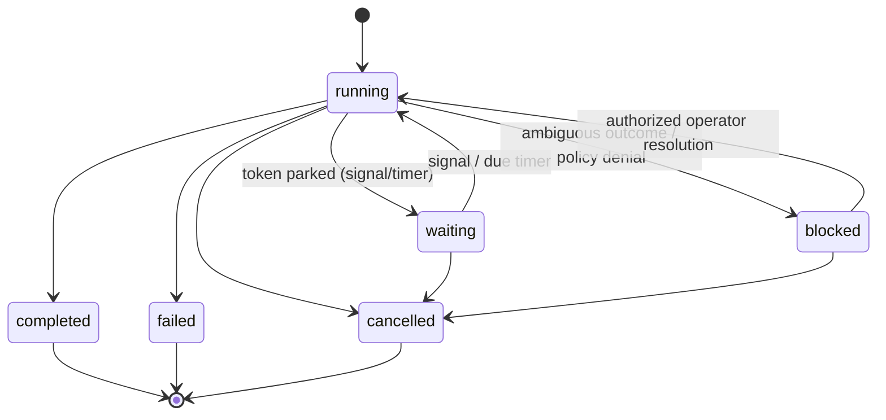
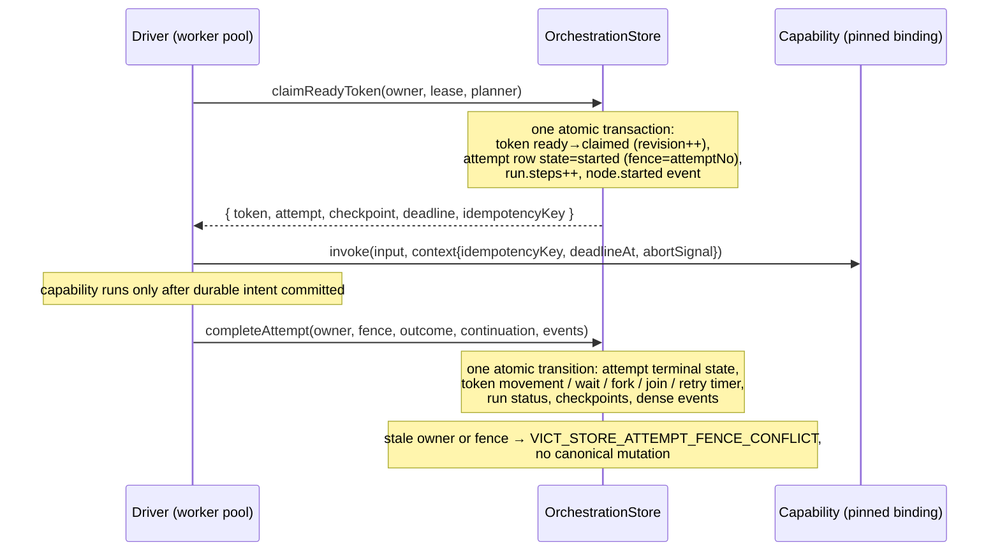
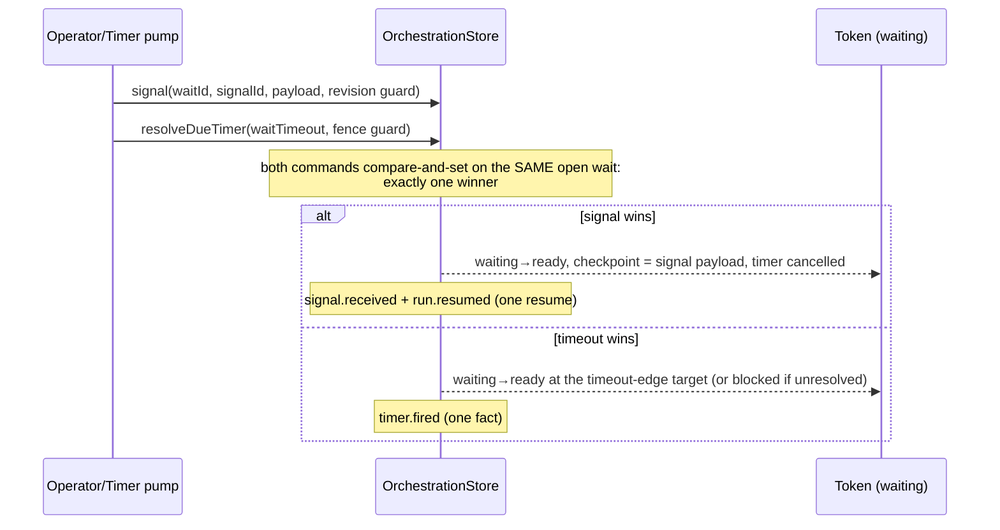

# Stage 03 — Durable Orchestration

> **Authority:** `docs/VICT-SYSTEM-REFERENCE.md` v0.1.1
> **Scope:** restart-safe branching, waits, signals, timers, retries,
> cancellation, and bounded parallel work.
> **Status:** implemented for independent audit (see
> `docs/report/VICT-STAGE-03-REPORT.md`); statuses in the system reference
> are updated only by the later independent disposition.

Stage 02 proved durable identity and sequential state. Stage 03 adds
**durable continuity**:

> A VICT run can branch, wait, wake, retry, cancel, and continue after
> process loss while remaining pinned to one exact activation, committing
> every orchestration transition once, and never blind-replaying an unsafe
> external effect.

## 1. Execution model

Stage 03 uses a **durable token-and-attempt state machine**. A run owns
durable continuation **tokens**; a token identifies a current node, a branch
lineage, and (through the private checkpoint boundary) a continuation
payload. Capability and decision executions go through durable **node
attempts** owned via claims, leases, and monotonic fences. A fork creates a
statically bounded set of child tokens; a join consumes exactly one
completed token per declared branch key. A wait parks a token behind one
durable wait record; a signal or timer resolves that wait once at the VICT
transition boundary. Retries create a new attempt for the same **logical
invocation**.

Resume never reconstructs a JavaScript call stack — it reconstructs durable
orchestration state and continues only the work that policy and identity
make safe.

### 1.1 Run lifecycle



Quiescence is derived from durable work only (kernel `deriveRunStatus`):
`running` while ready or in-flight work exists; `waiting` when all
unresolved work is parked behind waits/timers/joins; `blocked` when
continuation requires explicit resolution; terminal only on a definitive
root completion.

## 2. Graph language

New node kinds (Stage 02 capability-only graphs are unchanged and keep
their exact historical identity):

- **decision** — invokes a pure capability that returns a validated
  `DecisionResult`; routes by declared typed key. No expressions, no
  predicates in graph data.
- **wait** — parks the continuation behind a durable **signal** wait
  (exact name, optional payload contract, optional durable timeout) or a
  relative **timer**.
- **fork** — static bounded fan-out: branch edges with unique keys, a
  matching join, optional concurrency bound.
- **join** — consumes exactly one completed token per declared branch key;
  output is a canonical object keyed lexicographically. Fires once.

Edge kinds: `success`, `error`, `route` (decision), `branch` (fork),
`timeout` (timed signal wait only). Compilation (kernel `compileGraph`)
rejects invalid structure before activation with stable diagnostics:
unknown kinds, invalid edge kinds, missing/duplicate route or branch keys,
fork/join mismatches, unreachable or escaping branches, nested fan-out,
decision capabilities that are not pure, invalid retry/timeout bounds,
write retries without keyed idempotency, any retry on irreversible work,
unsupported cycles.

## 3. Identity and compatibility

Capability-only graphs keep their exact `vict.graph@1` canonical form and
`vict.activation@1` activation marker — stored Stage 02 activations remain
byte-comparable and restorable. Graphs with control declarations compile in
the `vict.graph@2` canonical form with the `vict.activation@2` marker and
the `vict.activation-manifest@2` manifest schema (the v1 manifest schema is
never edited).

Declared idempotency semantics (`idempotency: 'keyed'` on write
capabilities) participate in capability-set identity when declared;
pre-Stage-03 bindings without the field keep their historical canonical
form.

## 4. Durable transition model

### 4.1 Attempt claim/start/complete with fencing



The durable-before-invocation rule holds for every attempt: the claim
transaction IS the attempt-start intent (`node.started` plus the attempt
row commit before the handler runs).

### 4.2 Wait: signal versus timeout race



### 4.3 Keyed-idempotent write recovery

```mermaid
sequenceDiagram
    participant W as Keyed write capability
    participant E as External ledger
    participant S as OrchestrationStore
    W->>E: mutate(key = stable idempotency key)
    E-->>W: committed
    Note over W: process dies BEFORE the VICT completion commit
    Note over S: attempt outcome unknown; lease expires
    Note over S: recovery (pre-authorized mechanical policy):<br/>keyed write → reclaim with the SAME key
    W->>E: repeat with the SAME key
    E-->>W: reconciled prior result (no second mutation)
    S->>S: attempt 2 completed — one logical invocation, one external mutation
```

## 5. Retry, backoff, idempotency, and ambiguity

- `RetryPolicy` is bounded (`maxAttempts` ≤ 10) with deterministic,
  non-jittered backoff (fixed or exponential capped at `maxMs`).
- Retry classification uses **safe stable error codes only** — raw thrown
  messages never classify. A thrown capability error carries the stable
  class `VICT_RUNTIME_CAPABILITY_THREW`; timeouts are the stable code
  `timeout`.
- A retry is a **durable timer** (`timer.scheduled`, due time persisted);
  it survives restart and is processed by the explicit due-timer pump.
  While a retry is pending, the token stays ineligible (claimed).
- The logical invocation (`run + activation + token lineage + node +
  generation`) is stable across attempts; its idempotency key is derived
  deterministically and exposed to the capability context.
- Effect rules: pure/read may retry under policy (a repeated read is a
  live reread — documented and observable); keyed writes may retry with
  the same key; non-keyed writes and irreversible operations with
  ambiguous outcomes **block** — they are never replayed automatically.

## 6. Timeouts

Timeouts persist a durable deadline before invocation and race the
invocation against the injected time port, aborting the capability context
cooperatively. Late results are fenced out by the attempt fence. Pure/read
late results are ignored and may retry under policy; keyed writes may retry
with the same key; unsafe writes and irreversible operations with unknown
outcomes block.

## 7. Cancellation

Cancellation is a durable request (caller-supplied idempotency ID, stable
reason code) — never a claim that external effects were undone. It
prevents claims, closes waits/timers, cancels ready tokens, aborts the
in-flight capability context cooperatively, records the actual result of a
capability that completes after the request, and stops all downstream
continuation. Duplicate requests are idempotent; competing requests
produce one canonical outcome.

## 8. Blocked runs and operator resolution

A blocked run exposes a bounded administrative API
(`runtime.resolveBlocked`) that is:

- **denied by default** unless the runtime is constructed with explicit
  `orchestration.operatorAuthorized: true`;
- idempotent through a caller-supplied resolution ID with a canonical
  command hash;
- guarded by the expected run revision;
- restricted to the exact blocked run and exact pinned activation;
- fully evented with a safe `operator.intervened` record.

Actions: `retry` (only where a retry policy exists), `confirm_applied`
(must pass the pinned output contract), `fail` (approved safe code),
`cancel`. It cannot change graph definitions, activation identity,
permissions, or capability metadata. Approvals/roles remain Stage 05.

## 9. Exact-activation resume

Runs pin their activation. Resuming, signaling, timing, cancelling, or
resolving a run always resolves that run's `activationVersion` from the
stored manifest, rebuilt against the registry's **revision-pinned**
lookups. Selection changes affect future runs only. Missing artifacts
produce a structured unavailable condition and block the run — never a
substitute revision.

## 10. Checkpoint boundary (local trust)

Private operational checkpoint payloads exist only to continue active,
waiting, or blocked work. They are never part of `RunRecord`, event
payloads, list output, or trace diagnostics; terminal transitions tombstone
them (tested lifecycle). Every persisted value crosses the strict
persisted-value domain (undefined, NaN, cycles, class instances, and
functions are rejected).

**Local trust boundary, stated candidly:** Stage 03 SQLite is a trusted
local deployment. It does not provide the Stage 04 secret/artifact
platform or cloud encryption policy. Applications should pass opaque
references for sensitive or large state and resolve secrets just in time.
Local checkpoint bytes are not a protected multi-tenant secret store.

## 11. Storage and migration

One forward migration from the Stage 02 schema (v2): `vict_run` is rebuilt
with the extended lifecycle; new tables cover tokens (private checkpoint
column), attempts, waits, timers, signal receipts, cancellation and
operator-resolution deduplication, and branch results (private branch
outputs). Foreign keys are relaxed per migration and re-verified with
`PRAGMA foreign_key_check`. Historical Stage 02 rows, activations, and
dense event sequences are preserved exactly (proven against a real Stage
02 fixture database).

All orchestration commands are atomic semantic transitions guarded by
optimistic revisions; the in-memory and SQLite adapters pass the same
conformance suite (`@vict/runtime/testing` →
`runOrchestrationConformanceSuite`).

## 12. Events

New versioned facts (all carrying the full run/activation identity, dense
per-run `seq`, and safe structured metadata only): `run.waiting`,
`run.resumed`, `run.cancel_requested`, `run.cancelled`,
`node.retry_scheduled`, `node.timed_out`, `node.cancelled`,
`signal.received`, `timer.scheduled`, `timer.fired`, `fork.created`,
`branch.completed`, `join.completed`, `operator.intervened`. The event
schema stays `vict.run-event@1` (additive); existing capability-only
sequential runs keep their verified trace counts (ARA: 13 events).

## 13. Operational limits (Stage 03)

| Limit | Value |
| --- | --- |
| Local worker concurrency | default 4, hard max 32 |
| Due-timer batch | default 16, hard max 256 |
| Retry attempts | hard max 10 |
| Single delay (backoff/timeout/timer) | hard max 7 days |
| Fork branch count | hard max 64 |
| Claim lease | default 30 s, configurable |
| Nested fan-out | rejected at compilation |
| Dynamic (data-sized) fan-out | not supported |
| Distributed scheduling / multi-host | not supported |

## 14. Verification

- Shared adapter-neutral conformance suite: both adapters
  (`runOrchestrationConformanceSuite`).
- Real-process fixtures: signal-wait restart, offline timer,
  SIGKILL during a pure attempt (durable intent + fence + one retry),
  SIGKILL after an external keyed-write commit (exactly one external
  mutation).
- Real Stage 02 database migration fixture.
- Atomic fault injection and canary suites.
- Offline proof: `examples/orchestration-proof` (`npm run demo` there).
- Aggregate: `npm run verify:stage3`.