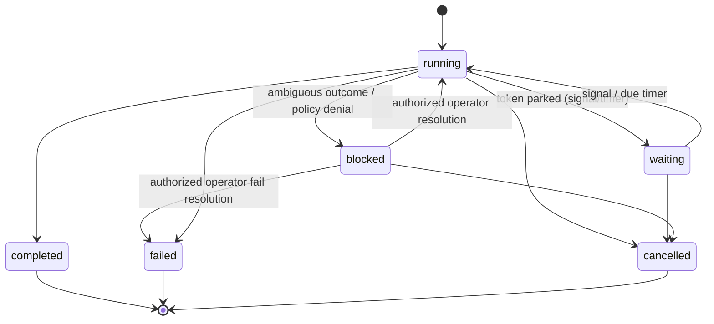
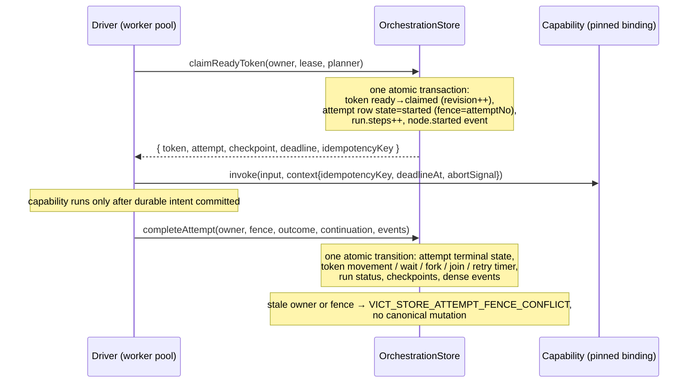
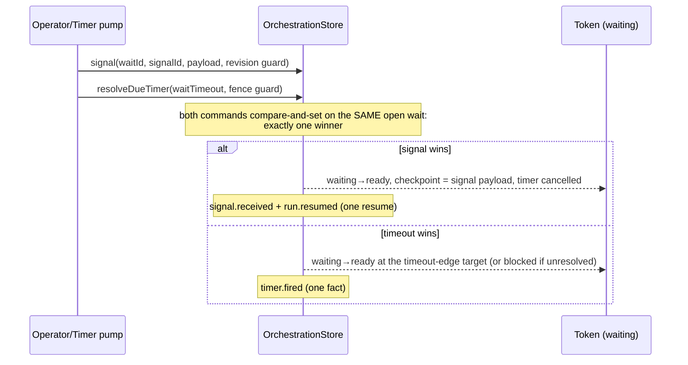

# Stage 03 — Durable Orchestration

> **Authority:** `docs/VICT-SYSTEM-REFERENCE.md` v0.1.1
> **Scope:** restart-safe branching, waits, signals, timers, retries,
> cancellation, and bounded parallel work.
> **Status:** implemented for independent audit (see
> `docs/report/VICT-STAGE-03-REPORT.md`); statuses in the system reference
> are updated only by the later independent disposition.

Stage 02 proved durable identity and sequential state. Stage 03 adds
**durable continuity**:

> A VICT run can branch, wait, wake, retry, cancel, and continue after
> process loss while remaining pinned to one exact activation, committing
> every orchestration transition once, and never blind-replaying an unsafe
> external effect.

## 1. Execution model

Stage 03 uses a **durable token-and-attempt state machine**. A run owns
durable continuation **tokens**; a token identifies a current node, a branch
lineage, and (through the private checkpoint boundary) a continuation
payload. Capability and decision executions go through durable **node
attempts** owned via claims, leases, and monotonic fences. A fork creates a
statically bounded set of child tokens; a join consumes exactly one
completed token per declared branch key. A wait parks a token behind one
durable wait record; a signal or timer resolves that wait once at the VICT
transition boundary. Retries create a new attempt for the same **logical
invocation**.

Resume never reconstructs a JavaScript call stack — it reconstructs durable
orchestration state and continues only the work that policy and identity
make safe.

### 1.1 Run lifecycle



Quiescence is derived from durable work only (kernel `deriveRunStatus`):
`running` while ready or in-flight work exists; `waiting` when all
unresolved work is parked behind waits/timers/joins; `blocked` when
continuation requires explicit resolution; terminal only on a definitive
root completion.

## 2. Graph language

New node kinds (Stage 02 capability-only graphs are unchanged and keep
their exact historical identity):

- **decision** — invokes a pure capability that returns a validated
  `DecisionResult`; routes by declared typed key. No expressions, no
  predicates in graph data.
- **wait** — parks the continuation behind a durable **signal** wait
  (exact name, optional payload contract, optional durable timeout) or a
  relative **timer**.
- **fork** — static bounded fan-out: branch edges with unique keys, a
  matching join, optional concurrency bound.
- **join** — consumes exactly one completed token per declared branch key;
  output is a canonical object keyed lexicographically. The join is a
  durable control node with its own declared output contract (§5.1); it
  fires exactly once. A join may declare zero or one success edge — a join
  with zero success edges is a **terminal join** (§5.1).

Edge kinds: `success`, `error`, `route` (decision), `branch` (fork),
`timeout` (timed signal wait only). Compilation (kernel `compileGraph`)
rejects invalid structure before activation with stable diagnostics:
unknown kinds, invalid edge kinds, missing/duplicate route or branch keys,
fork/join mismatches, unreachable or escaping branches, nested fan-out,
decision capabilities that are not pure, invalid retry/timeout bounds,
write retries without keyed idempotency, any retry on irreversible work,
unsupported cycles.

## 3. Identity and compatibility

Capability-only graphs keep their exact `vict.graph@1` canonical form and
`vict.activation@1` activation marker — stored Stage 02 activations remain
byte-comparable and restorable. Graphs with control declarations compile in
the `vict.graph@2` canonical form with the `vict.activation@2` marker and
the `vict.activation-manifest@2` manifest schema (the v1 manifest schema is
never edited).

Declared idempotency semantics (`idempotency: 'keyed'` on write
capabilities) participate in capability-set identity when declared;
pre-Stage-03 bindings without the field keep their historical canonical
form.

## 4. Durable transition model

### 4.1 Attempt claim/start/complete with fencing



The durable-before-invocation rule holds for every attempt: the claim
transaction IS the attempt-start intent (`node.started` plus the attempt
row commit before the handler runs).

### 4.2 Wait: signal versus timeout race



### 4.3 Keyed-idempotent write recovery

```mermaid
sequenceDiagram
    participant W as Keyed write capability
    participant E as External ledger
    participant S as OrchestrationStore
    W->>E: mutate(key = stable idempotency key)
    E-->>W: committed
    Note over W: process dies BEFORE the VICT completion commit
    Note over S: attempt outcome unknown; lease expires
    Note over S: recovery (pre-authorized mechanical policy):<br/>keyed write → reclaim with the SAME key
    W->>E: repeat with the SAME key
    E-->>W: reconciled prior result (no second mutation)
    S->>S: attempt 2 completed — one logical invocation, one external mutation
```

## 5. Durable join boundaries (RUN-002)

The join node is a real durable boundary: the canonical branch-result
object must cross the join node's OWN declared output contract, validated
by the runtime against the exact pinned activation — never inside the
persistence adapter or a SQLite transaction (author-controlled parsers
never execute in the store).

### 5.1 Join transaction sequence

```mermaid
sequenceDiagram
    participant B as Final branch attempt
    participant S as OrchestrationStore (atomic tx)
    participant R as Runtime (pinned activation)
    participant C as Join output contract (author parser)
    B->>S: completeAttempt(branchArrival, branchKey, output)
    Note over S: one atomic transaction: branch result recorded, branch token completed; on the FINAL arrival exactly ONE join-ready token is created AT THE JOIN NODE with the private canonical checkpoint (lexicographic by branch key)
    R->>S: claim the join-ready token (durable intent)
    R->>C: parse(canonical join payload)
    alt contract accepts
        R->>S: one atomic transition: join completed, downstream token ready (or terminal completion), join.completed committed here
        Note over S: downstream token executable only after this commit
    else contract rejects
        R->>S: one atomic transition: sanitized contract failure + terminal run failure
        Note over S: no join.completed, no downstream token, no raw parser content anywhere
    end
```

Precise semantics:

- **When `join.completed` commits:** exactly once, in the same atomic
  transition that records the VALIDATED join completion and its downstream
  (or terminal) continuation. A final branch arrival alone only creates
  the join-ready token; a rejecting contract never produces the fact.
- **Accepting contract:** the canonical branch-result object passes; the
  parser is invoked exactly once (per join completion), even across
  retries and restarts.
- **Rejecting contract:** invoked exactly once; no downstream capability
  is invoked; the run fails durably with a sanitized structured
  `VICT_KERNEL_CONTRACT_REJECTED` error; duplicate or stale arrivals cannot
  revalidate or rejoin.
- **Transforming contract:** the parser's validated/transformed return
  value is what downstream work receives as its input (crossing the
  downstream node's own input contract, which validates independently),
  and what a terminal join places in `RunResult.output`.
- **Terminal joins (zero success edges):** the join validates its declared
  output contract; on success the run completes with the validated
  canonical join output in `RunResult.output` (stored output under the
  configured retention only); on rejection the run fails safely and
  durably. No undefined node or continuation identifier is ever
  constructed; terminal cleanup and events are atomic.
- **Wait-wake into a join:** a resolved wait whose success target is the
  fork's join routes through the same durable branch-arrival boundary
  (the branch's completion value is the resolved wake payload).
- **Restart and concurrency:** the join-ready token is durable, so join
  validation survives close/reopen; concurrent final arrivals serialize on
  the store transition — exactly one join token and one completion;
  duplicate or stale branch completions are rejected by membership and
  fencing guards.

### 5.2 Safe contract-issue boundary (fail-closed)

Contract `issues` returned by a raw author `parse()` are UNTRUSTED
content: an author-controlled parser may place arbitrary strings — custom
messages, payload echoes, nested secrets, alphanumeric codes and paths —
anywhere in an issue object, and even schema-library issue paths may
contain PAYLOAD-DERIVED key names (a dynamic object key can be a secret).
Character filtering is therefore insufficient by construction: an
alphanumeric secret survives any allowlist of characters.

The single shared sanitizer (`sanitizeContractIssues` in
`@vict/contracts`, applied identically by the durable engine and the
sequential engine) reduces every rejection to framework-controlled
facts only:

1. **`code`** — copied ONLY when it is a member of the closed
   framework vocabulary (`SAFE_ISSUE_CODES`: `invalid_type`,
   `invalid_literal`, `invalid_enum_value`, `too_small`, `too_big`,
   `unrecognized_keys`, `invalid_union`, `invalid_string`,
   `invalid_date`). Any other code — including a secret — becomes the
   stable fallback `untrusted_issue`.
2. **`path`** — NEVER propagated. Issues are located by ordinal only:
   `issues[0]`, `issues[1]`, … (bounded at 10).
3. **`message`** — always framework-GENERATED from the safe code and the
   ordinal (`Expected a valid value at 'issues[0]', received a value.`).
4. **Everything else** — raw `message`, `safeMessage`, `expected`,
   `received`, and any extra or nested issue properties are dropped;
   payload echoes cannot leak.

The SAME policy applies to every validation boundary: input, output,
join, signal, and operator-confirmation validation. No
payload-derived or author-controlled string reaches `onEvent`,
`RunResult.trace`, stored events, default run history, public failure
errors, wait/signal/resolution records, or diagnostic metadata.

**The exact safe metadata boundary** (what IS observable): the contract
id, the node id, the issue COUNT, the allowlisted issue codes, the issue
ordinals, and the framework-generated messages. Caller-owned identifiers
(`runId`, `signalId`, `requestId`, `resolutionId`, `ownerId`) are
identifiers in the caller's own namespace — explicitly safe by policy,
never arbitrary diagnostic text. The cancellation `reasonCode` accepts
only the closed safe vocabulary (`operator_request`, `shutdown`,
`policy`, `superseded`); an invalid code is rejected with a fixed
framework message that does not echo the supplied value.

## 6. Retry, backoff, idempotency, and ambiguity

- `RetryPolicy` is bounded (`maxAttempts` ≤ 10) with deterministic,
  non-jittered backoff (fixed or exponential capped at `maxMs`).
- Retry classification uses **safe stable error codes only** — raw thrown
  messages never classify. A thrown capability error carries the stable
  class `VICT_RUNTIME_CAPABILITY_THREW`; timeouts are the stable code
  `timeout`.
- A retry is a **durable timer** (`timer.scheduled`, due time persisted);
  it survives restart and is processed by the explicit due-timer pump.
  While a retry is pending, the token stays ineligible (claimed).
- The logical invocation (`run + activation + token lineage + node +
  generation`) is stable across attempts; its idempotency key is derived
  deterministically and exposed to the capability context.
- Effect rules: pure/read may retry under policy (a repeated read is a
  live reread — documented and observable); keyed writes may retry with
  the same key; non-keyed writes and irreversible operations with
  ambiguous outcomes **block** — they are never replayed automatically.

## 7. Timeouts

Timeouts persist a durable deadline before invocation and race the
invocation against the injected time port, aborting the capability context
cooperatively. Late results are fenced out by the attempt fence. Pure/read
late results are ignored and may retry under policy; keyed writes may retry
with the same key; unsafe writes and irreversible operations with unknown
outcomes block.

## 8. Cancellation

Cancellation is a durable request (caller-supplied idempotency ID, stable
reason code) — never a claim that external effects were undone. It
prevents claims, closes waits/timers, cancels ready tokens, and
cooperatively ABORTS every in-flight capability context of the run: each
capability observes its `AbortSignal`, the attempt boundary classifies the
aborted attempt honestly as cancelled, and no downstream node or retry can
start from an aborted attempt. A late completion against a cancelled token
is fenced by the durable token and attempt guards. Duplicate requests are
idempotent; competing request IDs produce one canonical terminal outcome;
ambiguous unsafe effects never claim reversal.

## 9. Blocked runs and operator resolution

A blocked run exposes a bounded administrative API
(`runtime.resolveBlocked`) that is:

- **denied by default** unless the runtime is constructed with explicit
  `orchestration.operatorAuthorized: true`;
- idempotent through a caller-supplied resolution ID with a canonical
  command hash;
- guarded by the expected run revision;
- restricted to the exact blocked run and exact pinned activation;
- fully evented with a safe `operator.intervened` record.

Actions: `retry` (only where a retry policy exists), `confirm_applied`
(must pass the pinned output contract), `fail` (approved safe code),
`cancel`. It cannot change graph definitions, activation identity,
permissions, or capability metadata. Approvals/roles remain Stage 05.
The `fail` action applies the legal `blocked → failed` run transition
(kernel `RUN_TRANSITIONS`): the run is failed atomically in the same
transaction that records the sanitized `operator.intervened` and terminal
`run.failed` events, the blocked token is cancelled, no downstream
continuation is created, and a repeated identical resolution is a durable
duplicate.

## 10. Exact-activation resume

Runs pin their activation. Resuming, signaling, timing, cancelling, or
resolving a run always resolves that run's `activationVersion` from the
stored manifest, rebuilt against the registry's **revision-pinned**
lookups. Selection changes affect future runs only. Missing artifacts
produce a structured unavailable condition and block the run — never a
substitute revision.

## 11. Checkpoint boundary (local trust)

Private operational checkpoint payloads exist only to continue active,
waiting, or blocked work. They are never part of `RunRecord`, event
payloads, list output, or trace diagnostics; terminal transitions tombstone
them (tested lifecycle). Every persisted value crosses the strict
persisted-value domain (undefined, NaN, cycles, class instances, and
functions are rejected).

**Local trust boundary, stated candidly:** Stage 03 SQLite is a trusted
local deployment. It does not provide the Stage 04 secret/artifact
platform or cloud encryption policy. Applications should pass opaque
references for sensitive or large state and resolve secrets just in time.
Local checkpoint bytes are not a protected multi-tenant secret store.

## 12. Storage and migration

One forward migration from the Stage 02 schema (v2): `vict_run` is rebuilt
with the extended lifecycle; new tables cover tokens (private checkpoint
column), attempts, waits, timers, signal receipts, cancellation and
operator-resolution deduplication, and branch results (private branch
outputs). Foreign keys are relaxed per migration and re-verified with
`PRAGMA foreign_key_check`. Historical Stage 02 rows, activations, and
dense event sequences are preserved exactly (proven against a real Stage
02 fixture database).

All orchestration commands are atomic semantic transitions guarded by
optimistic revisions. Deterministic fault injection at every material
compound transition (run creation, attempt claim, attempt completion,
signal resolution, timer resolution, fork child creation, final join,
cancellation request/application, attempt recovery, operator resolution)
proves that no half-state, skipped event, duplicate continuation, lost
receipt, or leaked checkpoint becomes visible — including REAL SQLite
transaction rollback, not only in-memory staged rollback. Both adapters
pass the same shared suites (`@vict/runtime/testing`:
`runOrchestrationConformanceSuite`, `runOrchestrationJoinSuite`,
`runOrchestrationRaceSuite`).

Timer recovery: a pump that fails mid-resolution leaves the timer in a
leased `firing` state; once that lease lapses the timer becomes claimable
again, so a wake is never lost to a partial resolution.

## 13. Events

New versioned facts (all carrying the full run/activation identity, dense
per-run `seq`, and safe structured metadata only): `run.waiting`,
`run.resumed`, `run.cancel_requested`, `run.cancelled`,
`node.retry_scheduled`, `node.timed_out`, `node.cancelled`,
`signal.received`, `timer.scheduled`, `timer.fired`, `fork.created`,
`branch.completed`, `join.completed`, `operator.intervened`. The event
schema stays `vict.run-event@1` (additive); existing capability-only
sequential runs keep their verified trace counts (ARA: 13 events).

## 14. Operational limits (Stage 03)

| Limit | Value |
| --- | --- |
| Local worker concurrency | default 4, hard max 32 |
| Due-timer batch | default 16, hard max 256 |
| Retry attempts | hard max 10 |
| Single delay (backoff/timeout/timer) | hard max 7 days |
| Fork branch count | hard max 64 |
| Claim lease | default 30 s, configurable |
| Nested fan-out | rejected at compilation |
| Dynamic (data-sized) fan-out | not supported |
| Distributed scheduling / multi-host | not supported |

## 15. Verification

- Shared adapter-neutral conformance suites, run against BOTH adapters:
  behavior (`runOrchestrationConformanceSuite`), join boundaries
  (`runOrchestrationJoinSuite`), races/adversarial
  (`runOrchestrationRaceSuite`), and canaries
  (`runOrchestrationCanarySuite`).
- Real-process fixtures: signal-wait restart, offline timer,
  SIGKILL during a pure attempt (durable intent + fence + one retry),
  SIGKILL after an external keyed-write commit (exactly one external
  mutation), partial fan-out SIGKILL, terminal-join close/reopen.
- Real Stage 02 database migration fixture.
- Atomic fault injection at EVERY material store boundary, on real
  SQLite transactions: run creation, attempt claim, attempt completion
  (including its wait-creation, fork-creation, join-arrival, and
  terminal-cleanup forms), signal resolution, timer resolution,
  cancellation request and application, attempt recovery, and operator
  resolution.
- Adversarial canary sources: run input/checkpoint, decision value,
  branch outputs, join output, thrown messages with nested causes,
  hostile contract parsers (issue code, path, message,
  expected/received, extra nested properties, payload-derived key
  names), valid signal payloads, cancellation metadata, external-ledger
  errors, and the operator resolution flow — searched across the event
  ledger, run records, safe errors, `RunResult.trace`, receipts, and
  wait descriptors; one persistence-backed probe crosses a real SQLite
  close/reopen boundary.
- Timeout/race determinism: the keyed-write timeout-retry and
  irreversible-timeout race tests run on an injected manual clock
  (`createManualOrchestrationClock`) with explicit invocation barriers —
  persisted deadlines, retry-timer eligibility, and deadline racing move
  only when the test moves them. No wall-clock sleeps.
- Offline proof: `examples/orchestration-proof` (`npm run demo` there).
- Aggregate: `npm run verify:stage3`.