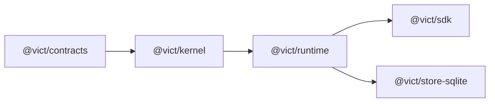

# VICT — Stage 02 Implementation Handoff

## Durable Identity and Stores

> **Authority:** VICT-SYSTEM-REFERENCE.md v0.1.1  
> **Repository:** C:/Users/RZ1/Desktop/RZ/260831-VCT-02  
> **Execution mode:** One autonomous coding agent  
> **Stage status at start:** Stage 01 and Stage 01.1 independently verified  
> **Stage objective:** Restart-safe sequential execution using semantic store ports and a local SQLite adapter  
> **Required final status:** READY FOR INDEPENDENT AUDIT  
> **Hard stop:** Do not begin Stage 03

---

## 1. Instruction to the implementation agent

You are the sole implementation agent for Vict Stage 02.

Work autonomously from repository inspection through implementation, tests, documentation, verification, cleanup, and a factual completion report. Make reasonable low-level engineering decisions within this handoff. Do not ask the user to choose ordinary implementation details that can be resolved from the repository, supported Node environment, automated evidence, or the architectural rules below.

Do not spawn, delegate to, or coordinate other coding agents.

Use stage terminology in filenames, reports, commits, and documentation.

Work only in:

```text
C:/Users/RZ1/Desktop/RZ/260831-VCT-02
```

Do not inspect, import, copy, rename, or adapt packages from any earlier Vict repository. This is a greenfield system.

Read VICT-SYSTEM-REFERENCE.md v0.1.1 before changing code. If it exists outside the repository, copy the supplied authoritative file into the repository’s docs area without altering its content. This handoff narrows the work; it does not replace the system reference.

At completion:

- run the full verification ladder;
- leave no generated databases, tarballs, temporary consumers, coverage output, or debug artifacts in the repository;
- commit the finished work with a clear stage-oriented message;
- push only when the repository’s existing workflow permits it and credentials are already configured;
- write VICT-STAGE-02-REPORT.md;
- report READY FOR INDEPENDENT AUDIT, not Verified;
- stop before Stage 03.

---

## 2. Mission

Stage 02 must prove one thing:

> Vict’s activation identity, run state, and operational event history can survive a real process restart without changing Stage 01’s sequential execution meaning or silently replaying work.

The result must support:

1. immutable activation manifests stored locally;
2. durable selection and exact restoration of an activation;
3. durable run records and append-only events;
4. atomic run-state/event transitions;
5. safe restart handling for interrupted sequential runs;
6. equivalent in-memory and SQLite store behavior;
7. existing payload-retention and sanitization guarantees at the durable boundary;
8. the non-blocking corrections carried forward from Stage 01.1.

Stage 02 is a persistence stage, not an orchestration expansion.

---

## 3. Verified starting baseline

Treat the following as established behavior that must not regress:

- Packages: @vict/contracts, @vict/kernel, @vict/runtime, @vict/sdk.
- Greenfield package dependencies are acyclic.
- Contracts and capabilities have explicit revisions.
- graphVersion identifies topology/declaration.
- capabilitySetVersion identifies effective capability/contract/effect bindings.
- activationVersion combines the two under vict.activation@1.
- Function bodies, schema-library internals, timestamps, randomness, memory addresses, and registration order do not enter version hashes.
- Activated capability invoke references, effects, and revisions are snapshotted.
- Registry mutation affects only a later explicit activation.
- Doubles are snapshotted per run; replacement is explicit.
- Sequential execution and the effect matrix are verified.
- Simulation/test fail closed for read, write, and irreversible capabilities without a safe double.
- Irreversible production execution requires explicit permission.
- Payload retention supports none, summary, and full; summary is the default.
- RunResult.output remains available to the authorized caller.
- Default records and traces omit payload values and unsafe thrown/schema messages.
- Base contracts and SDK declarations are Zod-free; Zod exists only through optional subpaths.
- The offline ARA proof has 4 nodes, 3 edges, and 13 events.
- The current three-node in-memory benchmark has 10 events, 6 contract validations, and one repository write per completed run.
- The verified suite contains 105 passing tests before Stage 02 changes.

Record the actual starting commit and command results. Do not reset a newer valid commit merely to match an earlier report.

---

## 4. Normative requirements in scope

Implement or advance these system-reference requirements:

| Requirement | Stage 02 obligation |
|---|---|
| CONT-008 | Freeze official adapter contracts and prevent caller-owned contract mutation from changing activated parsing behavior |
| VER-005 | Preserve immutable activation meaning |
| VER-007 | Keep every run pinned to one activation |
| VER-008 | Never restore or resume against a substitute activation |
| VER-010 | Capture contract parsing semantics by value or enforce equivalent immutability |
| RUN-001 | Persist exactly one activationVersion on every run |
| RUN-003 | Keep sequential scheduling explicit and reproducible |
| RUN-008 | Persist only safe error classes and correlation identifiers |
| DATA-001 | Use semantic storage ports |
| DATA-002 | Keep activations and events immutable |
| DATA-003 | Commit run transitions and their events atomically |
| DATA-004 | Preserve none/summary/full retention |
| DATA-005 | Preserve summary as the default |
| DATA-006 | Make full retention explicit and lifecycle-ready |
| DATA-008 | Require the exact activation for restoration |
| DATA-011 | Warn that full retention transfers responsibility to the caller/operator |
| DATA-012 | Prevent callers from mutating canonical records through returned references |
| OBS-001 | Persist run, activation, schema, sequence, and ordering context on events |
| OBS-002 | Persist safe summaries, not raw payloads |
| TEST-006 | Prove restart and incomplete/corrupt-state behavior |

Also preserve all requirements already marked Verified in v0.1.1.

---

## 5. Scope

### 5.1 Required work

1. Define asynchronous semantic storage ports in the runtime layer.
2. Provide conforming in-memory implementations.
3. Add one real SQLite adapter package.
4. Add schema versioning and forward migrations.
5. Persist activation manifests and selected activation identity.
6. Persist run state and append-only operational events.
7. Make each run transition and its new events atomic.
8. Integrate stores into runtime activation and sequential execution.
9. Restore an activation only when the registered code/contracts reproduce its exact identity.
10. Detect interrupted runs after restart and move them safely to blocked without replay.
11. Preserve retention and error-sanitization rules in stored rows.
12. Close the required Stage 01.1 carry-forward corrections.
13. Add in-memory/SQLite conformance tests.
14. Add real subprocess restart/crash tests.
15. Add SQLite package-consumer verification.
16. Update examples, benchmarks, architecture docs, and public types.

### 5.2 Explicit exclusions

Do not implement:

- waits or external signals;
- timers or scheduling queues;
- branch, fan-out, join, or loop primitives;
- automatic retries or backoff;
- resumable node execution;
- idempotency orchestration;
- distributed workers, leases, or leader election;
- Postgres or cloud databases;
- HTTP, WebSocket, SSE, MCP, or server transport;
- control-plane ChangeSets, roles, or approvals;
- CLI or Studio product surfaces;
- Builder Agent runtime integration;
- capability packs, registry, playbooks, or marketplace;
- SDK dependency-direction refactor planned for Stage 04;
- application-domain persistence for ARA;
- multi-process concurrent execution against one database;
- automatic replay of an interrupted capability.

If a desired implementation requires one of these, redesign the Stage 02 solution or record it as future work. Do not cross the boundary.

---

## 6. Package architecture

Use this dependency shape:



The arrow points from the imported lower layer to the dependent layer.

### 6.1 Ownership

**@vict/runtime**

- Store port types and public persistence records.
- In-memory conforming store.
- Atomic transition command semantics.
- Runtime integration and restart policy.
- No SQLite imports.

**@vict/store-sqlite**

- SQLite schema, migrations, transactions, serialization, and adapter.
- Depends on @vict/runtime types/ports.
- Must not depend on @vict/sdk.
- Must not contain graph compilation or application logic.

**@vict/kernel**

- Remains pure.
- No filesystem, database, SQLite, clock, or process access.

**@vict/sdk**

- Preserve the current public facade.
- Do not make it import or re-export the SQLite adapter.

Creating @vict/store-sqlite is justified because it contains real adapter behavior and tests. Do not create any other speculative package.

---

## 7. SQLite-driver decision

The exact SQLite driver is delegated to you, but the decision must be evidence-based.

Before choosing:

1. inspect package engines, lockfile, module format, TypeScript settings, CI assumptions, and Node versions;
2. probe the actual supported Node runtime;
3. compare the built-in SQLite API, if usable, against one maintained minimal external option;
4. consider installation reliability on Windows, native compilation requirements, ESM/types, transaction support, license, maintenance, and future testability;
5. choose the smallest option that reliably satisfies the supported environment.

Do not silently raise the minimum Node version. Do not add an ORM. Do not add a general query builder. Record the chosen driver and reasons in a short architecture decision section inside the stage report.

If the selected dependency requires native installation, verify a clean npm ci from the repository and document platform implications.

---

## 8. Semantic store design

Exact TypeScript names may follow repository conventions, but the following semantics are mandatory.

### 8.1 Activation catalog

The ActivationCatalog must support:

- publish an immutable activation manifest;
- read by activationVersion;
- list/query minimally for local inspection;
- atomically select an activation for a graph;
- read the selected activation for a graph;
- idempotently republish byte-equivalent/canonically equivalent content;
- reject the same activationVersion paired with different content;
- apply optimistic concurrency when changing a selected activation.

An activation manifest contains only serializable meaning:

- storage/manifest schema version;
- graph ID and graph definition;
- graphVersion;
- capabilitySetVersion;
- activationVersion;
- effective capability binding metadata;
- input/output contract IDs and revisions;
- effect classes;
- canonical manifest or enough canonical material to verify it;
- safe creation metadata/timestamp.

It must not serialize:

- functions or closures;
- schema-library objects;
- live registry maps;
- secret values;
- process-specific object identity;
- test doubles.

### 8.2 Exact activation restoration

Functions cannot be restored from SQLite. Restoration must therefore:

1. load the stored activation manifest;
2. resolve required capabilities/contracts from the current code registry;
3. rebuild a fresh immutable in-memory activation snapshot;
4. recompute all three version identities;
5. compare the rebuilt manifest and activationVersion with the stored record;
6. activate only on an exact match.

If a capability, contract, revision, effect, or graph element is missing or different:

- return a structured activation-unavailable or activation-mismatch error;
- preserve the stored manifest;
- leave the currently active in-memory graph unchanged;
- do not choose a “closest” revision;
- do not execute any capability;
- do not mutate a run to claim successful restoration.

Restoration verifies availability; it never invokes a capability.

### 8.3 Run and event store

RunStore and EventStore may be exposed as separate read interfaces, but writes that must be atomic must share one transaction boundary. Do not design two independent write ports that make DATA-003 impossible.

A practical shape is an aggregate ExecutionStore with operations conceptually equivalent to:

```ts
interface ExecutionStore {
  createRun(command: CreateRunCommand): Promise<Readonly<StoredRun>>
  commitTransition(command: CommitRunTransition): Promise<Readonly<StoredRun>>
  getRun(runId: string): Promise<Readonly<StoredRun> | undefined>
  listRuns(query?: RunQuery): Promise<ReadonlyArray<Readonly<StoredRun>>>
  listEvents(runId: string, afterSeq?: number): Promise<ReadonlyArray<Readonly<StoredEvent>>>
  recoverInterruptedRuns(command: RecoveryCommand): Promise<RecoveryResult>
}
```

This is conceptual, not a demand for these exact names.

Every transition command must include:

- run ID;
- expected record revision or expected current state;
- next safe run state;
- any safe updated metadata;
- an ordered batch of new events;
- expected next event sequence;
- timestamp from the runtime clock.

The adapter must either commit all of the transition plus events or commit none.

### 8.4 Store behavior

- All public port operations are Promise-based even if the chosen SQLite driver is synchronous.
- Read results are immutable snapshots or defensive copies.
- Store errors are structured and safe.
- No adapter exposes raw database handles through public runtime APIs.
- Event updates and deletes are not part of the public API.
- Activation updates are not part of the public API.
- Run state updates require optimistic concurrency.
- A duplicate event sequence is a conflict, not an overwrite.
- Stable ordering must not rely on unordered SQL results.
- JSON read from storage is validated before becoming a public record.

---

## 9. Required SQLite schema

Use a forward-migrated schema with an explicit schema version. Exact table/column names may follow repository style, but the model must cover:

### 9.1 Migration metadata

- migration version as a primary key;
- applied timestamp;
- optional checksum/name;
- migrations executed transactionally where SQLite permits;
- reopening an up-to-date database is idempotent;
- a database with an unsupported newer schema fails clearly and without mutation.

### 9.2 Activations

Minimum fields:

- activation_version primary key;
- manifest_schema;
- graph_id;
- graph_version;
- capability_set_version;
- canonical manifest JSON;
- created_at.

The row is immutable after insertion.

### 9.3 Active activation selection

Minimum fields:

- graph_id primary key;
- activation_version foreign key;
- selection revision for optimistic concurrency;
- selected_at.

Publishing and selecting may be one adapter transaction when activation() requests both.

### 9.4 Runs

Minimum fields:

- run_id primary key;
- graph_id;
- graph_version;
- capability_set_version;
- activation_version;
- status;
- mode;
- payload-retention mode;
- step count;
- current/last node identifier when known;
- safe output summary JSON when allowed;
- full output JSON only under explicit full retention;
- safe error JSON;
- record revision;
- created_at;
- updated_at;
- completed_at when terminal.

Input payloads are not stored in Stage 02, including under full retention.

### 9.5 Events

Minimum fields:

- run_id;
- dense per-run sequence number;
- event schema version;
- event type;
- graph ID;
- all three version identities;
- node/capability identifiers when applicable;
- safe event payload JSON;
- timestamp;
- primary key on run_id plus sequence.

Events are append-only.

### 9.6 Database configuration

At minimum:

- foreign-key enforcement enabled;
- explicit transactions for compound writes;
- a bounded busy timeout;
- predictable journal/synchronous settings documented;
- database path supplied by the caller;
- in-memory/temp database options for tests;
- clean close/dispose behavior;
- no database file committed to source control.

Stage 02 supports one local runtime owner per database. Detect or clearly document unsupported concurrent-process ownership; do not implement distributed leases.

---

## 10. Runtime integration

### 10.1 Construction and defaults

- Preserve an ergonomic in-memory default for existing users/tests unless the repository already requires an explicit repository.
- Allow a caller to inject conforming activation/execution stores.
- Do not construct SQLite implicitly inside @vict/runtime.
- Preserve existing retention defaults.
- Validate incompatible store configuration at construction.

### 10.2 Activation

Activation must be atomic from the caller’s perspective:

1. compile and resolve the candidate completely;
2. snapshot capability and contract parsing semantics;
3. build and validate the serializable manifest;
4. publish/select it in the catalog transaction;
5. only then replace the active in-memory snapshot.

If any step fails, the previously active graph remains selected and runnable. A failed storage write must not leave memory claiming an activation that durable state did not select.

### 10.3 Run lifecycle

Maintain sequential node execution.

Before executing a capability, persist enough intent to diagnose an interruption. At minimum:

1. create the run as running with run.started;
2. before each node invocation, atomically update current node/step context and append node.started;
3. after a node result, atomically persist the resulting state and ordered events;
4. on terminal completion/failure/block, atomically persist the terminal record and final events.

Signal-routing events may be committed with the completed-node transition when ordering remains exact.

Do not store input values. Do not store full outputs unless retention is full. Persist the same sanitized error object exposed by the safe runtime boundary.

The in-memory trace and durable event sequence must agree exactly for a completed run.

This will change the old “one repository write per run” benchmark fact. Update tests and documentation to report the new intentional number of durable transitions instead of preserving a stale count.

### 10.4 Interrupted process policy

Stage 02 does not resume interrupted execution.

On explicit local recovery during startup:

- find runs left in a nonterminal running state by the previous process;
- atomically transition each to blocked;
- append a safe run.blocked event with a stable interruption code and remediation;
- preserve activation identity and last durable node context;
- never invoke or replay the capability;
- never infer whether an external side effect occurred;
- make repeated recovery idempotent.

The remediation should state that automatic resume is unavailable at this stage. The operator may inspect the run and deliberately start a separate new run; that new run receives a new run ID.

Do not automatically mark active work from another process as interrupted. Stage 02 assumes a single local owner and recovery is an explicit boot operation before accepting runs.

### 10.5 Clock and serialization

- Use the injected runtime clock for operational timestamps where the runtime owns the event.
- Persist timestamps in one documented UTC representation.
- Use canonical/stable JSON where identity or byte comparison depends on it.
- Never use database row order as event order.
- Reject NaN, Infinity, unsupported values, malformed JSON, and records that fail public persistence schemas with structured errors.

---

## 11. Carry-forward corrections

These are required work, not optional observations.

### 11.1 Contract immutability

1. Freeze the contract returned by defineZodContract.
2. Apply the same rule to any other official adapter factory.
3. During activation, capture each contract’s parse function/reference and immutable metadata into the activation snapshot, or reject unsupported mutable shapes.
4. Add regression tests showing that replacing contractObject.parse after activation does not affect later runs on that activation.
5. Show that explicit reactivation captures a deliberately changed contract only when its revision is correctly changed.

Capturing the parse callable protects against property replacement. It cannot detect a closure whose hidden mutable state is changed; explicit revision discipline remains an accepted author/build trust boundary.

### 11.2 Full-retention responsibility

Add an explicit warning to:

- the public PayloadRetention/type documentation;
- runtime configuration documentation;
- the foundation/current architecture documentation;
- the Stage 02 report.

Required meaning:

> Selecting full retention makes the caller/operator responsible for the sensitivity, access control, minimization, and lifecycle of the complete output that will be persisted.

Do not weaken summary as the default.

### 11.3 Read encapsulation

The in-memory and SQLite stores must not hand out mutable references to canonical records. Tests must mutate or attempt to mutate returned records and prove subsequent reads remain unchanged.

### 11.4 Compiler diagnostic hygiene

When feasible without expanding graph semantics, make cycle detection coexist with other independent compile diagnostics in deterministic order. Preserve the existing 13-code public union unless a new code is genuinely necessary; do not renumber or repurpose codes.

If this improvement would materially destabilize the compiler, keep it as a documented non-gating observation and explain why in the report. The first three corrections are mandatory.

---

## 12. Error model

Add stable structured errors for persistence concerns. Exact names should fit existing conventions, but distinguish at least:

- unsupported storage schema;
- migration failure;
- activation not found;
- activation manifest mismatch/corruption;
- activation collision;
- selected-activation concurrency conflict;
- run not found;
- run-state/revision conflict;
- event-sequence conflict;
- invalid persisted record;
- storage unavailable/busy;
- interrupted run blocked.

Rules:

- Never copy raw SQLite error messages into persisted events or ordinary public errors.
- Preserve a safe error code, operation, relevant safe IDs, and correlation ID.
- Attach raw driver detail only to a protected development cause that cannot enter normal RunResult, event, or run-record serialization.
- Database paths should not enter ordinary public errors unless explicitly safe.
- SQL text and bound values must never be exposed through normal diagnostics.

---

## 13. Migrations and compatibility

Stage 02 begins persistence, so establish disciplined migration rules now:

- schema begins at an explicit integer version;
- migrations are ordered and forward-only;
- every migration has an automated fresh-database test;
- reopen/current-version behavior is tested;
- unsupported future versions fail closed;
- partially applied migration simulation does not leave a falsely advanced version;
- application code does not scatter ad hoc CREATE/ALTER statements outside migration ownership;
- stored manifest/event schema versions are separate from the SQLite schema version;
- no production down-migration mechanism is required in this stage.

Document how a developer may delete a disposable local development database. Do not make destructive deletion an automatic recovery behavior.

---

## 14. Conformance suite

Create one adapter-neutral conformance suite and run it against:

1. the in-memory store;
2. the SQLite store using a fresh temporary database.

At minimum, conformance must prove:

- activation publish/read equivalence;
- equivalent republish is idempotent;
- same-version/different-content collision is rejected;
- selection optimistic concurrency;
- create run plus initial event is atomic;
- transition plus event batch is atomic;
- record revisions reject stale writers;
- event sequences are dense and append-only;
- read order is explicit;
- completed, failed, and blocked records round-trip;
- none/summary/full retention shape is preserved;
- default summaries contain no canary values;
- safe errors round-trip without raw causes;
- returned objects cannot mutate stored state;
- recover-interrupted is idempotent;
- unknown/corrupt records fail safely.

The same behavioral test source should exercise both adapters. Do not maintain two hand-copied suites.

---

## 15. Required adversarial and restart tests

### 15.1 Real process restart

Use child processes or an equivalent real process boundary—not only closing and reopening an object in the same process.

Test at least:

1. Process A publishes/selects an activation and completes a run.
2. Process B opens the same database, resolves current registered code, restores the exact activation, and reads the identical run/events.
3. Versions, event ordering, retention shape, and safe output/error data match.

### 15.2 Forced interruption

Create a deterministic fixture capability that signals when a durable node-start transition has committed, then remains behind a barrier. Terminate the child process at that point.

On a new process:

- recover the run to blocked;
- verify a single interruption event;
- verify no capability automatically executes;
- verify exact activation identity remains;
- verify a second recovery call makes no duplicate event or transition.

Where practical, include a separate case interrupted after a safe pure capability returns but before a later node begins.

### 15.3 Exact-activation mismatch

Persist an activation, then restart with:

- a missing capability;
- a changed capability revision;
- a changed contract revision;
- a changed effect class;
- changed topology.

Each must fail restoration clearly without executing code or replacing a valid current activation.

### 15.4 Transaction failure

Inject or provoke failure between the logical run update and event append. Prove no impossible half-state becomes visible. Do this through adapter fault injection or a controlled transaction rollback; do not corrupt a user database.

### 15.5 Concurrency conflict

Submit two transitions from the same expected run revision. Exactly one succeeds; the other receives a structured conflict. Do not add distributed scheduling.

### 15.6 Corruption and schema

Against disposable test databases:

- malformed manifest JSON;
- internally inconsistent stored versions;
- unsupported future database schema;
- invalid status or event sequence;
- missing selected activation target.

Each must fail closed and preserve inspectable data where possible.

### 15.7 Secret canaries

Search serialized database-facing records and read results for unique canaries injected through:

- input fields;
- nested output values;
- thrown messages and nested causes;
- custom schema messages;
- authorization-like field names;
- ordinary and failed runs.

Default summary mode must contain none of the values. Full mode may contain only the complete validated output by explicit choice; it still must not store input or raw error messages.

---

## 16. Existing behavior and regression tests

Preserve or deliberately update:

- all pre-stage tests;
- ARA’s 4-node/3-edge topology;
- ARA’s 13-event semantic trace unless durable lifecycle semantics require a documented event change;
- graph/capability/activation identity fixtures;
- activation atomicity;
- cycle rejection and max-step protection;
- error-edge routing;
- domain payloads containing an error property;
- full effect matrix;
- package dependency acyclicity;
- no ARA/application logic in core packages;
- strict Zod-free packed consumer;
- optional Zod consumer;
- irreversible-double poison-spy tests.

If persistence integration intentionally changes repository-write counts or runtime event boundaries, update assertions and documentation based on observed behavior. Never edit a test merely to hide an unintended regression.

---

## 17. Performance evaluation

Performance remains informational, not a correctness shortcut.

Measure and report separately:

1. existing in-memory runtime;
2. SQLite-backed sequential runtime;
3. activation publish/restore;
4. completed-run read with events.

For each benchmark state:

- Node and platform;
- SQLite driver/version and database mode;
- temp/in-memory/file-backed database choice;
- warm-up and measured iteration counts;
- graph node/edge count;
- event count;
- number of durable transactions per run;
- median and p95;
- whether fsync/journal settings represent real local durability.

Do not compare a memory-only database result to file-backed durability without labeling the difference. Do not add brittle wall-clock assertions to correctness tests.

Compilation and activation restoration remain outside ARA’s conversational run path.

---

## 18. Consumer and packaging verification

Extend the isolated consumer verification to cover the new package:

- pack all five public packages from built artifacts;
- install them into a temporary consumer without workspace hoisting;
- use only declared dependencies;
- open a temporary SQLite database;
- publish/activate/run/close/reopen/read successfully;
- ensure the neutral consumer still has no Zod installed;
- exercise @vict/sdk/zod in a separate consumer with Zod installed;
- strict TypeScript with skipLibCheck false;
- clean every temporary package/database afterward.

Packed manifests must declare every runtime dependency correctly. No source-path imports or workspace-only resolution may be required.

---

## 19. Documentation deliverables

Update:

- root README with local durable-store quick start;
- architecture documentation for store ports and exact restoration;
- public API/type documentation;
- payload-retention warning;
- SQLite-driver decision and operational settings;
- migration policy;
- restart/interruption semantics;
- benchmark semantics;
- package/dependency diagram;
- VICT-SYSTEM-REFERENCE.md only where implementation status/evidence must be proposed for later acceptance.

Do not mark the system reference’s Stage 02 delivery status Verified. In your report, provide a proposed status delta for the independent auditor/owner to accept.

Use VICT-STAGE-02-REPORT.md for the implementation report.

---

## 20. Required command ladder

Start by discovering the actual repository scripts. Preserve all existing gates and add a clear Stage 02 verification command where useful.

At minimum, run and record:

```bash
npm ci
npm run format:check
npm run lint
npm run typecheck
npx vitest run --project unit
npx vitest run --project integration
npm test
npm run build
npm run verify:consumer
npm run example
npm run bench
```

Also run:

- the adapter-conformance suite directly;
- the subprocess restart/interruption suite directly;
- the SQLite packed-consumer verification;
- any migration/corruption suite you add;
- a final npm test after all documentation/configuration edits.

If you add npm run verify:stage2, it must call the real suites; it must not replace or skip the individual evidence above.

All commands must exit 0 for READY FOR INDEPENDENT AUDIT.

---

## 21. Required verification matrix

The report must give PASS/FAIL plus direct evidence for every row:

| Area | Required result |
|---|---|
| Fresh database | Schema migrates and opens |
| Reopen | Current schema reopens idempotently |
| Future schema | Fails closed without mutation |
| Activation publish | Immutable and round-trips |
| Activation collision | Same ID/different manifest rejected |
| Selection conflict | Stale expected revision rejected |
| Exact restore | Same registry rebuilds identical identities |
| Restore mismatch | Missing/changed bindings fail without execution |
| Completed restart | Run and events survive a new process |
| Failed restart | Safe error and events survive |
| Forced interruption | Run becomes blocked; nothing replays |
| Recovery repeat | No duplicate transition/event |
| Atomic transition | No run/event half-state |
| Writer conflict | One winner, one structured conflict |
| Event order | Dense, stable, append-only |
| Default retention | No complete input/output or canary values |
| Full retention | Output stored only by explicit configuration |
| Error safety | No raw thrown/schema/SQLite message persisted |
| Contract mutation | Cannot change pinned parsing semantics |
| Zod adapter | Returned contract is frozen |
| Record isolation | Mutating a read result cannot mutate store |
| In-memory parity | Shared conformance suite passes |
| SQLite parity | Shared conformance suite passes |
| Package isolation | Packed SQLite consumer works |
| ARA | Deterministic/offline and semantically correct |
| Regression | All prior behavior remains valid |
| Scope | No excluded Stage 03+ feature added |

---

## 22. Autonomy and decision rules

You may autonomously:

- choose the SQLite driver using Section 7;
- choose internal type/function/table names;
- add the one required adapter package;
- refactor the existing in-memory repository into semantic ports;
- add migration, fixture, fault-injection, and subprocess test utilities;
- update documentation and package scripts;
- make pre-1.0 breaking internal changes when required by the stage and update all call sites;
- commit the completed result.

You must stop and report a blocker if:

- the repository path is wrong or the expected greenfield project is absent;
- existing user changes overlap the required files and cannot be preserved;
- the verified Stage 01.1 baseline is missing or failing before your changes;
- installing any viable SQLite driver requires credentials, system modification, or a Node-version change outside repository scope;
- the architecture cannot satisfy atomic transition/event writes without crossing an explicit exclusion;
- required permissions or package-registry access are unavailable;
- a destructive operation would be required on data outside disposable test paths.

Do not stop for ordinary type errors, test failures, migration bugs, package-resolution issues, or implementation decisions. Diagnose and fix them.

Never:

- reset, discard, or overwrite unrelated user changes;
- delete a database whose exact disposable test ownership is not proven;
- weaken a safety test to pass;
- omit a failed command from the report;
- use the implementation report as proof of verification;
- claim independent verification.

---

## 23. Completion report format

Create VICT-STAGE-02-REPORT.md with:

### Outcome

Use one:

- READY FOR INDEPENDENT AUDIT
- NOT READY
- BLOCKED

### Starting state

- starting commit;
- Node/npm/platform;
- initial git status;
- baseline command results.

### Architecture delivered

- port model;
- package/dependency changes;
- SQLite-driver decision;
- schema/migrations;
- activation restoration;
- run/event transaction model;
- interruption policy;
- retention/error boundary.

### Carry-forward corrections

State exact evidence for:

- contract/adaptor immutability;
- full-retention warning;
- record encapsulation;
- cycle diagnostic disposition.

### Files changed

Group by package, tests, tooling, examples, and documentation.

### Verification evidence

For every command:

- exact command;
- exit code;
- observed test/file counts;
- material output summary.

### Required verification matrix

Reproduce Section 21 with PASS/FAIL and file/test references.

### Restart evidence

- process topology;
- exact scenario;
- database lifecycle;
- before/after records;
- proof that no capability replay occurred.

### Performance

Report the conditions and results required by Section 17.

### Compatibility changes

List every intentional public/internal breaking change and migration implication.

### Remaining risks

Be candid. Separate:

- blocking;
- non-blocking;
- accepted trust boundaries;
- future-stage work.

### Scope confirmation

Confirm each exclusion remained untouched.

### Repository state

- final commit;
- push result if applicable;
- final git status;
- temporary artifact cleanup.

### Independent verification readiness

Give the shortest clean-room command sequence for a separate auditor.

---

## 24. Exit gate

Stage 02 implementation work is complete only when:

1. all required ports and both adapters exist;
2. activation manifests and selections survive restart;
3. exact code/contract resolution is enforced;
4. completed/failed/blocked runs and append-only events survive a real process boundary;
5. run transitions and events are atomic;
6. interrupted work blocks without replay;
7. in-memory and SQLite adapters pass one shared conformance suite;
8. default persistence passes canary leakage checks;
9. official contracts are frozen and parsing behavior is pinned;
10. public full-retention responsibility is explicit;
11. read results cannot mutate canonical storage;
12. all prior and new tests pass;
13. packed consumers prove real package isolation;
14. documentation and benchmark claims match observed behavior;
15. the repository is clean except for intentional committed deliverables;
16. VICT-STAGE-02-REPORT.md is complete;
17. no Stage 03 behavior was implemented.

Then stop and return:

> **READY FOR INDEPENDENT AUDIT — Stage 02 implementation complete. Stage 03 not started.**

Do not update the stage to Verified. A separate audit must do that.

---

## 25. Final architectural reminder

The goal is not “put the current object in SQLite.”

The goal is:

> The same verified Vict meaning can be identified, persisted, inspected, and safely recovered after the process disappears—without pretending that serialized rows contain executable code and without replaying ambiguous effects.

Favor the smallest implementation that proves that statement completely.
