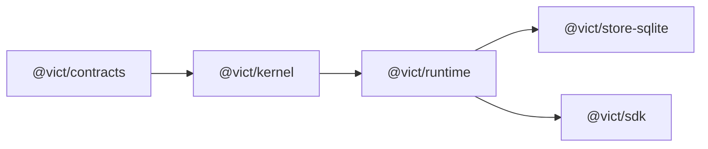

# VICT — Stage 03 Implementation Handoff

## Durable Orchestration

> **Authority:** `docs/VICT-SYSTEM-REFERENCE.md` v0.1.1
> **Accepted baseline commit:** `644c84f807b677535b36b3ccc4112ecad18853c5`
> **Repository:** `C:/Users/RZ1/Desktop/RZ/260831-VCT-02`
> **Remote:** `https://github.com/radz2291/vict-02`
> **Execution mode:** One autonomous coding agent
> **Stage status at start:** Stages 01, 01.1, and 02 independently verified
> **Stage objective:** Restart-safe branching, waits, signals, timers, retries, cancellation, and bounded parallel work
> **Required final status:** `READY FOR INDEPENDENT AUDIT`
> **Hard stop:** Do not begin Stage 04

---

## 1. Instruction to the implementation agent

You are the sole implementation agent for VICT Stage 03.

Work autonomously from repository inspection through architecture implementation, migrations, tests, examples, documentation, verification, cleanup, commit, push, and a factual completion report. Resolve ordinary low-level engineering choices from the repository, the verified baseline, and the rules in this handoff. Do not ask the user to choose routine internal names or implementation details.

Do not spawn, delegate to, or coordinate other coding agents.

Use stage terminology in filenames, documentation, commits, and reports.

Work only in:

```text
C:/Users/RZ1/Desktop/RZ/260831-VCT-02
```

Do not inspect, import, copy, rename, or adapt code from any earlier VICT repository. This is the greenfield system.

Before changing code:

1. fetch the remote safely;
2. confirm `main` contains baseline commit `644c84f807b677535b36b3ccc4112ecad18853c5`;
3. inspect the worktree and preserve all unrelated owner changes;
4. read `docs/VICT-SYSTEM-REFERENCE.md` completely;
5. reproduce the Stage 02 verification baseline;
6. record the actual starting commit, Node/npm/platform, and initial command results.

Do not reset a valid newer commit merely to match the SHA above. If `main` has advanced, inspect the additional commits and proceed only when they preserve the accepted Stage 02 closure.

At completion:

- run the complete verification ladder;
- remove generated databases, timers, external-effect ledgers, tarballs, temporary consumers, coverage output, process markers, and debug artifacts;
- create `docs/report/VICT-STAGE-03-REPORT.md`;
- commit the finished work with a clear stage-oriented message;
- push only by normal fast-forward when credentials and repository workflow already permit it;
- report `READY FOR INDEPENDENT AUDIT`, never `Verified`;
- stop before Stage 04.

---

## 2. Mission

Stage 03 must prove this statement:

> A VICT run can branch, wait, wake, retry, cancel, and continue after process loss while remaining pinned to one exact activation, committing every orchestration transition once, and never blind-replaying an unsafe external effect.

Stage 02 proved durable identity and sequential state. Stage 03 adds durable continuity. It is not a server, control-plane, SDK-platform, or distributed-worker stage.

The completed stage must support:

1. typed deterministic decision routing;
2. fixed, bounded fan-out with deterministic join results;
3. durable signal waits and durable timers;
4. bounded retry and deterministic backoff;
5. cooperative timeout and cancellation;
6. stable logical invocation and idempotency keys;
7. durable attempt ownership and stale-result fencing;
8. safe recovery after a real process crash;
9. explicit blocked-state resolution through a bounded operator API;
10. exact activation restoration for every resumed run;
11. equivalent orchestration semantics in memory and SQLite;
12. preservation of all verified Stage 02 safety, retention, and packaging behavior.

---

## 3. Verified starting baseline

Treat the following as established and non-regressible:

- The accepted repository baseline is closure commit `644c84f`.
- `@vict/contracts`, `@vict/kernel`, `@vict/runtime`, `@vict/store-sqlite`, and `@vict/sdk` form the current package family.
- The kernel performs no filesystem, database, network, model, clock, random, or process I/O.
- `graphVersion`, `capabilitySetVersion`, and `activationVersion` have independently verified canonical semantics.
- Activations snapshot capability handlers, effects, revisions, and contract parsing behavior.
- Runs are pinned to exactly one activation.
- Registry changes require explicit reactivation before affecting new runs.
- Stage 02 durable activation manifests survive restart and restore only on an exact match.
- The runtime commits durable intent before capability invocation.
- Run transitions and event batches are atomic.
- In-memory and SQLite adapters enforce the same identity, sequence, atomicity, and serialization invariants.
- Interrupted Stage 02 sequential runs block without replay.
- Retention supports `none`, `summary`, and `full`; `summary` is the default.
- Ordinary run records and events contain safe summaries and sanitized errors.
- Store reads are immutable defensive snapshots.
- Base contract and SDK declarations are Zod-independent; Zod is optional.
- The offline ARA proof remains 4 nodes, 3 edges, and 13 semantic events.
- The three-node benchmark remains 10 semantic events and 6 contract validations.
- The accepted Stage 02 suite contains 217 unit tests and 4 integration tests.
- The Stage 02 independent disposition is `PASS — STAGE 03 PERMITTED`.

Record observed baseline results rather than copying these counts if the repository has legitimately advanced.

---

## 4. Normative requirements in scope

Implement or materially advance these requirements from the system reference:

| Requirement | Stage 03 obligation                                                                         |
| ----------- | ------------------------------------------------------------------------------------------- |
| ARCH-001    | Keep all kernel planning and state-machine logic pure                                       |
| ARCH-002    | Put time, persistence, scheduling, effects, and identity behind explicit ports              |
| CAP-003     | Resolve every resumed invocation from the run’s exact activation                            |
| CAP-004     | Add bounded identity, deadline, cancellation, attempt, branch, and idempotency context      |
| KERN-002    | Reject structurally or semantically invalid orchestration graphs before activation          |
| KERN-004    | Continue rejecting arbitrary cycles                                                         |
| KERN-006    | Use declared typed route keys, not an expression language                                   |
| VER-005     | Keep activation meaning immutable after publication                                         |
| VER-007     | Keep each run pinned to one activation for its entire lifetime                              |
| VER-008     | Never resume against a substitute activation                                                |
| RUN-003     | Make scheduler, branch, and join semantics explicit and reproducible                        |
| RUN-004     | Record clock/timer decisions and other nondeterministic port results                        |
| RUN-005     | Make cancellation cooperative, durable, and propagated to child work                        |
| RUN-006     | Bound and classify retries; never blind-repeat irreversible work                            |
| RUN-007     | Use durable attempt ownership, optimistic transitions, and fencing                          |
| RUN-008     | Preserve safe persisted error classes and correlation identity                              |
| EFF-001     | Preserve effect-policy enforcement before every real invocation                             |
| EFF-002     | Preserve fail-closed simulation and test behavior                                           |
| EFF-006     | Require explicit idempotency semantics before retrying writes                               |
| EFF-007     | Do not claim universal external exactly-once execution                                      |
| DATA-002    | Keep activations and events immutable                                                       |
| DATA-003    | Atomically commit state changes and corresponding events                                    |
| DATA-008    | Require the exact pinned activation for resume                                              |
| OBS-001     | Preserve run, activation, schema, and ordering identity on every event                      |
| OBS-002     | Keep ordinary events payload-safe                                                           |
| OBS-005     | Limit automatic recovery to pre-authorized mechanical policy                                |
| OBS-006     | Never mutate definitions, permissions, or pinned activations during recovery                |
| API-002     | Make signal, cancellation, timer, and operator mutations idempotent and concurrency guarded |
| TEST-001    | Add direct automated evidence for every implemented invariant                               |
| TEST-002    | Include adversarial ordering, crash, duplicate, mutation, and race tests                    |
| TEST-006    | Exercise real process restart and incomplete state                                          |
| TEST-007    | Preserve leakage and permission tests at new boundaries                                     |

All requirements already marked `Verified` remain mandatory regression obligations.

Stage 03 does not complete control-plane approval, shared-cloud security, secret management, or distributed deployment requirements.

---

## 5. Architectural decision for Stage 03

This handoff resolves `OPEN-002` for the Stage 03 implementation scope.

### 5.1 Chosen execution model

Use a **durable token-and-attempt state machine**:

- A run owns one or more durable continuation tokens.
- A token identifies a current node, branch lineage, and runtime-only checkpoint payload.
- Capability and decision nodes execute through durable node attempts.
- A fork creates a statically bounded set of child tokens.
- A join consumes exactly one completed token for every declared branch key.
- A wait parks a token behind one durable wait record.
- A signal or timer resolves that wait once at the VICT transition boundary.
- Retries create a new attempt for the same logical invocation.
- Every external invocation is preceded by durable attempt intent.
- Every completion is accepted only from the current claim/fencing token.
- A run becomes quiescent when it is terminal, waiting, or blocked and has no eligible local work.

Do not attempt to resume a JavaScript call stack. Resume reconstructed durable orchestration state.

### 5.2 Pure kernel, effectful runtime

Refactor the execution architecture so that:

- the kernel validates and compiles the extended graph;
- pure kernel functions decide legal state transitions and next commands from explicit state/facts;
- the runtime claims work, persists transitions, invokes capabilities, handles clocks and abort signals, and feeds results back into the pure transition model;
- SQLite and in-memory adapters implement the same semantic transition commands;
- public convenience methods compose those semantics but do not create a second execution model.

The current monolithic `executeGraph()` may remain as a compatibility wrapper for non-durable/in-memory use, but durable resume must not restart the graph from its entry or depend on an in-memory loop stack. Prefer one underlying transition model over two drifting engines.

### 5.3 Deliberate Stage 03 limits

Stage 03 supports:

- typed decision routes;
- static/fixed fan-out known at activation time;
- a matching all-branches join;
- signal waits and relative timers;
- non-jittered bounded retry;
- one local runtime process with an in-process bounded worker pool.

Stage 03 does not support:

- dynamic data-sized fan-out;
- nested fan-out unless it falls out cleanly from the same token-lineage model and all required tests pass;
- arbitrary cycles;
- an expression or scripting language;
- semantic migration of an in-flight run to another activation;
- distributed scheduling or multi-host ownership.

Explicit bounded iteration is optional in the system reference and is **excluded from this handoff**. Do not add it merely to complete a feature list.

---

## 6. Scope

### 6.1 Required work

1. Extend the graph model with capability, decision, wait, fork, and join nodes.
2. Extend compilation, canonical identity, and activation manifests for those nodes.
3. Introduce a serializable durable orchestration state/transition model.
4. Add durable tokens/checkpoints, attempts, waits, timers, signal receipts, cancellation requests, and operator-resolution records.
5. Add a forward-only SQLite migration from the verified Stage 02 schema.
6. Add matching in-memory behavior through shared conformance tests.
7. Add exact multi-activation resolution for resumed runs.
8. Add durable attempt claims, leases, fencing, and stale-completion rejection.
9. Add retry, deterministic backoff, timeout, and stable idempotency keys.
10. Add signal delivery and due-timer processing.
11. Add cooperative cancellation and child-token propagation.
12. Add explicit fail-closed resolution for blocked runs.
13. Replace blanket interrupted-run blocking with effect-aware Stage 03 recovery while preserving the historical Stage 02 records.
14. Add permanent real-process crash and race tests.
15. Add a deterministic offline orchestration proof.
16. Extend packed-consumer verification.
17. Update documentation, benchmarks, public types, and the implementation report.

### 6.2 Explicit exclusions

Do not implement:

- Stage 04 SDK dependency-direction refactoring;
- capability packs, pack manifests, registries, or playbooks;
- configuration or secret-resolver platform;
- human approvals, roles, ChangeSets, or activation rollback UI;
- HTTP, SSE, WebSocket, MCP, CLI, or Studio transport/product surfaces;
- Postgres, Redis, external queues, or cloud timer services;
- multi-host or distributed workers;
- leader election;
- untrusted code loading or sandboxing;
- dynamic fan-out;
- arbitrary loops or a general expression language;
- automatic semantic healing;
- automatic compensation of external effects;
- application-domain event sourcing;
- a real model-dependent ARA product;
- automatic migration of a suspended run to a newer activation;
- a universal exactly-once claim for external systems.

If correctness appears to require an excluded feature, redesign within the local durable runtime boundary or report a blocker. Do not cross the stage boundary silently.

---

## 7. Package and dependency architecture

Keep Stage 03 within the current real packages:



Dependency arrows mean the lower package is imported by the package to its right.

### 7.1 Ownership

**`@vict/kernel`**

- Extended graph types and structural validation.
- Canonical control-graph identity.
- Immutable compiled control plan.
- Pure orchestration transition/decision rules.
- No persistence, timers, abort controllers, random IDs, process state, or capability I/O.

**`@vict/runtime`**

- Durable orchestration store ports and records.
- In-memory conforming adapter.
- Runtime driver, bounded local worker pool, attempt lifecycle, signal/timer/cancel APIs.
- Exact activation snapshot resolution and caching by `activationVersion`.
- Capability context, timeout/cancellation behavior, idempotency keys, and operator-resolution boundary.
- No SQLite imports.

**`@vict/store-sqlite`**

- Forward migration, tables, indexes, transactions, claim/fence behavior, and adapter implementation.
- No graph planning, capability invocation, or application logic.

**`@vict/sdk`**

- Preserve the existing facade and re-export only the public Stage 03 types/helpers needed by consumers.
- Do not perform the Stage 04 authoring-ABI dependency reversal.
- Do not import/re-export the SQLite adapter.

Do not create a speculative `@vict/orchestration`, queue, control, server, or worker package. Runtime orchestration is already an accepted `@vict/runtime` responsibility.

---

## 8. Extended graph language

Exact TypeScript spelling may follow repository style, but the public semantics below are mandatory.

### 8.1 Node kinds

Preserve existing graphs: an omitted kind continues to mean a capability node.

Conceptually:

```ts
type GraphNodeDefinition =
  | CapabilityNodeDefinition
  | DecisionNodeDefinition
  | WaitNodeDefinition
  | ForkNodeDefinition
  | JoinNodeDefinition;

interface CapabilityNodeDefinition {
  readonly id: string;
  readonly kind?: "capability";
  readonly capability: string;
  readonly input?: string;
  readonly output?: string;
  readonly retry?: RetryPolicy;
  readonly timeoutMs?: number;
}

interface DecisionNodeDefinition {
  readonly id: string;
  readonly kind: "decision";
  readonly capability: string;
  readonly input?: string;
  readonly output?: string;
  readonly retry?: RetryPolicy;
  readonly timeoutMs?: number;
}

interface WaitNodeDefinition {
  readonly id: string;
  readonly kind: "wait";
  readonly wait:
    | {
        readonly kind: "signal";
        readonly name: string;
        readonly contract?: string;
        readonly timeoutMs?: number;
      }
    | {
        readonly kind: "timer";
        readonly delayMs: number;
      };
}

interface ForkNodeDefinition {
  readonly id: string;
  readonly kind: "fork";
  readonly join: string;
  readonly maxConcurrency?: number;
}

interface JoinNodeDefinition {
  readonly id: string;
  readonly kind: "join";
  readonly fork: string;
  readonly output?: string;
}
```

These shapes are conceptual. Do not preserve a poor spelling merely to match this example, but do preserve the semantics.

### 8.2 Edge kinds

Conceptually support:

```ts
type GraphEdgeDefinition =
  | {
      readonly from: string;
      readonly to: string;
      readonly kind?: "success" | "error";
    }
  | {
      readonly from: string;
      readonly to: string;
      readonly kind: "route";
      readonly key: string;
    }
  | {
      readonly from: string;
      readonly to: string;
      readonly kind: "branch";
      readonly key: string;
    }
  | { readonly from: string; readonly to: string; readonly kind: "timeout" };
```

Rules:

- Capability nodes keep at most one success and one error edge.
- Decision nodes use route edges with unique, non-empty keys and may have one error edge.
- Signal waits have exactly one success edge and may have one timeout edge only when `timeoutMs` exists.
- Timer waits have exactly one success edge and no timeout edge.
- Fork nodes have at least two branch edges with unique keys and identify one matching join.
- Join nodes identify their fork and have at most one success edge.
- No implicit default decision route exists.
- Branch and route key order is non-semantic; canonical form sorts by key.

### 8.3 Decision result

A decision node invokes a snapshotted capability and expects a validated result conceptually equivalent to:

```ts
interface DecisionResult {
  readonly route: string;
  readonly value: unknown;
}
```

The route must match one declared route edge. The validated `value` becomes the next node input. An absent, empty, or undeclared route fails with a structured error. Do not evaluate arbitrary expressions or predicates embedded in graph data.

A decision capability must be `pure`. Reject decision nodes bound to read, write, or irreversible capabilities during compilation.

### 8.4 Fork and join payloads

- Every fixed branch starts with the same immutable checkpoint payload.
- The capability context exposes the branch key and token lineage.
- A join waits for exactly one successful result per declared branch key.
- Join output is a canonical branch-result object keyed by branch key.
- Branch keys and join output keys are ordered lexicographically, never by completion timing or object insertion order.
- A join transition occurs once.
- An unhandled branch failure fails the run and propagates cancellation to unfinished sibling tokens.
- A recovered error route within a branch may still reach the join normally.

Do not add implicit merging logic. A capability after the join may perform domain-specific merging as ordinary code.

### 8.5 Compiler validation

Add stable structured diagnostics for at least:

- unknown or incompatible node kind;
- edge kind invalid for the source node;
- missing or duplicate route key;
- missing or duplicate branch key;
- fork with fewer than two branches;
- fork referencing a missing or non-join node;
- join referencing a missing or non-fork node;
- mismatched fork/join pair;
- branch that cannot reach its declared join;
- illegal branch escape or premature terminal path;
- timeout edge without a signal timeout;
- signal timeout without a timeout edge, unless timeout explicitly means run failure;
- decision bound to a non-pure capability;
- invalid retry/timeout bounds;
- write retry without required idempotency declaration;
- any retry on an irreversible capability;
- unsupported cycle or nested-fork shape;
- unknown wait/join contract;
- statically incompatible adjacent contracts where determinable.

Diagnostics must be stable, safe, deterministic, and independently detectable where possible.

### 8.6 Identity and compatibility

All execution-relevant control declarations participate in canonical identity:

- node kind;
- wait kind/name/contract/timeout;
- retry count, conditions, and backoff;
- capability timeout;
- route keys and targets;
- branch keys, targets, join, and concurrency bound;
- join contract;
- capability idempotency classification;
- every contract ID and revision used by control nodes.

Do not hash functions, runtime clocks, process IDs, claims, timestamps, signal IDs, object insertion order, schema-library internals, or database row order.

Preserve restoration of existing Stage 02 activations:

- Existing capability-only graphs and stored v1 manifests/events must remain readable and restorable.
- A new schema marker must distinguish new semantic shapes where required.
- Do not edit the meaning of a published v1 canonical schema in place.
- If an old capability-only graph can retain its existing version identity without ambiguity, preserve it.
- If a deliberate identity bump is unavoidable, document the compatibility impact and prove old stored activations still restore through their historical schema.

Activation manifests must capture every control-node contract and capability metadata needed to rebuild the exact executable plan.

---

## 9. Durable orchestration state model

### 9.1 Run lifecycle

Support these durable states:

```text
created → running → waiting → running → completed
                  ↘ blocked → running
running/waiting/blocked → cancelled
running → failed
```

`blocked` is quiescent and potentially resolvable; it is not automatically equivalent to a completed terminal record.

Terminal states are:

- `completed`
- `failed`
- `cancelled`

Quiescent nonterminal states are:

- `waiting`
- `blocked`

Use a separate durable cancellation-request marker or a documented `cancelling` substate if needed. Do not create ambiguous public status combinations.

### 9.2 Continuation tokens

Each token needs at least:

- token ID;
- run ID;
- activation version;
- current node ID;
- status such as ready, claimed, waiting, joined, completed, cancelled, or blocked;
- parent token and branch lineage when applicable;
- fork ID and branch key when applicable;
- token revision/fence;
- runtime-only checkpoint reference or payload;
- creation/update timestamps from the injected clock.

Internal IDs should be derived deterministically from stable run/node/branch/generation identity where practical. Randomness must enter through an injected ID port and must never affect activation identity.

### 9.3 Node attempts

Each capability/decision invocation needs a durable attempt record containing at least:

- attempt ID;
- logical invocation ID;
- run/token/node/capability identity;
- attempt number;
- effect class;
- stable idempotency key where applicable;
- state such as ready, claimed, started, completed, failed, timed out, cancelled, or outcome unknown;
- owner/claim ID;
- lease or ownership expiry;
- fencing token or attempt revision;
- safe error/output summary;
- timestamps.

The logical invocation remains stable across retries. The attempt ID and attempt number change.

### 9.4 Quiescence

After each committed transition, derive run status from durable work:

- `running` when ready or in-flight work exists;
- `waiting` when no eligible work exists and all unresolved work is parked behind waits/timers/joins;
- `blocked` when no eligible work exists and continuation requires explicit resolution;
- terminal only when the root workflow has definitively completed, failed, or cancelled.

Do not infer quiescence from in-memory queue length alone.

---

## 10. Runtime driver and atomic boundaries

The durable driver must follow this pattern:

1. Load or reconstruct the exact activation snapshot for the run.
2. Atomically claim one eligible token/attempt using expected state and a fencing token.
3. Validate checkpoint input against the node input contract.
4. Apply effect, retry, timeout, and cancellation policy.
5. Atomically persist attempt-start intent and `node.started` before invocation.
6. Invoke only through the snapshotted capability binding.
7. Validate the result or classify the safe failure.
8. Atomically commit attempt result, token/run changes, waits/timers/children, and ordered events.
9. Continue claiming eligible work until terminal or quiescent.

The Stage 02 durable-before-invocation invariant remains mandatory for every attempt, including decision nodes and retry attempts.

No capability may run when:

- durable intent failed to commit;
- the claim is stale;
- cancellation won before invocation;
- the exact activation is unavailable;
- effect policy denies it;
- a required double is absent;
- retry policy/effect compatibility is invalid.

Store transaction commands should express semantic transitions, not expose arbitrary row mutation.

---

## 11. Attempt ownership, leases, and fencing

Stage 03 remains a single-local-runtime design, but crash correctness still requires durable ownership.

Implement:

- an injected process/worker owner ID;
- atomic claim of eligible work;
- a bounded lease or ownership deadline;
- a monotonically changing fence/claim token;
- completion commands that require the exact current owner and fence;
- stale completion rejection;
- bounded local concurrency and backpressure;
- deterministic ready-work selection, such as due time then stable token/attempt ID.

Rules:

- Lease expiry does not itself prove that an external effect did not occur.
- Reclaim decisions depend on effect class, retry policy, and idempotency declaration.
- A result from an expired/stale owner must not mutate canonical run state.
- Stale completion may be safely logged through protected local diagnostics but must not leak raw payload/error material.
- Do not claim distributed-worker readiness merely because a lease column exists.

The in-memory adapter must model the same conflicts and fencing behavior, not bypass them.

---

## 12. Retry, backoff, and idempotency

### 12.1 Retry policy

Use a bounded declarative policy conceptually equivalent to:

```ts
interface RetryPolicy {
  readonly maxAttempts: number; // includes the first attempt
  readonly retryOn: readonly string[]; // stable safe codes and/or a timeout class
  readonly backoff:
    | { readonly kind: "fixed"; readonly delayMs: number }
    | {
        readonly kind: "exponential";
        readonly initialMs: number;
        readonly multiplier: number;
        readonly maxMs: number;
      };
}
```

Required behavior:

- Default `maxAttempts` is 1.
- Counts and delays are positive, finite, and bounded by documented hard limits.
- No jitter in Stage 03; backoff must be reproducible.
- Retry classification uses safe stable codes, never raw message matching.
- Raw thrown errors are non-retryable unless their sanitized stable class is explicitly listed.
- `node.retry_scheduled` records attempt number and due time, not raw payload/error text.
- A retry is represented as a durable timer and survives restart.
- Exhaustion produces a safe failed or blocked result according to ambiguity/effect rules.

### 12.2 Stable logical invocation and idempotency key

Derive a stable opaque key from durable identity such as:

```text
run + activation + token lineage + node + logical invocation generation
```

The same logical invocation uses the same idempotency key across all attempts and process restarts. A distinct branch or later logical invocation receives a distinct key.

Expose to capability context:

- logical invocation ID;
- attempt ID and number;
- idempotency key when applicable;
- owner/fence identity only if capability code genuinely needs it;
- deadline and abort signal;
- branch identity.

Do not derive idempotency keys from timestamps, attempt numbers, object order, or process-local memory.

### 12.3 Effect rules

**Pure**

- May retry under an explicit bounded policy.
- Recompute is allowed after crash.

**Read**

- May retry only under an explicit bounded policy.
- A repeated read is a live reread; this must be documented and observable.

**Write**

- Automatic retry is allowed only when the capability explicitly declares keyed idempotency support.
- That declaration participates in capability-set and activation identity.
- The runtime supplies the same key on every retry.
- Tests must prove a crash after the external commit but before VICT commit causes one external mutation and a reconciled repeat result.
- A write without keyed idempotency becomes blocked when outcome is ambiguous.

**Irreversible**

- Compilation rejects retry policies beyond one attempt.
- Crash, timeout, or unknown outcome blocks for operator inspection.
- It is never automatically replayed.

Vict guarantees exactly-once acceptance of its own durable transition, not exactly-once behavior in an arbitrary external system.

---

## 13. Timeouts

Timeouts require both a durable deadline and cooperative in-process cancellation.

Implement a runtime time port that can:

- provide current time;
- await/signal an injected deadline for live execution;
- support deterministic fake/manual time in tests.

Required semantics:

1. Persist the attempt deadline before invocation.
2. Race the invocation against the injected deadline mechanism.
3. Abort the capability context when timeout wins.
4. Fence late results so they cannot commit over a timed-out/retried attempt.
5. Apply effect-specific ambiguity rules.
6. Persist timeout/retry/block transitions and events atomically.

JavaScript cancellation is cooperative. A timed-out promise may continue. Do not claim it was terminated.

- Pure/read late results are ignored after fencing; retry may proceed if policy permits.
- Keyed-idempotent writes may retry with the same key.
- Non-idempotent writes and irreversible operations with unknown outcomes block.

Due-time recovery after process restart must use the persisted deadline, never recompute it from a new process start time.

---

## 14. Waits, signals, and timers

### 14.1 Durable wait record

Each open wait must contain at least:

- wait ID;
- run/token/node identity;
- activation version;
- wait kind;
- expected signal name and contract identity when applicable;
- due time when applicable;
- open/resolved/cancelled status;
- wait revision;
- checkpoint reference;
- created/resolved timestamps;
- winning resolution identity.

A waiting result exposes safe descriptors such as wait ID, signal name, and due time. It does not expose checkpoint payloads.

### 14.2 Signal delivery

Use exact wait addressing. A signal command must contain at least:

- caller-supplied non-empty `signalId` idempotency key;
- exact `waitId`;
- expected signal name where useful for defense in depth;
- payload;
- optional expected wait revision.

Required behavior:

- Validate the signal payload before consuming the wait.
- Invalid payload leaves the wait open and invokes no capability.
- Atomically record the signal receipt, resolve the wait, make the token eligible, update run state, and append events.
- Duplicate delivery of the same `signalId` and same canonical command returns the original result without a second transition.
- Reuse of a `signalId` with different content is a structured idempotency conflict.
- A signal for an unknown wait is rejected; it is not silently queued.
- A signal for an already resolved wait returns a stable already-resolved result.
- A signal racing a timeout has exactly one winner through store compare-and-set.
- The losing operation records no second resume.

### 14.3 Timers

Support:

- timer-only wait nodes;
- signal-wait timeouts;
- retry/backoff timers;
- attempt deadlines.

Core correctness must use an explicit due-timer pump/claim API. A convenience in-process scheduler may wrap it, but no hidden forever loop is required for correctness.

Timer processing must:

- query due work in deterministic order;
- apply a caller-supplied batch limit;
- resolve each timer through an atomic guarded transition;
- remain idempotent under repeated polling;
- recover overdue timers after downtime;
- never use database row order as scheduler order;
- never fire early according to the injected clock.

No external queue or cloud scheduler belongs in Stage 03.

---

## 15. Cancellation

Cancellation is a durable request, not an assertion that external effects were undone.

Use an idempotent cancellation command containing at least:

- run ID;
- caller-supplied cancellation request ID;
- expected run revision where applicable;
- stable reason code selected from a safe vocabulary.

Do not persist arbitrary caller-provided cancellation text by default.

Required race semantics:

- Cancellation before claim prevents invocation.
- Cancellation after claim but before start competes atomically with the start transition; one wins.
- Cancellation of a waiting run closes its waits/timers and transitions the run once.
- Cancellation of fan-out propagates to every unfinished child token.
- Cancellation of an active capability signals its `AbortSignal`.
- No new downstream node or retry starts after a durable cancellation request.
- If an in-flight capability returns a known result, record the fact honestly, then stop downstream continuation.
- If a write/irreversible outcome remains unknown, block rather than claim cancellation undid the effect.
- Duplicate cancellation requests are idempotent.
- Competing cancellation IDs are concurrency-guarded and produce one canonical outcome.

Add explicit events for cancellation request and terminal cancellation while preserving safe payload rules.

---

## 16. Blocked state and operator-safe resolution

Stage 03 needs a narrow local administrative API so a blocked run can be resolved without implementing the Stage 05 control plane.

The API must be:

- separate from ordinary product-agent capability context;
- denied by default unless an explicit operator authorization port/configuration is supplied;
- idempotent through a caller-supplied resolution ID;
- protected by expected run/attempt revision;
- restricted to the exact blocked run and exact activation;
- fully evented with a safe `operator.intervened` record;
- incapable of changing graph definitions, activation identity, permissions, or capability metadata.

Support only bounded actions such as:

1. **Retry** the exact blocked logical invocation when effect/idempotency rules permit.
2. **Confirm applied** after external reconciliation, supplying an output that must pass the original pinned output contract.
3. **Fail** the run with an approved safe code.
4. **Cancel** remaining workflow work.

Rules:

- `confirm applied` must not bypass output validation.
- An irreversible action must never be retried through this API.
- Permission denial cannot be converted into permission grant; approvals remain Stage 05.
- Same resolution ID plus same canonical command is idempotent.
- Same resolution ID plus different content is a conflict.
- Stale revision or already-resolved state fails safely.

Do not build users, roles, approval records, a CLI, or a UI around this surface.

---

## 17. Exact activation resolution across suspended runs

Stage 03 must handle a suspended run even after a newer activation is selected.

Required behavior:

- Starting a new run uses the currently selected activation.
- Resuming, signaling, timing, cancelling, or resolving an existing run uses that run’s `activationVersion`.
- Selection changes do not affect suspended or in-flight runs.
- The runtime may cache multiple immutable activation snapshots by version.
- After restart, the runtime reconstructs a snapshot from the stored manifest and exact registered capability/contract revisions.
- Restoration for a run must not change the selected activation for future runs.
- Missing old executable artifacts block the run; never use a nearby/newer revision.

The current registry stores one active definition per ID. Extend resolution sufficiently to support exact historical revisions when the application has registered them:

- capability and contract lookup by ID plus revision;
- explicit selection/replacement for the revision used by a future activation;
- preservation of older registered revisions for suspended-run restoration;
- collision rejection for the same ID/revision paired with inconsistent metadata;
- no insertion-order-dependent “current” revision.

If the deployed application no longer provides an old revision, the correct result is a structured unavailable/block condition.

Do not implement automatic download or package registry lookup for missing artifacts.

---

## 18. Operational checkpoint payload policy

Durable resume requires runtime execution state that is distinct from retained history.

Use a private operational checkpoint boundary:

- Checkpoint payloads exist only to continue active/waiting/blocked work.
- They are not part of ordinary `RunRecord`, event payloads, list output, or trace diagnostics.
- Every value crossing a durable orchestration boundary must satisfy a strict documented serialization domain.
- Large values should be represented by application/artifact references rather than copied into SQLite.
- Terminal completion/failure/cancellation must remove or tombstone unneeded checkpoint payloads according to a tested lifecycle.
- `none` and `summary` history still retain no full application output.
- `full` history retains only what its existing explicit policy permits.
- Signal receipts retained for deduplication keep safe identity/hash metadata, not raw payload after consumption.
- Raw checkpoint data must never be copied into errors, events, metrics, or operator records.

Document the local trust boundary candidly:

- Stage 03 SQLite is a trusted local deployment and does not yet provide the Stage 04 secret/artifact platform or cloud encryption policy.
- Applications should pass opaque references for sensitive/large state and resolve secrets just in time.
- Do not claim that local checkpoint bytes are a protected multi-tenant secret store.

Tests must prove:

- canary values are absent from ordinary trace/history/diagnostics;
- a waiting run can resume after process restart using its checkpoint;
- terminal cleanup removes checkpoint accessibility through public and internal semantic ports;
- malformed or unsupported checkpoint values fail closed before downstream invocation.

Do not weaken the verified history-retention boundary merely because active workflow state needs continuity.

---

## 19. Storage and migration model

### 19.1 Migration discipline

Add a new forward migration. Do not edit the already-published Stage 02 migration in place.

Required migration evidence:

- fresh database reaches the new current version;
- real Stage 02 schema/data migrates forward without identity/event loss;
- completed/failed/blocked historical runs remain readable;
- Stage 02 activations remain immutable and restorable;
- migration interruption rolls back cleanly;
- reopening current schema is idempotent;
- an unsupported future schema fails closed without mutation;
- table rebuilds preserve foreign keys, indexes, and exact data where SQLite requires them;
- migration hash/file-integrity checks cover an actual Stage 02 fixture.

### 19.2 Required durable concepts

Exact tables may vary, but the SQLite and in-memory semantic models must cover:

- extended run lifecycle and cancellation marker;
- durable continuation tokens;
- private checkpoint payload/reference;
- logical invocations and node attempts;
- owner claims, leases, and fences;
- waits;
- timers/due scheduling;
- signal receipts and deduplication;
- cancellation request deduplication;
- operator resolution deduplication;
- branch/join membership and branch results;
- event schema/version compatibility.

Add explicit indexes for actual claim/query patterns such as:

- eligible ready work;
- expired claims;
- due timers;
- open waits;
- run/token/attempt lookup;
- signal/cancel/resolution deduplication.

Do not add indexes speculatively without a query or conformance need.

### 19.3 Transaction boundaries

At minimum, these operations must be single transactions or equivalent atomic semantic commands:

- create run plus root token plus initial events;
- claim ready attempt;
- persist attempt start plus `node.started`;
- complete/fail attempt plus token movement and events;
- create wait/timer plus run waiting transition and events;
- signal receipt plus wait resolution plus token wake plus events;
- timer fire plus wait/retry resolution plus token wake plus events;
- fork plus all child tokens plus fork event;
- final branch arrival plus one join transition plus next token plus events;
- cancellation request plus immediately cancellable work and events;
- blocked-resolution command plus resulting work/state/events;
- terminal state plus checkpoint cleanup/tombstone plus final events.

Use optimistic record/token/wait revisions and dense event sequences. Do not create separately callable writes that make half-transitions possible.

### 19.4 Store boundary

Extend or replace the Stage 02 `ExecutionStore` only as needed to express the atomic commands. Preserve semantic ports and avoid exposing raw SQL or generic arbitrary updates.

All public store methods remain asynchronous. Reads return deep-frozen snapshots or defensive copies. Persisted JSON is validated on read. Driver messages, paths, SQL, and bound values do not enter ordinary public errors.

---

## 20. Events and observability

Preserve existing event meaning and add versioned safe events for new orchestration facts.

Required semantic coverage includes:

- `run.waiting`
- `run.resumed`
- `run.cancel_requested`
- `run.cancelled`
- `node.retry_scheduled`
- `node.timed_out`
- `node.cancelled`
- `signal.received`
- `timer.scheduled`
- `timer.fired`
- fork creation and branch identity
- join completion
- blocked reason/resolution
- `operator.intervened`

Exact names should follow one stable convention. Do not rename existing event types casually.

Every event must retain:

- dense per-run `seq` ordering;
- run, graph, and all three version identities;
- event schema marker;
- safe node/token/attempt/wait/timer identity where relevant;
- injected timestamp;
- safe structured metadata only.

Branch invocation start order is deterministic by branch key and scheduler ordering. Capability completion timing may differ because real concurrent work is nondeterministic; the event ledger records observed fact order. Join result order remains deterministic by branch key regardless of completion timing.

Existing capability-only sequential graphs should preserve their semantic trace counts. Do not add generic events to every old run merely to make the new engine visible. The ARA proof should remain 13 semantic events unless an independently justified compatibility decision is recorded.

---

## 21. Public runtime surface

Exact names may follow repository conventions, but provide one coherent typed surface conceptually covering:

```ts
runtime.run(input, options); // start and drive until terminal/quiescent
runtime.resumeRun(runId, options); // drive an existing exact-activation run
runtime.signal(command); // idempotently resolve one exact wait
runtime.cancel(command); // idempotently request cancellation
runtime.processDueTimers(options); // resolve bounded due work
runtime.recoverOrchestration(options); // explicit boot recovery
runtime.resolveBlocked(command); // bounded authorized operator resolution
runtime.getRun(runId);
runtime.listRuns(query);
```

`run()` and `resumeRun()` should return a typed result whose status may be completed, failed, cancelled, waiting, or blocked. Waiting/blocked results expose safe continuation descriptors, not raw checkpoint data.

Rules:

- Mutation commands accept caller-supplied idempotency IDs.
- Stale expected revisions return structured conflicts.
- Public calls do not expose store rows or mutable internal maps.
- No API implicitly grants irreversible permission or operator authority.
- No API automatically changes activation selection while resuming a run.
- `runNode()` test isolation remains safe and does not create durable orchestration records unless explicitly redesigned and tested.

Document intentional pre-1.0 API changes and update all consumers.

---

## 22. Error model

Add safe stable errors for at least:

- unsupported control node/edge;
- invalid decision route;
- invalid fork/join structure;
- invalid retry/timeout policy;
- retry exhausted;
- write retry lacking idempotency declaration;
- irreversible retry denied;
- checkpoint serialization/corruption;
- attempt claim conflict;
- stale fencing token/completion;
- wait not found;
- wait already resolved;
- signal idempotency collision;
- signal contract rejection;
- timer claim/fire conflict;
- cancellation conflict;
- outcome unknown;
- blocked run requiring resolution;
- operator authorization denied;
- operator resolution conflict;
- exact activation unavailable for resume.

Errors must retain safe IDs, stable codes, relevant safe locations, and correlation identity. Do not persist:

- raw capability exception messages;
- raw schema-library messages;
- checkpoint/signal payload values;
- SQL or driver messages;
- database paths;
- arbitrary operator/cancellation text;
- secret-bearing nested causes.

Do not classify retryability by message substring.

---

## 23. Adapter-neutral conformance suite

Create one reusable Stage 03 orchestration conformance suite and run it against:

1. the in-memory adapter;
2. the SQLite adapter using a fresh temporary database.

At minimum, the shared suite must prove:

- root token creation and deterministic ready selection;
- claim exclusivity and stale-fence rejection;
- durable-before-invocation boundary;
- attempt number and logical invocation identity;
- fixed retry and exponential retry due times;
- retry exhaustion;
- write retry policy rejection without idempotency declaration;
- same stable idempotency key across retries;
- irreversible no-retry enforcement;
- wait creation and immutable readback;
- signal validation before consumption;
- signal exactly-once transition behavior;
- same-signal duplicate idempotency;
- same-ID/different-content collision;
- signal-versus-timeout single winner;
- timer idempotence and deterministic ordering;
- overdue timer recovery;
- cancellation before start;
- cancellation while waiting;
- cancellation-versus-start race;
- cancellation propagation across fan-out;
- fork child creation atomicity;
- join exactly once;
- deterministic joined output by branch key;
- branch failure propagation;
- blocked resolution idempotency and revision guards;
- exact activation required for resume;
- continuation checkpoint lifecycle;
- dense events and atomic state/event transitions;
- immutable/defensive reads;
- malformed persisted orchestration data fails closed.

Do not maintain two hand-copied adapter suites.

---

## 24. Mandatory adversarial tests

### 24.1 Decision routing

- Same validated route chooses the same target across runs.
- Reordered route-edge declarations retain canonical identity.
- Changed route key or target changes graph/activation identity.
- Unknown route fails without invoking a target.
- Decision output contract failure fails honestly.
- Non-pure decision capability fails compilation.

### 24.2 Fan-out and join

- At least two branches genuinely overlap behind barriers when concurrency is greater than one.
- Start order is deterministic.
- Reverse completion order still produces canonical joined output.
- Duplicate branch completion cannot join twice.
- Process death after some branch completions resumes only unfinished work.
- A stale branch completion after fence loss is rejected.
- One unhandled branch failure cancels unfinished siblings and fails once.
- Fixed fan-out bound and runtime parallelism limit are enforced.

### 24.3 Wait/restart/resume

Using real child processes:

1. Process A starts a run and commits an open signal wait.
2. Process A exits normally or is terminated.
3. Process B opens the same database and registers exact capability/contract revisions.
4. Process B resolves the exact activation without changing current selection.
5. Process B delivers one signal and resumes the run.
6. The run completes once with one signal receipt and one resume transition.

Repeat with a timer that becomes due while the process is offline.

### 24.4 Duplicate signal and signal/timer race

- Deliver the same signal ID concurrently from two callers; one transition occurs and both observe the idempotent canonical result.
- Reuse the ID with different payload/hash; receive a conflict.
- Race a valid signal against its timeout on both adapters; exactly one wins.
- Repeat polling/delivery after resolution; no new event or continuation appears.

### 24.5 Crash during pure/read attempt

- Terminate a child after durable `node.started` and invocation entry.
- Recover after lease expiry using exact activation.
- Schedule only the policy-permitted retry.
- Reject a late stale result.
- Complete within the maximum attempt count.

### 24.6 Crash during keyed-idempotent write

Use a disposable external-effect ledger separate from VICT storage:

1. A write capability records an external mutation keyed by `context.idempotencyKey`.
2. Kill the process after external commit but before VICT completion commit.
3. Restart and recover.
4. Retry with the same key.
5. The external ledger returns/reconciles the prior result rather than mutating twice.
6. VICT records one completed logical invocation with multiple attempts.

Assert exactly one external mutation. Do not simulate this only with an in-memory counter in one process.

### 24.7 Crash during unsafe write/irreversible effect

- Without keyed idempotency, an ambiguous write becomes blocked and is not replayed.
- An irreversible attempt becomes blocked and is never replayed automatically.
- Operator retry remains denied for irreversible work.
- A validated confirm-applied resolution can continue only through the authorized bounded API.

### 24.8 Timeout races

- Completion just before timeout commits completion once.
- Timeout just before completion fences the late result.
- Keyed write timeout retries with the same key.
- Unsafe write/irreversible timeout blocks.
- Retry timer survives process restart.

### 24.9 Cancellation races

- Cancel before claim: invocation count stays zero.
- Cancel after claim but before durable start: one atomic winner.
- Cancel during cooperative capability: abort signal observed.
- Capability completes after request: record actual result fact, start no downstream node.
- Cancel during ambiguous unsafe effect: block rather than claim reversal.
- Cancel fan-out: every unfinished child reaches a consistent non-running state.
- Duplicate cancel requests add no duplicate terminal event.

### 24.10 Activation changes while waiting

- Start and suspend under activation A.
- Publish/select activation B for new runs.
- Resume the suspended run only under A.
- New runs use B.
- Restart with A and B registered; both resolve by exact revision.
- Restart without A artifacts; the suspended run blocks and B is never substituted.

### 24.11 Atomic fault injection

Inject failure at each material compound transition boundary, including:

- attempt start;
- attempt completion;
- wait creation;
- signal resolution;
- timer resolution;
- fork child creation;
- final join;
- cancellation;
- operator resolution;
- terminal cleanup.

Prove no half-state, skipped event sequence, duplicate continuation, or lost idempotency receipt becomes visible.

### 24.12 Payload and error canaries

Inject unique canaries through:

- run input/checkpoint;
- signal payload;
- decision value;
- branch output;
- thrown message and nested cause;
- custom contract message;
- cancellation/operator metadata;
- external ledger error.

The canaries must be absent from ordinary events, default run history, safe errors, metrics, and deduplication metadata. Checkpoint payload may contain the active value only inside the private operational boundary; it must not be publicly readable and must follow terminal cleanup rules.

---

## 25. Reference orchestration proof

Add one deterministic, offline, credential-free Stage 03 proof. Prefer a separate example such as:

```text
examples/orchestration-proof
```

Do not turn the existing minimal ARA proof into a large synthetic test fixture.

The proof should exercise one coherent flow, for example:

1. a pure decision route;
2. two fixed parallel preparation branches;
3. deterministic join;
4. a durable external signal wait with timeout;
5. a keyed-idempotent write that fails once and retries;
6. completion after restart.

It must:

- run entirely offline;
- use deterministic injected IDs and time;
- disclose topology, event count, durable transaction count, and attempts;
- produce the same semantic result on repeated runs;
- prove parallel overlap with barriers rather than timing guesses;
- leave no files after verification.

Keep the existing ARA proof unchanged and passing at its verified semantics.

---

## 26. Existing behavior and compatibility

Preserve:

- every Stage 01/01.1/02 test unless an explicit compatible replacement is justified;
- activation atomicity and canonical identity properties;
- exact activation restoration;
- durable-before-invocation ordering;
- store identity/sequence validation;
- summary retention default and safe errors;
- immutable reads;
- effect matrix and test doubles;
- simulation/test fail-closed behavior;
- irreversible explicit normal-mode permission;
- cycle and max-step protection;
- error-edge routing;
- domain payloads that happen to contain an `error` field;
- ARA 4-node/3-edge topology and 13-event trace;
- three-node benchmark 10 events and 6 validations;
- strict neutral/Zod package isolation;
- dependency acyclicity;
- no application logic in kernel/runtime.

Intentional pre-1.0 changes may include:

- expanded run statuses/results;
- richer capability context;
- extended graph/node/edge types;
- versioned registry lookup;
- expanded execution-store commands;
- new SQLite schema version;
- replacement of blanket interrupted-run blocking by effect-aware orchestration recovery.

Document every intentional change and update all call sites. Do not weaken old tests to hide regressions.

Historical Stage 02 databases and records must remain readable after migration.

---

## 27. Performance and resource evaluation

Correctness dominates Stage 03. Performance evidence is informational.

Measure and report separately:

1. existing sequential in-memory run;
2. existing sequential SQLite run;
3. decision route overhead;
4. signal wait creation and delivery;
5. timer claim/fire;
6. two/four-branch fan-out and join;
7. one retry sequence;
8. restart restoration and resume;
9. completed orchestration record/event read.

For every benchmark record:

- Node/npm/platform;
- SQLite settings and file-backed/in-memory mode;
- warm-up and measured iterations;
- topology and concurrency;
- events and durable transactions;
- median and p95;
- whether capability work is no-op or barrier-controlled;
- whether compilation/activation is inside or outside the measured boundary.

Add no brittle wall-clock correctness thresholds. Use explicit concurrency/barrier assertions for parallel behavior.

Publish bounded defaults/hard limits for:

- branch count;
- local concurrency;
- max attempts;
- backoff/timeout duration;
- due-timer batch size;
- maximum active checkpoint size;
- maximum events/steps if applicable.

---

## 28. Consumer and packaging verification

Extend isolated packed-consumer verification using the built artifacts of all five public packages.

Required isolated scenarios:

1. Neutral consumer without directly installing/importing Zod.
2. Optional Zod consumer with Zod explicitly installed.
3. SQLite orchestration consumer that:
   - activates an extended graph;
   - starts and reaches a durable wait;
   - closes the store/process boundary;
   - reopens and resolves the exact activation;
   - delivers an idempotent signal;
   - resumes to completion;
   - reads the exact ordered trace.
4. A due-timer or retry case across close/reopen.

Use strict TypeScript with `skipLibCheck: false`. Install only declared dependencies. Do not rely on workspace hoisting, source paths, or repository-local aliases.

Packaging commands must use portable local paths. Clean temporary consumers, tarballs, databases, and npm caches owned by the test.

---

## 29. Implementation sequence

Use this order so foundational semantics are proven before concurrency is layered on top:

### Milestone A — Model and identity

- Extended graph union and edge rules.
- Compiler diagnostics.
- Canonical identity and manifest compatibility.
- Pure state/transition model.

### Milestone B — Durable records and migration

- Tokens, attempts, waits, timers, receipts, cancellation, resolutions.
- In-memory semantics.
- SQLite forward migration and transactions.
- Shared low-level conformance.

### Milestone C — Sequential resumable driver

- Start, claim, durable attempt, exact activation resume.
- Stable logical invocation/idempotency keys.
- Restart recovery without branch/wait complexity.

### Milestone D — Waits, signals, timers

- Signal wait and timer wait.
- Duplicate/race semantics.
- Due timer pump.
- Real restart fixtures.

### Milestone E — Retry, timeout, cancellation

- Backoff timers.
- Abort/deadline port.
- Effect-aware ambiguity handling.
- Keyed-write crash proof.

### Milestone F — Decision, fan-out, join

- Typed route decisions.
- Fixed bounded child tokens.
- Bounded concurrent worker loop.
- Deterministic join and sibling cancellation.

### Milestone G — Blocked resolution and full evidence

- Authorized bounded operator actions.
- Fault injection at every compound boundary.
- Offline proof, packed consumers, benchmarks, docs, report.

Keep the repository buildable and tested at each milestone. Intermediate commits are allowed, but the final pushed history must remain comprehensible and non-destructive.

---

## 30. Documentation deliverables

Create or update:

- `docs/architecture/STAGE-03-DURABLE-ORCHESTRATION.md`
- `docs/report/VICT-STAGE-03-REPORT.md`
- root README Stage 03 local usage section;
- public API/type documentation;
- graph/control-node semantics;
- run lifecycle and quiescence;
- retry/idempotency/ambiguity rules;
- signal/timer/cancel command semantics;
- exact activation resume across selection changes;
- operational checkpoint boundary and local trust limitation;
- SQLite migration and recovery behavior;
- event vocabulary/schema compatibility;
- benchmark conditions and limits;
- packed-consumer instructions.

The architecture document must include concise state/sequence diagrams for:

- run lifecycle;
- wait signal-versus-timeout race;
- attempt claim/start/complete with fencing;
- keyed-idempotent write recovery.

Do not rewrite or erase prior independent audit/history documents.

Do not mark Stage 03 `Verified` in the system reference. The report may propose exact requirement-status deltas for the later independent disposition. Future functionality remains `Planned`.

---

## 31. Required verification commands

Discover and preserve the actual repository scripts. Add `verify:stage3` as a real aggregator if useful, but do not let it hide individual failures.

Run and record at least:

```bash
npm ci
npm run format:check
npm run lint
npm run typecheck
npm run build
npm run test:unit
npm run test:integration
npm test
npm run verify:consumer
npm run verify:stage2
npm run example
npm run bench
```

Also run directly:

- the Stage 03 adapter conformance suite;
- the graph/compiler identity suite;
- real-process wait/signal/timer restart fixtures;
- the keyed-write crash/reconciliation fixture;
- fan-out/join concurrency and crash fixtures;
- cancellation/timeout race suites;
- migration from an actual Stage 02 database fixture;
- corruption and atomic fault-injection suites;
- the packed Stage 03 consumer;
- the offline orchestration proof;
- `npm run verify:stage3` if added;
- `git diff --check`;
- final `git status --short`.

Use Node `>=22.13.0` and record the exact version.

All applicable commands must exit 0 for `READY FOR INDEPENDENT AUDIT`.

If an environmental restriction prevents a command, diagnose it accurately. Do not weaken source, scripts, durability settings, or tests to obtain a passing report.

---

## 32. Required verification matrix

The report must reproduce this matrix with PASS/FAIL and direct evidence:

| Area                      | Required result                                                  |
| ------------------------- | ---------------------------------------------------------------- |
| Baseline                  | Accepted Stage 02 commands and tests still pass                  |
| Old schema                | Real Stage 02 database migrates without identity/history loss    |
| Fresh schema              | New database opens at current version                            |
| Future schema             | Fails closed without mutation                                    |
| Old activation            | Stored v1 activation remains readable/restorable                 |
| Control identity          | Route/wait/fork/join/retry changes affect correct version layers |
| Canonical order           | Route/branch/property insertion order does not alter identity    |
| Exact resume              | Suspended run resumes only under its pinned activation           |
| Selection change          | New run uses B while suspended run remains on A                  |
| Missing artifacts         | Resume blocks; no substitute revision executes                   |
| Attempt intent            | Durable before every invocation                                  |
| Claim ownership           | One owner wins; stale completion is fenced                       |
| Retry bound               | Attempts never exceed declared maximum                           |
| Retry schedule            | Backoff due times are deterministic and durable                  |
| Write idempotency         | Crash/retry produces one external mutation                       |
| Unsafe write              | Ambiguous outcome blocks without replay                          |
| Irreversible              | Never automatically retries                                      |
| Signal wait               | Restart and valid signal resume once                             |
| Invalid signal            | Wait remains open; no capability executes                        |
| Duplicate signal          | Same command is idempotent                                       |
| Signal collision          | Same ID/different content conflicts                              |
| Signal/timeout race       | Exactly one winner                                               |
| Timer recovery            | Overdue timer fires once after restart                           |
| Cancellation before start | Invocation count remains zero                                    |
| Active cancellation       | Abort/fencing and ambiguity rules hold                           |
| Fan-out concurrency       | Branches overlap within bound                                    |
| Join order                | Output deterministic by branch key                               |
| Join once                 | Duplicate/stale branch completion cannot rejoin                  |
| Branch crash              | Only unfinished safe work resumes                                |
| Branch failure            | Siblings cancel; run resolves once                               |
| Blocked resolution        | Authorized, validated, idempotent, revision guarded              |
| Operator denial           | Default/failing authorization invokes nothing                    |
| Atomicity                 | No half-state at any compound transition                         |
| Event order               | Dense, append-only, exact identities                             |
| Default history           | No canary values or raw messages                                 |
| Checkpoint boundary       | Private, validated, lifecycle-managed                            |
| In-memory parity          | Shared Stage 03 conformance passes                               |
| SQLite parity             | Shared Stage 03 conformance passes                               |
| ARA regression            | 4 nodes, 3 edges, 13 events, offline                             |
| Benchmark regression      | Existing 10-event/6-validation semantics preserved               |
| Packed consumer           | Close/reopen/wait/signal/resume works in isolation               |
| Scope                     | No Stage 04+ feature introduced                                  |

---

## 33. Autonomy and stop conditions

You may autonomously:

- choose internal type, table, index, function, and file names;
- refactor the kernel execution loop into a pure transition engine;
- expand current store ports to express atomic orchestration commands;
- add the required forward migration;
- add deterministic ID/time/worker test ports;
- add subprocess fixtures, fault hooks, and a disposable external-effect ledger;
- make documented pre-1.0 API changes required by this stage;
- add one offline orchestration example;
- update scripts, documentation, and benchmarks;
- create multiple comprehensible stage commits;
- commit and normally push the completed result.

You must stop and report a blocker if:

- the accepted Stage 02 closure is missing or materially failing before changes;
- repository owner changes overlap required files and cannot be safely preserved;
- exact activation resume cannot be implemented without silently substituting code;
- the chosen store boundary cannot make required multi-record transitions atomic;
- a required solution needs distributed coordination, a control plane, or a secret platform outside scope;
- required package/OS access needs new credentials or destructive system modification;
- testing would require deleting data outside proven disposable paths;
- a safety invariant can only pass by weakening existing tests or durability settings.

Do not stop for normal implementation bugs, type errors, test failures, migration corrections, or naming decisions. Diagnose and resolve them.

Never:

- reset, discard, or overwrite unrelated work;
- force-push or rewrite history;
- delete an unverified database/path;
- hide a failed command from the report;
- change a test only to conceal a regression;
- treat implementation report claims as independent evidence;
- claim Stage 03 is independently verified;
- begin Stage 04.

---

## 34. Completion report format

Create `docs/report/VICT-STAGE-03-REPORT.md` with:

### Outcome

Use exactly one:

- `READY FOR INDEPENDENT AUDIT`
- `NOT READY`
- `BLOCKED`

### Starting state

- starting commit;
- Node/npm/platform;
- initial status;
- baseline verification results.

### Architecture delivered

- graph/control model;
- pure transition engine;
- token/attempt/wait/timer model;
- package dependency effects;
- exact activation resolution;
- runtime driver and worker bound.

### Identity and compatibility

- canonical schemas and markers;
- what changes graph/capability-set/activation versions;
- old activation/event restoration;
- registry revision behavior;
- migration impact.

### Durable transition model

- claim/fence semantics;
- transaction boundaries;
- quiescence derivation;
- checkpoint lifecycle;
- event ordering.

### Effects and recovery

- retries/backoff;
- timeout/cancellation;
- idempotency keys;
- write reconciliation evidence;
- irreversible/unsafe ambiguity handling;
- blocked resolution.

### Files changed

Group by package, migration, tests/fixtures, examples, tooling, and documentation.

### Verification evidence

For every command include:

- exact command;
- exit status;
- observed test/file counts;
- material result.

### Required verification matrix

Reproduce Section 32 with PASS/FAIL and exact file/test references.

### Crash and race evidence

For each real-process scenario state:

- process topology and barrier;
- durable boundary reached;
- termination point;
- restart/recovery action;
- before/after records;
- invocation/external-mutation counts;
- proof of no duplicate transition.

### Performance and resource limits

Report the workload and results required by Section 27.

### Compatibility decisions

List every intentional public/internal breaking change and migration behavior.

### Requirement status proposal

Propose exact system-reference delivery changes for later owner/auditor acceptance. Do not apply `Verified` yourself.

### Remaining risks

Separate:

- blocking;
- non-blocking;
- accepted local trust boundaries;
- deferred Stage 04+ work.

### Scope confirmation

Confirm every explicit exclusion remained untouched.

### Repository state

- final commit(s);
- push result;
- final status;
- temporary artifact cleanup.

### Independent verification readiness

Give the shortest clean-room sequence for a fresh auditor and identify the most important adversarial fixtures.

---

## 35. Commit and push

Review all changes and verification evidence before committing.

Use a clear final commit message such as:

```text
feat(stage-03): add durable orchestration
```

Multiple focused commits are acceptable when they improve auditability. Do not squash by rewriting already-pushed history.

Push `main` only through a normal fast-forward push. If the remote advanced, fetch and integrate safely without discarding owner work. Report the exact final implementation SHA and push output.

The report may be committed with the implementation or as a later normal commit. State both SHAs if separate.

---

## 36. Exit gate

Stage 03 implementation is complete only when:

1. extended graphs compile with stable structured validation;
2. old Stage 02 activations and records remain compatible;
3. durable orchestration uses serializable token/attempt state, not call-stack replay;
4. every invocation has committed durable intent first;
5. claims and fencing prevent stale/double completion;
6. decision routing uses declared typed keys;
7. fixed fan-out is bounded and join output is deterministic;
8. waiting runs survive a real process restart;
9. signals and timers resume once at the VICT transition boundary;
10. duplicate signal/timer/cancel/resolution operations are idempotent;
11. signal/timeout and cancellation/start races have one canonical winner;
12. retries and backoff are bounded, classified, and durable;
13. keyed write crash/retry causes exactly one external mutation in the proof ledger;
14. unsafe writes and irreversible ambiguity block without replay;
15. cancellation is durable, cooperative, fenced, and propagated;
16. blocked resolution is explicit, authorized, validated, and audited;
17. a suspended run never changes activation when a new one is selected;
18. missing exact artifacts block instead of substituting;
19. checkpoint payloads remain private operational state and obey lifecycle cleanup;
20. in-memory and SQLite adapters pass the same Stage 03 conformance suite;
21. atomic fault injection exposes no half-state;
22. all Stage 02 and new tests pass;
23. ARA and benchmark semantic regressions are absent;
24. packed isolated consumers prove real close/reopen/resume behavior;
25. docs and observed counts agree;
26. the implementation report is complete and candid;
27. the repository is clean except for intentional committed deliverables;
28. no Stage 04 behavior was implemented.

Then stop and return:

> **READY FOR INDEPENDENT AUDIT — Stage 03 durable orchestration implementation complete. Stage 04 not started.**

Do not mark the system reference `Verified`. A separate independent audit must establish the disposition.

---

## 37. Final architectural reminder

The objective is not to add a collection of callbacks around the Stage 02 loop.

The objective is:

> VICT can lose its process at any meaningful boundary, reconstruct the exact pinned workflow from durable state, and continue only the work that policy and identity make safe—once at its own transition boundary, with no fabricated claim about external exactly-once execution.

Favor explicit state, exact identity, bounded concurrency, idempotent commands, and adversarial proof over convenience abstractions.
